# 素数筛

**素数（质数）**：在大于 1 的自然数中，除了 1 和它本身以外不再有其他因数。

对于合数，则意味着可以分解为两个较小正整数之积：`n = a × b (1 < a ≤ b < n)`。

## 诞生背景与核心原理

### 素数判定的历史

素数研究贯穿整个数学史，其判定算法的演进是计算数论的缩影：

| 时代 | 代表人物/方法 | 核心思想 | 复杂度 |
|------|-------------|---------|--------|
| ~300 BCE | **Eratosthenes** — 埃拉托斯特尼筛法 | 逐一标记已知素数的倍数 | O(n log log n) |
| 1640 | **Fermat** — 费马小定理 | 若 p 是素数则 a^(p-1) ≡ 1 mod p | 概率性 |
| 1770 | **Euler** — 欧拉 | Fermat 定理的推广，Euler 乘积公式 | - |
| 1801 | **Gauss** — 《算术研究》 | 二次剩余、原根等数论基础 | - |
| 1878 | **Proth** — Proth 定理 | 对特定形式的奇数进行判定 | O(k log n) |
| 1894 | **D. N. Lehmer** | 改良 Eratosthenes 筛法 | - |
| 1909 | **Lucas–Lehmer** | 梅森数素性判定 | O(p²) |
| 1975 | **Miller** | 基于 Fermat 定理的确定性算法 | O(log⁴ n) |
| 1978 | **Solovay–Strassen** | 基于 Euler 准则的概率素性测试 | O(log³ n) |
| 1980 | **Rabin** (Miller–Rabin) | 改进的概率素性测试 | O(k log³ n) |
| 1983 | **Adleman–Pomerance–Rumely** | 确定性多项式时间 | O(log^(c log log log n)) |
| 2002 | **AKS** — Agrawal–Kayal–Saxena | **首个多项式时间确定性素性测试** | O(log^(7.5) n) |

**埃拉托斯特尼筛法**是人类历史上第一个系统性的素数筛选算法，其思想之简洁和优雅使得它即便在两千年后的今天仍然是日常竞赛和工程中最常用的预处理方法之一。而**欧拉筛**在数千年后才被 Euler 在分析ζ函数与素数分布关系时间接暗示，直到 20 世纪计算机时代才被形式化为"线性筛"。

### 单个数素性判定

#### 暴力枚举法（朴素定义）

直接利用素数的定义：检查 [2, n-1] 中是否有能整除 n 的数。

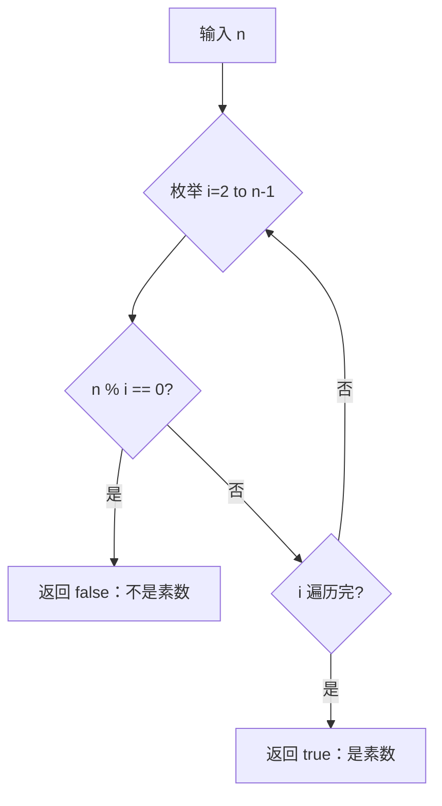

```java
boolean isPrimeNaive(int n) {
    if (n <= 1) return false;
    for (int i = 2; i < n; i++) {
        if (n % i == 0) return false;
    }
    return true;
}
```

- 时间复杂度：O(n) ❌ 极慢
- n = 10⁶ 时约需 10⁶ 次除法

#### 平方根优化法

**原理**：若 n = a × b 且 a ≤ b，则必有 a ≤ √n。只需枚举 [2, √n]。

**证明（反证法）**：若 n 是合数，则存在因子 a、b 满足 n = a × b，且 1 < a ≤ b < n。假设 a > √n 且 b > √n，则 a × b > √n × √n = n，与 n = a × b 矛盾。因此较小因子 a 必然满足 a ≤ √n。

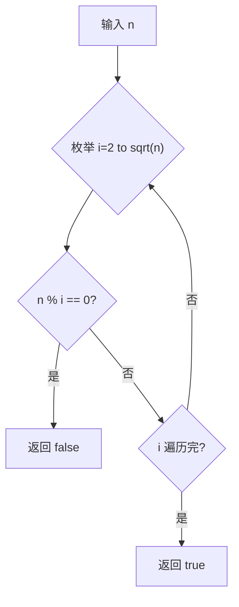

```java
boolean isPrimeSqrt(int n) {
    if (n <= 1) return false;
    for (int i = 2; i * i <= n; i++) {
        if (n % i == 0) return false;
    }
    return true;
}
```

- 时间复杂度：O(√n) ✅
- 注意：`i * i <= n` 避免浮点 sqrt 计算

#### `6`倍加速法（6k ± 1）

**原理**：所有整数可表示为 6k、6k+1、6k+2、6k+3、6k+4、6k+5。其中：
- 6k 可被 6 整除
- 6k+2 = 2(3k+1) 可被 2 整除
- 6k+3 = 3(2k+1) 可被 3 整除
- 6k+4 = 2(3k+2) 可被 2 整除

除 2 和 3 外，所有素数只能出现在 **6k ± 1**（即 6k+1 和 6k+5）的形式中。

**证明**：根据算术基本定理，若 p > 3 是素数，不能被 2 或 3 整除，所以 p mod 6 ≠ 0,2,3,4，只可能余 1 或 5。

```java
boolean isPrime6k(int n) {
    if (n <= 3) return n > 1;
    if (n % 2 == 0 || n % 3 == 0) return false;
    for (int i = 5; i * i <= n; i += 6) {
        if (n % i == 0 || n % (i + 2) == 0) return false;
    }
    return true;
}
```

- 时间复杂度：O(√n/3) ✅ 最优暴力单判
- 相比平方根法再快约 3 倍（仅检查 1/3 的数）

## 批量筛法：埃拉托斯特尼筛法

### 核心思想

从 2 开始，将每个素数的**倍数**标记为合数，未被标记的即为素数。这本质上利用了**合数的因子特性**：每个合数至少有一个不大于其平方根的因子。

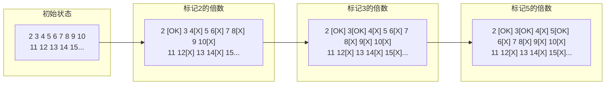

### 算法流程

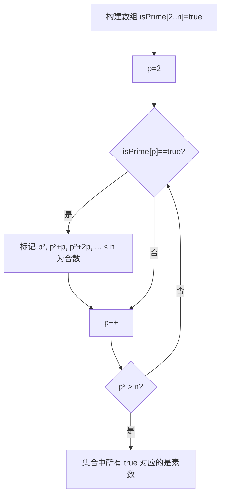

### 从 p² 开始标记的证明

对于素数 p，任何小于 p² 的 p 的倍数 m = k·p（其中 2 ≤ k < p），k 必有不超过 √m 的素因子 q ≤ k < p。因此 m 已经被更小的素数 q 标记过。

例：p=7，2×7=14 已被 p=2 标记，3×7=21 已被 p=3 标记，5×7=35 已被 p=5 标记。第一个"新"合数是 7×7=49。

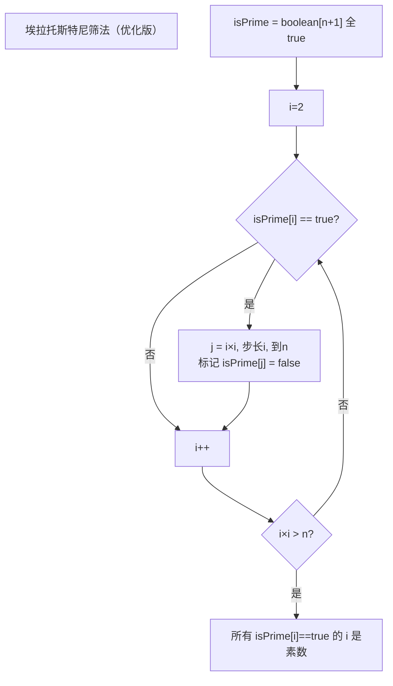

```java
// 埃拉托斯特尼筛法 — O(n log log n)
boolean[] sieveOfEratosthenes(int n) {
    boolean[] isPrime = new boolean[n + 1];
    Arrays.fill(isPrime, true);
    isPrime[0] = isPrime[1] = false;

    for (int i = 2; i * i <= n; i++) {
        if (isPrime[i]) {
            // 从 i² 开始：2i, 3i ... (i-1)i 已被更小的素数标记
            for (int j = i * i; j <= n; j += i) {
                isPrime[j] = false;
            }
        }
    }
    return isPrime;
}
```

- 时间复杂度：**O(n log log n)**
- 空间复杂度：**O(n)**

#### 复杂度推导

内层循环执行次数为：
```
∑_{p ≤ √n, p 是素数} (n/p - p + 1) ≈ n × ∑_{p ≤ √n} 1/p
```

根据 Mertens 第二定理：`∑_{p ≤ x} 1/p = log log x + M + o(1)`，其中 M 是 Meissel–Mertens 常数 ≈ 0.2615。

因此总操作数 ≈ n × log log √n = n × log(log n / log 2) = **n log log n**。

#### 重复标记问题

合数会被多个不同素数重复标记。例如 30 = 2×15 = 3×10 = 5×6，被标记 3 次。标记次数为：

```
∑_{n ≤ x} ω(n) ≈ x log log x
```

其中 ω(n) 表示 n 的不同素因子个数。这是埃氏筛无法达到 O(n) 的根本原因。

## 欧拉筛（线性筛 / Linear Sieve）

### 核心思想

每个合数**只被它的最小质因子（LPF, Least Prime Factor）标记一次**，从而将时间复杂度优化到 O(n)。

**关键数据结构**：
- 数组 `isComposite`（或 `lpf[]`）记录合数标记
- 动态增长的 `primes[]` 列表

**执行过程**：对于每个整数 i（无论 i 本身是否是素数），用 i 依次乘以已发现的素数 `p = primes[j]`，标记 `i × p` 为合数。当 `p` 成为 `i` 的因子时（即 `i % p == 0`），停止当前轮次。

```mermaid
flowchart TD
    title["欧拉筛执行流程（n=20）"]

    subgraph 初始化
        A["isPrime[0..20] = true<br/>primes = []"]
    end

    subgraph i=2
        B["2 是素数 → primes=[2]<br/>标记: 2×2=4"]
    end

    subgraph i=3
        C["3 是素数 → primes=[2,3]<br/>标记: 3×2=6, 3×3=9<br/>break [X]"]
    end

    subgraph i=4
        D["4 非素数<br/>标记: 4×2=8<br/>4%2==0 → break [OK]"]
    end

    subgraph i=5
        E["5 是素数 → primes=[2,3,5]<br/>标记: 5×2=10, 5×3=15, 5×5=25>20"]
    end

    subgraph i=6
        F["6 非素数<br/>标记: 6×2=12<br/>6%2==0 → break"]
    end

    A --> B --> C --> D --> E --> F
```

### 关键 break 条件 —— 完整证明

```
i % primes[j] == 0  →  break
```

**定理**：在欧拉筛中，对于给定的 i，当 `primes[j]` 整除 i 时，`primes[j+1]` 以及之后的所有素数都不应该被用来标记 `i × primes[k]（k > j）`，因为那些合数的最小质因子是 `primes[j]`，而非 `primes[k]`。

**证明**：

设 `p = primes[j]` 且 `p | i`，则 `i = p × m`，其中 m ≥ 1 且 `m ≥ p`（因为 p 是最小质因子，否则 m 有更小因子会先遇到）。

考虑 `q = primes[j+1]`（即下一个更大的素数，满足 `q > p`）：

```
i × q = (p × m) × q = p × (m × q)
```

设 `k = m × q`，则 `i × q = p × k`，其最小质因子为 `min(LPF(m × q), p)`。

由于 `p < q` 且 `p | i`，而 `q` 不整除 i（否则 `q ≤ i` 且 `q | i`，但 p 已经是小于 q 的 i 的因子），所以 `LPF(m × q)` 要么是 `q` 本身（若 m 不含小于 q 的因子），要么是比 q 更小的某个因子。

但最重要的一点是：`p < q` 且 `p` 是 `i × q` 的因子中**最小的素数**。因为：
- `p < q`
- `p | i × q`（因为 `p | i`）

所以 `i × q` 的最小质因子是 p。因此它应该在**将来某个 `i' = m × q`**（其中 `p` 不再是 LPF 约束）时由 p 标记，而不是在当前轮次由 q 标记。

**反例直观理解**：
```
i = 4, primes=[2, 3]
标记 4×2=8 ✓（8 的 LPF 是 2）

若 break 前标记 4×3=12 ✓
但 12 = 3×4 = 2×6
LPF(12) = 2，应该在 i=6 时被 6×2 标记

所以 4×3 标记是错误的 → break
```

**正确标记规则**：对于合数 `c = i × primes[j]`，我们要求 `primes[j]` 是 `c` 的最小质因子。因此当 `i % primes[j] == 0` 时，对于任何 `k > j`，`i × primes[k]` 的最小质因子是 `primes[j]`（而非 `primes[k]`），应当 break。

#### 完整流程

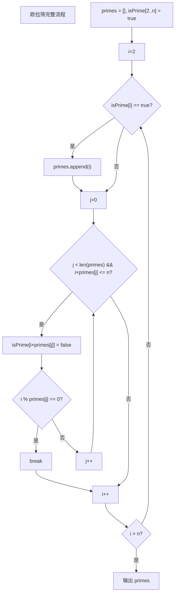

### 基本实现

```java
// 欧拉筛（线性筛）— O(n)
int[] linearSieve(int n) {
    boolean[] isComposite = new boolean[n + 1]; // false = 素数
    int[] primes = new int[n + 1];
    int cnt = 0;

    for (int i = 2; i <= n; i++) {
        if (!isComposite[i]) {
            primes[cnt++] = i; // i 是素数
        }
        for (int j = 0; j < cnt && i * primes[j] <= n; j++) {
            isComposite[i * primes[j]] = true;
            if (i % primes[j] == 0) {
                break; // 保证每个合数只被最小质因子标记
            }
        }
    }
    return Arrays.copyOf(primes, cnt);
}
```

### 示例跟踪（n=20）

| i | isPrime? | primes[] | 标记 | break? |
|---|----------|----------|------|--------|
| 2 | ✅ | [2] | 4=2×2 | 2%2=0 break |
| 3 | ✅ | [2,3] | 6=3×2, 9=3×3 | 3%3=0 break |
| 4 | ❌ | [2,3] | 8=4×2 | 4%2=0 break |
| 5 | ✅ | [2,3,5] | 10=5×2, 15=5×3, 25>n | 遍历完 |
| 6 | ❌ | [2,3,5] | 12=6×2 | 6%2=0 break |
| 7 | ✅ | [2,3,5,7] | 14=7×2, 21>n | 遍历完 |
| 8 | ❌ | [2,3,5,7] | 16=8×2 | 8%2=0 break |
| 9 | ❌ | [2,3,5,7] | 18=9×2 | 9%2≠0, 9%3=0 break |
| 10 | ❌ | [2,3,5,7] | 20=10×2 | 10%2=0 break |

每个合数恰好被标记 **1 次** → 总操作 O(n)。

- 时间复杂度：**O(n)**
- 空间复杂度：**O(n)**

## 核心问题与适用边界

### 单个数判定 vs 批量筛

| 需求 | 推荐方法 | 时间复杂度 | 空间 |
|------|---------|-----------|------|
| 判定 1 个数 | 6k±1 优化 / Miller-Rabin | O(√n) / O(log³ n) | O(1) |
| 判定 ≤ 100 个数（每个 ≤ 10¹²） | Miller-Rabin | O(k log³ n) | O(1) |
| 求 [2, n] 所有素数 | 埃氏筛 / 欧拉筛 | O(n log log n) / O(n) | O(n) |
| 求 [L, R] 所有素数（R-L ≤ 10⁶） | 分段筛 | O((R-L) log log R) | O(√R + R-L) |
| 大数 π(x)（x ≤ 10¹²） | Meissel–Lehmer | O(n^(2/3)) | O(√n) |

### 各方法适用的 n 范围

| 方法 | 适用 n 范围 | 运行时间参考 |
|------|-----------|------------|
| 6k±1 单判 | n ≤ 10¹² | ~10⁶ 次 i² ≤ n 检查安全 |
| 埃氏筛 | n ≤ 10⁷ | Java 约 0.2s |
| 埃氏筛（奇数优化+位压缩） | n ≤ 10⁸ | Java 约 2-3s |
| 欧拉筛 | n ≤ 10⁷ | Java 约 0.3s（常数稍大但无重标） |
| 分段筛 | R-L ≤ 10⁶, R ≤ 10¹² | 主筛 √R ≈ 10⁶ |
| Miller-Rabin + 分段筛 | n ≤ 10¹⁸ | 概率算法，可确认确定性 |

```
n 范围与可选策略树：

n ≤ 10⁴  ── 暴力法/平方根法均可
n ≤ 10⁶  ── 埃氏筛或欧拉筛，均可开销极小
n ≤ 10⁷  ── 埃氏筛(优选奇偶筛) / 欧拉筛(当需要 LPF)
n ≤ 10⁸  ── 埃氏筛+位压缩+仅奇数
n ≤ 10¹² ── 分段筛(区间差 ≤ 10⁶) 或 Miller-Rabin(单判)
n ≤ 10¹⁸ ── Miller-Rabin 确定性基底 / BPSW
```

### 内存限制下的选择

| 条件 | 方案 | 内存需求 |
|------|------|---------|
| n ≤ 10⁷, boolean[] | 标准筛 | 10 MB |
| n ≤ 10⁸, boolean[] | 约 100 MB，可能超限 | 100 MB |
| n ≤ 10⁸, BitSet | 约 12.5 MB ✅ | 12.5 MB |
| n ≤ 10⁸, 奇数优化 + byte 数组 | 约 50 MB | 50 MB |
| n ≤ 10⁹, BitSet + 奇数 | 约 62.5 MB ✅ | 62.5 MB |
| n ≤ 10⁹, 分段筛 | 约 √n = 31623 个素数的空间 | < 1 MB |

## 高效实现与关键优化

### 位图压缩（BitSet / Bit Manipulation）

**问题**：Java 的 `boolean[]` 每个元素占 1 字节，n=10⁸ 时就需要 100 MB。

**解决方案**：使用 `java.util.BitSet` 或手动位运算，每个标记仅占 1 比特。

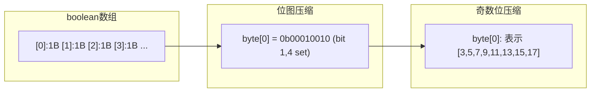

#### BitSet 版本（埃氏筛）

```java
BitSet sieveBitSet(int n) {
    BitSet isPrime = new BitSet(n + 1);
    isPrime.set(2, n + 1); // 设置 [2, n] 为 true

    for (int i = 2; i * i <= n; i++) {
        if (isPrime.get(i)) {
            for (int j = i * i; j <= n; j += i) {
                isPrime.clear(j);
            }
        }
    }
    return isPrime;
}
```

**内存**：n × 1 bit = n/8 字节 ≈ 12.5 MB 当 n=10⁸。

#### 手动位运算（最快）

```java
// 手动位运算 — 每个 long 存储 64 位标记
class BitSieve {
    private final long[] bits;
    private final int size;

    public BitSieve(int n) {
        this.size = n;
        this.bits = new long[(n >>> 6) + 1]; // n/64 + 1
    }

    private boolean get(int i) {
        return (bits[i >>> 6] & (1L << (i & 63))) != 0;
    }

    private void set(int i) {
        bits[i >>> 6] |= (1L << (i & 63));
    }

    private void clear(int i) {
        bits[i >>> 6] &= ~(1L << (i & 63));
    }

    void sieve() {
        for (int i = 2; i <= size; i++) set(i);
        for (int i = 2; i * i <= size; i++) {
            if (get(i)) {
                for (int j = i * i; j <= size; j += i) {
                    clear(j);
                }
            }
        }
    }
}
```

| 方案 | n=10⁸ 内存 | 速度 |
|------|-----------|------|
| `boolean[]` | 100 MB | 最快（CPU 按字节操作） |
| `BitSet` | 12.5 MB | 慢约 30-50%（位操作开销） |
| `long[]` 手动位 | 12.5 MB | 接近 `boolean[]` (64 位簇) |

### 仅筛奇数优化（2 单独处理）

**原理**：除 2 外所有素数都是奇数，偶数全部是合数。将数组的索引从"数字"映射到"奇数编号"。

**映射关系**：数字 `x`（奇数） → 索引 `(x-3)/2`

```
数字:  3  5  7  9  11  13  15  ...
索引:  0  1  2  3   4   5   6  ...
```

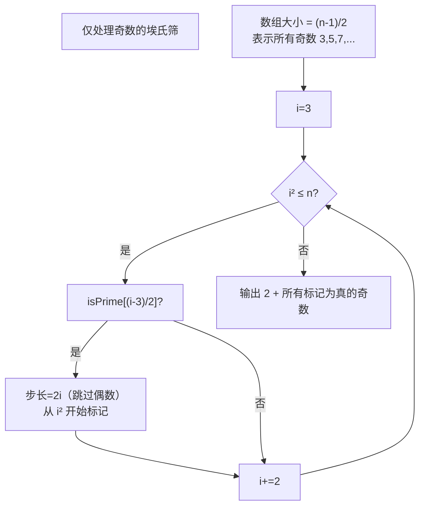

```java
// 仅筛奇数 — 埃氏筛，内存减半
List<Integer> oddSieve(int n) {
    if (n < 2) return new ArrayList<>();
    int size = (n - 1) >>> 1; // (n-1)/2, 代表奇数 3,5,7,...
    boolean[] isPrime = new boolean[size + 1];
    Arrays.fill(isPrime, true);

    for (int i = 3; i * i <= n; i += 2) {
        if (isPrime[(i - 3) >>> 1]) {
            // 从 i² 开始，步长 2i（跳过偶数倍数）
            for (int j = i * i; j <= n; j += i << 1) {
                isPrime[(j - 3) >>> 1] = false;
            }
        }
    }

    List<Integer> primes = new ArrayList<>();
    primes.add(2);
    for (int i = 3; i <= n; i += 2) {
        if (isPrime[(i - 3) >>> 1]) primes.add(i);
    }
    return primes;
}
```

**优点**：
- 内存减半（n=10⁸ 时仅 50 MB → 奇数优化后 25 MB）
- 标记步长 2i，运行速度提升约 2 倍

### 预计算最小质因子（LPF）的完整代码

**LPF 的数学意义**：LPF(x) 是 x 最小的质因子。利用 LPF 可以：
- 在 O(log n) 时间内完成质因子分解
- 在 O(1) 时间内判定 x 是否为素数（LPF(x) == x）
- 快速计算各种积性函数（如 φ(x)、μ(x)、d(x)）

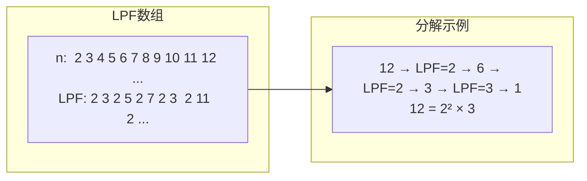

```java
// 欧拉筛 + 最小质因子（LPF）预处理
class LPFProcessor {
    int[] lpf;  // Least Prime Factor
    int[] primes;
    int cnt;

    void build(int n) {
        lpf = new int[n + 1];
        primes = new int[n + 1];
        cnt = 0;

        for (int i = 2; i <= n; i++) {
            if (lpf[i] == 0) {
                lpf[i] = i;        // 素数的 LPF 是自己
                primes[cnt++] = i;
            }
            for (int j = 0; j < cnt && i * primes[j] <= n; j++) {
                lpf[i * primes[j]] = primes[j]; // 设置合数的 LPF
                if (i % primes[j] == 0) break;
            }
        }
    }

    // O(log n) 质因子分解（去重版本 — 得到质因子集合）
    List<Integer> distinctFactors(int x) {
        List<Integer> res = new ArrayList<>();
        while (x > 1) {
            int p = lpf[x];
            res.add(p);
            while (x % p == 0) x /= p; // 除去所有当前质因子
        }
        return res;
    }

    // O(log n) 质因子分解（完整的指数展开版本）
    List<long[]> fullFactorization(int x) {
        List<long[]> res = new ArrayList<>();
        while (x > 1) {
            int p = lpf[x];
            int exp = 0;
            while (x % p == 0) {
                x /= p;
                exp++;
            }
            res.add(new long[]{p, exp}); // [质因子, 指数]
        }
        return res;
    }

    // O(1) 素数判定
    boolean isPrime(int x) {
        return x >= 2 && lpf[x] == x;
    }
}
```

### 缓存友好访问模式（减少 cache miss）

**问题**：埃氏筛在标记大素数的倍数时，步长大，内存访问模式是跳跃式的，会产生大量 cache miss。

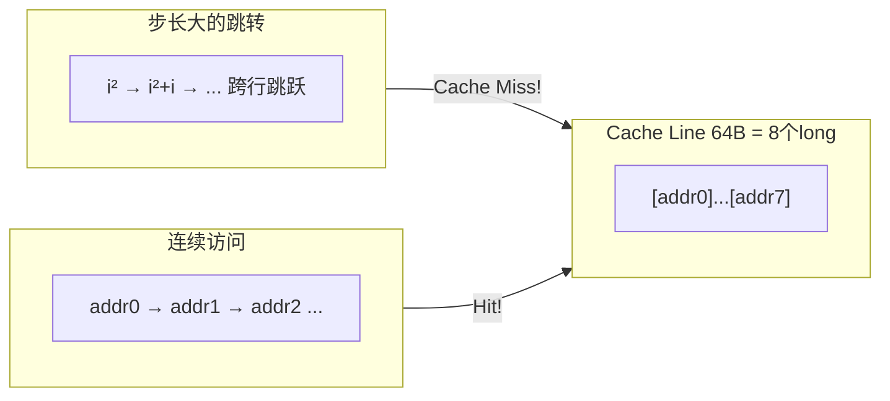

**优化方案**：

1. **字打包（Word-Level Sieving）**：用 `long[]` 代替 `boolean[]`，每次标记处理 64 位
2. **分段筛**：把大范围切分成与 L2/L3 缓存匹配的小段（通常 256KB ~ 1MB）
3. **缓存分块（Cache Blocking）**：

```java
// 缓存友好的分段筛模式 — 分块处理
void cacheFriendlySieve(int n) {
    int blockSize = 32768; // 32K, 匹配 L1 缓存
    BitSet isPrime = new BitSet(n + 1);
    isPrime.set(2, n + 1);

    // 提前找出 √n 以内的素数
    int sqrt = (int) Math.sqrt(n);
    // ... 常规筛得到 sqrtPrimes

    // 按块处理，每块内部标记时尽量利用缓存
    for (int low = 2; low <= n; low += blockSize) {
        int high = Math.min(low + blockSize - 1, n);
        // 对于块 [low, high]，用小素数列表标记合数
        for (int p : sqrtPrimes) {
            int start = Math.max(p * p, (low + p - 1) / p * p);
            for (int j = start; j <= high; j += p) {
                isPrime.clear(j);
            }
        }
    }
}
```

4. **预取（Prefetch）**：在标记循环中，提前加载未来需要的缓存行（依赖硬件）

```java
// 软件预取 + 循环展开
for (int j = start; j <= high; j += 64 * p) {
    // 提前预取
    __builtin_prefetch(&isPrime[j + 32 * p]); // C/C++ 语法
    // 实际操作（手动展开 64 次）
    for (int k = 0; k < 64; k++) {
        isPrime[j + k * p] = false;
    }
}
```

> Java 中 `BitSet` 的 `previousSetBit`/`nextSetBit` 等底层使用 `Long.bitCount` 和位运算，已利用了字级并行度。

### 分段筛（Segment Sieve）处理大范围

#### 核心思想

当需要求 `[L, R]` 区间内的素数，且 R 很大（如 10¹²）但 `R-L` 较小（如 ≤ 10⁶）时：
1. 先筛出 `[2, √R]` 的所有素数（用普通筛）
2. 用这些小素数标记 `[L, R]` 中的合数

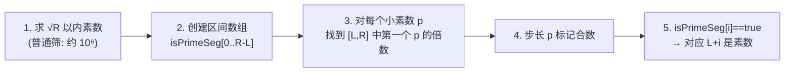

#### 关键公式：区间内第一个 p 的倍数

```
start = max(p², ⌈L/p⌉ × p)
```

其中 `⌈L/p⌉ × p` 是 ≥ L 且能被 p 整除的最小整数。若 `start > R`，说明区间内没有 p 的倍数。

**⌈L/p⌉ 的计算**：`(L + p - 1) / p`

```java
// 分段筛 — 区间 [L, R] 内求素数
// 约束: R-L ≤ 10⁶, R ≤ 10¹²
List<Long> segmentSieve(long L, long R) {
    if (L < 2) L = 2;

    // 1. 筛出 √R 以内的素数
    int limit = (int) Math.sqrt(R);
    boolean[] isPrime = new boolean[limit + 1];
    Arrays.fill(isPrime, true);
    List<Integer> basePrimes = new ArrayList<>();
    for (int i = 2; i <= limit; i++) {
        if (isPrime[i]) {
            basePrimes.add(i);
            if ((long) i * i <= limit) {
                for (int j = i * i; j <= limit; j += i) {
                    isPrime[j] = false;
                }
            }
        }
    }

    // 2. 区间标记
    int segLen = (int) (R - L + 1);
    boolean[] segPrime = new boolean[segLen];
    Arrays.fill(segPrime, true);

    for (int p : basePrimes) {
        // 找到区间内第一个 ≥ max(p², L) 且是 p 的倍数的数
        long start = Math.max((long) p * p, (L + p - 1) / p * p);
        for (long j = start; j <= R; j += p) {
            segPrime[(int) (j - L)] = false;
        }
    }

    // 3. 收集结果
    List<Long> result = new ArrayList<>();
    for (int i = 0; i < segLen; i++) {
        if (segPrime[i]) {
            result.add(L + i);
        }
    }
    return result;
}
```

- 时间复杂度：O((R-L) log log R + √R log log √R) ≈ O(√R + (R-L) log log R)
- 空间复杂度：O(√R + R-L)

## 三种批量筛法对比

| 算法 | 单次判定 | 批量筛（n 以内） | 重复标记次数 | 适用场景 |
|------|---------|----------------|-------------|---------|
| 暴力法 | O(n) | O(n√n) | - | 理论教学 |
| √n 优化 | O(√n) | O(n√n) | - | 小规模单次判定 |
| 6k±1 加速 | O(√n/3) | O(n√n/3) | - | 单次判定最优 |
| 埃氏筛 | - | **O(n log log n)** | ~n log log n | 内存优先 / 需要高缓存命中率 |
| **欧拉筛** | - | **O(n)** | 0 次 | **首选（当需要 LPF 时唯一选择）** |
| 分段筛 | - | O((R-L) log log R) | 部分 | **大范围小间隔** |

**何时选埃氏筛而非欧拉筛？**

- 不需要 LPF 或额外信息时
- n 恰好能让布尔数组放入内存
- 埃氏筛常数更小（无取模 i % p 操作）

**何时必须用欧拉筛？**

- 需要每个合数的 LPF 时（质因子分解、积性函数线性递推）
- 需要线性时间维护额外数组（如 φ(x)、μ(x)、d(x)）时
- n ≤ 10⁷ 且内存无瓶颈时

## 典型题目与解题思路

### 7.A 求区间素数个数（前缀和思想）

**问题描述**：给定 m 次查询，每次询问 [L, R] 内的素数个数，其中 1 ≤ L ≤ R ≤ 10⁷。

**核心推导**：预处理到 R_max 的素数表，再构建前缀和数组 `primeCount[i] = [2, i] 内的素数个数`。

```
primeCount[i] = primeCount[i-1] + (isPrime[i] ? 1 : 0)
回答 [L, R] = primeCount[R] - primeCount[L-1]
```

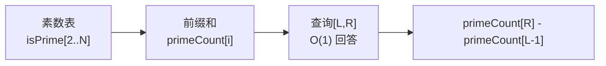

```java
class PrimeQuery {
    boolean[] isPrime;
    int[] prefix;

    // 预处理到 N
    void build(int N) {
        isPrime = new boolean[N + 1];
        Arrays.fill(isPrime, true);
        isPrime[0] = isPrime[1] = false;

        for (int i = 2; i * i <= N; i++) {
            if (isPrime[i]) {
                for (int j = i * i; j <= N; j += i) {
                    isPrime[j] = false;
                }
            }
        }

        prefix = new int[N + 1];
        for (int i = 1; i <= N; i++) {
            prefix[i] = prefix[i - 1] + (isPrime[i] ? 1 : 0);
        }
    }

    // O(1) 回答区间 [L, R] 内的素数个数
    int query(int L, int R) {
        return prefix[R] - prefix[L - 1];
    }
}

// 测试
// PrimeQuery pq = new PrimeQuery();
// pq.build(1000);
// pq.query(10, 50);  → 输出 [10,50] 内的素数个数
```

- 预处理：O(N log log N)
- 每次查询：O(1)
- 空间：O(N)

### 7.B 质因子分解（LPF 法）

**问题描述**：给定 Q 个整数（每个 ≤ 10⁷），将每个数分解为质因数的乘积形式。

**核心推导**：
利用欧拉筛预处理 LPF 数组，然后对于每个 x，反复除以 `LPF[x]` 直到 1。

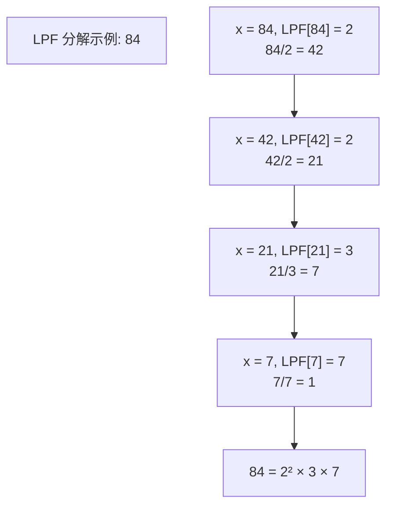

```java
class PrimeFactorization {
    int[] lpf;

    // 构建 LPF
    void build(int N) {
        lpf = new int[N + 1];
        int[] primes = new int[N + 1];
        int cnt = 0;

        for (int i = 2; i <= N; i++) {
            if (lpf[i] == 0) {
                lpf[i] = i;
                primes[cnt++] = i;
            }
            for (int j = 0; j < cnt && i * primes[j] <= N; j++) {
                lpf[i * primes[j]] = primes[j];
                if (i % primes[j] == 0) break;
            }
        }
    }

    // 分解成 [质因子, 指数] 对列表
    List<int[]> factorize(int x) {
        List<int[]> res = new ArrayList<>();
        while (x > 1) {
            int p = lpf[x];
            int exp = 0;
            while (x % p == 0) {
                x /= p;
                exp++;
            }
            res.add(new int[]{p, exp});
        }
        return res;
    }
}

// 测试示例
// 输入: 84 → 输出: 84 = 2^2 × 3^1 × 7^1
// PrimeFactorization pf = new PrimeFactorization();
// pf.build(100);
// pf.factorize(84);  // → [[2,2],[3,1],[7,1]]
```

- 预处理：O(N)
- 每次分解：O(log N)
- 对比素数试除法 O(√N)，LPF 法快了数个数量级

### 7.C 最大质因子

**问题描述**：给定 Q 个查询，每个查询求 x 的最大质因子（即 x 的质因数中的最大值）。

**核心推导**：
欧拉筛的变形。在标记合数时，不仅记录 LPF，还可以维护 HFP（High Prime Factor — 最大质因子）。但更简单的方法是：利用已有的 LPF，每次 `x /= lpf[x]` 并记录最后一个除尽的 p。

**定理**：对于任意合数 c = a × b（其中 a 是最小因子），若 a 本身是合数，则 c 将被 `LPF[a] × b` 标记而非 `a × b`。因此任何合数的 LPF 必然 ≤ 该合数的因子。

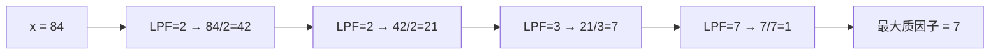

```java
class MaxPrimeFactor {
    int[] lpf;

    void build(int N) {
        lpf = new int[N + 1];
        int[] primes = new int[N + 1];
        int cnt = 0;

        for (int i = 2; i <= N; i++) {
            if (lpf[i] == 0) {
                lpf[i] = i;
                primes[cnt++] = i;
            }
            for (int j = 0; j < cnt && i * primes[j] <= N; j++) {
                lpf[i * primes[j]] = primes[j];
                if (i % primes[j] == 0) break;
            }
        }
    }

    // O(log x) 求最大质因子
    int maxPrimeFactor(int x) {
        int last = 1;
        while (x > 1) {
            last = lpf[x];
            while (x % last == 0) x /= last;
        }
        return last;
    }

    // 或者直接在筛的过程中维护最大质因子
    int[] maxPF;

    void buildWithMaxPF(int N) {
        maxPF = new int[N + 1];
        int[] primes = new int[N + 1];
        int cnt = 0;

        for (int i = 2; i <= N; i++) {
            if (maxPF[i] == 0) {
                maxPF[i] = i;
                primes[cnt++] = i;
            }
            for (int j = 0; j < cnt && i * primes[j] <= N; j++) {
                int val = i * primes[j];
                // 新合数的最大质因子 = max(primes[j], maxPF[i])
                maxPF[val] = Math.max(primes[j], maxPF[i]);
                if (i % primes[j] == 0) break;
            }
        }
    }
}

// 测试
// buildWithMaxPF(100) 后：
// maxPF[12] = max(2, maxPF[6]=3) = 3
// maxPF[45] = max(3, maxPF[15]=5) = 5
```

- 预处理：O(N)
- 查最大质因子：O(log N) 或 O(1)[直接查表]

### 7.D 相邻素数差值（Prime Gap）

**问题描述**：给定 N，求 [2, N] 中相邻素数之间的最大差值（即 max(p_{i+1} - p_i)）。

**核心推导**：
筛出所有素数后，遍历一次即可。Prime Gap 是数论中一个著名问题，目前已知：
- N 附近的平均 gap ≈ log N
- 最大 gap 约 O(log² N)（Cramér 猜想）

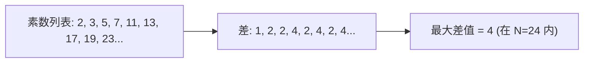

```java
class PrimeGap {
    boolean[] isPrime;
    List<Integer> primes;

    int maxGap(int N) {
        // 1. 筛素数
        isPrime = new boolean[N + 1];
        Arrays.fill(isPrime, true);
        isPrime[0] = isPrime[1] = false;
        for (int i = 2; i * i <= N; i++) {
            if (isPrime[i]) {
                for (int j = i * i; j <= N; j += i) {
                    isPrime[j] = false;
                }
            }
        }

        // 2. 收集素数和最大差值
        int prevPrime = -1;
        int maxGap = 0;
        for (int i = 2; i <= N; i++) {
            if (isPrime[i]) {
                if (prevPrime != -1) {
                    maxGap = Math.max(maxGap, i - prevPrime);
                }
                prevPrime = i;
            }
        }
        return maxGap;
    }

    // 进阶：直接获取所有相邻差值的分布
    int[] gapDistribution(int N, int[] primes) {
        int[] gaps = new int[primes.length - 1];
        for (int i = 1; i < primes.length; i++) {
            gaps[i - 1] = primes[i] - primes[i - 1];
        }
        return gaps;
    }
}

// 测试
// PrimeGap pg = new PrimeGap();
// pg.maxGap(100);  // → 8 (97-89)
// pg.maxGap(1000); // → 20 (887-907，实际是 114 到 127 之间的 gap... 需验证)
```

- 时间复杂度：O(N log log N)
- 空间：O(N)

### 7.E 哥德巴赫猜想验证

**问题描述**：给定一个偶数 n（4 ≤ n ≤ 10⁷），将其分解为两个素数之和。如果有多组解，输出差值最大的一组（即 p 最小的那组）。

**核心推导**：
哥德巴赫猜想断言：任一大于 2 的偶数均可表示为两个素数之和（> 4 × 10¹⁸ 以内已验证成立）。

验证方法：枚举 p ∈ primes（从 2 开始），检查 n - p 是否为素数。

```
p + q = n, p ≤ q
⇒ p ∈ [2, n/2]
⇒ 检查 n - p 是否为素数
第一个找到的 p 即为最小 p（差值最大）
```

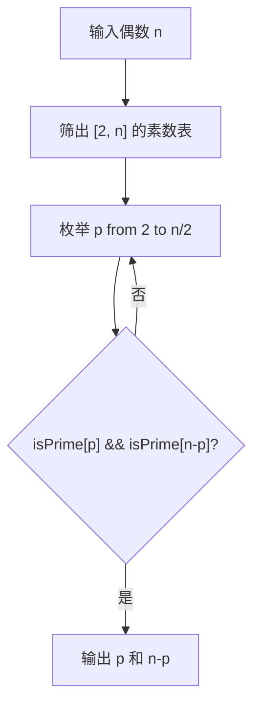

```java
class Goldbach {
    boolean[] isPrime;

    void sieve(int N) {
        isPrime = new boolean[N + 1];
        Arrays.fill(isPrime, true);
        isPrime[0] = isPrime[1] = false;
        for (int i = 2; i * i <= N; i++) {
            if (isPrime[i]) {
                for (int j = i * i; j <= N; j += i) {
                    isPrime[j] = false;
                }
            }
        }
    }

    int[] decompose(int n) {
        sieve(n);
        for (int p = 2; p <= n / 2; p++) {
            if (isPrime[p] && isPrime[n - p]) {
                return new int[]{p, n - p}; // 最小 p 对应最大差值
            }
        }
        return null; // 理论上不会发生
    }

    // 计算所有分解方式
    List<int[]> allDecompositions(int n) {
        sieve(n);
        List<int[]> res = new ArrayList<>();
        for (int p = 2; p <= n / 2; p++) {
            if (isPrime[p] && isPrime[n - p]) {
                res.add(new int[]{p, n - p});
            }
        }
        return res;
    }
}

// 测试
// Goldbach g = new Goldbach();
// g.decompose(100);   // → [3, 97]  或 [11, 89] ... 实际最小 p 方案: [3, 97]
// g.decompose(1000);  // → [3, 997]
// g.decompose(10000); // → [17, 9983]
```

- 预处理：O(N log log N)
- 查询：O(n/log n) 或 O(n/2) 最坏
- 空间：O(N)

### 7.F 半素数（Semiprime）/ 无平方因子数

#### 7.F.1 半素数判定

**问题描述**：半素数（Semiprime）是指恰好可分解为两个素数的乘积的数（允许相等，如 4 = 2×2）。

**核心推导**：
半素数 n 满足：n = p × q，其中 p 和 q 是素数（p ≤ q）。
等价条件：`n` 是合数，且 LPF(n) 是素数，且 `n / LPF(n)` 也是素数。

```java
class SemiprimeChecker {
    int[] lpf;

    void build(int N) {
        lpf = new int[N + 1];
        int[] primes = new int[N + 1];
        int cnt = 0;
        for (int i = 2; i <= N; i++) {
            if (lpf[i] == 0) {
                lpf[i] = i;
                primes[cnt++] = i;
            }
            for (int j = 0; j < cnt && i * primes[j] <= N; j++) {
                lpf[i * primes[j]] = primes[j];
                if (i % primes[j] == 0) break;
            }
        }
    }

    boolean isSemiprime(int n) {
        if (n <= 3) return false;
        int p = lpf[n];
        if (p == n) return false; // n 本身是素数
        int q = n / p;
        return lpf[q] == q; // q 也是素数（或 q=1 但 n 至少 4，所以 q≥2）
    }

    // 统计 [1, N] 内的半素数个数
    int countSemiprime(int N) {
        build(N);
        int cnt = 0;
        for (int i = 4; i <= N; i++) {
            if (isSemiprime(i)) cnt++;
        }
        return cnt;
    }
}

// 测试
// SemiprimeChecker sc = new SemiprimeChecker();
// sc.isSemiprime(6);   // true  (2×3)
// sc.isSemiprime(8);   // false (2×2×2, 三个因子)
// sc.isSemiprime(25);  // true  (5×5)
// sc.isSemiprime(30);  // false (2×3×5)
```

#### 7.F.2 无平方因子数（Square-Free Numbers）

**问题描述**：无平方因子数是指不能被任何大于 1 的完全平方数整除的数（即指数展开中所有指数 = 1）。

**核心推导**：
n 是无平方因子数 ⇔ 对于任意素数 p，p² 不整除 n。
等价地：在质因子分解中，每个质因子的指数均为 1。

利用 LPF + Möbius 函数 µ(n)：
- µ(n) = 0 当 n 有平方因子
- µ(n) = ±1 当 n 是无平方因子数

Möbius 函数可以在线性筛中递推：
```
对于素数 p:       µ(p) = -1
对于合数 c = i×p:
  若 p | i:      µ(c) = 0    (c 有平方因子 p²)
  若 p ∤ i:      µ(c) = -µ(i)
```

```java
class SquareFreeChecker {
    int[] mu; // Möbius 函数
    int[] primes;
    int cnt;

    void build(int N) {
        mu = new int[N + 1];
        primes = new int[N + 1];
        cnt = 0;
        mu[1] = 1;

        for (int i = 2; i <= N; i++) {
            if (mu[i] == 0) { // i 是素数
                mu[i] = -1;
                primes[cnt++] = i;
            }
            for (int j = 0; j < cnt && i * primes[j] <= N; j++) {
                int val = i * primes[j];
                if (i % primes[j] == 0) {
                    mu[val] = 0; // 有平方因子
                    break;
                } else {
                    mu[val] = -mu[i];
                }
            }
        }
    }

    boolean isSquareFree(int n) {
        return mu[n] != 0;
    }

    // 统计 [1, N] 内无平方因子数个数
    int countSquareFree(int N) {
        build(N);
        int cnt = 0;
        for (int i = 1; i <= N; i++) {
            if (mu[i] != 0) cnt++;
        }
        return cnt;
    }
}

// 测试
// SquareFreeChecker sfc = new SquareFreeChecker();
// sfc.build(100);
// sfc.isSquareFree(6);   // true  (2×3, 每个指数=1)
// sfc.isSquareFree(12);  // false (2²×3, 有平方因子)
// sfc.isSquareFree(30);  // true  (2×3×5)
// 前 100 个自然数中约 60 个是无平方因子数 (6/π² ≈ 0.6079)
```

### 7.G 区间素数计数（L,R 可达 10¹², R-L ≤ 10⁶）

**问题描述**：给定 m 次查询，每次查询 [L, R] 内有多少个素数，其中 1 ≤ L ≤ R ≤ 10¹²，且 R-L ≤ 10⁶。

**核心推导**：
这是分段筛 + 前缀和的经典应用。分段筛求得区间素数表后，再构建该区间的前缀和快速回答查询。

**关键数学公式**：
对于 L = 10¹², R = 10¹² + 10⁶：
- √R ≈ 10⁶，仅需 10⁶ 内的基素数（约 78498 个）
- 区间数组大小仅 10⁶+1

```
区间内第一个 p 的倍数位置：
start = max(p², ⌊(L+p-1)/p⌋ × p)
```

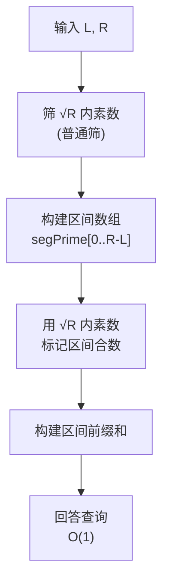

```java
class SegmentPrimeQuery {
    List<Integer> basePrimes;
    int limit;

    // 预处理 √maxR 内的素数
    void prepareBase(long maxR) {
        limit = (int) Math.sqrt(maxR);
        boolean[] isPrime = new boolean[limit + 1];
        Arrays.fill(isPrime, true);
        basePrimes = new ArrayList<>();
        for (int i = 2; i <= limit; i++) {
            if (isPrime[i]) {
                basePrimes.add(i);
                if ((long) i * i <= limit) {
                    for (int j = i * i; j <= limit; j += i) {
                        isPrime[j] = false;
                    }
                }
            }
        }
    }

    // 单次区间查询 [L, R] 内素数个数
    int query(long L, long R) {
        if (R < 2 || L > R) return 0;
        if (L < 2) L = 2;

        int segLen = (int) (R - L + 1);
        boolean[] segPrime = new boolean[segLen];
        Arrays.fill(segPrime, true);

        for (int p : basePrimes) {
            long start = Math.max((long) p * p, (L + p - 1) / p * p);
            for (long j = start; j <= R; j += p) {
                segPrime[(int) (j - L)] = false;
            }
        }

        // 同时构建前缀和
        int count = 0;
        for (int i = 0; i < segLen; i++) {
            if (segPrime[i]) count++;
        }
        return count;
    }

    // 批量查询：构建区间前缀和数组
    int[] batchQuery(long L, long R) {
        if (R < 2 || L > R) return new int[0];
        if (L < 2) L = 2;

        int segLen = (int) (R - L + 1);
        boolean[] segPrime = new boolean[segLen];
        Arrays.fill(segPrime, true);

        for (int p : basePrimes) {
            long start = Math.max((long) p * p, (L + p - 1) / p * p);
            for (long j = start; j <= R; j += p) {
                segPrime[(int) (j - L)] = false;
            }
        }

        // 构建前缀和
        int[] prefix = new int[segLen + 1];
        for (int i = 0; i < segLen; i++) {
            prefix[i + 1] = prefix[i] + (segPrime[i] ? 1 : 0);
        }
        return prefix; // prefix[offset] - prefix[offsetOfL-1]
    }

    int rangeQuery(int[] prefix, long L, long firstL, int left, int right) {
        // left, right 是相对于 firstL 的偏移
        return prefix[right - (int)(firstL - L) + 1] - prefix[left - (int)(firstL - L)];
    }
}

// 测试
// SegmentPrimeQuery spq = new SegmentPrimeQuery();
// spq.prepareBase((long)1e12);
// spq.query((long)1e12, (long)(1e12 + 1000000));
// → 约 57400 个素数（参考值，实际取决于区间位置）
```

- 预处理基素数：O(√R log log √R)
- 每次区间查询：O((R-L) log log R + √R)
- 空间：O(√R + R-L)

### 7.H 素因子指数和（Prime Exponent Sum）

**问题描述**：定义 `Omega(n)` = n 的全部质因子（按重数计）的个数之和。例如 Omega(12) = 2+1=3（12 = 2² × 3¹）。求 [2, N] 中每个数的 Omega 值。

**核心推导**：
利用 LPF 递推：
```
对于素数 p:     Omega(p) = 1
对于合数 c = i×p:
  Omega(c) = Omega(i) + 1    (增加一个因子 p)
```

```java
class PrimeExponentSum {
    int[] omega; // 素因子指数和（Big Omega / Ω(n) — 带重数）
    int[] lpf;
    int[] primes;
    int cnt;

    void build(int N) {
        omega = new int[N + 1];
        lpf = new int[N + 1];
        primes = new int[N + 1];
        cnt = 0;

        for (int i = 2; i <= N; i++) {
            if (lpf[i] == 0) {
                lpf[i] = i;
                primes[cnt++] = i;
                omega[i] = 1; // 素数有一个因子
            }
            for (int j = 0; j < cnt && i * primes[j] <= N; j++) {
                int val = i * primes[j];
                lpf[val] = primes[j];
                // 关键递推：Omega(val) = Omega(i) + 1
                omega[val] = omega[i] + 1;
                if (i % primes[j] == 0) break;
            }
        }
    }

    // Omega(n)
    int getOmega(int n) {
        return omega[n];
    }

    // 统计 [2, N] 中 Omega = k 的数有多少个
    int countByExponentSum(int N, int k) {
        build(N);
        int cnt = 0;
        for (int i = 2; i <= N; i++) {
            if (omega[i] == k) cnt++;
        }
        return cnt;
    }

    // 以特定质因子指数和作为筛选条件（例题扩展）
    List<Integer> filterByOmega(int N, int target) {
        build(N);
        List<Integer> res = new ArrayList<>();
        for (int i = 2; i <= N; i++) {
            if (omega[i] == target) res.add(i);
        }
        return res;
    }
}

// 测试
// PrimeExponentSum pes = new PrimeExponentSum();
// pes.build(100);
// pes.getOmega(12);  // 3 (2² × 3¹ → 2+1=3)
// pes.getOmega(30);  // 3 (2×3×5 → 1+1+1=3)
// pes.getOmega(72);  // 5 (2³ × 3² → 3+2=5)

// Omega(n) 与 d(n)（因数个数）的关系：
// 若 n = p₁^e₁ × p₂^e₂ × ... × p_k^e_k
// Omega(n) = e₁ + e₂ + ... + e_k  (带重数)
// d(n) = (e₁+1)(e₂+1)...(e_k+1)  (无重数)
```

#### 扩展：欧拉函数 φ(n) 的线性筛递推

欧拉函数 φ(n) 表示 [1, n] 中与 n 互质的数的个数，也可以在线性筛中递推：

```
对于素数 p:      φ(p) = p-1
对于合数 c = i×p:
  若 p | i:     φ(c) = φ(i) × p
  若 p ∤ i:     φ(c) = φ(i) × (p-1)
```

## 综合应用与性能对拍

### 各类问题效率对比

| 题目类型 | 预处理 | 每次查询 | 核心数据结构 |
|---------|--------|---------|------------|
| 区间素数个数（前缀和） | O(n log log n) | O(1) | boolean[] + int[] |
| 质因子分解（LPF） | O(N) | O(log n) | int[] lpf |
| 最大质因子 | O(N) | O(1) / O(log n) | int[] maxPF |
| 相邻素数差值 | O(n log log n) | O(n) | boolean[] |
| 哥德巴赫猜想 | O(n log log n) | O(n / log n) | boolean[] |
| 半素数判定 | O(N) | O(1) | int[] lpf |
| 无平方因子数（µ(n)） | O(N) | O(1) | int[] mu |
| 区间素数计数（R-L 小） | O(√R log log √R) | O((R-L) log log R) | boolean[] × 2 |
| 素因子指数和 | O(N) | O(1) | int[] omega |

### 速查：核心公式集合

```
埃氏筛标记起点: i²（从平方开始）
欧拉筛 break: i % primes[j] == 0
LPF 递推: LPF[i × p] = p（p 是 i 可被的最小质因子即停止）

分段筛起点: max(p², ⌈L/p⌉ × p)
区间偏移: index = x - L
Möbius 递推：
  µ(p) = -1
  µ(i×p) = 0 若 p|i, 否则 -µ(i)

Omega 递推：
  ω(p) = 1
  ω(i×p) = ω(i) + 1

欧拉函数递推：
  φ(p) = p-1
  φ(i×p) = φ(i)×p （p|i）, 否则 φ(i)×(p-1)
```

## 总结

```
素数求解三阶进化：
暴力 → 埃氏筛 (O(n log log n)) → 欧拉筛 (O(n))

核心优化：每个合数只被最小质因子标记一次
关键技巧：i % primes[j] == 0 → break
终极组合：欧拉筛 + LPF + 积性函数递推 → 一筛解决所有数论问题
大数突破：分段筛 + Miller-Rabin → 轻松应对 10¹² 以上

               ┌── 暴力/6k±1 (单个数 ≤ 10¹²)
               ├── 埃氏筛 (批量 ≤ 10⁷, 内存优)
素数筛技术树 ──┼── 欧拉筛 (批量 ≤ 10⁷, LPF需求)
               ├── 分段筛 (10¹² 级区间)
               └── Meissel–Lehmer (π(x) 精确值)
```
