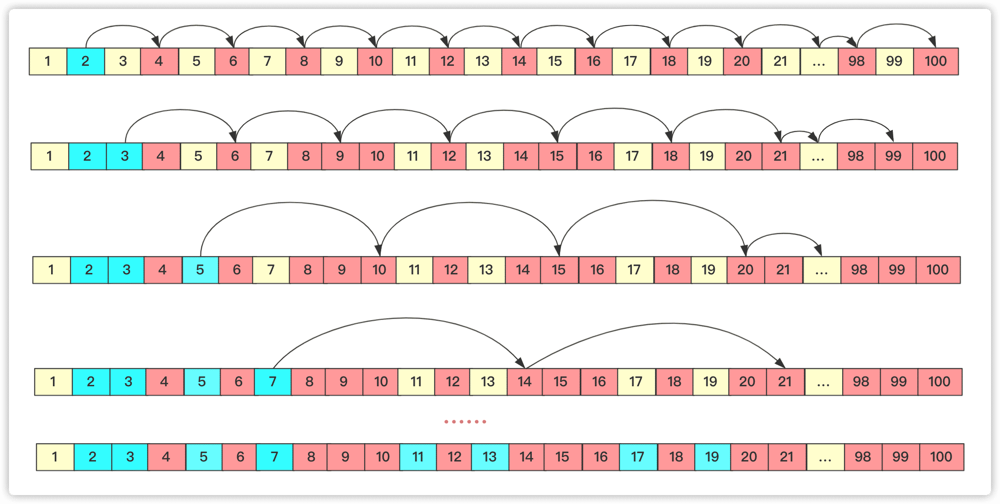
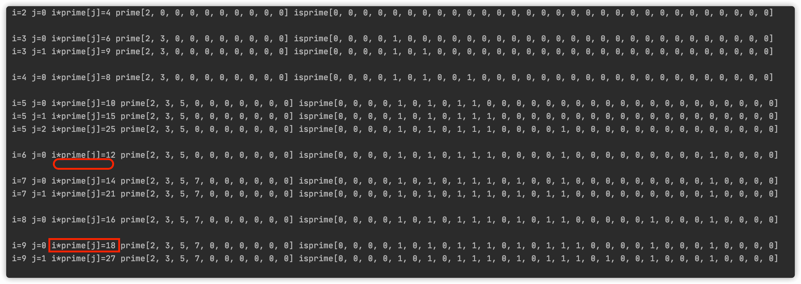

# 素数筛

## 求一个质数

怎么求素数吗？

首先，**最笨的方法**，判断n是否为素数，就是枚举[2, n-1]之间有没有直接能够被n整除的，如果有，那么返回false这个就不是素数，否则就是素数，代码如下：

```java
boolean isprime(int value) {
    for (int i = 2; i < value; i++) {
        if (value % i == 0) {
            return false;
        }
    }
    return true;
}
```

这种判断一个素数的时间复杂度为O(n)。

但是其实这种太浪费时间了，完全没必要这样，**可以优化一下** 。如果一个数不是质数，那么必定是两个数的乘积，而这两个数通常一个大一个小，并且小的小于等于**根号n**，大的大于等于**根号n**，我们只需要枚举小的可能范围，看看是否能够被整除，就可以判断这个数是否为素数啦。例如`100 = 2*50 = 4*25 = 5*20 = 10*10` 只需要找2—10这个区间即可，右侧的一定有个对应的不需要管它。

```java
boolean isprime(int value) {
    for (int i = 2; i * i < value + 1; i++) {
        if (value % i == 0) {
            return false;
        }
    }
    return true;
}
```

这里之所以要小于value+1，就是要包含根号的情况，例如 3*3=9。要包含3这种时间复杂度求单个数是O(logn)。

## 求多个素数

求多个素数的时候(小于n的素数)，上面的方法就很繁琐了，因为有大量重复计算，因为**计算某个数的倍数** 是否为素数的时候出现大量的重复计算，如果这个数比较大那么对空间浪费比较多。

这样，素数筛的概念就被发明和使用，筛的原理是从前往后进行一种递推、过滤排序以来统计素数。

### 埃拉托斯特尼(Eratosthenes)筛法

一个数如果不是为素数，那么这个数没有数的乘积能为它，那么这样我们可以根据这个思想进行操作啊：

直接从前往后枚举，这个数位置没被标记的肯定就是素数，如果这个数是素数那么将这个数的倍数标记一下(下次遍历到就不需要在计算)。如果不是素数那么就进行下一步。这样数值越大后面计算次数越少，在进行具体操作时候可借助数组进行判断。所以**埃氏筛的核心思想就是将素数的倍数确定为合数**。

假设刚开始全是素数，2为素数，那么2的倍数均不是素数；然后遍历到3，3的倍数标记一下；下个是5(因为4已经被标记过)；一直到n-1为止。具体流程可以看图：



具体代码为：

```java
boolean isprime[];
long prime[];

void getprime() {
    prime = new long[100001];//记录第几个prime
    int index = 0;//标记prime当前下标
    isprime = new boolean[1000001];//判断是否被标记过
    for (int i = 2; i < 1000001; i++) {
        if (!isprime[i]) {
            prime[index++] = i;
        }
        for (int j = i + i; j < 1000000; j = j + i)//他的所有倍数都over
        {
            isprime[j] = true;
        }
    }
}
```

这种筛的算法复杂度为O(nloglogn)，别小瞧多的这个logn，数据量大一个log可能少不少个0，那时间也是十倍百倍甚至更多的差距。

### 欧拉筛

观察上述的埃氏筛，有很多重复的计算，尤其是前面的素数，比如2和3的最小公倍数为6，每3次2的计算就也会遇到是3的倍数，而欧拉筛在埃氏筛的基础上改进，有效的避免了这个重复计算。

具体是何种思路呢？就是埃氏筛是遇到一个质数将它的倍数计算到底，而欧拉筛则是只用**它乘以已知晓的素数的乘积进行标记**，如果素数能够被整除那就停止往后标记。

在实现上同样也是用两个数组，一个存储真实有效的素数，一个用来作为标记使用。

- 在遍历到一个数的时候，如果这个数没被标记，那么这个数存在素数的数组中，对应下标加1.
- 不管这个数是不是素数，遍历已知素数将它和该素数的乘积值标记，如果这个素数能够被当前值i整除，那么停止操作进行下一轮。

具体实现的代码为：

```java
boolean isprime[];
int prime[];

void getprimeoula()// 欧拉筛
{
    prime = new int[100001];// 记录第几个prime
    int index = 0;
    isprime = new boolean[1000001];
    for (int i = 2; i < 1000001; i++) {
        if (!isprime[i]) {
            prime[index++] = i;
        }
        for (int j = 0; j < index && i * prime[j] <= 100000; j++) {//已知素数范围内枚举
            isprime[i * prime[j]] = true;// 标记乘积
            if (i % prime[j] == 0)
                break;
        }
    }
}
```

你可能会问为啥`if (i % prime[j] == 0)`就要break。

如果`i%prime[j]==0`，那么就说明`i=prime[j]*k`，k为一个整数。

那么如果进行下一轮的话`i*prime[j+1]=(prime[j]*k)*prime[j+1]=prime[j]*(k*prime[j+1])` 当`i=k*prime[j+1]`两个位置就产生冲突重复计算啦，所以一旦遇到能够被整除的就停止。



你可以看到这个过程，6只标记12而不标记18，18被9*2标记。详细理解还需要多看看代码想想。欧拉的思路就是离我较近的我给它标记。欧拉筛的时间复杂度为O(n)，因为每个数只标记一次。

