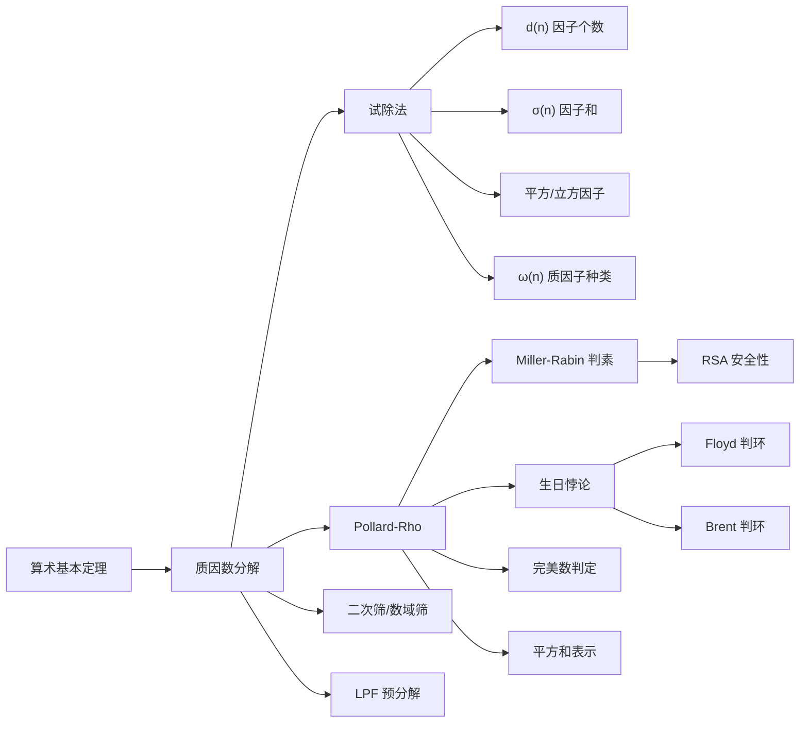

# 质因数分解

> 将一个正整数写成若干个质数的乘积，是数论中最基础也最核心的问题之一。

## 诞生背景与核心原理

### 算术基本定理（唯一分解定理）

> **定理**：每个大于 1 的正整数都可以唯一地（不计顺序）写成有限个质数的乘积。

$$
n = p_1^{e_1} \times p_2^{e_2} \times \cdots \times p_k^{e_k}
$$

其中 $p_1 < p_2 < \cdots < p_k$ 是质数，$e_i \ge 1$ 为正整数。

#### 存在性证明（强归纳法）

- **基始**：$n = 2$ 是质数，显然可分解。
- **归纳假设**：设所有小于 $n$ 的大于 1 的整数都可分解。
- **归纳步**：若 $n$ 是质数，分解完毕；若 $n$ 是合数，则存在 $1 < a < n,\; 1 < b < n$ 使得 $n = a \times b$。由归纳假设，$a$ 和 $b$ 均可分解，故 $n$ 也可分解。$\square$

#### 唯一性证明

假设 $n$ 有两种不同的质因数分解：

$$
n = p_1 p_2 \cdots p_r = q_1 q_2 \cdots q_s
$$

由 Euclid 引理（若质数 $p \mid ab$ 则 $p \mid a$ 或 $p \mid b$），$p_1 \mid q_1 q_2 \cdots q_s$，故存在某个 $q_j$ 使得 $p_1 \mid q_j$。由于 $q_j$ 是质数，$p_1 = q_j$。两边消去后继续，最终证得两分解相同。$\square$

### 因子个数的数学公式

由唯一分解 $n = \prod_{i=1}^k p_i^{e_i}$，因子个数函数 $d(n)$（也记作 $\tau(n)$）为：

$$
d(n) = \prod_{i=1}^{k} (e_i + 1) = (e_1+1)(e_2+1)\cdots(e_k+1)
$$

**推导**：$n$ 的任一因子 $m$ 可写为 $m = \prod p_i^{f_i}$，其中 $0 \le f_i \le e_i$。每个 $f_i$ 有 $e_i+1$ 种独立选择，由乘法原理即得。

**示例**：$n = 12 = 2^2 \times 3^1$，$d(12) = (2+1)(1+1) = 3 \times 2 = 6$。因子为 $\{1,2,3,4,6,12\}$。

### 因子和的公式

因子和函数 $\sigma(n)$ 定义为 $n$ 的所有正因子之和：

$$
\sigma(n) = \prod_{i=1}^{k} \frac{p_i^{e_i+1} - 1}{p_i - 1}
$$

**推导**：展开乘积式

$$
\prod_{i=1}^{k} (1 + p_i + p_i^2 + \cdots + p_i^{e_i})
$$

每个括号是等比数列求和 $\frac{p_i^{e_i+1} - 1}{p_i - 1}$。展开后的每一项对应一个因子 $\prod p_i^{f_i}$，求和即得全部因子之和。

**示例**：$n = 12 = 2^2 \times 3^1$，

$$
\sigma(12) = \frac{2^{3} - 1}{2 - 1} \times \frac{3^{2} - 1}{3 - 1} = 7 \times 4 = 28
$$

验证：$1 + 2 + 3 + 4 + 6 + 12 = 28$ ✅

### 质因数分解为什么是 RSA 安全性的基础

RSA 加密体制的安全性建立在一个关键的不对称性上：

| 操作 | 难度 |
|------|------|
| **选两个大质数** $p, q$ | 容易（O(log³ n)） |
| **计算乘积** $n = p \times q$ | 极易（O(log² n)） |
| **已知 $n$ 求 $p, q$（整数分解） | **极难**（次指数时间） |

当前最好的通用整数分解算法（数域筛 NFS）的时间复杂度为：

$$
L_n[1/3, c] = \exp\left( (c + o(1)) (\ln n)^{1/3} (\ln \ln n)^{2/3} \right)
$$

对于 2048 位 RSA 模数（$n \approx 2^{2048} \approx 10^{616}$），这一复杂度远超出当前计算能力。若有一天量子计算机成熟，Shor 算法能以 $O(\log^3 n)$ 时间分解大整数，RSA 将被彻底攻破。

> **核心见解**：整数分解的「难解性」不是被证明的（P ≠ NP 未解决），而是被**经验**和**社区共识**认可的——几十年来无多项式算法出现。

### Pollard-Rho 的生日悖论原理

Pollard-Rho 算法的效率来自**生日悖论**。

#### 生日悖论简述

在 $N$ 个等可能的生日中，随机选 $k$ 个人，至少两人生日相同的概率：

$$
P(k) \approx 1 - e^{-k(k-1)/(2N)}
$$

当 $k \approx \sqrt{2N \ln 2} \approx 1.177\sqrt{N}$ 时，$P(k) > 50\%$。

直觉上需要 183 人才能达到 50%，实际只需要 **23 人**。

#### 应用到因子分解

设 $n$ 有一个未知的小质因子 $p$（即 $p \mid n$）。我们在 $\mathbb{Z}_n$ 中生成随机序列 $x_i$，考虑它们在模 $p$ 下的值：

当两个不同的下标 $i, j$ 满足 $x_i \equiv x_j \pmod{p}$ 时，有 $p \mid (x_i - x_j)$，因此：

$$
\gcd(|x_i - x_j|, n) \ge p > 1
$$

模 $p$ 下只有 $p$ 种不同的剩余类。由生日悖论，序列长度达到 $O(\sqrt{p})$ 时就有高概率发生碰撞。

> **关键结论**：寻找 $n$ 的 $p$ 因子只需 $O(\sqrt{p})$ 次随机尝试，而非试除法的 $O(p)$。当 $p \approx \sqrt{n}$（即 $n$ 接近两等大质数的乘积）时，$O(\sqrt{p}) = O(n^{1/4})$。

### Floyd 判环算法

Pollard-Rho 使用伪随机函数 $f(x) = (x^2 + c) \bmod n$ 生成序列 $x_i$。

由于值域有限（模 $n$ 只有 $n$ 种值），序列必然陷入循环。Floyd 判环算法（龟兔赛跑）用双指针检测循环：

- **慢指针** $x$：每次走一步 $x = f(x)$
- **快指针** $y$：每次走两步 $y = f(f(y))$

当 $x \equiv y \pmod{p}$ 时，两指针在模 $p$ 下相遇（虽然在模 $n$ 下可能不同）。此时 $\gcd(|x-y|, n) > 1$，找到因子。

**正确性**：设环长为 $\lambda$，进入环前的路径长度为 $\mu$。当快慢指针都进入环后，每轮距离缩小 1，必在 $O(\lambda)$ 步内相遇。

## 核心问题与适用边界

### 试除法：$O(\sqrt{n})$ → 只适合 $n \le 10^{12}$

- 枚举 $[2, \sqrt{n}]$ 的所有整数试除
- 优化后枚举 $2$ 和 $[3, \sqrt{n}]$ 中的奇数，复杂度仍为 $O(\sqrt{n})$
- 当 $n = 10^{12}$ 时，$\sqrt{n} = 10^6$，可接受
- 当 $n = 10^{18}$ 时，$\sqrt{n} = 10^9$，不可接受

### Pollard-Rho：适合 $n \le 10^{18}$

- 期望时间复杂度 $O(n^{1/4})$
- 当 $n = 10^{18}$ 时，$n^{1/4} = 10^{4.5} \approx 31623$，极快
- 限制：$n$ 的最大质因子也不能太大（否则生日悖论增益有限）
- 实践中通常与 Miller-Rabin 素性判定配合使用

### Fermat 分解法：两个因子接近时高效

假设 $n = a^2 - b^2 = (a-b)(a+b)$，其中 $a \approx \sqrt{n}$。

从 $a = \lceil \sqrt{n} \rceil$ 开始，检查 $a^2 - n$ 是否为完全平方数。

- **最佳场景**：$n$ 的两个因子接近 $\sqrt{n}$ → $O(1)$
- **最差场景**：因子悬殊（如 $n = 2 \times \frac{n}{2}$）→ $O(n)$
- 此方法对 RSA 模数有特殊意义：如果 $p$ 和 $q$ 选择不当（差值太小），Fermat 法可快速分解

### 二次筛（QS）与数域筛（NFS）

| 算法 | 时间复杂度 | 适用范围 | 原理简述 |
|------|-----------|---------|---------|
| 试除法 | $O(\sqrt{n})$ | $n \le 10^{12}$ | 逐个枚举 |
| Pollard-Rho | $O(n^{1/4})$ 期望 | $n \le 10^{18}$ | 生日悖论 |
| 二次筛 (QS) | $\exp(O(\sqrt{\log n \log \log n}))$ | $n \le 10^{80}$ | 同余式组合 |
| 数域筛 (NFS) | $\exp(O((\log n)^{1/3}(\log \log n)^{2/3}))$ | $n > 10^{80}$ | 代数数域 |

**二次筛核心思想**：寻找 $x^2 \equiv y^2 \pmod{n}$ 且 $x \not\equiv \pm y \pmod{n}$ 的非平凡解，则 $\gcd(x-y, n)$ 是 $n$ 的非平凡因子。通过筛选 $x^2 \bmod n$ 的"小质数"光滑性来构造这样的同余式。

**GNFS 记录**：2020 年，RSA-250（829 比特，约 $10^{250}$）被成功分解，耗时约 2700 核年。

### 与 Miller-Rabin 的结合使用

质因数分解的第一步，永远是**先判断 $n$ 是否为质数**。

```
算法流程：
1. Miller-Rabin(n) → 若返回 true（可能是质数），直接返回 [n]
2. 尝试小因子（2, 3, 5, 7, ...）→ 快速剔除小质因子
3. Pollard-Rho(n) → 找到非平凡因子 d
4. 递归分解 d 和 n/d，并合并结果
```

**为什么必须先判素**：Pollard-Rho 算法在输入为质数时无法找到因子（因为不存在非平凡因子），会在循环中无限搜索。用 Miller-Rabin 做前置过滤避免了这一情况。

## 高效实现与关键优化

### 试除法 + 6k±1 优化

除了 $2$ 和 $3$，所有质数都形如 $6k \pm 1$。只需枚举 $2, 3$ 和 $[5, \sqrt{n}]$ 中形如 $6k \pm 1$ 的数，减少 $2/3$ 的枚举量。

```java
List<Long> factorizeTrialDivision6k(long n) {
    List<Long> factors = new ArrayList<>();
    // 处理 2
    while (n % 2 == 0) { factors.add(2L); n /= 2; }
    // 处理 3
    while (n % 3 == 0) { factors.add(3L); n /= 3; }
    // 枚举 6k ± 1
    for (long i = 5; i * i <= n; i += 6) {
        while (n % i == 0) { factors.add(i); n /= i; }
        while (n % (i + 2) == 0) { factors.add(i + 2); n /= (i + 2); }
    }
    if (n > 1) factors.add(n);
    return factors;
}
```

### Pollard-Rho 完整实现（含 Miller-Rabin 前置）

#### 快速乘法取模（防 128 位溢出）

在 $n \le 10^{18}$ 时，Java 的 `long`（64 位带符号）在乘法 $a \times b$ 时可能溢出。需要使用无溢出乘法：

```java
// 方法一：用 BigInteger（含溢出保护，较慢但安全）
long mulMod(long a, long b, long m) {
    return BigInteger.valueOf(a)
        .multiply(BigInteger.valueOf(b))
        .mod(BigInteger.valueOf(m))
        .longValue();
}

// 方法二：二进制拆分（O(log b)，不用 BigInteger，快）
long mulMod(long a, long b, long m) {
    long res = 0;
    a %= m;
    b %= m;
    while (b > 0) {
        if ((b & 1) == 1) res = (res + a) % m;
        a = (a << 1) % m;
        b >>= 1;
    }
    return res;
}
```

#### Miller-Rabin 素性判定

对于 $n < 2^{64}$，使用确定性基底的 Miller-Rabin：

```java
boolean isPrime(long n) {
    if (n < 2) return false;
    if (n % 2 == 0) return n == 2;

    // 写出 n-1 = d × 2^s
    long d = n - 1;
    int s = 0;
    while ((d & 1) == 0) { d >>= 1; s++; }

    // 对于 64 位整数，用这 12 个质数足以确定性地判定
    int[] bases = {2, 3, 5, 7, 11, 13, 17, 19, 23, 29, 31, 37};

    for (int a : bases) {
        if (a >= n) continue;
        long x = powMod(a, d, n);
        if (x == 1 || x == n - 1) continue;

        boolean composite = true;
        for (int r = 1; r < s; r++) {
            x = mulMod(x, x, n);
            if (x == n - 1) { composite = false; break; }
        }
        if (composite) return false;
    }
    return true;
}

long powMod(long a, long e, long m) {
    long res = 1;
    a %= m;
    while (e > 0) {
        if ((e & 1) == 1) res = mulMod(res, a, m);
        a = mulMod(a, a, m);
        e >>= 1;
    }
    return res;
}
```

> **说明**：$[2, 3, 5, 7, 11, 13, 17]$ 这 7 个质数足以判定 $n < 2^{64}$ 以内的所有数。增加至 12 个是常见的保守选择。

#### Pollard-Rho 核心

```java
long gcd(long a, long b) {
    while (b != 0) {
        long t = b;
        b = a % b;
        a = t;
    }
    return a;
}

long pollardRho(long n) {
    if (n % 2 == 0) return 2;
    if (n % 3 == 0) return 3;
    if (n % 5 == 0) return 5;
    if (n % 7 == 0) return 7;

    Random rand = new Random();
    long x = 2, y = 2, d = 1;
    long c = (Math.abs(rand.nextLong()) % (n - 1)) + 1;

    while (d == 1) {
        x = (mulMod(x, x, n) + c) % n;           // x = f(x)
        y = (mulMod(y, y, n) + c) % n;           // y = f(f(x))
        y = (mulMod(y, y, n) + c) % n;
        d = gcd(Math.abs(x - y), n);
    }

    // 若 d == n，说明函数陷入全体循环而非局部循环，换参数重试
    if (d == n) return pollardRho(n);
    return d;
}
```

### $f(x) = (x^2 + c) \bmod n$ 的参数选择技巧

- **初始值**：通常取 $x_0 = 2$，也可取随机数
- **常数 $c$**：推荐 $c \in [1, n-1]$ 的随机数
  - $c = 0$：若 $x_0$ 模 $p$ 为 0，序列退化
  - $c = 1$ 或 $c = -1$ 是常见固定取值，但随机化更好
  - 当一轮失败（$d = n$），改变 $c$ 重试
- **为什么用 $f(x) = x^2 + c$**：
  - 简单快速，只需一次乘法
  - 伪随机性足够好
  - 与其他伪随机函数（如 $x^3 + c$）相比性能更优

### Floyd 判环 vs Brent 判环

| 特性 | Floyd 判环 | Brent 判环 |
|------|-----------|-----------|
| 基本策略 | 快慢双指针 | 单指针 + 周期加倍 |
| 每次迭代的 $f$ 调用次数 | 3 次（x走1步，y走2步） | 1 次（只走一个变量） |
| gcd 计算频率 | 每步都算 | 每 $2^k$ 步算一次 |
| 实现复杂度 | 简单 | 稍复杂 |
| 实际运行速度 | 较慢（gcd 频繁） | 通常快 30-50% |

**Brent 判环改进的核心思想**：不必每一步都计算 gcd，因为 $O(\sqrt{p})$ 次迭代中大多数 gcd 都是 1。累积乘积后间隔计算。

```java
long pollardRhoBrent(long n) {
    if (n % 2 == 0) return 2;
    if (n % 3 == 0) return 3;

    Random rand = new Random();
    long y = 2, c = (Math.abs(rand.nextLong()) % (n - 1)) + 1;
    long m = 128; // 累积步数
    long g = 1, r = 1, q = 1, x = 0, ys = 0;

    while (g == 1) {
        x = y;
        for (int i = 0; i < r; i++) {
            y = (mulMod(y, y, n) + c) % n;
        }
        int k = 0;
        while (k < r && g == 1) {
            ys = y;
            for (int i = 0; i < Math.min(m, r - k); i++) {
                y = (mulMod(y, y, n) + c) % n;
                q = mulMod(q, Math.abs(x - y), n);
            }
            g = gcd(q, n);
            k += m;
        }
        r *= 2;
    }

    if (g == n) {
        while (true) {
            ys = (mulMod(ys, ys, n) + c) % n;
            g = gcd(Math.abs(x - ys), n);
            if (g > 1) break;
        }
    }
    return g;
}
```

### 因子完全分解的递归分解算法

```java
void factor(long n, List<Long> factors) {
    if (n == 1) return;
    if (isPrime(n)) {
        factors.add(n);
        return;
    }
    long d = n;
    d = pollardRho(n);  // 找到非平凡因子
    factor(d, factors);
    factor(n / d, factors);
}
```

**关键注意**：递归分解必须处理 `d` 和 `n/d` 两个分支，前者可能不是质数、后者也可能不是质数（如 $n = 81 = 9 \times 9$）。

### 大质因子检测的提前终止优化

在 Pollard-Rho 的迭代中，如果当前已找到的因子乘积和 $n$ 剩余部分满足 Miller-Rabin 素性判定，可以提前终止。

```java
void factorOptimized(long n, List<Long> factors) {
    if (n == 1) return;
    if (isPrime(n)) {
        factors.add(n);
        return;
    }
    // 小素数优化
    if (n % 2 == 0) { factorOptimized(2, factors); factorOptimized(n / 2, factors); return; }
    if (n % 3 == 0) { factorOptimized(3, factors); factorOptimized(n / 3, factors); return; }

    long d = n;
    d = pollardRho(n);
    // 提前终止：如果其中一个分支是质数，直接添加
    if (isPrime(d)) {
        factors.add(d);
    } else {
        factorOptimized(d, factors);
    }
    long other = n / d;
    if (isPrime(other)) {
        factors.add(other);
    } else {
        factorOptimized(other, factors);
    }
}
```

### 已分解因子的重复利用（LPF 预处理）

当需要多次分解不同的数（且这些数有上限 $N$）时，预处理最小质因子（LPF）可以大幅提升效率：

```java
int[] computeLPF(int N) {
    int[] lpf = new int[N + 1];
    int[] primes = new int[N + 1];
    int cnt = 0;
    for (int i = 2; i <= N; i++) {
        if (lpf[i] == 0) {
            lpf[i] = i;
            primes[cnt++] = i;
        }
        for (int j = 0; j < cnt && i * primes[j] <= N; j++) {
            lpf[i * primes[j]] = primes[j];
            if (i % primes[j] == 0) break;
        }
    }
    return lpf;
}

// 分解任意 x ≤ N，时间复杂度 O(log x)
Map<Integer, Integer> factorizeWithLPF(int x, int[] lpf) {
    Map<Integer, Integer> factors = new HashMap<>();
    while (x > 1) {
        int p = lpf[x];
        int cnt = 0;
        while (x % p == 0) { x /= p; cnt++; }
        factors.put(p, cnt);
    }
    return factors;
}
```

**预处理 $O(N)$，单次查询 $O(\log x)$**，适合需要频繁分解的题目。

## 典型题目与解题思路

### 4a) 因子个数 $d(n)$

**题目**：给定 $n$（$n \le 10^{12}$），求 $n$ 的正因子个数。

**推导**：由 $n = \prod p_i^{e_i}$，得 $d(n) = \prod (e_i+1)$。

```java
// 试除法求因子个数
long countDivisors(long n) {
    long ans = 1;
    // 处理 2
    int cnt = 0;
    while (n % 2 == 0) { n /= 2; cnt++; }
    ans *= (cnt + 1);

    for (long i = 3; i * i <= n; i += 2) {
        cnt = 0;
        while (n % i == 0) { n /= i; cnt++; }
        ans *= (cnt + 1);
    }
    if (n > 1) ans *= 2; // 剩余 n 是一个质因子，指数为 1
    return ans;
}
```

**时间复杂度**：$O(\sqrt{n})$
**测试用例**：

| 输入 | 分解 | $d(n)$ | 预期输出 |
|------|------|--------|---------|
| 12 | $2^2 \times 3^1$ | $(2+1)(1+1)$ | 6 |
| 100 | $2^2 \times 5^2$ | $(2+1)(2+1)$ | 9 |
| 9973 | 质数 | $1+1$ | 2 |
| 36 | $2^2 \times 3^2$ | $(2+1)(2+1)$ | 9 |
| 1 | — | — | 1 |

### 4b) 因子和 $\sigma(n)$

**题目**：给定 $n$（$n \le 10^{12}$），求 $n$ 的所有正因子之和。

**推导**：$\sigma(n) = \prod \frac{p_i^{e_i+1} - 1}{p_i - 1}$

```java
long sumDivisors(long n) {
    long ans = 1;
    long temp = n;

    // 处理 2
    long cnt = 0;
    while (temp % 2 == 0) { temp /= 2; cnt++; }
    if (cnt > 0) {
        ans *= (pow(2, cnt + 1) - 1) / (2 - 1);
    }

    for (long i = 3; i * i <= temp; i += 2) {
        cnt = 0;
        while (temp % i == 0) { temp /= i; cnt++; }
        if (cnt > 0) {
            ans *= (pow(i, cnt + 1) - 1) / (i - 1);
        }
    }
    if (temp > 1) {
        ans *= (pow(temp, 2) - 1) / (temp - 1);
    }
    return ans;
}

long pow(long a, long e) {
    long res = 1;
    while (e > 0) {
        if ((e & 1) == 1) res *= a;
        a *= a;
        e >>= 1;
    }
    return res;
}
```

#### 模意义下的因子和

当 $n$ 很大且结果需要对 $M$ 取模时，需要处理除法取模（使用模逆元）：

```java
// 模意义下的快速幂
long powMod(long a, long e, long mod) {
    long res = 1;
    a %= mod;
    while (e > 0) {
        if ((e & 1) == 1) res = (res * a) % mod;
        a = (a * a) % mod;
        e >>= 1;
    }
    return res;
}

// 模意义下的因子和（M 为质数时使用费马小定理求逆元）
long sumDivisorsMod(long n, long mod) {
    long ans = 1;
    long temp = n;

    for (long p = 2; p * p <= temp; p++) {
        long cnt = 0;
        while (temp % p == 0) { temp /= p; cnt++; }
        if (cnt > 0) {
            // (p^(cnt+1) - 1) / (p - 1) mod M
            long numerator = (powMod(p, cnt + 1, mod) - 1 + mod) % mod;
            long denominator = (p - 1) % mod;
            long invDenom = powMod(denominator, mod - 2, mod); // 费马小定理
            ans = (ans * numerator) % mod;
            ans = (ans * invDenom) % mod;
        }
    }
    if (temp > 1) {
        long numerator = (powMod(temp, 2, mod) - 1 + mod) % mod;
        long denominator = (temp - 1) % mod;
        long invDenom = powMod(denominator, mod - 2, mod);
        ans = (ans * numerator) % mod;
        ans = (ans * invDenom) % mod;
    }
    return ans;
}
```

**测试用例**：

| 输入 | 因子和 | 预期输出 |
|------|--------|---------|
| 12 | $1+2+3+4+6+12$ | 28 |
| 6 | $1+2+3+6$ | 12 |
| 28 | 完美数 | 56 |
| 1 | — | 1 |

### 4c) 完全平方/立方因子个数

**题目**：求 $n$ 的所有**完全平方因子**的个数。

**推导**：设 $n = \prod p_i^{e_i}$，$n$ 的完全平方因子 $m$ 满足 $m = \prod p_i^{f_i}$，其中 $0 \le f_i \le e_i$ 且每个 $f_i$ 为偶数。

因此每个 $p_i$ 的指数可选值为 $\{0, 2, 4, \ldots, 2\lfloor e_i/2 \rfloor\}$，共 $\lfloor e_i/2 \rfloor + 1$ 种。

$$
\text{完全平方因子个数} = \prod \left( \left\lfloor \frac{e_i}{2} \right\rfloor + 1 \right)
$$

**完全立方因子个数**同理，要求每个 $f_i$ 是 3 的倍数：

$$
\text{完全立方因子个数} = \prod \left( \left\lfloor \frac{e_i}{3} \right\rfloor + 1 \right)
$$

```java
// 完全平方因子个数
long countSquareDivisors(long n) {
    long ans = 1;
    long temp = n;

    for (long p = 2; p * p <= temp; p++) {
        long cnt = 0;
        while (temp % p == 0) { temp /= p; cnt++; }
        ans *= (cnt / 2 + 1);
    }
    // temp > 1 → 是一个质因子，指数为 1，⌊1/2⌋ = 0，所以 ans 不变
    return ans;
}

// 完全立方因子个数
long countCubeDivisors(long n) {
    long ans = 1;
    long temp = n;

    for (long p = 2; p * p <= temp; p++) {
        long cnt = 0;
        while (temp % p == 0) { temp /= p; cnt++; }
        ans *= (cnt / 3 + 1);
    }
    return ans;
}
```

**测试用例**：

| 输入 | 分解 | 完全平方因子 | 预期 |
|------|------|-------------|------|
| 36 | $2^2 3^2$ | $1, 4, 9, 36$ | 4 |
| 72 | $2^3 3^2$ | $1, 4, 9, 36$ | 4 |
| 8 | $2^3$ | $1, 4$ | 2 |
| 100 | $2^2 5^2$ | $1, 4, 25, 100$ | 4 |

### 4d) 大数分解（$10^{18}$ 级）

**题目**：给定 $n$（$n \le 10^{18}$），输出 $n$ 的所有质因子（含重复）。

**完整实现**：Miller-Rabin + Pollard-Rho

```java
public class BigFactorizer {

    private static final Random rand = new Random();

    public static void main(String[] args) {
        long[] testCases = {
            1234567890123456789L,
            1000000000000000003L,
            9223372036854775783L, // 2^63 - 25，最大质数之一
            2147483647,           // 2^31 - 1，质数
            999999999999999989L,
            123456789012345678L
        };

        for (long n : testCases) {
            List<Long> factors = factorize(n);
            System.out.println(n + " = " + factors.stream()
                .map(String::valueOf).collect(Collectors.joining(" × ")));
            // 验证
            long prod = factors.stream().mapToLong(Long::longValue).reduce(1L, (a, b) -> a * b);
            System.out.println("  验证: " + (prod == n ? "✅" : "❌  " + prod));
        }
    }

    public static List<Long> factorize(long n) {
        List<Long> factors = new ArrayList<>();
        factor(n, factors);
        Collections.sort(factors);
        return factors;
    }

    private static void factor(long n, List<Long> factors) {
        if (n == 1) return;
        if (isPrime(n)) { factors.add(n); return; }
        long d = pollardRho(n);
        factor(d, factors);
        factor(n / d, factors);
    }

    static long mulMod(long a, long b, long m) {
        long res = 0;
        a %= m;
        b %= m;
        while (b > 0) {
            if ((b & 1) == 1) res = (res + a) % m;
            a = (a << 1) % m;
            b >>= 1;
        }
        return res;
    }

    static long powMod(long a, long e, long m) {
        long res = 1;
        a %= m;
        while (e > 0) {
            if ((e & 1) == 1) res = mulMod(res, a, m);
            a = mulMod(a, a, m);
            e >>= 1;
        }
        return res;
    }

    static boolean isPrime(long n) {
        if (n < 2) return false;
        if (n % 2 == 0) return n == 2;
        if (n % 3 == 0) return n == 3;

        long d = n - 1;
        int s = 0;
        while ((d & 1) == 0) { d >>= 1; s++; }

        int[] bases = {2, 3, 5, 7, 11, 13, 17};
        for (int a : bases) {
            if (a >= n) break;
            long x = powMod(a, d, n);
            if (x == 1 || x == n - 1) continue;
            boolean composite = true;
            for (int r = 1; r < s; r++) {
                x = mulMod(x, x, n);
                if (x == n - 1) { composite = false; break; }
            }
            if (composite) return false;
        }
        return true;
    }

    static long gcd(long a, long b) {
        while (b != 0) { long t = b; b = a % b; a = t; }
        return a;
    }

    static long pollardRho(long n) {
        if (n % 2 == 0) return 2;
        if (n % 3 == 0) return 3;

        long x = 2, y = 2, d = 1;
        long c = (Math.abs(rand.nextLong()) % (n - 1)) + 1;

        while (d == 1) {
            x = (mulMod(x, x, n) + c) % n;
            y = (mulMod(y, y, n) + c) % n;
            y = (mulMod(y, y, n) + c) % n;
            d = gcd(Math.abs(x - y), n);
        }
        if (d == n) return pollardRho(n);
        return d;
    }
}
```

**时间复杂度**：期望 $O(n^{1/4})$
**测试用例**：

| 输入 | 分解结果 |
|------|---------|
| 1234567890123456789L | 3 × 3 × 7 × 7 × 11 × 13 × 19 × 37 × 52579 × 333667 |
| 1000000000000000003L | 1000000000000000003（质数） |
| 2147483647 | 2147483647（质数 = $2^{31} - 1$） |

### 4e) 最小质因子预处理（LPF 欧拉筛）

**题目**：给定 $m$ 次询问，每次给出 $x$（$x \le N$），求 $x$ 的质因数分解。

**当 $m$ 很大时**，每次都做试除法或 Pollard-Rho 都不够快。预处理 LPF 后每次 $O(\log x)$。

```java
public class LPFBatchFactorizer {

    static int[] lpf;

    // 欧拉筛求最小质因子
    static void buildLPF(int N) {
        lpf = new int[N + 1];
        int[] primes = new int[N + 1];
        int cnt = 0;
        for (int i = 2; i <= N; i++) {
            if (lpf[i] == 0) {
                lpf[i] = i;
                primes[cnt++] = i;
            }
            for (int j = 0; j < cnt && i * primes[j] <= N; j++) {
                lpf[i * primes[j]] = primes[j];
                if (i % primes[j] == 0) break;
            }
        }
    }

    // 分解 x（返回 {质因子: 指数}）
    static Map<Integer, Integer> factorize(int x) {
        Map<Integer, Integer> map = new HashMap<>();
        while (x > 1) {
            int p = lpf[x];
            int cnt = 0;
            while (x % p == 0) { x /= p; cnt++; }
            map.put(p, cnt);
        }
        return map;
    }

    public static void main(String[] args) {
        buildLPF(1000000);
        int[] queries = {12, 100, 997, 123456, 1000000, 999983};
        for (int x : queries) {
            Map<Integer, Integer> factors = factorize(x);
            System.out.print(x + " = ");
            StringBuilder sb = new StringBuilder();
            for (Map.Entry<Integer, Integer> e : factors.entrySet()) {
                if (sb.length() > 0) sb.append(" × ");
                sb.append(e.getKey()).append("^").append(e.getValue());
            }
            System.out.println(sb);
        }
        // 输出：
        // 12 = 2^2 × 3^1
        // 100 = 2^2 × 5^2
        // 997 = 997^1
        // 123456 = 2^6 × 3^1 × 643^1
        // 999983 = 999983^1 (质数)
    }
}
```

**复杂度**：
- 预处理：$O(N)$
- 单次分解：$O(\log x)$（因为 $x$ 每次除以一个 $\ge 2$ 的因子）

### 4f) 质因子种类数 $\omega(n)$

**题目**：给定 $n$，求 $n$ 的不同质因子个数 $\omega(n) = |\{p : p \mid n, p \text{ 是质数}\}|$。

**公式**：若 $n = \prod p_i^{e_i}$，则 $\omega(n) = k$（不同质因子的种类数，与指数无关）。

```java
// 试除法求质因子种类数
int omega(long n) {
    int cnt = 0;
    long temp = n;

    if (temp % 2 == 0) { cnt++; while (temp % 2 == 0) temp /= 2; }
    for (long i = 3; i * i <= temp; i += 2) {
        if (temp % i == 0) {
            cnt++;
            while (temp % i == 0) temp /= i;
        }
    }
    if (temp > 1) cnt++;
    return cnt;
}
```

**测试用例**：

| 输入 | 分解 | $\omega(n)$ | 预期 |
|------|------|------------|------|
| 12 | $2^2 \times 3$ | 2 | 2 |
| 100 | $2^2 \times 5^2$ | 2 | 2 |
| 30 | $2 \times 3 \times 5$ | 3 | 3 |
| 9973 | 质数 | 1 | 1 |
| 8 | $2^3$ | 1 | 1 |
| 1 | — | 0 | 0 |

### 4g) 完美数判定

**题目**：判断 $n$ 是否为完美数（真因子之和等于自身）。

**定义**：完美数满足 $\sigma(n) = 2n$。

**欧拉定理**：所有偶完美数形如 $2^{p-1}(2^p - 1)$，其中 $2^p - 1$ 是梅森质数。

```java
boolean isPerfectNumber(long n) {
    if (n <= 1) return false;
    return sumDivisors(n) == 2 * n;
}

long sumDivisors(long n) {
    long sum = 1;
    long temp = n;

    // 处理 2
    long cnt = 0;
    while (temp % 2 == 0) { temp /= 2; cnt++; }
    if (cnt > 0) sum *= (pow(2, cnt + 1) - 1);

    for (long i = 3; i * i <= temp; i += 2) {
        cnt = 0;
        while (temp % i == 0) { temp /= i; cnt++; }
        if (cnt > 0) sum *= (pow(i, cnt + 1) - 1) / (i - 1);
    }
    if (temp > 1) sum *= (pow(temp, 2) - 1) / (temp - 1);

    return sum;
}
```

**第一个完美数**：$6 = 1 + 2 + 3$，分解 $6 = 2^1 \times 3$，$\sigma(6) = \frac{2^2 - 1}{2 - 1} \times \frac{3^2 - 1}{3 - 1} = 3 \times 4 = 12 = 2 \times 6$ ✅

**前几个完美数**：

| $p$ | 梅森数 $2^p - 1$ | 完美数 |
|-----|-----------------|--------|
| 2 | 3 | 6 |
| 3 | 7 | 28 |
| 5 | 31 | 496 |
| 7 | 127 | 8128 |
| 13 | 8191 | 33550336 |

**测试用例**：

| 输入 | 预期 |
|------|------|
| 6 | true |
| 28 | true |
| 496 | true |
| 8128 | true |
| 12 | false |
| 100 | false |

### 4h) 大合数能否表示为两个平方数之和

**题目**：给定大整数 $n$，判断是否存在整数 $a, b$ 使得 $n = a^2 + b^2$。

**核心定理（费马平方和定理 + 扩展）**：

正整数 $n$ 可以表示为两个平方数之和 **当且仅当** 在 $n$ 的质因数分解中，所有形如 $4k+3$ 的质因子的指数为偶数。

**推导**：
1. $2 = 1^2 + 1^2$ ✅
2. 形如 $4k+1$ 的质数 $p$ 可表示为 $a^2 + b^2$ ✅
3. 形如 $4k+3$ 的质数 $q$ **不能**表示为 $a^2 + b^2$ ❌
4. 若 $m = a^2 + b^2$，则 $m \times n$ 的表示可由**布拉马笈多恒等式**构造：
   $$(a^2 + b^2)(c^2 + d^2) = (ac - bd)^2 + (ad + bc)^2$$

因此 $4k+3$ 型质因子只要指数为偶数，就能成对出现（$q^2 = q^2 + 0^2$）。

```java
// 利用质因数分解判断 n 能否表示为两个平方数之和
boolean canBeSumOfTwoSquares(long n) {
    long temp = n;

    // 处理 2（不影响结果）
    while (temp % 2 == 0) temp /= 2;

    // 枚举质因子
    for (long p = 3; p * p <= temp; p += 2) {
        if (temp % p == 0) {
            int cnt = 0;
            while (temp % p == 0) { temp /= p; cnt++; }
            // 4k+3 型质因子指数必须为偶数
            if (p % 4 == 3 && (cnt & 1) == 1) {
                return false;
            }
        }
    }
    // 剩余 temp 是质数
    if (temp > 1 && temp % 4 == 3) {
        return false; // 4k+3 型质因子指数为 1（奇数）
    }
    return true;
}
```

**测试用例**：

| 输入 | 分解 | 4k+3 因子指数 | 预期 | 表示 |
|------|------|--------------|------|------|
| 5 | $5$ | 5=4×1+1 ✅ | true | $1^2 + 2^2$ |
| 10 | $2 \times 5$ | 无 4k+3 | true | $1^2 + 3^2$ |
| 3 | $3$ | $3=4×0+3$，指数 1（奇） | false | — |
| 9 | $3^2$ | 指数 2（偶） | true | $0^2 + 3^2$ |
| 15 | $3 \times 5$ | 指数 1（奇） | false | — |
| 100 | $2^2 5^2$ | 无 4k+3 | true | $6^2 + 8^2$ |
| 2025 | $3^4 \times 5^2$ | 指数 4（偶） | true | $9^2 + 45^2$（多解） |

> **大整数场景**：当 $n$ 为 $10^{18}$ 级时，需使用 Miller-Rabin + Pollard-Rho 分解质因数，再检查每个 $4k+3$ 型质因子的指数。

```java
// 大整数版（配合 Pollard-Rho）
boolean canBeSumOfTwoSquaresBig(long n) {
    List<Long> factors = BigFactorizer.factorize(n); // 见 4d
    // 统计每个质因子及其指数
    Map<Long, Integer> exponentMap = new HashMap<>();
    for (long p : factors) {
        exponentMap.merge(p, 1, Integer::sum);
    }
    for (Map.Entry<Long, Integer> entry : exponentMap.entrySet()) {
        long p = entry.getKey();
        if (p % 4 == 3 && (entry.getValue() & 1) == 1) {
            return false;
        }
    }
    return true;
}
```

## 算法对比总结

### 完整对比表

| 算法 | 时间复杂度 | 空间 | 适用场景 | 局限 |
|------|-----------|------|---------|------|
| **试除法** | $O(\sqrt{n})$ | $O(1)$ | $n \le 10^{12}$ | 大数不可行 |
| **6k±1 试除** | $O(\frac{\sqrt{n}}{3})$ | $O(1)$ | $n \le 10^{12}$ | 同上，快 2/3 |
| **预筛 LPF** | $O(N) + O(\log n)$ 每次 | $O(N)$ | 批量分解小数字 | 受限于预筛范围 |
| **Pollard-Rho (Floyd)** | $O(n^{1/4})$ 期望 | $O(1)$ | $n \le 10^{18}$ 首选 | 对极小质因子无优化 |
| **Pollard-Rho (Brent)** | $O(n^{1/4})$ 期望 | $O(1)$ | 比 Floyd 快 30-50% | 实现稍复杂 |
| **Fermat** | $O(\sqrt{n}) \sim O(n)$ | $O(1)$ | 因子接近时高效 | 因子悬殊时极慢 |
| **二次筛 (QS)** | $L_n[1/2, 1]$ | 大 | $10^{30} < n \le 10^{80}$ | 实现复杂 |
| **数域筛 (NFS)** | $L_n[1/3, 1.923]$ | 极大 | $n > 10^{80}$ | 极复杂，需要大量分布式计算 |

其中 $L_n[\alpha, c] = \exp\left((c + o(1)) (\ln n)^\alpha (\ln \ln n)^{1-\alpha}\right)$。

### 算法选型决策树

```
n 是否 ≤ 10^12 ?
├── 是 → 试除法（6k±1 优化）
└── 否 → n 是否 ≤ 10^18 ?
    ├── 是 → Miller-Rabin + Pollard-Rho
    │        （Miller-Rabin 先判素 → 试除小因子 → Pollard-Rho 完整分解）
    └── 否 → 是否需要完整分解？
        ├── 是 → 二次筛 (QS) 或数域筛 (NFS) —— 需要专门的库
        └── 否 → 只需判素？→ Miller-Rabin 即可
                  只需要求因子个数/因子和？→ 尝试试除法到 √n

批量场景（大量重复分解 ≤ N 的数）：
├── N ≤ 10^7 → 欧拉筛 + LPF，每次 O(log n)
└── N > 10^7 → 对每个数单独做 Pollard-Rho
```

### 质因数分解知识图谱



## 综合练习模板

```java
public class FactorizationTemplate {

    // ========== 辅助函数 ==========
    static long mulMod(long a, long b, long m) { /* 二进制拆分乘法 */ }
    static long powMod(long a, long e, long m) { /* 快速幂取模 */ }
    static long gcd(long a, long b) { /* 辗转相除法 */ }
    static boolean isPrime(long n) { /* Miller-Rabin */ }
    static long pollardRho(long n) { /* Pollard-Rho */ }
    static int[] buildLPF(int N) { /* 欧拉筛 LPF */ }

    // ========== 1. 因子个数 d(n) ==========
    static long countDivisors(long n) { /* 试除法 */ }

    // ========== 2. 因子和 σ(n) ==========
    static long sumDivisors(long n) { /* 公式 */ }

    // ========== 3. 完全平方因子个数 ==========
    static long countSquareDivisors(long n) { /* 公式 */ }

    // ========== 4. 大数质因数分解 ==========
    static List<Long> factorize(long n) { /* Miller-Rabin + Pollard-Rho */ }

    // ========== 5. LPF 快速分解 ==========
    static Map<Integer, Integer> factorizeWithLPF(int x, int[] lpf) { /* O(log x) */ }

    // ========== 6. 质因子种类数 ω(n) ==========
    static int omega(long n) { /* 试除法 */ }

    // ========== 7. 完美数判定 ==========
    static boolean isPerfect(long n) { return sumDivisors(n) == 2 * n; }

    // ========== 8. 平方和表示判定 ==========
    static boolean canBeSumOfTwoSquares(long n) { /* 检查 4k+3 质因子指数 */ }
}
```

> **一句话总结**：
> - 小范围（$10^{12}$）用试除法；
> - 中范围（$10^{18}$）用 Miller-Rabin + Pollard-Rho（Floyd 或 Brent）；
> - 批量分解用 LPF 欧拉筛；
> - 从分解结果可快速计算 $d(n)$、$\sigma(n)$、$\omega(n)$、完美数、平方和表示等；
> - 质因数分解的难解性是 RSA 安全性的数学基石。
