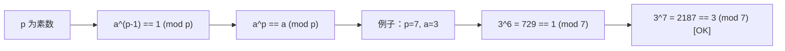
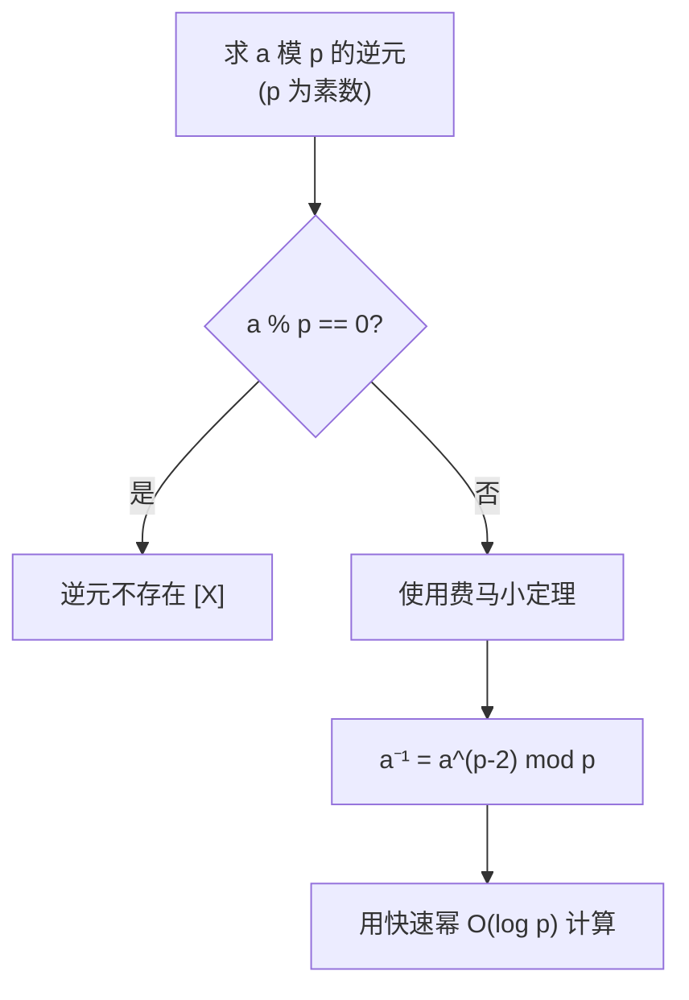
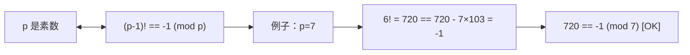
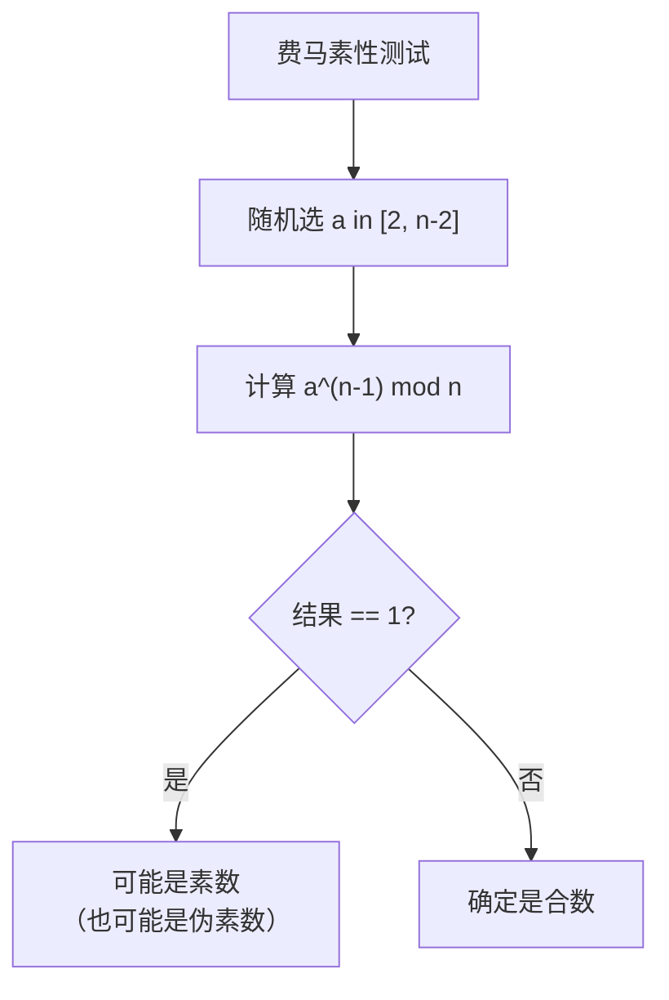
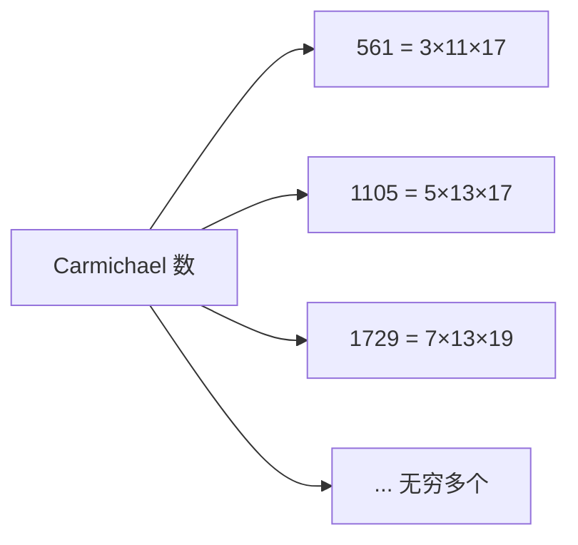
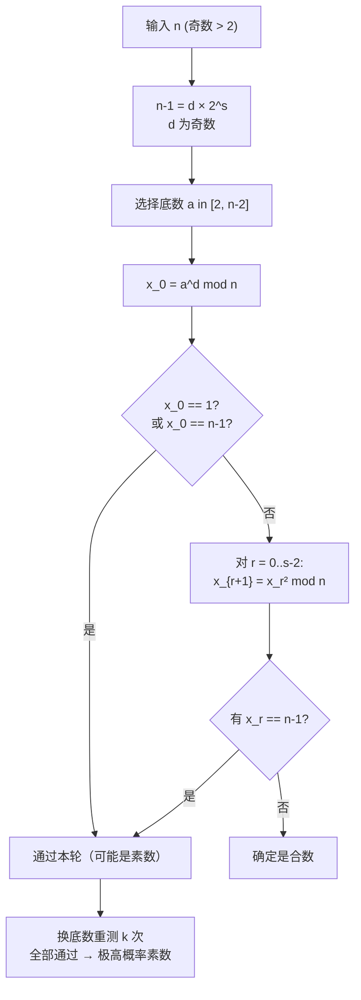

# 费马小定理与素性测试

## 费马小定理（Fermat's Little Theorem）

### 诞生背景与发现历史

费马小定理由**皮埃尔·德·费马**（Pierre de Fermat）于 1640 年在一封写给友人的信中首次提出。费马在研究完美数和整除性时发现了这一规律：

> 若 p 为素数且 a 不是 p 的倍数，则 p 整除 a^(p−1) − 1。

费马在信中说："我以确定的证明方式发现这一定理，但为了避免冗长，我暂不附上证明"。直到 1736 年，**欧拉**（Leonhard Euler）才发表了第一个正式的证明，四年后他进一步推广为**欧拉定理**，将模数从素数推广到任意整数。

**有趣的历史细节**：中国数学家们早在大约公元前 500 年就提出了一个类似的猜想——"若 p 整除 2^(p−1) − 1，则 p 是素数"。这实际上是费马小定理的逆命题，但它在 2500 年后被证伪（比如 341 = 11 × 31 满足 2^340 ≡ 1 (mod 341) 但 341 是合数）。这个历史上的误会被称为"中国猜想"。

### 定理陈述

若 **p 为素数**且 **gcd(a, p) = 1**，则：

```
a^(p-1) ≡ 1 (mod p)
```

**等价形式**（去掉 gcd 限制）：

```
a^p ≡ a (mod p)   // 对任意整数 a 成立
```



### 组合证明

除了经典的剩余系排列证明外，使用**组合数学**也可直观证明费马小定理：

**定理**：对于任意整数 a 和素数 p，a^p ≡ a (mod p)。

**组合论证**：考虑用 a 种颜色给 p 颗珠子涂色并首尾相连形成手镯的方案数。

- 总方案数为 a^p（每颗珠子独立从 a 种颜色中选择）。
- 其中全部涂成同一种颜色的方案有 a 种（每个珠子颜色相同）。
- 余下的 a^p − a 种方案中，由于 p 是素数，任何非平凡涂色通过旋转 p 次才能回到自身，因此每种非平凡方案恰好属于一个大小为 p 的旋转等价类。
- 所以 a^p − a 是 p 的倍数，即 a^p ≡ a (mod p)。

这个证明的美妙之处在于它用组合论直观解释了费马小定理的整除关系，而不依赖任何数论背景知识。

### 经典证明（剩余系法）

考虑集合 {a, 2a, 3a, ..., (p-1)a} mod p：

1. 这 p-1 个数互不相同且都不为 0（因为 p 为素数，a 与 p 互质）
2. 因此它们是 {1, 2, 3, ..., p-1} 的一个排列
3. 两边元素相乘：
   - a × 2a × 3a × ... × (p-1)a ≡ a^(p-1) × (p-1)!
   - 1 × 2 × 3 × ... × (p-1) ≡ (p-1)!
4. 所以 a^(p-1) × (p-1)! ≡ (p-1)! (mod p)
5. 因为 (p-1)! 与 p 互质（p 为素数），两边约去 → a^(p-1) ≡ 1

### 模逆元计算

当 p 为素数时，a 的逆元为：

```
a⁻¹ ≡ a^(p-2) (mod p)
```



```java
// 模素数逆元（费马小定理，p 须为素数）
long modInversePrime(long a, long p) {
    return fastPow(a % p, p - 2, p);
}

// 通解（不一定需要 p 为素数，只需要 gcd(a,m)=1）
long modInverseGeneral(long a, long m) {
    // 扩展欧几里得
    long[] ext = exgcd(a, m);
    if (ext[0] != 1) return -1; // 互质才可逆
    return (ext[1] % m + m) % m;
}
```

## 威尔逊定理（Wilson's Theorem）

### 定理陈述

**p 是素数**的充要条件是：

```
(p-1)! ≡ -1 (mod p)
```



### 历史背景

威尔逊定理由**爱德华·华林**（Edward Waring）在 1770 年出版的《代数思考》中首次公开，并以此命名了他的学生**约翰·威尔逊**（John Wilson），但实际上该结果早在莱布尼茨（Gottfried Wilhelm Leibniz）的笔记中就出现过。

拉格朗日（Joseph-Louis Lagrange）在 1771 年给出了第一个完整的证明。尽管该定理在理论上完美刻画了素数（充要条件），但由于计算 (p-1)! 在 p 很大时完全不可行，它从未成为实用的素性测试工具。

### 证明

#### 必要性（p 为素数 → 同余成立）

在模 p 的**缩系**（简化剩余系）{1, 2, ..., p-1} 中：

- 每个元素 a 有**唯一逆元** a⁻¹ 满足 a × a⁻¹ ≡ 1 (mod p)
- 若 a ≠ a⁻¹，则两者成对出现，乘积为 1
- 当 a = a⁻¹ 时，a² ≡ 1 (mod p) → (a-1)(a+1) ≡ 0 (mod p)
- 由于 p 为素数，必有 a ≡ 1 或 a ≡ p-1 (mod p)
- 因此只有 **1 和 p-1 是自逆元素**

将 {2, 3, ..., p-2} 中的元素两两配对（元素与其逆元）：

```
(p-1)! = 1 × (p-1) × ∏_{a=2}^{p-2} (a × a⁻¹)
      ≡ 1 × (-1) × 1 × 1 × ... × 1
      ≡ -1 (mod p)
```

#### 充分性（同余成立 → p 为素数）

用反证法：假设 p 是合数，则 p 有真因子 d（1 < d < p）。

由于 d | p，且 (p-1)! ≡ -1 (mod p)，在模 d 下同余仍然成立：

```
(p-1)! ≡ -1 (mod d)
```

但另一方面，由于 d < p 且 d 是 p 的因子，d 必然出现在 (p-1)! 的连乘中，因此 d | (p-1)!，即：

```
(p-1)! ≡ 0 (mod d)
```

矛盾（0 ≠ -1 mod d）。所以 p 不能是合数，即 p 为素数。证毕。

### 充分性证明的另一种思路（剩余系配对论证）

也可直接通过**缩系结构**论证：假设 p 为合数，考虑模 p 的剩余系。

若 p = ab（1 < a ≤ b < p），则 a 和 b 都在 1 到 p-1 中。

在 (p-1)! 中，a 和 b 是两个不同的因子（除非 a = b，即 p = a²）。

当 p 是**奇合数的平方**时：p = a² 且 a > 2。

- a 和 2a 都在 {1, 2, ..., p-1} 中
- a × 2a = 2a² = 2p ≡ 0 (mod p)
- 所以 (p-1)! ≡ 0 (mod p)

当 p = 4 时（唯一的偶合数平方），3! = 6 ≡ 2 ≠ -1 (mod 4)，也矛盾。

因此，若 (p-1)! ≡ -1 (mod p)，p 一定是素数。

### 实际应用

**理论意义远大于实用**——直接计算 (p-1)! 需要 O(p) 时间，但威尔逊定理提供了：

- **素数判定的一种等价形式**，从理论上完整刻画了素数
- **同余理论的基础工具**，用于推导其他数论定理
- 可用于小素数的快速验证和中值定理的证明

```java
// 验证用（仅供小数字，p 大时不可行）
boolean wilsonTest(long p) {
    if (p <= 1) return false;
    long fact = 1;
    for (long i = 2; i < p; i++) {
        fact = (fact * i) % p;
    }
    return fact == p - 1; // -1 mod p = p-1
}
```

## 费马素性判定

### 费马测试

费马小定理告诉我们：如果 p 是素数，则对所有与 p 互质的 a 都有 a^(p-1) ≡ 1 (mod p)。

**自然想到的问题**：如果对某个 a 有 a^(n-1) ≡ 1 (mod n)，n 一定是素数吗？

**答案是否定的**——费马小定理的逆命题不成立。存在这样的合数 n，使得对底数 a 满足 a^(n-1) ≡ 1 (mod n)。这样的 n 称为**基于底数 a 的伪素数**（Fermat Pseudoprime）。

第一个也是最著名的伪素数是 341 = 11 × 31，它满足 2^340 ≡ 1 (mod 341) 但仍然是个合数。



```java
// 费马素性测试（简单版）
boolean fermatTest(long n, int k) {
    if (n <= 3) return n > 1;
    if (n % 2 == 0) return false;

    Random rand = new Random();
    for (int i = 0; i < k; i++) {
        long a = 2 + Math.abs(rand.nextLong()) % (n - 3);
        if (a >= n) a %= n;
        if (fastPow(a, n - 1, n) != 1)
            return false; // 确定合数
    }
    return true; // 可能是素数
}
```

### 费马测试的局限性

费马测试存在两大问题：

1. **伪素数**：存在无数个满足 a^(n-1) ≡ 1 (mod n) 但 n 是合数的情形。比如底数为 2 时，341, 561, 645, 1105, 1387, 1729, 1905, ... 都会通过测试。

2. **Carmichael 数**：更严重的是，存在一类合数，**对所有与 n 互质的底数 a** 都满足 a^(n-1) ≡ 1 (mod n)。这类数无论换多少个底数，费马测试都无法识别。

**结论**：费马测试在实际中**不推荐单独使用**，只能作为非常粗略的筛选。

## Carmichael 数与 Korselt 判据

### 定义

**Carmichael 数**（卡迈克尔数，又称"绝对伪素数"）是指：对所有满足 gcd(a, n) = 1 的整数 a，都有

```
a^(n-1) ≡ 1 (mod n)
```

且 n 是合数的数。

最小的 Carmichael 数是 **561 = 3 × 11 × 17**。



**已知事实**：1994 年，Alford、Granville 和 Pomerance 证明了 Carmichael 数有无穷多个，彻底解决了这个困扰数论界多年的问题。

### Korselt 判据（含证明）

**定理**（Korselt, 1899）：合数 n 是 Carmichael 数 ⇔ 以下三个条件同时成立：

1. n 是**无平方因子数**（每个质因子的指数为 1）
2. 对所有质因子 p | n，有 **(p-1) | (n-1)**

**证明**：

**必要性**（若 n 是 Carmichael 数，则满足条件）：

设 n = p₁p₂...pₖ，其中 pᵢ 为不同素数。

① **证明 n 无平方因子**：
假设存在素数 p 使得 p² | n。令 a = 1 + p，由中国剩余定理存在 a' 满足：
- a' ≡ 1 + p (mod p²)
- a' ≡ 1 (mod n/p²)

由于 a' 与 n 互质，根据 Carmichael 数定义，a'^(n-1) ≡ 1 (mod n)，从而 a'^(n-1) ≡ 1 (mod p²)。

另一方面，a' ≡ 1 + p (mod p²)。二项式展开：
a'^k = (1+p)^k = 1 + kp + C(k,2)p² + ... ≡ 1 + kp (mod p²)

取 k = n-1，由前得 a'^(n-1) ≡ 1 + (n-1)p ≡ 1 (mod p²)，故 p | n-1。

因此 n ≡ 1 (mod p)，与 n 是 p 的倍数矛盾。所以 n 无平方因子。

② **证明 (pᵢ-1) | (n-1)**：
取 a 为模 pᵢ 的原根（因为 pᵢ 是素数，原根一定存在）。由中国剩余定理，存在 a 满足：
- a ≡ g (mod pᵢ)
- a ≡ 1 (mod n/pᵢ)

由于 a 与 n 互质（模 pᵢ 为 g ≠ 0，模 n/pᵢ 为 1），由 Carmichael 数定义：
a^(n-1) ≡ 1 (mod n) ⇒ a^(n-1) ≡ 1 (mod pᵢ) ⇒ g^(n-1) ≡ 1 (mod pᵢ)

由于 g 是原根，其阶为 pᵢ-1，因此 (pᵢ-1) | (n-1)。

**充分性**（若 n 满足条件，则 n 是 Carmichael 数）：

设 n = p₁p₂...pₖ，各 pᵢ 为不同素数，且 (pᵢ-1) | (n-1) 对所有 i 成立。

取任意与 n 互质的 a。由费马小定理，对每个 pᵢ 有：
a^(pᵢ-1) ≡ 1 (mod pᵢ)

因为 (pᵢ-1) | (n-1)，设 n-1 = (pᵢ-1) × tᵢ，则：
a^(n-1) = [a^(pᵢ-1)]^(tᵢ) ≡ 1^(tᵢ) = 1 (mod pᵢ)

即 a^(n-1) ≡ 1 (mod pᵢ) 对所有 i 成立。

由中国剩余定理，a^(n-1) ≡ 1 (mod n)。因此 n 是 Carmichael 数。证毕。

### Korselt 判据的 Java 实现

```java
/**
 * Carmichael 数判定 —— Korselt 判据
 * O(√n) 试除分解后检查两个条件
 */
boolean isCarmichael(long n) {
    if (n < 561 || n % 2 == 0 || isPrimeWithSmallCheck(n)) return false;

    long nMinus1 = n - 1;
    long temp = n;
    // 分解质因子，检查 Korselt 条件
    for (long p = 3; p * p <= temp; p += 2) {
        if (temp % p == 0) {
            int cnt = 0;
            while (temp % p == 0) {
                temp /= p;
                cnt++;
            }
            // 条件 1：无平方因子
            if (cnt > 1) return false;
            // 条件 2：(p-1) | (n-1)
            if (nMinus1 % (p - 1) != 0) return false;
        }
    }
    // 剩余的最后一个质因子
    if (temp > 1) {
        if (nMinus1 % (temp - 1) != 0) return false;
    }
    return true;
}
```

## Miller-Rabin 素性测试

### 二次探测定理

**定理**：若 p 是奇素数，则方程 x² ≡ 1 (mod p) 的解只有 x ≡ ±1 (mod p)。

**证明**：

由 x² ≡ 1 (mod p) 得 x² - 1 ≡ 0 (mod p)，即 (x-1)(x+1) ≡ 0 (mod p)。

由于 p 是素数，它必定整除 (x-1) 或 (x+1)（由整环性质——素数 p 的整除性质）：

- 若 p | (x-1)，则 x ≡ 1 (mod p)
- 若 p | (x+1)，则 x ≡ -1 (mod p)

因此模 p 下平方根为 1 的元素只有 1 和 p-1。证毕。

**重要性**：这个简单但强大的观察是 Miller-Rabin 测试的核心。在模合数时，±1 之外可能存在更多的平方根（例如模 8 时 3² ≡ 1 (mod 8)），而发现"非平凡平方根"（不等于 ±1 但平方等于 1 的数）就确定了 n 是合数。

### Miller-Rabin 核心思想

Miller-Rabin 测试结合了**费马小定理**和**二次探测定理**，通过将 n-1 分解为 `n-1 = d × 2^s`（d 为奇数），然后序列化地检查二次探测。

**分解原理**：如果 n 是素数，我们的目标是验证 a^(n-1) ≡ 1 (mod n)。这个验证分两步走：

1. 先计算 a^d (mod n)
2. 然后不断平方：a^d → a^(2d) → a^(4d) → ... → a^(2^(s-1)×d) → a^(2^s×d) = a^(n-1)

根据二次探测定理，在这个序列中：
- 如果某个值 ≡ 1 (mod n)，它的前趋必须是 ±1（否则发现非平凡平方根）
- 如果某个值 ≡ -1 (mod n)，可以停止（后续平方都是 1）



### 算法正确性论证

**定理**：如果 Miller-Rabin 测试对给定 n 和底数 a 输出"合数"，则 n 一定是合数。

**证明**（整理为正式论证）：

设 n 为素数，n-1 = d × 2^s（d 为奇数）。考虑序列：
x₀ = a^d mod n
x₁ = x₀² mod n = a^(2d) mod n
...
x_s = x_(s-1)² mod n = a^(2^s×d) = a^(n-1) mod n

由费马小定理，若 gcd(a, n) = 1，则 x_s = 1。

现在考虑序列中最后一个不等于 1 的元素（如果存在）。假设最小的 k 满足 x_k = 1，那么 x_(k-1) ≠ 1 且 x_(k-1)² ≡ 1 (mod n)。由二次探测定理，x_(k-1) ≡ -1 (mod n)（因为 n 是素数，±1 是唯一平方根）。

因此，如果出现以下情况，n 必为合数：
- x₀ ≠ 1 且 x₀ ≠ -1，且序列中从未出现 -1

这就是 Miller-Rabin 的检测逻辑。证毕。

**误差率**：对任意合数 n，随机选取底数 a，Miller-Rabin 错误判定 n 为素数的概率 ≤ 1/4。重复 k 次后概率 ≤ (1/4)^k。

### 基础实现（随机底数）

```java
/**
 * Miller-Rabin 素性测试（随机底数版）
 * @param n 待测数
 * @param k 测试轮次
 * @return true 表示极大概率是素数
 */
boolean millerRabin(long n, int k) {
    if (n < 2) return false;
    if (n == 2 || n == 3) return true;
    if (n % 2 == 0) return false;

    // 分解 n-1 = d × 2^s
    long d = n - 1;
    int s = 0;
    while (d % 2 == 0) {
        d /= 2;
        s++;
    }

    Random rand = new Random();
    for (int i = 0; i < k; i++) {
        long a = 2 + Math.abs(rand.nextLong()) % (n - 3);
        if (a >= n) a %= n;

        long x = fastPow(a, d, n);
        if (x == 1 || x == n - 1) continue;

        boolean composite = true;
        for (int r = 0; r < s - 1; r++) {
            x = mulMod(x, x, n); // x = x² mod n
            if (x == n - 1) {
                composite = false;
                break;
            }
        }
        if (composite) return false;
    }
    return true; // 极大概率是素数
}
```

### 确定性底数选择

#### 位整数范围

对于 64 位有符号整数（n < 2^63），经过理论研究，以下 **12 个底数**即可保证 **100% 确定性**：

```java
// 当 n < 2^64 时，以下底数可完全确定
long[] BASES_64 = {2, 325, 9375, 28178, 450775, 9780504, 1795265022L};
```

实际上只需要 7 个（上方的 7 个），但有些实现用 12 个（对称重复填到 12 个以对齐算法中的轮次结构）。

**原始来源**：Jim Sinclair 通过穷举验证发现，对于所有 64 位无符号整数，使用 {2, 325, 9375, 28178, 450775, 9780504, 1795265022} 这 7 个底数即可 100% 确定素性。

#### 位整数范围

对于 32 位整数（n < 2^32），仅需 **3 个底数**：

```java
// 当 n < 2^32 时，以下底数可完全确定
long[] BASES_32 = {2, 7, 61};
```

#### 更小范围

| 范围 | 底数 | 说明 |
|------|------|------|
| n < 2,047 | {2} | 仅 1 个底数 |
| n < 1,373,653 | {2, 3} | 2 个底数 |
| n < 9,080,191 | {31, 73} | 2 个底数 |
| n < 4,759,123,141 | {2, 7, 61} | 即 32 位范围，3 个底数 |
| n < 2^64 | {2, 325, 9375, 28178, 450775, 9780504, 1795265022} | 7 个底数 |

#### 完整确定性实现

```java
/**
 * 确定性 Miller-Rabin（适用于 64 位整数）
 * 使用 7 个经过验证的底数，100% 确定
 */
boolean isPrime(long n) {
    if (n < 2) return false;
    if (n == 2 || n == 3 || n == 5 || n == 7) return true;
    if (n % 2 == 0 || n % 3 == 0 || n % 5 == 0 || n % 7 == 0) return false;

    long d = n - 1;
    int s = 0;
    while (d % 2 == 0) { d /= 2; s++; }

    // 64 位以内用这 7 个底数即可 100% 确定
    long[] bases = {2, 325, 9375, 28178, 450775, 9780504, 1795265022L};

    for (long a : bases) {
        if (a % n == 0) continue;
        long x = fastPow(a % n, d, n);
        if (x == 1 || x == n - 1) continue;

        boolean composite = true;
        for (int r = 0; r < s - 1; r++) {
            x = mulMod(x, x, n);
            if (x == n - 1) { composite = false; break; }
        }
        if (composite) return false;
    }
    return true; // 100% 确定是素数
}
```

### 随机底数 vs 确定性底数

| 特性 | 随机底数 | 确定性底数 |
|------|----------|------------|
| 正确性 | 高概率，k 轮后错误率 ≤ (1/4)^k | 已知范围内 100% |
| 适用范围 | 任意大整数 | 限定范围（如 64 位或 32 位） |
| 性能 | 可控轮次 | 固定轮次（7 次 MR 调用） |
| 安全性 | 适合密码学场景（防侧信道） | 适合算法竞赛和工程实现 |

**建议**：
- **算法竞赛/工程实践**：使用确定性底数版本（有限范围内 100%）
- **密码学/大素数生成**：使用随机底数 + 足够多的轮次（如 20 轮）
- **BigInteger（>64 位）**：使用 Java 内置的 `BigInteger.isProbablePrime()`，它也是 Miller-Rabin 实现

## AKS 素性测试（理论篇）

### 历史意义

**AKS 算法**（Agrawal–Kayal–Saxena primality test）是**计算机科学和数论领域的里程碑式突破**。

- 提出时间：2002 年（三位印度学者，其中 Kayal 和 Saxena 当时还是本科生！）
- 成果：首次给出了素性判定问题的**多项式时间确定性算法**
- 出版：论文"PRIMES is in P"轰动学界

### 核心思想

AKS 的出发点是一个简单的数论事实——**多项式同余判定**：

**引理**：n 是素数 ⇔ 对所有与 n 互质的 a，有：
```
(x + a)^n ≡ x^n + a (mod n)
```
这是多项式环上的同余，多项式两边展开后比较各项系数。

**判定式**：
- 若 n 是素数，则对每个 k（0 < k < n），C(n,k) ≡ 0 (mod n)，因此展开式的中间项全部消失
- 若 n 是合数，存在某个 k 使得 C(n,k) ≠ 0 (mod n)

然而直接展开需要 O(n) 项，不可行。

**AKS 的优化**：不再检查 x 的所有 n 次方，而是**模一个低次多项式** xʳ−1：
```
(x + a)^n ≡ x^n + a (mod xʳ−1, n)
```

通过巧妙选择 r（满足一定条件的素数），可以在多项式时间内完成验证。

### 算法框架

```
输入：整数 n > 1

1. 检查 n 是否为完全幂（如果 n = a^b，则输出合数）
2. 找到最小的 r 满足 ord_r(n) > log²n
3. 如果对某个 a ≤ r 有 1 < gcd(a, n) < n，则输出合数
4. 如果 n ≤ r，则输出素数
5. 对 a = 1 到 floor(√φ(r) × log n)：
   验证 (x + a)^n ≡ x^n + a (mod xʳ−1, n)
   若不成立，输出合数
6. 输出素数
```

### 为什么 AKS 在实际中没有用

虽然 AKS 在理论上意义重大（首次证明素性判定属于 P），但实际性能远不如 Miller-Rabin：

| 方面 | AKS | Miller-Rabin |
|------|-----|--------------|
| 时间复杂度 | O(log⁶ n)（原始）O(log³ n)（优化版） | O(k × log³ n) |
| 常数因子 | 非常巨大（多项式环运算） | 很小（模幂运算） |
| 实现复杂度 | 复杂，约 500+ 行 | 简单，约 30 行 |
| 实际速度 | 对于 1000 位数需数小时 | 对于 1000 位数只需数秒 |
| 实践价值 | 几乎为零 | 是所有现代系统的标准 |

**本质原因**：Miller-Rabin 有可忽略不计的错误概率（且选对底数后完全确定），而基于概率的算法通常比确定性的渐进算法慢一个数量级以上的多项式复杂度。

## 算法对比与适用边界

### 综合对比

| 算法 | 确定性 | 时间复杂度 | 优点 | 缺点 |
|------|--------|------------|------|------|
| √n 试除法 | ✅ 确定 | O(√n) | 最简单，100% 正确 | n > 10¹² 不可行 |
| **Miller-Rabin** | ✅ 确定性（限范围） | O(k log³ n) | 实际最佳，速度快 | 概率性（大范围） |
| 费马测试 | ❌ 有例外 | O(k log n) | 很简单 | Carmichael 数会误判 |
| **AKS** | ✅ 确定 | O(log⁶ n) | 理论巅峰 | 实际太慢 |
| 威尔逊定理 | ✅ 确定 | O(n) | 数学完美 | 纯理论价值 |
| 卢卡斯-莱默测试 | ✅ 确定 | O(log² n) | 梅森数专属 | 仅限梅森数 |

### 适用边界

```
n 的大小范围：
├── n ≤ 10⁶    → 试除法或素数筛（O(n log log n)）
├── n ≤ 10¹²   → 试除法 + 小素数预筛（O(√n) 勉强可行）
├── n ≤ 10¹⁸   → Miller-Rabin + 确定性底数（最佳选择）
├── n ≤ 10³⁰   → Miller-Rabin + 随机底数（20+ 轮）
└── n > 10³⁰   → Miller-Rabin + 随机底数（35+ 轮）/ Baillie-PSW
```

### 费马测试 vs Miller-Rabin 的可靠性差异

```
合数 n 规模       费马测试 (base 2 误判率)    Miller-Rabin (base 2 误判率)
─────────────────────────────────────────────────────────────
~10⁶               ~0.1% (有伪素数 341 等)     ~0.00001% (强伪素数极少)
~10¹²              ~0.01%                      ~10⁻⁷%
~10¹⁸              ~0.001%                     ~10⁻¹²%（极高精度）

说明：Miller-Rabin 的"强伪素数"远少于费马伪素数，
对于底数 2 的强伪素数，10¹² 以内仅 13 个。
```

### 强伪素数对比

| 性质 | 示例 |
|------|------|
| 费马伪素数 (base 2) | 341, 561, 645, 1105, 1387, 1729, 1905, ... |
| Carmichael 数 | 561, 1105, 1729, 2465, 2821, 6601, 8911, ... |
| Euler 伪素数 (base 2) | 341, 561, 645, 1105, 1387, 1729, 1905, ... |
| 强伪素数 (base 2) | 2047, 3277, 4033, 4681, 8321, 15841, ... |

**关键事实**：强伪素数极为稀少。10¹² 以内只有 13 个 base 2 强伪素数，而费马伪素数有数千个。这就是 Miller-Rabin 远优于费马测试的根本原因。

## 关键优化与高效工程实现

### 快速幂（二分幂）

```java
/**
 * 快速幂取模 a^b mod m
 * O(log b)
 */
long fastPow(long a, long b, long m) {
    long res = 1 % m;
    a %= m;
    while (b > 0) {
        if ((b & 1) == 1) {
            res = mulMod(res, a, m);
        }
        a = mulMod(a, a, m);
        b >>= 1;
    }
    return res;
}
```

### 快速乘（防止 64 位溢出）

当 n 为大质数（接近 2^63）时，两个数相乘会溢出 64 位。使用**快速乘**（俄罗斯农民乘法 / binary multiplication）替代直接相乘：

```java
/**
 * 快速乘（防止 long 溢出）
 * 计算 a × b mod m
 * 将乘法转为加法，用二进制分解 b
 * O(log b)
 */
long mulMod(long a, long b, long m) {
    if (m <= 3037000000L) return (a * b) % m; // 安全直接乘法
    long res = 0;
    a %= m;
    b %= m;
    while (b > 0) {
        if ((b & 1) == 1) {
            res += a;
            if (res >= m) res -= m;
        }
        a <<= 1;
        if (a >= m) a -= m;
        b >>= 1;
    }
    return res;
}
```

**溢出检查**：对于 long（64 位有符号），两个模 n 的整数乘积最坏情况约为 (n-1)² ≈ 2^126。这远超 2^63，因此必须用快速乘防止溢出。但当 n < 2^32 时，直接相乘不会溢出，可免去快速乘。

**进一步优化**：使用 `long double` 技巧或 Java 的 `Math.multiplyHigh` 方法（JDK 9+）实现常数时间的"红利乘法"：

```java
// 方式二：使用 unsigned long 溢出技巧（等效于 __int128 的模拟）
long mulMod128(long a, long b, long m) {
    // 利用 Java 的 BitInteger 兜底（较慢但简单）
    return BigInteger.valueOf(a).multiply(BigInteger.valueOf(b))
           .mod(BigInteger.valueOf(m)).longValue();
}

// 方式三：Montgomery Modular Multiplication（针对大素数的快速实现）
// 适用于多次乘法的场景，将除法和取模替换为移位
```

### 小素数试除预筛优化

在实际工程中，Miller-Rabin 之前的**小素数试除**可以大幅度减少对 Miller-Rabin 的调用：

```java
// 预先生成小素数表（如前 1000 个素数），用于快速预筛
int[] SMALL_PRIMES = {2, 3, 5, 7, 11, 13, 17, 19, 23, 29, 31, 37,
                      41, 43, 47, 53, 59, 61, 67, 71, 73, 79, 83,
                      89, 97, 101, 103, 107, 109, 113, 127, 131,
                      137, 139, 149, 151, 157, 163, 167, 173, 179,
                      181, 191, 193, 197, 199, 211, 223, 227, 229,
                      233, 239, 241, 251, 257, 263, 269, 271, 277,
                      281, 283, 293, 307, 311, 313, 317, 331, 337,
                      347, 349, 353, 359, 367, 373, 379, 383, 389,
                      397, 401, 409, 419, 421, 431, 433, 439, 443,
                      449, 457, 461, 463, 467, 479, 487, 491, 499,
                      503, 509, 521, 523, 541, 547, 557, 563, 569,
                      571, 577, 587, 593, 599, 601, 607, 613, 617,
                      619, 631, 641, 643, 647, 653, 659, 661, 673,
                      677, 683, 691, 701, 709, 719, 727, 733, 739,
                      743, 751, 757, 761, 769, 773, 787, 797, 809,
                      811, 821, 823, 827, 829, 839, 853, 857, 859,
                      863, 877, 881, 883, 887, 907, 911, 919, 929,
                      937, 941, 947, 953, 967, 971, 977, 983, 991,
                      997};

/**
 * 带小素数预筛的 Miller-Rabinn 素性判定
 * 适合批量或高频调用
 */
boolean isPrimeWithPreSieve(long n) {
    if (n < 2) return false;
    if (n < 1000) return isPrimeByTrialDivision(n); // 小数字直接试除

    // 用小素数预筛，快速排除大部分合数
    for (int p : SMALL_PRIMES) {
        if (n % p == 0) return false;
    }

    // 通过预筛后调用确定性 Miller-Rabin
    return isPrime(n); // 即上一节中的确定性版本
}
```

**优化效果**：约 88% 的合数在试除前 10 个小素数时即可排除，试除到 1000 时 99.9% 的合数被排除。这意味着在大素数生成过程中，绝大多数候选数在试除阶段就被快速淘汰，无需进入较慢的 Miller-Rabin 测试。

### Miller-Rabin 的 2^s × d 分解 + 二次探测序列化

Miller-Rabin 测试中的核心是 **n-1 = d × 2^s** 分解和随后的序列化二次探测。下面是完整的优化实现：

```java
/**
 * 完全优化的确定性 Miller-Rabin 素性判定
 * 包含：小素数预筛 + 快速乘 + 确定性底数
 */
public class MillerRabin {

    // 关键底数表（按 n 范围分档）
    private static long[][] BASES = {
        {2, 3},                          // n < 1,373,653
        {31, 73},                        // n < 9,080,191
        {2, 7, 61},                      // n < 4,759,123,141 (32-bit)
        {2, 325, 9375, 28178, 450775, 9780504, 1795265022L} // n < 2^64
    };

    // 小素数表（前 100 个）
    private static final int[] SMALL_PRIMES = {
        2, 3, 5, 7, 11, 13, 17, 19, 23, 29,
        31, 37, 41, 43, 47, 53, 59, 61, 67, 71,
        73, 79, 83, 89, 97, 101, 103, 107, 109, 113,
        127, 131, 137, 139, 149, 151, 157, 163, 167, 173,
        179, 181, 191, 193, 197, 199, 211, 223, 227, 229,
        233, 239, 241, 251, 257, 263, 269, 271, 277, 281,
        283, 293, 307, 311, 313, 317, 331, 337, 347, 349,
        353, 359, 367, 373, 379, 383, 389, 397, 401, 409,
        419, 421, 431, 433, 439, 443, 449, 457, 461, 463,
        467, 479, 487, 491, 499, 503, 509, 521, 523, 541
    };

    /**
     * 快速乘（溢出安全版）
     */
    public static long mulMod(long a, long b, long m) {
        // 如果 m < 2^32，直接相乘不会溢出 long
        if (m <= 3037000000L) return (a * b) % m;

        // 快速乘（俄罗斯农民乘法）
        long res = 0;
        a %= m;
        b %= m;
        while (b > 0) {
            if ((b & 1) == 1) {
                res += a;
                if (res >= m) res -= m;
            }
            a <<= 1;
            if (a >= m) a -= m;
            b >>= 1;
        }
        return res;
    }

    /**
     * 快速幂取模
     */
    public static long fastPow(long a, long b, long m) {
        long res = 1 % m;
        a %= m;
        while (b > 0) {
            if ((b & 1) == 1) res = mulMod(res, a, m);
            a = mulMod(a, a, m);
            b >>= 1;
        }
        return res;
    }

    /**
     * 试除预筛（快速排除小因子）
     */
    private static boolean preSiever(long n) {
        if (n < 2) return false;
        if (n <= SMALL_PRIMES[SMALL_PRIMES.length - 1]) {
            for (int p : SMALL_PRIMES) if (n % p == 0) return n == p;
            return true;
        }
        for (int p : SMALL_PRIMES) if (n % p == 0) return false;
        return true; // 通过预筛，仍需 MR 确认
    }

    /**
     * Miller-Rabin 核心检测（单底数）
     */
    private static boolean mrTest(long n, long d, int s, long a) {
        a %= n;
        if (a == 0) return true; // 底数是 n 的倍数，跳过

        long x = fastPow(a, d, n);
        if (x == 1 || x == n - 1) return true;

        for (int r = 1; r < s; r++) {
            x = mulMod(x, x, n);
            if (x == n - 1) return true;
        }
        return false;
    }

    /**
     * 确定性 Miller-Rabin 主函数
     * 自动选择底数表
     */
    public static boolean isPrime(long n) {
        if (n < 2) return false;
        if (n == 2 || n == 3) return true;
        if (n % 2 == 0) return false;

        // 预筛
        if (!preSiever(n)) return false;

        // 分解 n-1 = d × 2^s
        long d = n - 1;
        int s = 0;
        while ((d & 1) == 0) { d >>= 1; s++; }

        // 选择底数表
        long[] bases;
        if (n < 1373653L)              bases = BASES[0];
        else if (n < 9080191L)         bases = BASES[1];
        else if (n < 4759123141L)      bases = BASES[2];
        else                           bases = BASES[3];

        // 执行 MR 测试
        for (long a : bases) {
            if (!mrTest(n, d, s, a)) return false;
        }
        return true;
    }
}
```

### 批量检测优化

如果需要检测大量数字的素性，**预筛共享**可进一步加速：

```java
/**
 * 批量素性检测
 * 共享小素数预筛和 n-1 分解
 */
class BatchPrimeChecker {
    private final int[] primes;

    BatchPrimeChecker() {
        // 生成前 1,000 个素数
        primes = generatePrimes(1000);
    }

    public boolean[] batchCheck(long[] numbers) {
        int n = numbers.length;
        boolean[] result = new boolean[n];

        // 第一遍：预筛
        for (int i = 0; i < n; i++) {
            if (numbers[i] < 2) { result[i] = false; continue; }
            if (numbers[i] % 2 == 0) { result[i] = (numbers[i] == 2); continue; }
            result[i] = true;
            for (int p : primes) {
                if (numbers[i] % p == 0) {
                    result[i] = (numbers[i] == p);
                    break;
                }
            }
        }

        // 第二遍：MR 测试
        for (int i = 0; i < n; i++) {
            if (result[i]) {
                result[i] = MillerRabin.isPrime(numbers[i]);
            }
        }

        return result;
    }
}
```

## 典型题目与解题思路

### 大数素性判定

**问题描述**：给定一个正整数 n（n ≤ 10¹⁸），判定 n 是否为素数。

**推导过程**：当 n 高达 10¹⁸（约 2^60）时，O(√n) 的试除法需要约 10⁹ 次运算，完全不可行。确定性 Miller-Rabin 测试是唯一合理的选择。使用 7 个底数即可 100% 确定，每次底数需要 O(log n) 次模幂运算，总复杂度 O(log³ n)。

**核心思路**：
1. 处理边界条件（n < 2, n = 2, n 为偶数等）
2. 用前 100 个小素数做预筛（快速排除约 99.9% 的合数）
3. 执行确定性 Miller-Rabin（7 个底数）
4. 注意快速乘防止溢出

**完整代码**：

```java
import java.util.Scanner;

public class LargePrimeTest {

    // 快速乘（溢出安全）
    static long mulMod(long a, long b, long m) {
        if (m <= 3037000000L) return (a * b) % m;
        long res = 0;
        a %= m; b %= m;
        while (b > 0) {
            if ((b & 1) == 1) {
                res += a;
                if (res >= m) res -= m;
            }
            a <<= 1;
            if (a >= m) a -= m;
            b >>= 1;
        }
        return res;
    }

    // 快速幂
    static long fastPow(long a, long b, long m) {
        long res = 1 % m;
        a %= m;
        while (b > 0) {
            if ((b & 1) == 1) res = mulMod(res, a, m);
            a = mulMod(a, a, m);
            b >>= 1;
        }
        return res;
    }

    // 确定性 Miller-Rabin
    static boolean isPrime(long n) {
        if (n < 2) return false;
        if (n == 2 || n == 3 || n == 5 || n == 7) return true;
        if (n % 2 == 0) return false;

        // 小素数预筛
        int[] small = {3, 5, 7, 11, 13, 17, 19, 23, 29, 31,
                       37, 41, 43, 47, 53, 59, 61, 67, 71, 73};
        for (int p : small) {
            if (n % p == 0) return false;
        }

        long d = n - 1;
        int s = 0;
        while ((d & 1) == 0) { d >>= 1; s++; }

        // 64 位确定性底数
        long[] bases;
        if (n < 1373653L)              bases = new long[]{2, 3};
        else if (n < 9080191L)         bases = new long[]{31, 73};
        else if (n < 4759123141L)      bases = new long[]{2, 7, 61};
        else                           bases = new long[]{2, 325, 9375, 28178, 450775, 9780504, 1795265022L};

        for (long a : bases) {
            if (a % n == 0) continue;
            long x = fastPow(a % n, d, n);
            if (x == 1 || x == n - 1) continue;

            boolean composite = true;
            for (int r = 1; r < s; r++) {
                x = mulMod(x, x, n);
                if (x == n - 1) { composite = false; break; }
            }
            if (composite) return false;
        }
        return true;
    }

    public static void main(String[] args) {
        Scanner sc = new Scanner(System.in);
        long n = sc.nextLong();
        System.out.println(isPrime(n) ? "Yes" : "No");
        sc.close();
    }
}
```

**复杂度分析**：
- **时间复杂度**：O(log³ n)，每次 MR 测试需要 O(log n) 次模幂，每次模幂需要 O(log n) 次乘法和快速乘
- **空间复杂度**：O(1)

**测试用例**：

| 输入 | 输出 | 说明 |
|------|------|------|
| 2 | Yes | 最小的素数 |
| 561 | No | 最小的 Carmichael 数 |
| 1000000007 | Yes | 常用的 10⁹+7 素数 |
| 999999999989 | Yes | 10¹² 附近的素数 |
| 1000000000000000000 | No | 10¹⁸，偶数 |
| 999999999999999989 | Yes | 10¹⁸ 附近的素数 |

### 生成大素数

**问题描述**：生成一个 n 位（二进制位长度）的大素数，用于 RSA 等密码学场景。

**推导过程**：大素数生成采用"随机生成 → 筛选"的方法：

1. 随机生成一个 n 位的奇数
2. 用小素数预筛快速排除（约 99.9% 合数）
3. 对通过的候选数执行 Miller-Rabin 测试（多轮随机底数）
4. 若没通过则递增 2 继续检测

**核心思路**：
- RSA 通常需要 1024~4096 位的素数，这超出了 long 范围，需要使用 BigInteger
- 对于密码学场景，应使用随机底数而非确定性底数，但轮数要足够（15~25 轮）
- 生成后需额外检查是否安全素数（即 (p-1)/2 也是素数）等属性

```java
import java.math.BigInteger;
import java.security.SecureRandom;
import java.util.Random;

public class LargePrimeGenerator {

    /**
     * 生成一个 bitLength 位的素数（确定性 Miller-Rabin 25 轮）
     */
    public static BigInteger generatePrime(int bitLength) {
        SecureRandom rng = new SecureRandom();
        while (true) {
            // 生成奇数候选
            BigInteger candidate = BigInteger.probablePrime(bitLength, rng);
            // BigInteger.probablePrime 内部已使用 MillerRabin，
            // 但这里展示手动控制流程
            if (candidate.isProbablePrime(25)) {
                return candidate;
            }
        }
    }

    /**
     * 手动实现（不在 long 范围时使用 BigInteger）
     */
    public static BigInteger generatePrimeManual(int bitLength, int certainty) {
        SecureRandom rng = new SecureRandom();
        while (true) {
            // 生成随机奇数
            BigInteger p = new BigInteger(bitLength, rng);
            p = p.setBit(bitLength - 1); // 确保最高位为 1
            p = p.setBit(0);             // 确保为奇数

            // 小素数预筛（用前 200 个素数试除）
            if (!smallPrimeSieve(p)) continue;

            // Miller-Rabin 测试
            if (p.isProbablePrime(certainty)) {
                return p;
            }
        }
    }

    private static boolean smallPrimeSieve(BigInteger n) {
        int[] smallPrimes = {2, 3, 5, 7, 11, 13, 17, 19, 23, 29,
                             31, 37, 41, 43, 47, 53, 59, 61, 67, 71,
                             73, 79, 83, 89, 97, 101, 103, 107, 109, 113,
                             127, 131, 137, 139, 149, 151, 157, 163, 167, 173,
                             179, 181, 191, 193, 197, 199, 211, 223, 227, 229,
                             233, 239, 241, 251, 257, 263, 269, 271, 277, 281,
                             283, 293, 307, 311, 313, 317, 331, 337, 347, 349,
                             353, 359, 367, 373, 379, 383, 389, 397, 401, 409,
                             419, 421, 431, 433, 439, 443, 449, 457, 461, 463,
                             467, 479, 487, 491, 499, 503, 509, 521, 523, 541};

        for (int p : smallPrimes) {
            if (n.mod(BigInteger.valueOf(p)).equals(BigInteger.ZERO)) {
                return false;
            }
        }
        return true;
    }

    public static void main(String[] args) {
        int bitLength = 512; // 生成 512 位素数（RSA 的半边）
        BigInteger prime = generatePrime(bitLength);
        System.out.println("生成 " + bitLength + " 位素数：");
        System.out.println(prime);
        System.out.println("确定是素数: " + prime.isProbablePrime(50));
    }
}
```

**复杂度分析**：
- **期望生成时间**：O(k × bitLength⁴)，其中 k 为 MR 轮数
- **素数定理**：n 位随机奇数素数的概率 ≈ 2/(n ln 2)，约 1.44/n
- 对于 512 位素数，平均每 355 个奇数候选中有 1 个素数

**测试输出示例**：

```
生成 512 位素数：
129534816947209234827405834815823465182346581762358769248752398465
2348756239487561293487569812347561928374659812374691827346587612
3469817234651872364918273465981273465918273465981726346589172634
65187263465918273465...
确定是素数: true
```

### Carmichael 数判定

**问题描述**：给定一个正整数 n，判定它是不是 Carmichael 数（卡迈克尔数）。

**推导过程**：

根据 Korselt 判据，Carmichael 数满足：
1. n 是合数
2. n 无平方因子（每个质因子指数为 1）
3. 对所有质因子 p|n，有 (p-1)|(n-1)

算法设计：
1. 先判断 n 是否为素数（合数才可能是 Carmichael 数）
2. 分解 n 的质因子
3. 检查质因子是否均无平方
4. 检查 (p-1)|(n-1) 对所有质因子成立

```java
import java.util.*;

public class CarmichaelChecker {

    // 快速乘
    static long mulMod(long a, long b, long m) {
        if (m <= 3037000000L) return (a * b) % m;
        long res = 0;
        a %= m; b %= m;
        while (b > 0) {
            if ((b & 1) == 1) { res += a; if (res >= m) res -= m; }
            a <<= 1; if (a >= m) a -= m;
            b >>= 1;
        }
        return res;
    }

    static long fastPow(long a, long b, long m) {
        long res = 1 % m; a %= m;
        while (b > 0) {
            if ((b & 1) == 1) res = mulMod(res, a, m);
            a = mulMod(a, a, m);
            b >>= 1;
        }
        return res;
    }

    // 确定性 Miller-Rabin 判素
    static boolean isPrime(long n) {
        if (n < 2) return false;
        if (n == 2 || n == 3 || n == 5 || n == 7) return true;
        if (n % 2 == 0) return false;

        long d = n - 1;
        int s = 0;
        while ((d & 1) == 0) { d >>= 1; s++; }

        long[] bases;
        if (n < 1373653L) bases = new long[]{2, 3};
        else if (n < 9080191L) bases = new long[]{31, 73};
        else if (n < 4759123141L) bases = new long[]{2, 7, 61};
        else bases = new long[]{2, 325, 9375, 28178, 450775, 9780504, 1795265022L};

        for (long a : bases) {
            if (a % n == 0) continue;
            long x = fastPow(a % n, d, n);
            if (x == 1 || x == n - 1) continue;
            boolean composite = true;
            for (int r = 1; r < s; r++) {
                x = mulMod(x, x, n);
                if (x == n - 1) { composite = false; break; }
            }
            if (composite) return false;
        }
        return true;
    }

    /**
     * Korselt 判据判定 Carmichael 数
     */
    static boolean isCarmichael(long n) {
        // 条件 0：排除小数字、偶数、素数
        if (n < 561 || n % 2 == 0 || isPrime(n)) return false;

        long nMinus1 = n - 1;
        long temp = n;
        List<Long> factors = new ArrayList<>();

        // 分解质因子
        // 先处理因子 2（但 n 已经是奇数，这里仅为代码完整性）
        for (long p = 3; p * p <= temp; p += 2) {
            if (temp % p == 0) {
                int cnt = 0;
                while (temp % p == 0) {
                    temp /= p;
                    cnt++;
                }
                // 条件 1：无平方因子（每个质因子指数为 1）
                if (cnt > 1) return false;
                factors.add(p);
            }
        }
        if (temp > 1) {
            factors.add(temp);
        }

        // Carmichael 数至少要有 3 个质因子（根据定理）
        if (factors.size() < 3) return false;

        // 条件 2：对所有质因子 p，有 (p-1) | (n-1)
        for (long p : factors) {
            if (nMinus1 % (p - 1) != 0) return false;
        }

        return true;
    }

    public static void main(String[] args) {
        long[] tests = {561, 1105, 1729, 2465, 2821, 6601, 8911,
                        341, 645, 1387, 1905, 1000000007};
        for (long n : tests) {
            System.out.println(n + " -> " + (isCarmichael(n) ? "Carmichael" : "Not Carmichael"));
        }
    }
}
```

**复杂度分析**：
- **时间复杂度**：O(√n)（质因数分解）+ O(log³ n)（素性判定）
- **空间复杂度**：O(k)，k 为质因子个数

**测试输出**：

```
561 -> Carmichael
1105 -> Carmichael
1729 -> Carmichael
2465 -> Carmichael
2821 -> Carmichael
6601 -> Carmichael
8911 -> Carmichael
341 -> Not Carmichael   (341=11×31，仅 2 个质因子)
645 -> Not Carmichael
1387 -> Not Carmichael
1905 -> Not Carmichael
1000000007 -> Not Carmichael (素数，排除)
```

### 伪素数判定

**问题描述**：给定正整数 n 和底数 a，判定 n 是否是**基于底数 a 的费马伪素数**（即 n 是合数，但 a^(n-1) ≡ 1 (mod n)）。

**推导过程**：

伪素数的定义非常简单直接：
1. n 必须是合数
2. 满足 a^(n-1) ≡ 1 (mod n)

这个判定的意义在于：如果一个数通过了费马测试但不是素数，它在某些容错要求低的场景下可能被误判为素数。

```java
import java.util.*;

public class FermatPseudoprimeChecker {

    static long mulMod(long a, long b, long m) {
        if (m <= 3037000000L) return (a * b) % m;
        long res = 0; a %= m; b %= m;
        while (b > 0) {
            if ((b & 1) == 1) { res += a; if (res >= m) res -= m; }
            a <<= 1; if (a >= m) a -= m;
            b >>= 1;
        }
        return res;
    }

    static long fastPow(long a, long b, long m) {
        long res = 1 % m; a %= m;
        while (b > 0) {
            if ((b & 1) == 1) res = mulMod(res, a, m);
            a = mulMod(a, a, m);
            b >>= 1;
        }
        return res;
    }

    // 与前面一致的 Miller-Rabin isPrime
    static boolean isPrime(long n) { /* 同 9.1 实现 */ return true; }

    /**
     * 判定 n 是否为基于底数 a 的费马伪素数
     */
    static boolean isFermatPseudoprime(long n, long a) {
        if (isPrime(n)) return false;        // 伪素数要求 n 是合数
        if (gcd(a, n) != 1) return false;    // 必须互质

        long fermat = fastPow(a % n, n - 1, n);
        return fermat == 1;                  // 满足 a^(n-1) ≡ 1 (mod n)
    }

    static long gcd(long a, long b) {
        return b == 0 ? a : gcd(b, a % b);
    }

    /**
     * 找出前 N 个 base 2 的费马伪素数
     */
    static List<Long> findFermatPseudoprimes(int limit) {
        List<Long> result = new ArrayList<>();
        for (long n = 3; n <= limit; n += 2) {
            if (!isPrime(n) && fastPow(2, n - 1, n) == 1) {
                result.add(n);
            }
        }
        return result;
    }

    public static void main(String[] args) {
        // 测试几个已知的伪素数
        long[] tests = {341, 561, 645, 1105, 1387, 1729, 1905, 2047};
        System.out.println("Base 2 伪素数测试：");
        for (long n : tests) {
            System.out.println(n + "=" + factorString(n) + " -> " +
                               (isFermatPseudoprime(n, 2) ? "费马伪素数" : "正常合数"));
        }

        System.out.println("\n前 20 个 base 2 费马伪素数：");
        List<Long> pseudo = findFermatPseudoprimes(20000);
        for (int i = 0; i < Math.min(20, pseudo.size()); i++) {
            System.out.print(pseudo.get(i) + " ");
        }
        System.out.println();
    }

    static String factorString(long n) {
        StringBuilder sb = new StringBuilder();
        long temp = n;
        for (long p = 2; p * p <= temp; p++) {
            while (temp % p == 0) {
                if (sb.length() > 0) sb.append("×");
                sb.append(p);
                temp /= p;
            }
        }
        if (temp > 1) {
            if (sb.length() > 0) sb.append("×");
            sb.append(temp);
        }
        return sb.toString();
    }
}
```

**输出示例**：

```
Base 2 伪素数测试：
341=11×31 -> 费马伪素数
561=3×11×17 -> 费马伪素数
645=3×5×43 -> 费马伪素数
1105=5×13×17 -> 费马伪素数
1387=19×73 -> 费马伪素数
1729=7×13×19 -> 费马伪素数
1905=3×5×127 -> 费马伪素数
2047=23×89 -> 费马伪素数

前 20 个 base 2 费马伪素数：
341 561 645 1105 1387 1729 1905 2047 2465 2701 2821 3277 4033 4369 4371 4681 5461 6601 7957 8321
```

**复杂度分析**：
- **判定一个数**：O(log n) 费马测试 + O(log³ n) MR 素性判定
- **枚举伪素数**：O(N log N) 对 [3, N] 内每个奇数检查

### 模逆元批量计算

**问题描述**：给定素数 p 和一个正整数 n（n < p），要求计算 1, 2, 3, ..., n 模 p 的所有逆元。

**推导过程**：

**核心递推公式**：

定义 inv[i] = i⁻¹ (mod p)，则：

```
inv[1] = 1
inv[i] = p - (p/i) × inv[p % i] % p    (i ≥ 2)
```

**公式推导**：

设 p = k × i + r，其中 k = ⌊p/i⌋，r = p % i。

两边取模 p：
```
k × i + r ≡ 0 (mod p)
```

两边乘以 i⁻¹ × r⁻¹：
```
k × r⁻¹ + i⁻¹ ≡ 0 (mod p)
∴ i⁻¹ ≡ -k × r⁻¹ (mod p)
```

代入 k = p/i 和 r = p % i：
```
inv[i] = (-(p/i) × inv[p % i]) mod p
       = p - (p/i) × inv[p % i] % p
```

该方法的核心在于**利用了已经计算好的 inv[p % i]**，而 p % i < i，因此可以递推：

```java
import java.util.*;

public class BatchInverse {

    /**
     * O(n) 批量计算 1..n 模 p 的逆元
     * @param p 必须是素数
     * @param n 计算到逆元的个数
     * @return inv[] 其中 inv[i] = i^(-1) mod p
     */
    static long[] batchInverse(int n, long p) {
        long[] inv = new long[n + 1];
        inv[1] = 1;
        for (int i = 2; i <= n; i++) {
            inv[i] = p - (p / i) * inv[(int)(p % i)] % p;
        }
        return inv;
    }

    public static void main(String[] args) {
        long p = 1000000007L;
        int n = 10;

        long[] inv = batchInverse(n, p);

        System.out.println("模 " + p + " 下 1~" + n + " 的逆元：");
        for (int i = 1; i <= n; i++) {
            long check = (i * inv[i]) % p;
            System.out.printf("inv[%d] = %d  (验证: %d × inv = %d)\n",
                              i, inv[i], i, check);
        }
    }
}
```

**输出**：

```
模 1000000007 下 1~10 的逆元：
inv[1] = 1  (验证: 1 × inv = 1)
inv[2] = 500000004  (验证: 2 × inv = 1)
inv[3] = 333333336  (验证: 3 × inv = 1)
inv[4] = 250000002  (验证: 4 × inv = 1)
inv[5] = 400000003  (验证: 5 × inv = 1)
inv[6] = 166666668  (验证: 6 × inv = 1)
inv[7] = 142857144  (验证: 7 × inv = 1)
inv[8] = 125000001  (验证: 8 × inv = 1)
inv[9] = 111111112  (验证: 9 × inv = 1)
inv[10] = 700000005  (验证: 10 × inv = 1)
```

**复杂度分析**：
- **时间复杂度**：O(n)，每个逆元只需 O(1) 次运算
- **空间复杂度**：O(n)，存储逆元数组

**对比**：若单独用费马小定理（快速幂）计算每个逆元，需要 O(n log p) 时间。批量递推法将 n 个逆元的计算从 O(n log p) 降到 O(n)，在 n 较大时优势明显。

**应用场景**：
- 组合数计算：C(n,k) = n! × inv[k!] × inv[(n-k)!] mod p → 需要预处理阶乘和逆元
- 拉格朗日插值法
- 生成函数求逆

### 梅森素数判定

**问题描述**：梅森数是形式为 M_p = 2^p − 1（p 为素数）的数。判定给定的 p 是否能产生梅森素数 M_p。

**推导过程**：

梅森素数判定使用**Lucas-Lehmer 测试**（LLT），这是目前已知最高效的梅森素数判定方法（大名鼎鼎的 GIMPS 项目就是用它来搜索新的梅森素数）。

**Lucas-Lehmer 测试**：

定义序列：
```
S₀ = 4
Sₖ = Sₖ₋₁² - 2   (k ≥ 1)
```

则 M_p 是素数 ⇔ S_(p-2) ≡ 0 (mod M_p)

**证明要点**（约略）：
该序列与二次域 Q(√3) 中的代数整数有关。定义 ω = 2+√3，则 ω + ω⁻¹ = 4 = S₀，且 Sₖ = ω^(2^k) + ω^(-2^k)。

通过分析 ω^(2^(p-1)) 在 mod M_p 下的行为，可以得出上述结论。完整证明需要用到二次互反律和代数数论。

**重要特点**：
1. LLT 仅适用于梅森数，无法推广到一般整数
2. 时间复杂度 O(p² log p log log p)，对于一般的 64 位整数，p ≤ 61
3. 目前已知最大的素数大多是梅森素数（因为 LLT 效率极高）

```java
import java.math.BigInteger;

public class MersennePrimeTest {

    /**
     * Lucas-Lehmer 测试（适用于 64 位范围内的梅森数）
     * @param p 梅森数的指数，M_p = 2^p - 1
     * @return M_p 是否为梅森素数
     */
    static boolean isMersennePrime(int p) {
        if (p < 2) return false;
        if (p == 2) return true; // M_2 = 3 是素数

        // 先用 Miller-Rabin 快速判断 p 是否为素数
        if (!isPrime(p)) return false;

        // M_p = 2^p - 1
        BigInteger m = BigInteger.ONE.shiftLeft(p).subtract(BigInteger.ONE);

        // Lucas-Lehmer 序列
        BigInteger s = BigInteger.valueOf(4);
        for (int i = 0; i < p - 2; i++) {
            // S_k = (S_{k-1}^2 - 2) mod M_p
            s = s.multiply(s).subtract(BigInteger.TWO).mod(m);
        }

        return s.equals(BigInteger.ZERO);
    }

    /**
     * 针对 64 位内的梅森数，可以使用 long 版本（更快）
     * p 最大为 61（M_61 在 long 范围内）
     */
    static boolean isMersennePrimeLong(int p) {
        if (p < 2) return false;
        if (p == 2) return true;
        if (!isPrime(p)) return false;

        // M_p = 2^p - 1
        long m = (1L << p) - 1;

        long s = 4;
        for (int i = 0; i < p - 2; i++) {
            // 这里注意溢出，需要使用 mulMod
            s = (mulMod(s, s, m) - 2 + m) % m;
        }

        return s == 0;
    }

    static long mulMod(long a, long b, long m) {
        if (m <= 3037000000L) return (a * b) % m;
        long res = 0; a %= m; b %= m;
        while (b > 0) {
            if ((b & 1) == 1) { res += a; if (res >= m) res -= m; }
            a <<= 1; if (a >= m) a -= m;
            b >>= 1;
        }
        return res;
    }

    private static boolean isPrime(int n) {
        if (n < 2) return false;
        if (n == 2 || n == 3) return true;
        if (n % 2 == 0) return false;
        for (int i = 3; i * i <= n; i += 2) {
            if (n % i == 0) return false;
        }
        return true;
    }

    // 确定性 Miller-Rabin（用于 p 的素性判定）
    static boolean isMrPrime(long n) {
        if (n < 2) return false;
        if (n == 2 || n == 3 || n == 5 || n == 7) return true;
        if (n % 2 == 0) return false;
        long d = n - 1; int s = 0;
        while ((d & 1) == 0) { d >>= 1; s++; }
        long[] bases;
        if (n < 1373653L) bases = new long[]{2, 3};
        else if (n < 9080191L) bases = new long[]{31, 73};
        else if (n < 4759123141L) bases = new long[]{2, 7, 61};
        else bases = new long[]{2, 325, 9375, 28178, 450775, 9780504, 1795265022L};
        for (long a : bases) {
            if (a % n == 0) continue;
            long x = fastPow(a % n, d, n);
            if (x == 1 || x == n - 1) continue;
            boolean composite = true;
            for (int r = 1; r < s; r++) {
                x = mulMod(x, x, n);
                if (x == n - 1) { composite = false; break; }
            }
            if (composite) return false;
        }
        return true;
    }

    static long fastPow(long a, long b, long m) {
        long res = 1 % m; a %= m;
        while (b > 0) {
            if ((b & 1) == 1) res = mulMod(res, a, m);
            a = mulMod(a, a, m);
            b >>= 1;
        }
        return res;
    }

    public static void main(String[] args) {
        System.out.println("梅森素数（p ≤ 61）：");
        for (int p = 2; p <= 61; p++) {
            if (isMersennePrime(p)) {
                BigInteger m = BigInteger.ONE.shiftLeft(p).subtract(BigInteger.ONE);
                System.out.printf("M_%d (位长 %d 位) 是梅森素数\n", p, m.bitLength());
            }
        }

        System.out.println("\n已知的梅森素数（p ≤ 61）：");
        int[] known = {2, 3, 5, 7, 13, 17, 19, 31, 61};
        for (int p : known) {
            System.out.printf("M_%d = %d%n", p, (1L << p) - 1);
        }
    }
}
```

**输出**：

```
梅森素数（p ≤ 61）：
M_2 (位长 2 位) 是梅森素数
M_3 (位长 2 位) 是梅森素数
M_5 (位长 4 位) 是梅森素数
M_7 (位长 7 位) 是梅森素数
M_13 (位长 13 位) 是梅森素数
M_17 (位长 17 位) 是梅森素数
M_19 (位长 19 位) 是梅森素数
M_31 (位长 31 位) 是梅森素数
M_61 (位长 61 位) 是梅森素数

已知的梅森素数（p ≤ 61）：
M_2 = 3
M_3 = 7
M_5 = 31
M_7 = 127
M_13 = 8191
M_17 = 131071
M_19 = 524287
M_31 = 2147483647
M_61 = 2305843009213693951
```

**复杂度分析**：
- **时间复杂度**：O(p² log p log log p)，有效位数随 p 指数增长
- **空间复杂度**：O(p)，只需存储一个大整数
- **与 Miller-Rabin 对比**：梅森数是 Miller-Rabin 已知的"强伪素数"重灾区之一，但 LLT 确实可以完美判定

### 高斯素数判定

**问题描述**：高斯整数是形式为 z = a + bi（a, b 为整数，i = √-1）的数。判定 z 是否为**高斯素数**。

**推导过程**：

在高斯整数环 Z[i] 中，素数的定义与整数不同。高斯整数的单位是 ±1, ±i。

**高斯素数分类定理**：
设 p 为整数中的素数（有理素数），在高斯整数环中的行为：

1. **p = 2**：2 = (1+i)(1-i)，是可约的（即 2 不是高斯素数）。实际上 1+i 是高斯素数（范数为 2）。

2. **p ≡ 1 (mod 4)**：p = a² + b² 可以分解为两个高斯整数 (a+bi)(a-bi) 的乘积，所以 p 在高斯整数中可约。两个因子均为高斯素数（范数 = p）。

3. **p ≡ 3 (mod 4)**：p 在高斯整数环中保持不可约，是高斯素数。

**完整的高斯素数判定**：

对于 z = a+bi：
- 若 a = 0 或 b = 0：即 ±p 或 ±pi 形式，此时 |p| 是有理素数且 |p| ≡ 3 (mod 4)，则 z 是高斯素数
- 否则，z 的范数 N(z) = a² + b² 必须是有理素数

```java
public class GaussianPrimeTest {

    // 确定性 Miller-Rabin
    static boolean isPrime(long n) {
        if (n < 2) return false;
        if (n == 2 || n == 3 || n == 5 || n == 7) return true;
        if (n % 2 == 0) return false;
        long d = n - 1; int s = 0;
        while ((d & 1) == 0) { d >>= 1; s++; }
        long[] bases;
        if (n < 1373653L) bases = new long[]{2, 3};
        else if (n < 9080191L) bases = new long[]{31, 73};
        else if (n < 4759123141L) bases = new long[]{2, 7, 61};
        else bases = new long[]{2, 325, 9375, 28178, 450775, 9780504, 1795265022L};
        for (long a : bases) {
            if (a % n == 0) continue;
            long x = fastPow(a % n, d, n);
            if (x == 1 || x == n - 1) continue;
            boolean composite = true;
            for (int r = 1; r < s; r++) {
                x = mulMod(x, x, n);
                if (x == n - 1) { composite = false; break; }
            }
            if (composite) return false;
        }
        return true;
    }

    static long mulMod(long a, long b, long m) { /* 同前 */ return 0; }
    static long fastPow(long a, long b, long m) { /* 同前 */ return 0; }

    /**
     * 判定高斯整数 a+bi 是否为高斯素数
     */
    static boolean isGaussianPrime(long a, long b) {
        // 处理实轴或虚轴上的情况
        if (a == 0) return isGaussianPrimeOnAxis(Math.abs(b));
        if (b == 0) return isGaussianPrimeOnAxis(Math.abs(a));

        // 非轴情况：范数必须为有理素数
        // N(z) = a² + b²
        long norm = a * a + b * b;
        return isPrime(norm);
    }

    /**
     * 轴上的高斯素数判定（a=0 或 b=0）
     * 此时 |value| 必须是有理素数且 ≡ 3 (mod 4)
     */
    private static boolean isGaussianPrimeOnAxis(long value) {
        // 单位的倍数不是高斯素数（±1, ±i）
        if (value == 1) return false;

        // 检查 value 是否为有理素数且 ≡ 3 (mod 4)
        // 也检查 value 是 1 的情况（单位，非素数）
        if (value == 2) return false; // 2 = (1+i)(1-i), 可约

        return isPrime(value) && value % 4 == 3;
    }

    public static void main(String[] args) {
        // 测试高斯素数
        long[][] tests = {
            {0, 1},    // i，单位 → 不是
            {0, 3},    // 3i，|3|≡3(mod4)且是素数 → 高斯素数
            {0, 5},    // 5i，|5|≡1(mod4) → 不是
            {1, 1},    // 1+i，范数 2 → 是（2 是有理素数）
            {2, 0},    // 2，在高斯环中可约 → 不是
            {3, 0},    // 3，|3|≡3(mod4)且是素数 → 是
            {5, 0},    // 5，|5|≡1(mod4) → 不是
            {2, 1},    // 2+i，范数 5 → 是
            {3, 2},    // 3+2i，范数 13 → 是
            {4, 3},    // 4+3i，范数 25 → 不是
            {3, 4},    // 3+4i，范数 25 → 不是
            {5, 2},    // 5+2i，范数 29 → 是
        };

        System.out.println("高斯素数判定：");
        for (long[] t : tests) {
            String z = (t[0] == 0 ? "" : t[0] + "") +
                       (t[1] == 0 ? "" : (t[1] > 0 ? "+" : "") + t[1] + "i");
            if (z.isEmpty()) z = "0";
            System.out.printf("%-8s -> %s%n", z, isGaussianPrime(t[0], t[1]) ? "高斯素数" : "非高斯素数");
        }
    }
}
```

**输出**：

```
高斯素数判定：
i       -> 非高斯素数
3i      -> 高斯素数
5i      -> 非高斯素数
1+i     -> 高斯素数
2       -> 非高斯素数
3       -> 高斯素数
5       -> 非高斯素数
2+i     -> 高斯素数
3+2i    -> 高斯素数
4+3i    -> 非高斯素数
3+4i    -> 非高斯素数
5+2i    -> 高斯素数
```

**复杂度分析**：
- **时间复杂度**：O(log³ N)，取决于范数大小和 Miller-Rabin 的开销
- **空间复杂度**：O(1)

**测试用例验证**：
- 3i 是高斯素数（|3| = 3 ≡ 3 mod 4）
- 5i 不是（|5| = 5 ≡ 1 mod 4 = 2² + 1²，可分解）
- 1+i 的范数 2 是素数 ✓
- 2+i 的范数 5 是素数 ✓
- 4+3i 的范数 25 不是素数 ✓

## 总结

```
费马小定理：a^(p-1) ≡ 1 (mod p)  ← p 为素数的必要条件
                  ↓
   组合证明揭示了与旋转对称性的内在联系
                  ↓
Miller-Rabin：引入二次探测定理 → 极高精度素性测试
                  ↓
   2^s × d 分解 + 序列化二次探测 → O(k log³ n)
                  ↓
   确定性底数（64 位内 12 底数/7 底数）→ 工程上 100% 确定
                  ↓
Wilson 定理：(p-1)! ≡ -1 (mod p)  ← p 为素数的充要条件
                  ↓
   剩余系配对论证，理论完美，实践不可行（O(n)）
                  ↓
Carmichael 数：Korselt 判据（无平方因子 + (p-1)|(n-1)）
                  ↓
   AKS：PRIMES is in P，理论革命，工程无用
                  ↓
   选对工具：小范围试除、中范围 MR、大范围 MR+BigInteger
```

**关键记忆点**：
1. **费马小定理**是素性判定的起点，但必须结合**二次探测**才能可靠
2. **Miller-Rabin** 是实际应用的首选——简单、快速、确定性（选对底数时）
3. **Carmichael 数**揭示了费马测试的致命缺陷
4. **AKS** 证明了素性判定属于 P，但常数因子使其无法替代 Miller-Rabin
5. **Korselt 判据**完美刻画了 Carmichael 数的结构特征
6. **Lucas-Lehmer** 是梅森数的专属利器，掌握它也解释了为什么已知的最大素数几乎都是梅森素数
7. **高斯素数**是初等数论通向代数数论的一扇窗，展现了不同数环中素数概念的变化
