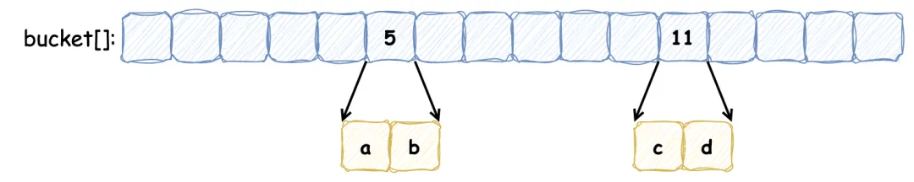
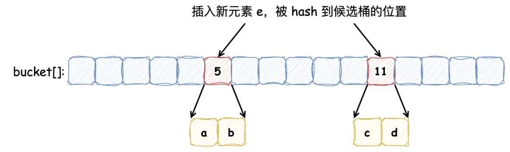
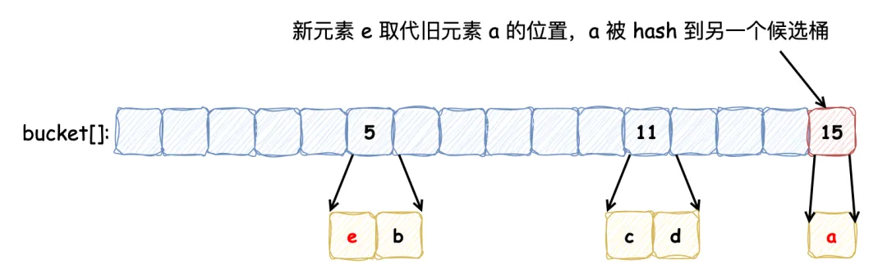

# 布谷鸟过滤器

布隆过滤器不记录元素本身，并且存在一个位被多个元素共用的情况，所以它不支持删除元素。布谷鸟过滤器（详细了解可以参考这篇论文[《布谷鸟过滤器：实际上优于布隆过滤器》](https://www.cs.cmu.edu/~dga/papers/cuckoo-conext2014.pdf)）的提出解决了这个问题，它**支持删除操作**，此外它还带来了其他优势：

1. **查找性能更高**：布隆过滤器要采用多种哈希函数进行多次哈希，而布谷鸟过滤器只需一次哈希
2. **节省更多空间**：布谷鸟过滤器记录元素更加紧凑，论文中提到，如果期望误报率在 3% 以下，半排序桶布谷鸟过滤器每个元素所占用的空间要比布隆过滤器中单个元素占用空间要小

> 布谷鸟过滤器之所以被称为“布谷鸟”，是因为它的工作原理类似于布谷鸟在自然界中的行为。布谷鸟以将自己的蛋产在其他鸟类的巢中而闻名，这样一来，寄主鸟就会抚养布谷鸟的幼鸟。
> 在布谷鸟过滤器中，如果一个位置已经被占用，新元素会“驱逐”现有元素，将其移到其他位置。这种“驱逐”行为类似于布谷鸟将其他鸟蛋推出巢外，以便安置自己的蛋。因此，这种过滤器得名为“布谷鸟”过滤器。

布谷鸟过滤器本质上是一个 **桶数组**，每个桶中保存若干数量的 **指纹**（指纹由元素的部分 Hash 值计算出来）。定义一个布谷鸟过滤器，每个桶记录 2 个指纹，5 号桶和 11 号桶分别记录保存 a, b 和 c, d 元素的指纹，如下所示：



此时，向其中插入新的元素 e，发现它被哈希到的两个候选桶分别为 5 号 和 11 号，但是这两个桶中的元素已经添加满了：



按照布谷鸟过滤器的特性，它会将其中的一个元素重哈希到其他的桶中（具体选择哪个元素，由具体的算法指定），新元素占据该元素的位置，如下：



以上便是向布谷鸟过滤器中添加元素并发生冲突时的操作流程，在我们的例子中，重新放置元素 e 触发了另一个重置，将现有的项 a 从桶 5 踢到桶 15。**这个过程可能会重复，直到找到一个能容纳元素的桶，这就使得布谷鸟哈希表更加紧凑，因此可以更加节省空间**。如果没有找到空桶则认为此哈希表太满，无法插入。虽然布谷鸟哈希可能执行一系列重置，但其均摊插入时间为 **O(1)**。

与布隆过滤器一样，布谷鸟过滤器同样会造成假阳性，造成假阳性的有以下原因：

1. **有限的空间**：布谷鸟过滤器使用有限数量的桶和每个桶中的有限空间来存储元素的指纹。当多个元素的指纹映射到相同的桶时，可能会导致不同元素的指纹存储在同一位置
2. **指纹冲突**：由于指纹是元素的哈希值的缩减版本，可能会有不同的元素产生相同的指纹。当查询一个不存在的元素时，可能会发现其指纹已经存在于过滤器中，从而导致假阳性
3. **哈希函数的性质**：哈希函数的选择和指纹长度决定了指纹的唯一性和冲突概率。较短的指纹更容易产生冲突，从而增加假阳性的概率
4. **负载因子**：随着过滤器接近满载，冲突的概率增加，这会导致更多的“驱逐”操作。在高负载情况下，假阳性率也可能上升

Github - cuckoofilter 是 Github 上 Star 数较多的一个仓库，它参考了论文内容，并用 Golang 实现了布谷鸟过滤器，大家感兴趣的话可以直接去参考它的源码。该过滤器重要的参数如下：

1. 每个元素有 2 个候选桶，每个桶记录 4 个指纹：该配置能够使桶的利用率达到 95%，能够满足多数场景，当指定假阳性率在 0.00001 和 0.002 之间时，可以将每个元素占用空间最小化
2. 指纹的静态大小为 8 位：指定误报率为 0.03，根据公式 `f >= log2(2b/r)` b为桶的大小 r为误报率，计算出指纹大小为 8。在 2 个候选桶和 4 个指纹的配置下，随着指纹大小变大，空间利用率不会再随之增加，仅降低假阳率

我们在此讨论下它的删除方法实现：

```go
// Delete 删除过滤器中的指纹
func (cf *Filter) Delete(data []byte) bool {
  // 尝试在首选桶中删除
  i1, fp := getIndexAndFingerprint(data, cf.bucketPow)
  if cf.delete(fp, i1) {
    return true
  }
  // 删除失败，则尝试从备用桶删除
  i2 := getAltIndex(fp, i1, cf.bucketPow)
  return cf.delete(fp, i2)
}
```

它的删除方法实现比较简单：它检查给定元素的两个候选桶，如果在首选桶中匹配到则将该指纹移除，否则去备用桶中匹配，在备用桶中则移除备用桶指纹，如果备用桶中没有，则会提示删除失败。如果两个元素 a, b 发生碰撞（共享桶和指纹），那么在 a 元素删除后，因为 b 元素的存在，仍然会判断 a 元素在过滤器中，表现出假阳性。需要注意的是，**想要安全的删除某元素，必须事先插入它**，否则删除插入项可能会无意中删除共享指纹的真实存在的项，而且如果多次插入重复元素，想要将其删除干净还需要知道该元素插入了多少次。

此外，相比于布隆过滤器它也存在一些的劣势：

1. **插入性能可能会受到影响**：随着插入元素越多，空间利用率不断提高，发生冲突的可能性越大，发生冲突之后，可能会不断的触发元素的重定位，插入性能会变差，一般通过最大重试次数来限制
2. **插入重复元素次数存在上限**：布隆过滤器插入重复元素没有负面影响，只是再标记相同的位，而布谷鸟过滤器插入重复元素会触发元素的重定位，因此它的重复元素插入存在上限

对于过滤器缓存的使用，大部分情景都是读多写少的，而重复插入并没有什么意义，布谷鸟过滤器的删除虽然不完美但总好过没有（因为布隆过滤器想要删除元素便需要重建，上亿甚至几十亿的数据重建缓存也蛮花时间），同时还有更优的查询和存储效率，应该说在绝大多数情况下其都是一个性价比更高的选择。
