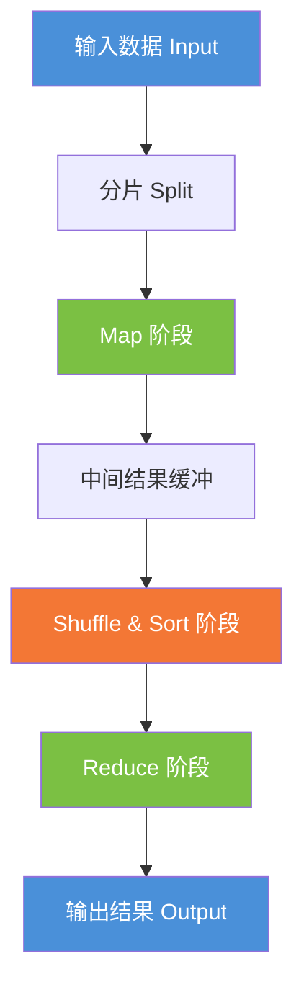
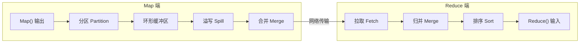
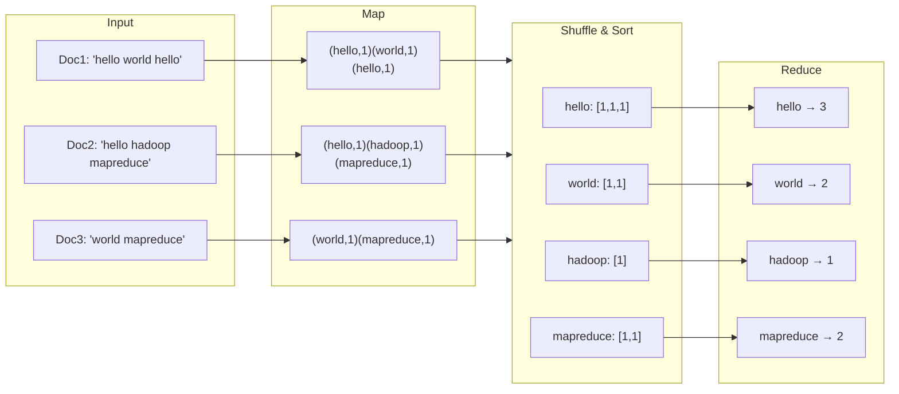

# Map & Reduce

MapReduce 是一种分布式计算模型，由 Google 在 2004 年提出（论文 *MapReduce: Simplified Data Processing on Large Clusters*）。其本质上是**分治思想 / Hash 映射 / 归并排序** 在分布式环境下的规模化延伸。核心思路是：将海量数据分解为独立小块并行处理（Map），再将中间结果聚合得到最终输出（Reduce）。

## 算法原理

### 为什么要这样设计？

传统的单机处理模式受限于 CPU、内存和磁盘带宽，无法在合理时间内完成 TB 乃至 PB 级数据的计算。MapReduce 通过以下设计解决这一矛盾：

- **数据局部性（Data Locality）**：将计算逻辑发送到数据所在的节点，而非将海量数据搬运到计算节点，大幅减少网络传输。
- **自动容错（Fault Tolerance）**：任务粒度细、无共享状态，单个节点失效后仅需重跑该节点上的任务。
- **水平扩展（Horizontal Scaling）**：增加机器即可线性提升吞吐量，无需修改代码逻辑。

### 核心流程

整个 MapReduce 作业分为 **5 个阶段**：



#### ① 输入分片（Input Split）

输入数据被切割为若干 **Split**，每个 Split 对应一个 Map 任务的输入。分片大小通常与 HDFS 块大小一致（如 128 MB），以确保数据局部性。

#### ② Map 阶段

用户自定义的 `map()` 函数接收 `<key, value>` 对，输出零到多个中间 `<key, value>` 对。所有的 Map 任务完全独立，可并行执行。

> **核心约束**：Map 函数的输出必须先经过 **分区（Partition）**，相同 key 的数据被分配到同一个 Reduce 任务。

#### ③ Shuffle & Sort 阶段

这是 Map 和 Reduce 之间的**关键桥梁**，也是 MapReduce 中最复杂的部分：



- **Map 端**：输出写入环形缓冲区 → 达到阈值后溢写到磁盘（同时进行分区内排序）→ 多个溢写文件合并成一个已排序的分区文件。
- **Reduce 端**：从所有 Map 节点拉取属于自己分区的数据 → 进行多路归并排序 → 保证每个 Reduce 函数的输入按 key 有序。

#### ④ Reduce 阶段

用户自定义的 `reduce()` 函数接收一个 key 及其对应的 value 迭代器，输出最终结果。Reduce 输出的结果通常写入分布式文件系统（如 HDFS）。

#### ⑤ 输出

每个 Reduce 任务产生一个独立的输出文件，共同构成完整结果。

## 以 Word Count 为例

统计海量文档中每个单词的出现次数，是 MapReduce 最经典的示例。



### Map 函数（伪代码）

```java
map(String key, String value) {
    // key: 文档名称; value: 文档内容
    for each word w in value:
        emitIntermediate(w, "1");
}
```

### Reduce 函数（伪代码）

```java
reduce(String key, Iterator values) {
    // key: 单词; values: 该单词出现的次数列表
    int sum = 0;
    for each v in values:
        sum += parseInt(v);
    emit(key, sum);
}
```

## 复杂度分析

| 维度 | 说明 |
|------|------|
| **时间复杂度** | $O(\frac{N}{M} \cdot \log \frac{N}{M})$ — N 为数据总量，M 为机器数，每台机器的排序开销为 $O(\frac{N}{M} \log \frac{N}{M})$ |
| **网络 I/O** | $O(N)$ — 每个 Map 输出的中间数据需通过网络传输到 Reduce 节点 |
| **磁盘 I/O** | $O(N)$ — Map 端溢写、Reduce 端归并均涉及磁盘读写 |
| **空间复杂度** | $O(N)$ — 中间结果需存储于磁盘 |

### 关键参数

- **Map 数量** ≈ 总数据量 / 分片大小（通常 128 MB ~ 256 MB）
- **Reduce 数量** = 用户指定或自动推导（通常 < 集群节点数）
- **Combiner**：可选，在 Map 端进行局部聚合，减少网络传输

## 容错机制

| 故障类型 | 处理方式 |
|---------|---------|
| **Map 任务失败** | Master 检测到心跳超时后，将该任务重新调度到其他空闲节点执行 |
| **Reduce 任务失败** | 同 Map，重新调度；已拉取的中间数据需重新拉取 |
| **Master 节点失败** | 可通过 checkpoint + 备用 Master 恢复（旧版简单中止；新版支持 HA） |
| **慢任务（Straggler）** | 通过 **推测执行（Speculative Execution）** 在另一节点启动相同任务的备份，谁先完成就杀掉另一个 |

## 局限与演进

| 局限 | 说明 | 改进方案 |
|------|------|---------|
| **仅批处理** | Map 和 Reduce 之间有同步屏障，延迟高 | Apache Spark（内存 DAG 计算） |
| **数据倾斜** | 某些 key 对应数据量极大，单个 Reduce 成为瓶颈 | 二次 Hash + 倾斜检测 |
| **中间结果落盘** | 每次 Shuffle 都必须写磁盘 | Spark 的 Shuffle 支持内存 + 磁盘两级存储 |
| **表达能力有限** | 仅能描述 Map + Reduce 两步计算 | DAG 计算模型（如 Tez、Spark） |

## 相关题目

### 海量数据分布在 100 台电脑中，如何高效统计出 TOP 10？

**思路**：两阶段 MapReduce

1. **Map 阶段**：每台机器独立统计本机数据的词频（HashMap/Trie 树）
2. **Reduce 阶段**：汇总各机器的 TOP 10，再从汇总结果中取全局 TOP 10

> 若数据量极大导致单机内存不足，可在 Map 端先分片再分别统计，最后归并。

### 一共有 N 个机器，每个机器上有 N 个数，如何找到 N² 个数的中位数（median）？

**思路**：二分法 + 分布式计数

1. 确定数值范围 `[min, max]`
2. 二分猜测中位数 `mid`，让每台机器统计小于 `mid` 的数的个数
3. 汇总后判断是否达到 N²/2，调整 `mid` 继续二分
4. 最终锁定中位数

时间复杂度：$O(N \log R)$（R 为数值范围），不需要排序全部数据。
