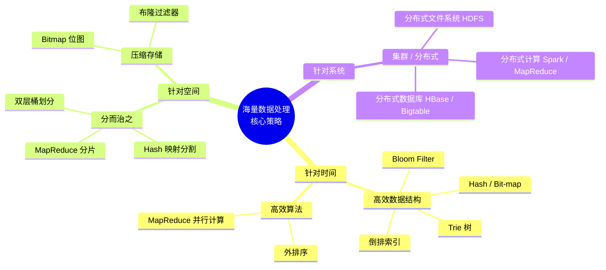
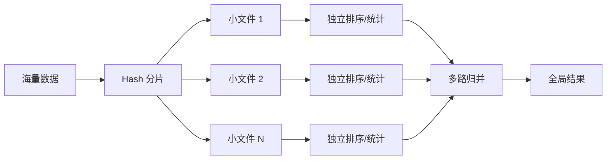
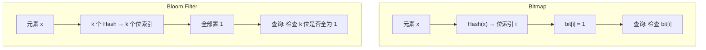
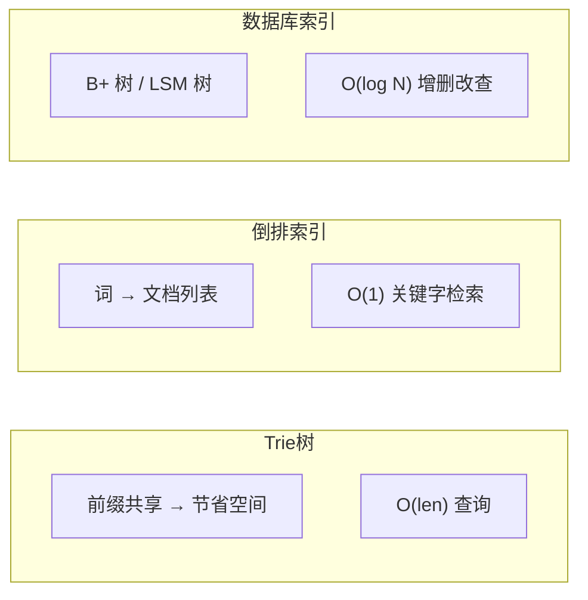
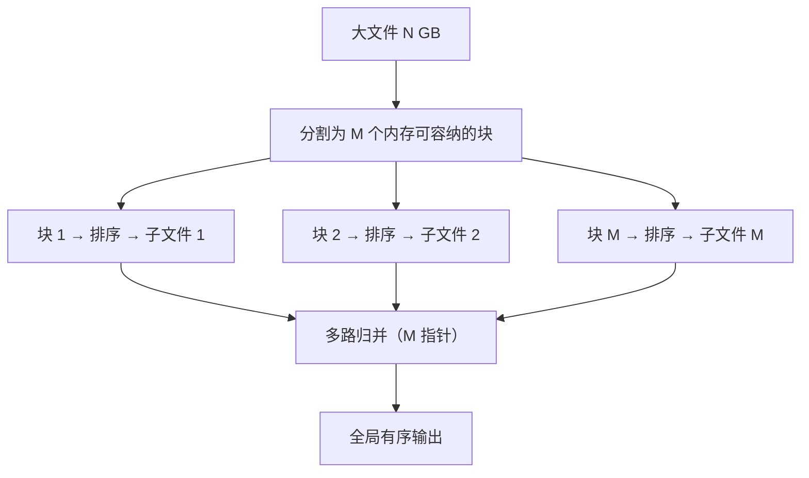

# Overview

## 何谓海量数据处理？

所谓海量数据处理，无非就是基于海量数据上的**存储、处理、查询**。何谓"海量"？就是数据量太大，导致：

- **时间维度**：无法在较短时间内完成计算
- **空间维度**：数据太大，无法一次性装入内存
- **网络维度**：单机 I/O 带宽成为瓶颈

那解决办法呢？核心思路可以归纳为三类：

- **针对时间**：采用精巧的算法搭配合适的数据结构——如 Bloom Filter、Hash、Bit-map、堆、数据库或倒排索引、Trie 树
- **针对空间**：大而化小，分而治之——Hash 映射、分片、分层
- **集群 / 分布式**：单机受限于 CPU、内存、硬盘交互带宽；集群分布式则更关注节点间数据交互与任务调度

## 常见策略详解

### 分治 / Hash / 排序

**原理**：将大问题切割成相互独立的小问题，分别求解后再合并。

- 先通过 **Hash 映射** 将数据均匀分散到多个小文件（或节点）
- 对每个小文件独立排序或统计
- 最后通过多路归并得到全局结果

**典型场景**：大文件词频统计、Top K 查询、重复数据检测

### Bitmap & Bloom Filter

| 数据结构 | 核心思想 | 空间优势 | 特点 |
|---------|---------|---------|------|
| **Bitmap** | 每个 bit 代表一个元素的存在状态 | $O(N/8)$ | 精确，但无法处理字符串 |
| **Bloom Filter** | 多个 Hash 函数映射到 bit 数组 | $O(k)$ per 元素 | 有误报率，不可删除 |
| **Counting Bloom Filter** | 将 bit 扩展为 counter | $4\times$ Bitmap 空间 | 支持删除 |

**核心流程对比**：

### 双层桶划分

**原理**：当数据分布极度不均匀时，先做一层粗粒度划分，再对热点桶做第二层细粒度划分（类似多级 Hash 表或 Quadtree 的降维思想）。

**适用场景**：

- 数据倾斜严重的 Top K 查找
- 空间索引与近似查询

### Trie 树 / 数据库 / 倒排索引

**本质**：通过**空间换时间**，以预建索引结构加速海量数据下的查询与统计。

> 详见 [Trie 树 / 数据库 / 倒排索引](./Trie树-数据库-倒排索引.md)

### 外排序

**原理**：当数据远大于内存时，将数据分批读入内存排序后写回磁盘，最后多路归并。

**典型步骤**：

1. 将大文件分成 M 个可装入内存的小块
2. 每块在内存排序后写回磁盘（形成 M 个有序子文件）
3. 多路归并 M 个有序子文件 → 全局有序文件

**复杂度**：$O(N \log \frac{N}{M})$ 排序 + $O(N \log M)$ 归并

### Map & Reduce

**原理**：分治思想在分布式环境下的规模化实践。Map 阶段并行处理各数据分片，Reduce 阶段聚合中间结果。

| 阶段 | 输入 | 输出 | 并行度 |
|------|------|------|--------|
| **Map** | `<k1, v1>` | 中间 `<k2, v2>` | 与分片数相等 |
| **Shuffle** | Map 输出 | 按 key 排序分区的数据 | 自动完成 |
| **Reduce** | `<k2, list(v2)>` | 最终 `<k3, v3>` | 用户指定 |

> 详见 [Map & Reduce](./Map%20&%20Reduce.md)

## 策略选择速查表

| 需求 | 推荐策略 | 数据结构 / 算法 |
|------|---------|----------------|
| 元素存在性判断（可接受误报） | Bloom Filter | Bit 数组 + k 个 Hash |
| 元素存在性判断（精确） | Bitmap / Hash Set | Bitmap / 分治 |
| 统计词频 / 查询频次 | Trie 树 / Hash | Trie / HashMap |
| Top K | 堆 + 分治 / MapReduce | 小顶堆 / 归并 |
| 关键字搜索 | 倒排索引 | 词→文档映射表 |
| 排序（内存不足） | 外排序 | 归并排序 |
| 大规模并行计算 | MapReduce / Spark | 分治 + 归并 |

## 相关题目精选

### 海量日志数据，提取出某日访问百度次数最多的那个 IP

**思路**：Hash 分片 + HashMap 统计 + 全局最大

1. 将日志按 IP 的 Hash 值分批到多个小文件（保证同一 IP 进入同一文件）
2. 对每个小文件用 HashMap 统计 IP 频次
3. 每个小文件取最大值，再比较得到全局最大值

### 亿个 int 找出它们的中位数

**思路**：二分区间统计法

1. 遍历所有 int，统计每个区间段（如每 2³²/2¹⁶ 为一个桶）的元素个数
2. 定位中位数所在的桶
3. 对该桶内的元素精确排序找到中位数

**复杂度**：两次遍历即可，无需对所有元素排序。
