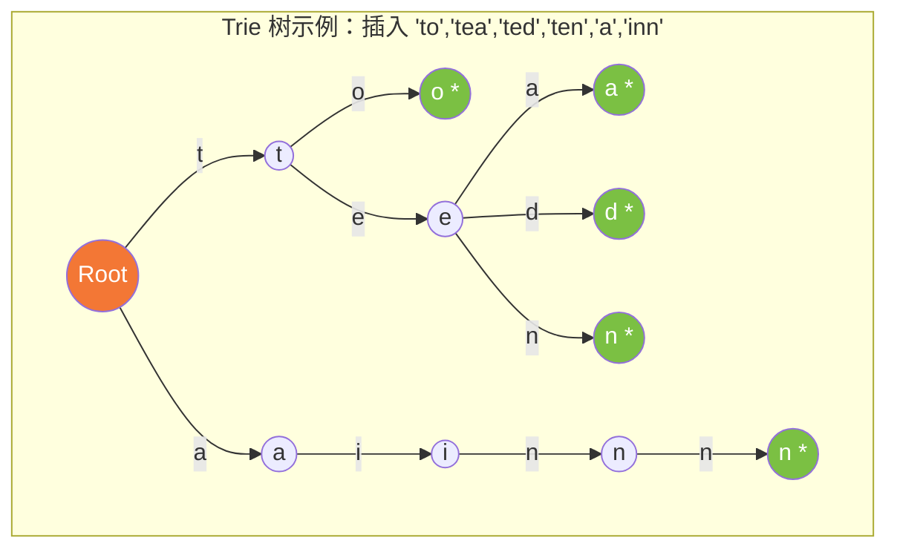
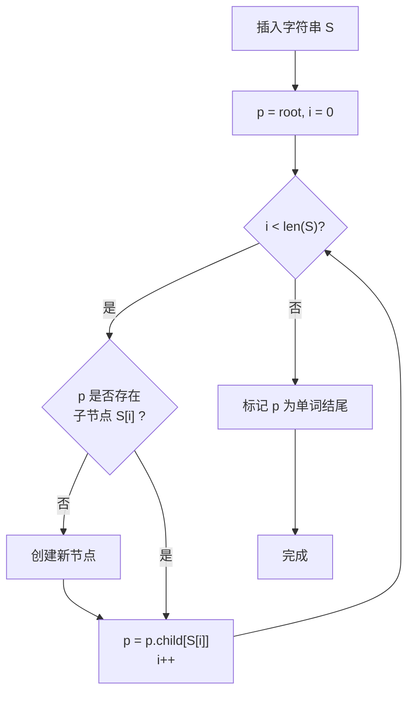
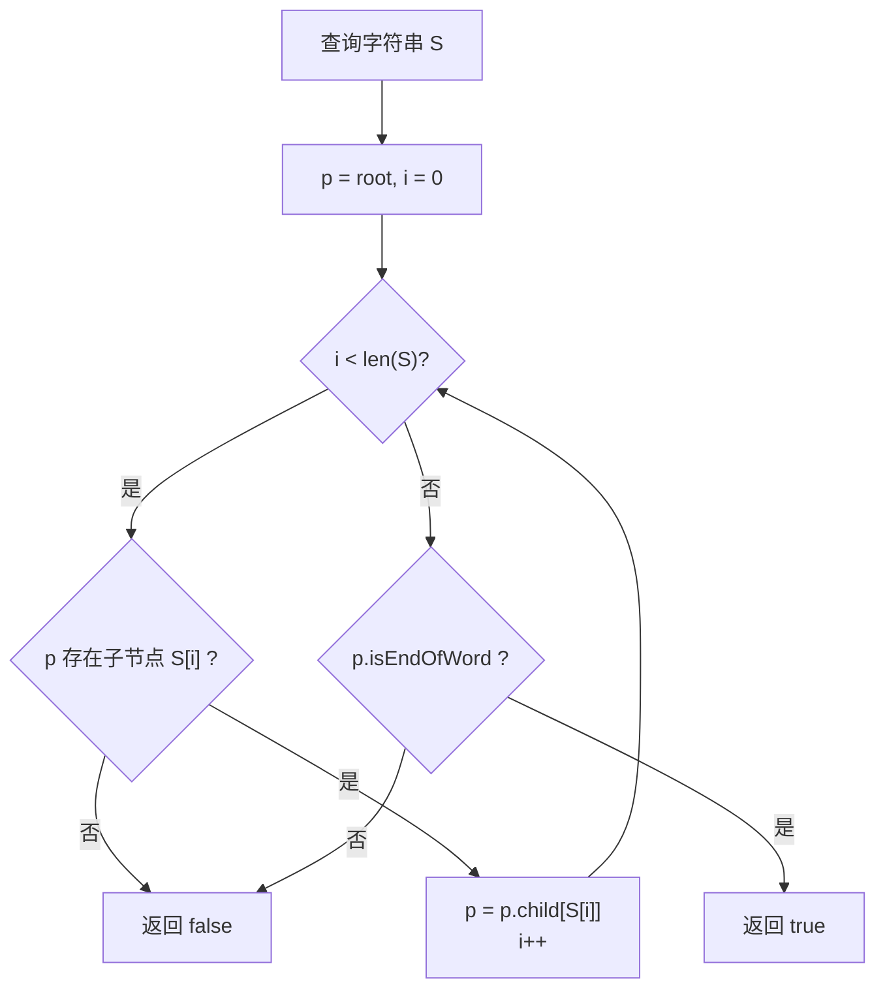
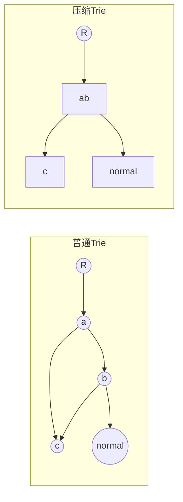
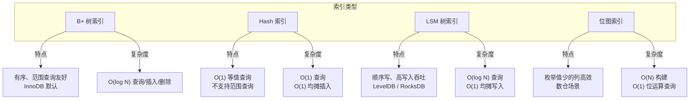
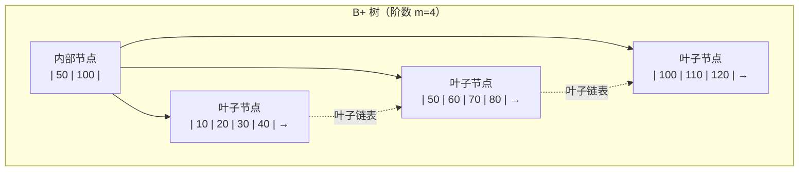
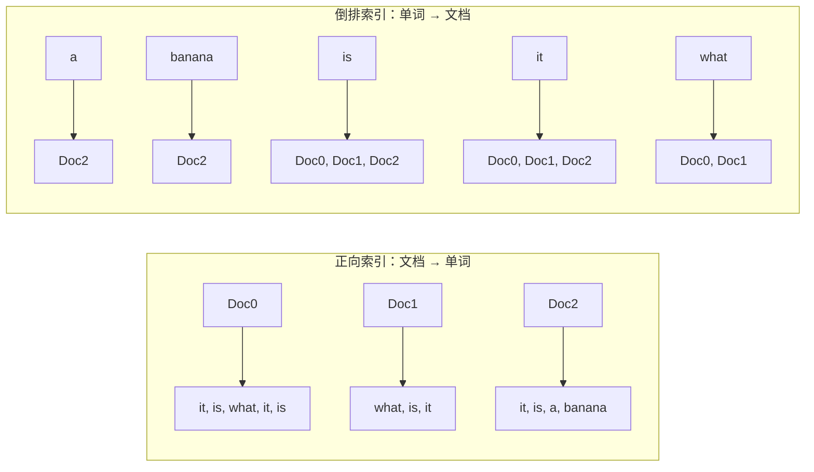
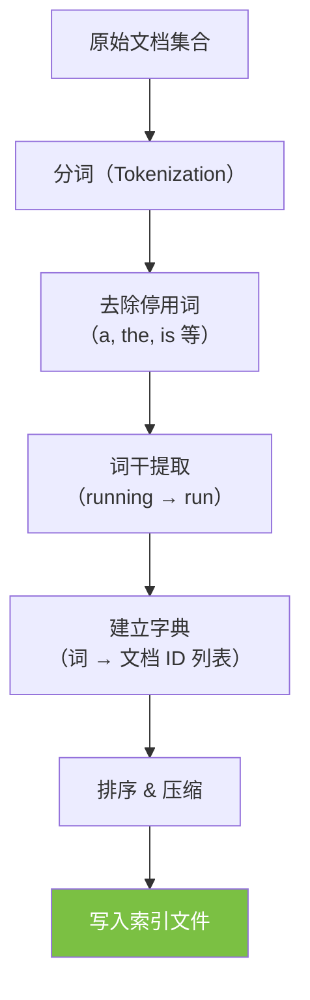

# Trie 树 / 数据库 / 倒排索引

## Trie 树（前缀树）

### 算法原理

Trie 树（又称前缀树、字典树）是一种树形数据结构，核心思想是**利用字符串的公共前缀来压缩存储空间**，同时支持高效的插入和查询操作。

**为什么这样设计？**

- 普通的 Hash 表无法高效地支持**前缀匹配**（如查询所有以 "app" 开头的单词）
- 字符串集合通常存在大量公共前缀（如 "application" 和 "apply" 共享 "appl"），Trie 树将这些公共前缀合并存储，节省空间
- 查询复杂度仅与字符串长度有关，**与集合大小无关**，在海量数据场景下优势明显

### 数据结构



> `*` 标记表示从根到该节点的路径构成一个完整单词。

**节点的基本结构**（两种常见实现方式）：

| 实现方式 | 存储结构 | 查询速度 | 空间占用 |
|---------|---------|---------|---------|
| **数组方式** | 每个节点维护一个大小为 26（或 256）的指针数组 | O(1) 查子节点 | 大（大量空指针）|
| **HashMap 方式** | 每个节点维护 `Map<char, Node>` | O(1) 均摊 | 较小 |

### 核心操作

#### 插入操作



**伪代码**：

```java
class TrieNode {
    Map<Character, TrieNode> children = new HashMap<>();
    boolean isEndOfWord = false;
    int count = 0; // 统计经过该节点的单词数（用于频次统计）
}

void insert(String word) {
    TrieNode p = root;
    for (char c : word.toCharArray()) {
        p = p.children.computeIfAbsent(c, k -> new TrieNode());
        p.count++; // 经过计数
    }
    p.isEndOfWord = true;
}
```

#### 查询操作



**复杂度**：

| 操作 | 时间复杂度 | 空间复杂度 |
|-----|-----------|-----------|
| **插入** | O(L) — L 为字符串长度 | O(N × L) 最坏（无公共前缀）|
| **查询** | O(L) | O(1) 额外 |
| **前缀匹配** | O(P + K) — P 为前缀长度，K 为匹配结果数 | 同查询 |
| **删除** | O(L) | O(1) 额外 |

> Trie 树的查询效率不依赖数据量大小（即集合中元素个数 N），这是它相对于二分查找或 BST 的核心优势。

### 适用场景

- **寻找热门查询**：查询串的重复度比较高，总数 1 千万，去重后不超过 300 万，每个不超过 255 字节 → Trie 树统计词频 + 堆取 Top K
- **10 个文件，每个 1G，每行存放用户 query（可能重复），按频度排序** → Trie 树分文件统计后归并
- **1 千万字符串中去重** → Trie 树可在插入时检测重复（不标记 `isEndOfWord` 即可）
- **统计文本中最频繁出现的前 10 个词**（文本约 1 万行） → 时间复杂度 O(n × L)，n 为行数，L 为单词平均长度

### 扩展：压缩 Trie（Radix Tree / Patricia Trie）

当字符串公共前缀很长时，Trie 树仍存在单个字符逐层跳转的开销。**压缩 Trie** 将连续的单分支路径合并为单个节点，大幅减少节点数量，适用于 IP 路由查找（CIDR）、自动补全等场景。



## 数据库索引

### 算法原理

数据库索引是一种**辅助数据结构**，用于加速对表中数据的检索。其本质是**以空间换时间**——通过预先维护一种有序的结构，将全表扫描的 O(N) 降低到 O(log N) 甚至 O(1)。

### 常见索引结构对比



### B+ 树核心思想

B+ 树是数据库索引的核心实现（MySQL InnoDB 默认索引类型）：

- **所有数据存储在叶子节点**，叶子节点形成有序链表
- **非叶子节点仅存储键值指针**，不存数据，因此更"矮胖"，减少磁盘 I/O
- 树的高度通常为 3~4 层（即使应对上亿数据），每次查询仅需 3~4 次磁盘 I/O



**复杂度总结**：

| 操作 | B 树 | B+ 树 | Hash 索引 |
|------|------|-------|-----------|
| 等值查询 | O(log N) | O(log N) | O(1) |
| 范围查询 | O(log N + K) | O(log N + K) （更优，叶子链表遍历） | 不支持 |
| 插入 | O(log N) | O(log N) | O(1) 均摊 |
| 删除 | O(log N) | O(log N) | O(1) 均摊 |

## 倒排索引（Inverted Index）

### 算法原理

倒排索引是**从词语到文档**的映射结构，是搜索引擎的核心技术。

**为什么叫"倒排"？**

- **正向索引**：文档 → 单词（每个文档维护其包含的单词列表）
- **倒排索引**：单词 → 文档（每个单词指向包含它的文档列表）

这种"反向"关系就是"倒排"名称的来源。



### 构建过程



**以英文为例**，要索引的文本：

```text
T0 = "it is what it is"
T1 = "what is it"
T2 = "it is a banana"
```

构建的倒排索引：

| 词项（Term） | 倒排列表（Posting List） |
|:---:|:---:|
| a | {2} |
| banana | {2} |
| is | {0, 1, 2} |
| it | {0, 1, 2} |
| what | {0, 1} |

**查询 "what is it"**：将三个词的倒排列表做**集合交集**运算 → {0, 1, 2} ∩ {0, 1, 2} ∩ {0, 1} = {0, 1} → 文档 0 和 1 匹配。

### 倒排列表的压缩

海量数据下，倒排列表可能非常庞大，常用的压缩技术：

| 技术 | 原理 | 压缩比 |
|------|------|--------|
| **差分编码（Delta Encoding）** | 存储相邻文档 ID 的差值而非原始值 | 约 3~5 倍 |
| **可变字节编码（VByte）** | 小整数用更少字节存储 | 约 2~4 倍 |
| **Simple9 / Simple16** | 一个 32-bit 字打包多个小整数 | 约 4~8 倍 |
| **Roaring Bitmaps** | 稠密用 Bitmap，稀疏用数组，自动切换 | 高效 |

> Elasticsearch / Lucene 使用 Roaring Bitmaps 作为倒排列表的底层存储结构，在文档 ID 稠密时用 Bitmap 加速位运算，稀疏时用压缩数组节省空间。

### 适用场景

- **全文搜索引擎**：Elasticsearch、Solr、Sphinx
- **关键字查询**：百度、Google 的网页搜索
- **数据库全文索引**：MySQL FULLTEXT 索引
- **代码搜索**：OpenGrok、Sourcegraph

### 复杂度分析

| 操作 | 时间复杂度 | 说明 |
|------|-----------|------|
| **索引构建** | O(N × L) | N 为文档数，L 为平均文档长度 |
| **单词查询** | O(1) | 字典通常用 Hash 表或 Trie 树实现 |
| **多词合并（AND）** | O(K₁ + K₂ + ...) | 合并多个倒排列表，K 为列表长度 |
| **短语查询** | O(K) | 需额外检查位置信息 |
| **存储空间** | O(T × D) | T 为词项数，D 为平均倒排列表长度 |
