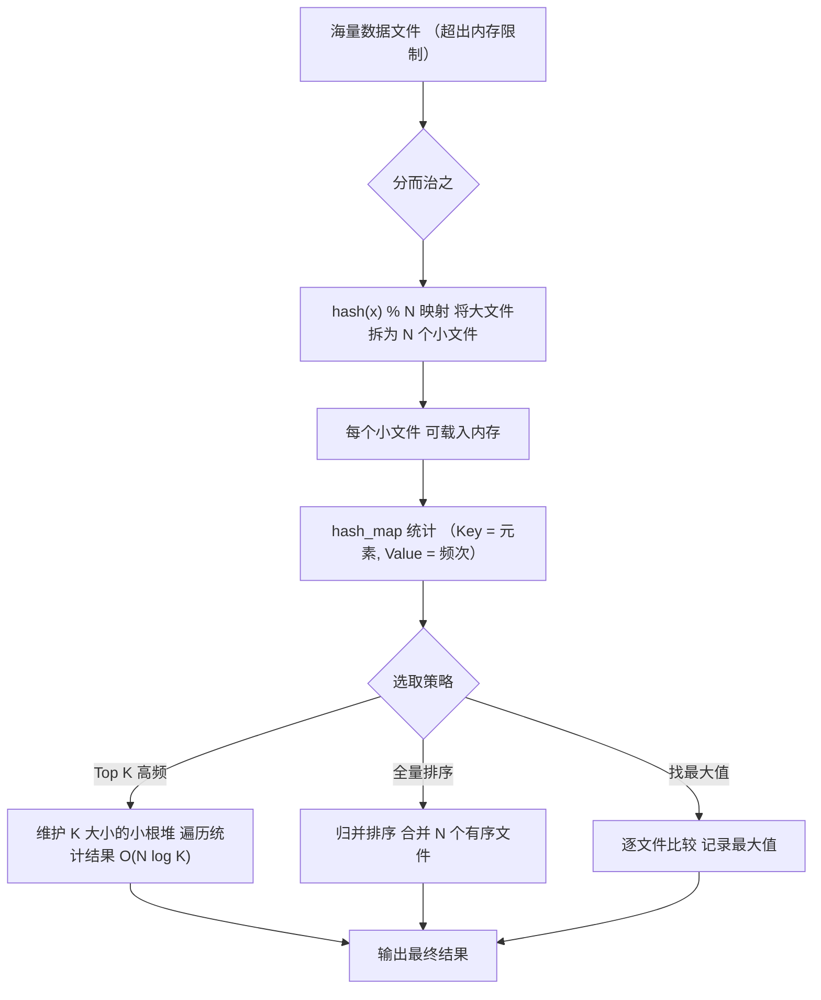
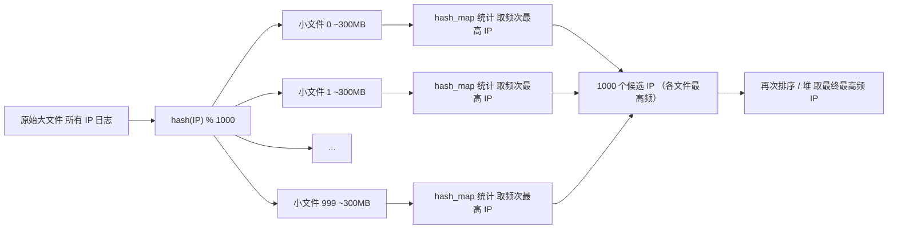
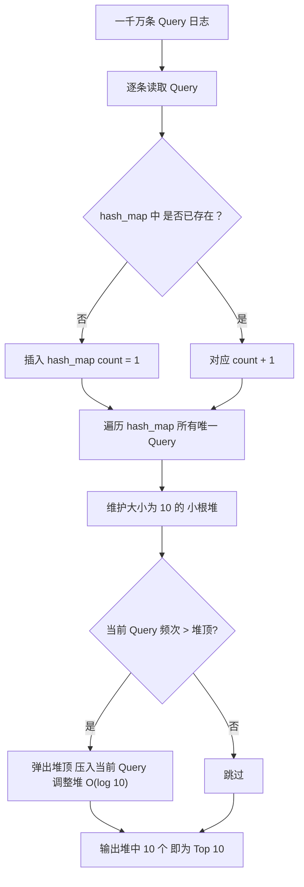
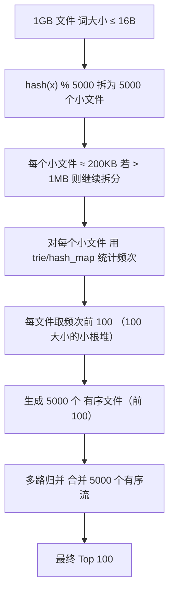
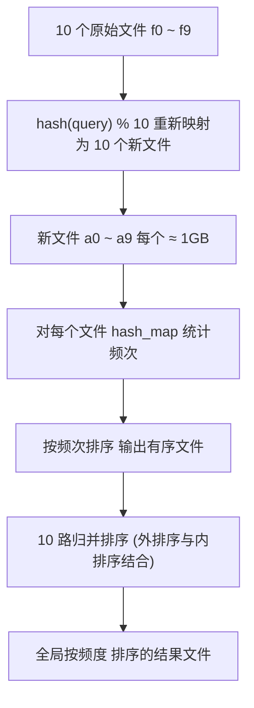
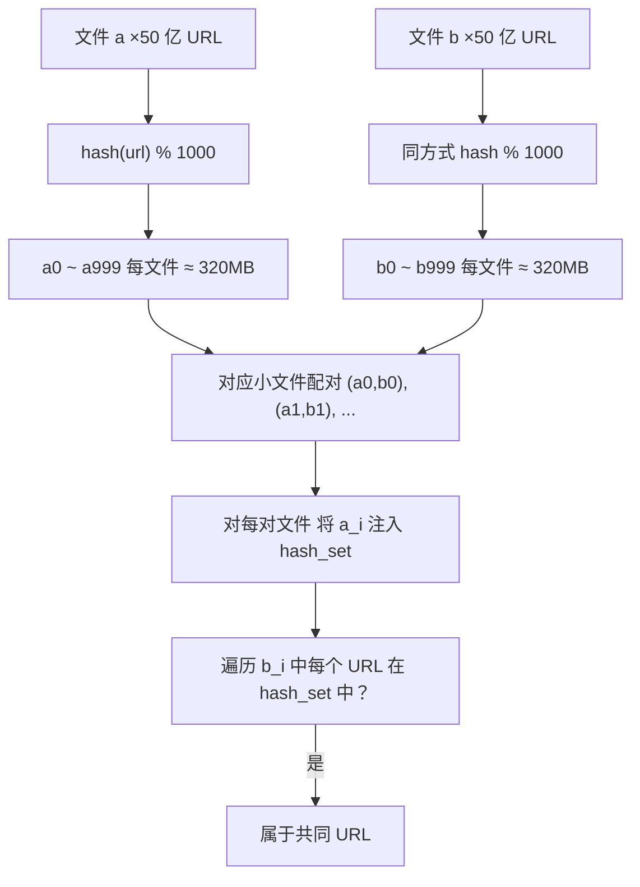

# 分治/hash/排序

## 核心思想

分而治之 / Hash映射 + Hash统计 + 堆/快速/归并排序。核心流程是：**先映射，再统计，最后排序**。

### 三步策略

| 步骤 | 操作 | 核心目的 |
|------|------|----------|
| ① **分而治之 / Hash映射** | 对大文件取模（如 `hash(x) % 1000`）拆分为小文件 | 大而化小，缩小规模，确保单个文件 < 可用内存 |
| ② **Hash统计** | 对每个小文件使用 `hash_map(key, count)` 统计频率 | 线性时间内完成频次统计 |
| ③ **堆/快速/归并排序** | 维护 K 大小的小根堆取出 Top K；或归并多个有序文件 | 从频次结果中提取目标数据 |

### 算法主流程



## 数学基础

### Hash 取模的正确性证明

如果两个元素相等，则对同一 Hash 函数，其哈希值必然相等：
```
A = B  ⇒  hash(A) = hash(B)  ⇒  hash(A) % M = hash(B) % M
```
因此，取模映射之后，**相同元素必定落入同一个小文件**，不会出现同一个元素被分散到多个文件的情况。这是分治策略正确的前提。

### 复杂度总览

| 操作 | 时间复杂度 | 空间复杂度 |
|------|-----------|-----------|
| Hash 映射拆分 | O(N) | O(1) 附加 |
| Hash 统计 | O(N) | O(U)，U 为不同元素个数 |
| 堆排序取 Top K | O(N log K) | O(K) |
| 归并排序（M 路） | O(N log M) | O(M) 缓冲区 |

## 案例分析

### 海量日志数据，提取某日访问百度次数最多的 IP

**分析**：IP 是 32 位，最多 2^32 ≈ 42.9 亿个可能值。若日志有数亿条，直接内存统计不可行。

**解法**：



**关键点**：
- `hash(IP) % 1000` 确保同一 IP 只出现在一个文件中
- 每个小文件约 300MB（假设总量 300GB），可载入内存
- 先求局部最高频，再求全局最高频，两次扫描即可

### 300 万查询串中统计最热门的 10 个

**原题**：一千万条记录，去重后约 300 万，每条 Query 最长 255 字节。可用内存限制 1GB。

**分析**：300 万 × 255B ≈ 0.75GB，**可全部装入内存**，无需分治。直接使用 `hash_map + 小根堆`。

**核心流程**：



**复杂度**：
- 统计阶段：`O(10^7)` 逐条读入 + hash_map 操作 ≈ O(N)
- 堆排序阶段：遍历 300 万唯一 Query，每次维护堆 `O(log 10) = O(1)`，总 O(N')
- **总计**：`O(N + N')`，N 为一千万，N' 为三百万

**小根堆取 Top K 原理**：

```mermaid
graph LR
    subgraph 小根堆（容量 K=10）
        H1["堆顶（最小）"]
        H2[...]
        H3[...]
        H4["堆底（最大）"]
    end
    X["新元素 x"] --> C{"x.count > 堆顶.count?"}
    C -->|是| R["替换堆顶 → 下沉调整"]
    C -->|否| S["跳过"]
    R --> O["保持堆中始终为 当前最大的 K 个"]
    S --> O
```

### 1GB 文件，每行一词（≤16B），内存 1MB，返回频次最高的 100 个词

**三步解法**：



**边界条件**：
- 若某小文件拆分后仍 > 1MB，递归进行二次 hash 映射
- Trie 树适合词频统计：共享前缀，节省内存

### 海量数据分布在 100 台电脑中，统计 TOP10

#### 情况 A：每个元素不重复且只出现在一台机器


#### 情况 B：相同元素可出现在多台机器

**方案 1（推荐）**：重新 hash 映射，将相同元素集中到同一台机器，再按情况 A 处理。

**方案 2（暴力）**：每台机器独立统计各元素频次 → 按元素汇总求和 → 排序取 TOP10。

### 10 个文件，每个 1GB，每行 query，按 query 频度排序

**方案 1（通用解法）**：



**方案 2**：若所有 query 唯一值可装入内存，直接 `trie/hash_map + 排序`。

**方案 3**：分布式处理（如 MapReduce），多个节点并行统计后合并。

### 两文件各 50 亿 URL（各 64B），内存 4G，找共同 URL

**容量估算**：50 亿 × 64B ≈ 320GB，远超 4GB 内存。

**解法**：



**正确性**：相同的 URL 经 `hash(url) % 1000` 必落入同序号的文件对 `(a_i, b_i)`，不同文件对中没有相同 URL。

### 100 万个数中找最大的 100 个数

| 方案 | 方法 | 时间复杂度 | 说明 |
|------|------|-----------|------|
| 方案 1 | 局部淘汰 + 插入排序 | O(100w × 100) | 直观但慢 |
| 方案 2 | 快速排序分划思想 | O(100w × 100) | 只处理大于 pivot 的部分 |
| 方案 3 | **最小堆** | **O(100w × log 100)** | **最优解** |

**三种方案对比**：堆方案仅在 `O(N log K)` 级别，当 K 远小于 N 时优势明显。

## 总结

| 问题类型 | 核心策略 | 数据结构 | 时间复杂度 |
|---------|---------|---------|-----------|
| 单文件太大，内存不足 | 分治 + Hash 映射 | hash_map + 堆 | O(N log K) |
| 单文件可装入内存 | 直接统计 + 堆排序 | hash_map/trie + 堆 | O(N + N' log K) |
| 多文件需全局排序 | Hash 映射 + 多路归并 | hash_map + 归并 | O(N log M) |
| 多文件找交集 | Hash 映射 + hash_set | hash_set | O(N) |
| 多机器分布式 | 各自统计 + 合并 | 堆 + 归并 | O(N/M + M log K) |
