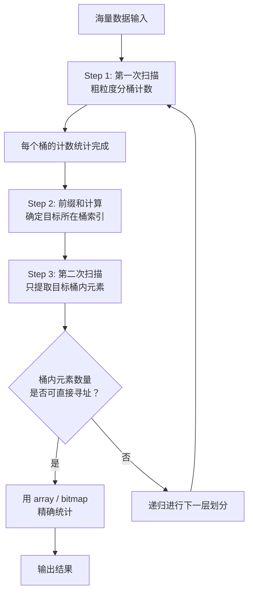
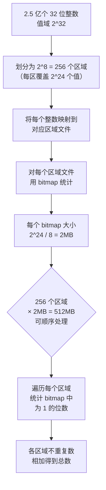
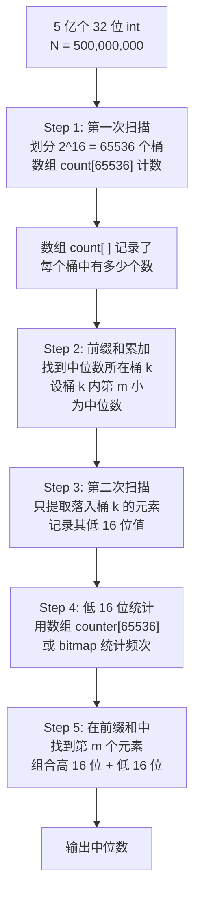
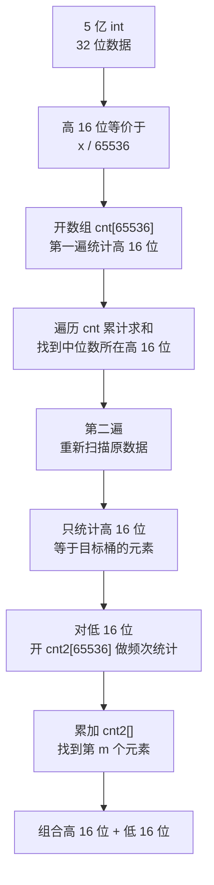
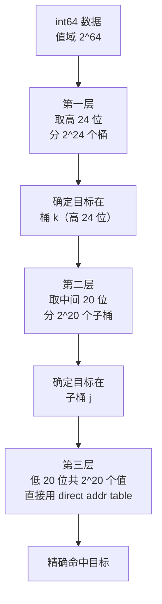

# 双层桶划分

## 核心思想

双层桶划分的本质仍是 **分而治之**，但重点在"分"的技巧上——**通过多次划分逐步缩小数值范围，直到子范围小到可直接寻址（bitmap / 直接寻址表）为止**。


### 适用范围

| 适用问题 | 说明 |
|---------|------|
| 第 K 大 / 中位数 | 逐步缩小范围，定位精确位置 |
| 不重复数字统计 | 确定元素存在于哪个桶，再精确去重 |
| 重复数字统计 | 桶内计数，汇总全局 |
| 频次统计 | 桶内 bitmap / 数组统计频率 |

### 设计原理

**为什么需要双层划分？**

假设整数范围是 `[0, 2^32)`，直接开辟一个大小为 2^32 的数组（约 4GB）在很多场景下可用内存不足。双层桶划分的思路是：

1. **第一层（粗分）**：将整个值域分成 $2^{16}$ 个桶（每个桶覆盖 $2^{16}$ 个值），用一个 65536 大小的计数数组统计各桶元素个数
2. **定位目标桶**：根据累计计数确定目标元素落在哪个桶
3. **第二层（细分）**：只对目标桶内的元素（最多 $2^{16}$ 个）进行精确统计，可直接使用 bitmap 或直接寻址表

这样，**空间需求从 4GB 降到了 65536 × 2 × 4B ≈ 0.5MB + 桶内 bitmap 约 8KB**。

## 算法通用流程



### 数学基础

设总数据量为 N，值域大小为 $R$，内存可容纳的寻址空间大小为 $M$。

分层数 $k$ 需满足：

$$\left(\frac{R}{B^k}\right) \leq M$$

其中 $B$ 为每层的分桶数。对 32 位整数：
- 第一层分 $2^{16}$ 桶 → 每桶覆盖 $2^{16}$ 个值
- 桶内最大元素数 $N/2^{16}$，值域宽度 $2^{16}$
- 第二层用 bitmap（需 $2^{16}/8 = 8$KB）或数组（$2^{16} \times 4 = 256$KB）均可

对于 64 位整数（int64 / long）：
- 值域 $2^{64}$，需要 **3 次划分**：
  - 第一次：$2^{24}$ 桶 → 每桶覆盖 $2^{40}$ 个值
  - 第二次：$2^{20}$ 桶 → 每桶覆盖 $2^{20}$ 个值
  - 第三次：桶内 $2^{20}$ 个值 → 直接用 direct addr table

## 相关题目

### 2.5 亿个整数中找出不重复的整数的个数

**分析**：32 位整型，值域 $[0, 2^{32})$。2.5 亿个整数有大量重复，内存不足以容纳全部。

**解法**：



**关键点**：
- 第一层用 256 个桶（8 位划分），每个桶覆盖 $2^{24}$ 个整数值
- 每个桶的 bitmap 只需 $2^{24} / 8 = 2$MB 内存，256 个文件顺序处理即可
- 需要足够的磁盘空间存放 256 个中间文件

**鸽巢原理**：当 N 个元素放入 M 个桶，至少有一个桶包含 $\lceil N/M \rceil$ 个元素。本例中每桶平均约 $2.5\text{亿} / 256 \approx 97.7\text{万}$ 个元素，远小于 $2^{24}$，bitmap 绰绰有余。

### 5 亿个 int 找中位数

#### 思路一：基于值域划分（推荐）

**核心过程**：



**详细说明**：

**第一遍统计**：开辟 `int count[65536]` 数组（约 256KB），遍历所有 5 亿个数，对每个数 `x`：
```
bucket = (x + 2^15) >>> 16    // 取高 16 位，+2^15 处理负数
count[bucket]++
```

> 注意负数处理：C/C++ 中 `>>>` 是无符号右移，或者用 `(x >> 16) + 32768`（加偏移量，因为 int 范围是 `[-2^31, 2^31)`，右移 16 位后范围 `[-32768, 32767]`，加 32768 偏移到 `[0, 65535]`。

**定位中位数桶**：遍历 count 数组累加，找到使 `sum >= N/2` 的桶索引 k。

假设：
- 前 k-1 个桶累计 sum_prev = 2.49 亿
- 第 k 个桶的元素个数为 count[k]
- 则中位数在桶 k 中的第 `(2.5亿 - 2.49亿) = 100万` 个元素

**第二遍统计**：只关心高 16 位 = k 的元素（即 `(x >> 16) + 32768 == k`），对低 16 位用 `int count2[65536]`（约 256KB）或 bitmap 统计频次。

再次前缀和，找到第 100 万个元素对应的低 16 位值，组合即得中位数。

**复杂度分析**：

| 指标 | 值 |
|------|-----|
| 扫描轮次 | 2 次读磁盘 |
| 单次扫描空间 | 256KB（count 数组）× 2 = 512KB |
| 总时间 | O(2N) = O(N) |
| 内存占用 | ~512KB，远小于 4GB 限制 |

#### 思路二：类基数排序法



**与基数排序的关联**：基数排序按位分组，从低位到高位（LSD）或高位到低位（MSD）逐步排序。这里的双层桶划分按高位先分桶（类似 MSD 基数排序），但只定位到中位数而非全排序。

#### 扩展：int64 的三层划分



**空间分析**：
- 第一层数组：$2^{24} \times 4B = 64MB$
- 第二层数组：$2^{20} \times 4B = 4MB$
- 第三层直连表：$2^{20} \times 4B = 4MB$
- **总计 ≈ 72MB**，远小于 $2^{64} / 8 = 2^{61}B$ 的全 bitmap

## 复杂度对比

| 问题 | 分层数 | 扫描次数 | 内存占用 | 时间复杂度 |
|------|-------|---------|---------|-----------|
| 不重复数统计（int32） | 1 | 2 | 2MB/文件 × 256 文件 | O(N) |
| 中位数（int32） | 2 | 2 | ~512KB | O(N) |
| 中位数（int64） | 3 | 3 | ~72MB | O(N) |
| 理论最优 | log_B(R) | log_B(R) | O(B × 4B) | O(N × log_B(R)) |

## 总结

双层桶划分的精髓在于：

1. **以空间换扫描次数**：每次扫描使用少量内存（计数数组），逐步缩小搜索范围
2. **分层精度递增**：第一层粗筛确定大区间，第二层精确命中
3. **通用性极强**：中位数、第 K 大、重复检测、频次统计均可应用
4. **与基数排序同源**：本质是按位分组的二分查找思想，只查不排
