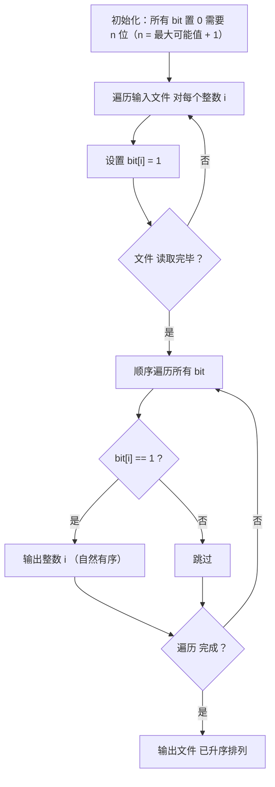
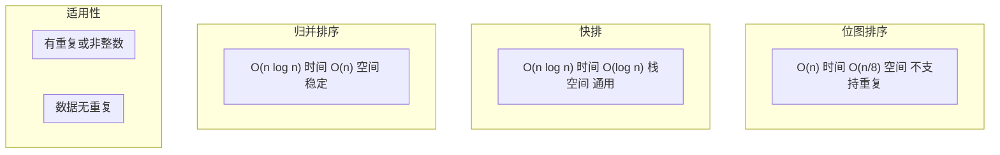
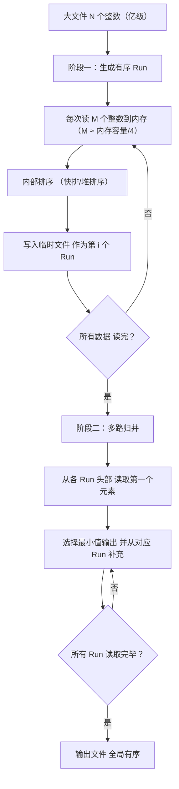
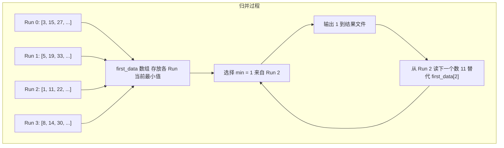
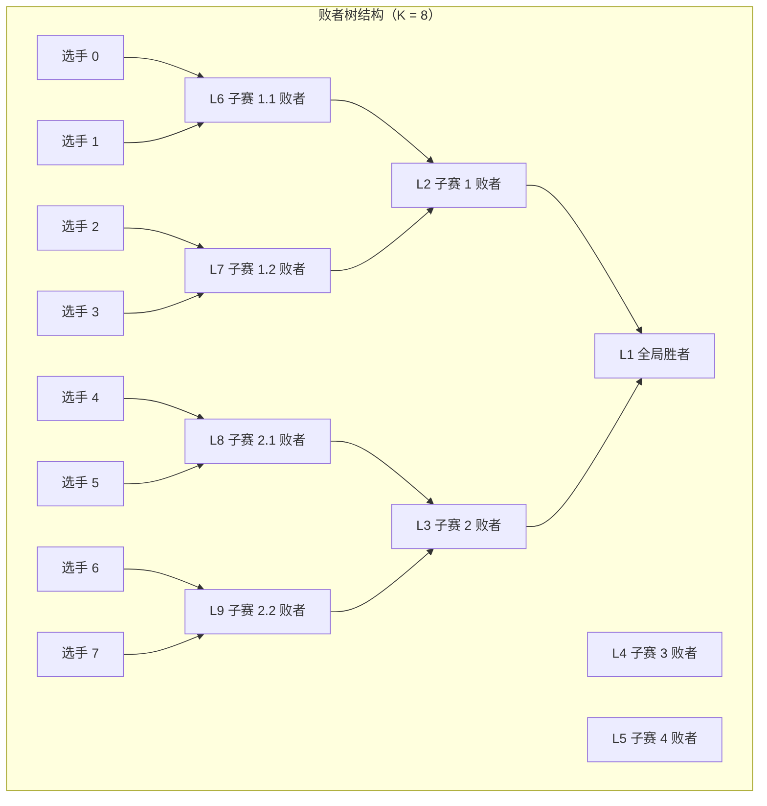
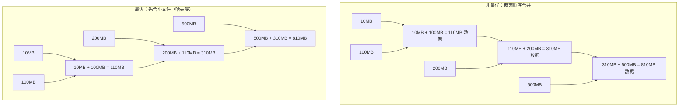
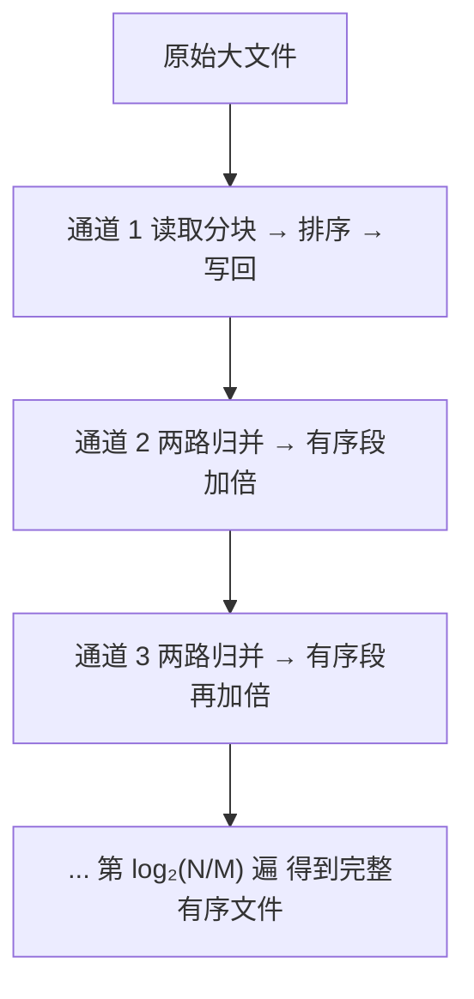

# 外（磁盘文件）排序

## 概述

外排序（External Sorting）指**借助外部磁盘存储进行的大规模数据排序**。当待排序数据远超可用内存时，无法使用纯内部排序，必须通过磁盘 I/O 分阶段完成。

### 适用场景

| 场景 | 说明 |
|------|------|
| 大数据排序 | 内存放不下全部数据，需分批处理 |
| 大数据去重 | 基于有序结果做一次扫描去重 |
| 数据库排序归并 | SQL 中 `ORDER BY` + `LIMIT` 在大表上的实现 |

### 基本思想


**编程珠玑** 中描述了三种外排序方法：
1. **位图排序法** — 无重复数据时最高效
2. **外排多路归并法** — 通用性最强
3. **多通道排序法** — 适用于特定约束

## 位图排序法（Bitmap Sort）

### 适用条件

- 待排序数据**不含重复**
- 数据值域已知且较小（如所有整数 ≤ 10^7）
- 每条记录是单一整数，无附加数据

### 位图原理

用一个 bit 位表示一个整数是否存在。例如集合 `{1,2,3,5,8,13}`（元素 < 20）可表示为：

```
位索引:  0 1 2 3 4 5 6 7 8 9 10 11 12 13 14 15 16 17 18 19
位值:    0 1 1 1 0 1 0 0 1 0  0  0  0  1  0  0  0  0  0  0
```

### 算法流程



### 示例：10^7 个不重复整数的排序

**约束**：n = 10^7，内存 ≈ 1MB

```bash
# 位图排序方案伪代码

# 第一步：位图初始化
for i = {0, ..., n}
    bit[i] = 0

# 第二步：读文件，建集合
for each i in the input file
    bit[i] = 1

# 第三步：检查每一位，输出
for i = {0, ..., n}
    if bit[i] == 1
        write i on the output file
```

**内存计算**：10^7 bits = 10^7 / 8 = 1.25MB。但要求仅 1MB，所以需分两次扫描：

| 扫描 | 处理范围 | 位图大小 | 说明 |
|------|---------|---------|------|
| 第 1 次 | 0 ~ 4,999,999 | 5M/8 ≈ 0.625MB | 只处理前 500 万的整数 |
| 第 2 次 | 5,000,000 ~ 9,999,999 | 5M/8 ≈ 0.625MB | 处理后 500 万的整数 |

两次扫描复用同一块内存，**峰值仅 0.625MB**。

### 位图 vs 普通排序



**关键限制**：位图排序**不适用于含重复数据的情况**，因为无法记录重复次数。若有重复，需改用 bitmap + count 的扩展方案或多路归并。

## 外排多路归并法（External Multi-Way Merge Sort）

### 算法总览



### 阶段一：生成有序子文件（Run 生成）

假设内存限制为 1MB，每个整数占 4B：

-   每次可排序的整数数 = 1MB / 4B = 250K

-   需要分块的次数 = 10^7 / 250K = 40 次

即：读 10^7 个整数 → 分 40 次内存排序 → 生成 **40 个有序临时文件**。

每个整数经历一次磁盘写（写入临时文件），一次磁盘读（归并时读入）。

### 阶段二：K 路归并



**步骤详解**：

1. **初始化**：从 40 个有序文件中各读第一个数，放入 `min_heap[40]`
2. **循环**：
   - 从堆顶取出最小值（`O(log K)` 调整）
   - 写入结果文件
   - 从该最小值所在文件读取下一个数，压入堆（`O(log K)` 调整）
3. **结束**：所有文件读取完毕

### 败者树优化

当 K（归并路数）很大时（如 K = 1000），每次取最小值用堆的 `O(log K)` 仍可接受。但**败者树**（Loser Tree）可以进一步优化比较次数：



**败者树原理**：每个内部节点记录该子赛的"败者"（较小的值），而"胜者"继续向上比较。更新时只需从叶到根比较 `O(log K)` 次，且比较次数和 K 无关的常数更小。

### 最优归并树——减少 I/O

每次归并都涉及磁盘读写，**减少归并次数**是优化关键。最优归并树（类似哈夫曼树）的策略是：让较小的 Run 先合并，以减少后续归并的总 I/O 量。



> **I/O 量对比**：两两顺序合并共处理 `10+100 + 110+200 + 310+500 = 1230MB`；哈夫曼式合并共处理 `10+100 + 200+110 + 500+310 = 1230MB`。当各 Run 大小差异极大时，哈夫曼策略的 I/O 节省更显著。

### 多序列归并示例（代码级）

```
输入: 10^7 个整数（约 40MB），内存 1MB（每次可排 250K 个）
结果: 生成 40 个有序临时文件 → 多路归并

关键数据结构：
- min_heap[40]：存放各文件当前最小值
- 每次输出堆顶，从对应文件补充新元素

伪代码：

// 阶段一：生成 Run
for i = 0 to N / M - 1:
    read(M 个整数到内存 buf)
    sort(buf)
    write(buf → temp_file_i)

// 阶段二：K 路归并
for i = 0 to K - 1:
    min_heap[i] = (read(temp_file_i), i)  // (值, 文件索引)
build_min_heap(min_heap)

while min_heap is not empty:
    (min_val, idx) = pop(min_heap)
    write(min_val → output)
    if temp_file_idx has next:
        push(min_heap, (read_next(temp_file_idx), idx))
```

### 性能分析

| 指标 | 值 |
|------|-----|
| 磁盘读取次数 | N / M × 2（一次写 Run，一次归并读）+ 1（原文件读） |
| 磁盘写入次数 | N / M（写有序 Run）+ 1（写结果） |
| 内部排序复杂度 | O((N/M) × M log M) = O(N log M) |
| 归并复杂度 | O(N log K)，K 为归并路数 |
| **总时间** | **CPU 时间 + I/O 时间**（通常 I/O 是瓶颈） |

## 多通道排序法

当内存极小、一次只能排序很少数据时，可对磁盘数据做**多次扫描合并**（多通道归并）。其核心是用更多的 I/O 轮次换取更少的内存占用。



> 适用场景：内存极小（如嵌入式环境），I/O 速度较快（如 SSD），或预排序数据。

## 三种方案对比

| 特性 | 位图排序 | 多路归并排序 | 多通道排序 |
|------|---------|-------------|-----------|
| 是否支持重复 | ❌ 否 | ✅ 是 | ✅ 是 |
| 时间复杂度 | O(N) | O(N log N) | O(N log N) |
| 空间复杂度 | O(N/8) | O(M) | O(M) 更小 |
| I/O 次数 | 1 次读 + 1 次写 | 2 次读 + 2 次写 | 2×log₂(N/M) 次 |
| 适用场景 | 无重复 + 值域小 | 通用 | 内存极受限 |
| 实现复杂度 | 低 | 中 | 低 |

## 总结

外排序的核心挑战在于：**如何用最少的内存和最少的 I/O，对远超内存容量的数据进行排序**。

| 策略 | 核心思想 | 关键数据结构 | 优化方向 |
|------|---------|-------------|---------|
| 位图排序 | 用位代替整数，空间压缩 32 倍 | 位图 (Bit Vector) | 分多次扫描压缩内存 |
| 多路归并 | 分批内排 → 多路外排合并 | 堆 / 败者树 | 败者树 + 最优归并树 |
| 多通道排序 | 多次扫描，逐步扩大有序段 | 有序文件 | 减少通道数 |

**实践建议**：
- 数据无重复且值域小 → **位图排序**（极快）
- 数据有重复 → **多路归并排序**（通用）
- 内存极小 → **多通道排序**（空间换时间）
