# 布谷鸟过滤器

## 什么是布谷鸟过滤器

### 概述

布谷鸟过滤器（Cuckoo Filter）是一种**近似集合成员查询**（Approximate Membership Query）数据结构，由 Fan 等人于 2014 年提出（论文 *Cuckoo Filter: Practically Better Than Bloom*）。它的名字来源于**布谷鸟哈希（Cuckoo Hashing）** 的挤占机制——正如布谷鸟（Cuckoo）这种鸟将蛋下到其他鸟的巢中、挤走原有鸟蛋的行为。

**核心特性对比**：

| 特性 | Bloom Filter | Cuckoo Filter |
|------|-------------|---------------|
| 查询 | O(k) — k 个 Hash | O(1) — 最多 2 次桶查找 |
| 插入 | O(k) | O(1) 均摊（可能发生挤占链）|
| 删除 | ❌ 不支持 | ✅ 支持 |
| 空间效率 | 高（约 0.6185^m/n） | 更高（桶大小 = 4 时负载率 95%）|
| 误报率 | 随元素增加上升 | 更稳定 |

### 布谷鸟哈希基础

布谷鸟过滤器底层依赖**布谷鸟哈希**结构，我们先理解布谷鸟哈希的工作原理。

**布谷鸟哈希的核心思想**：每个元素有两个候选位置（由两个 Hash 函数决定）。插入时若两个候选位都已被占用，则随机踢出一个已有元素，被踢出的元素再寻找它的另一个候选位置，如此反复——直到所有元素都有位置安置。

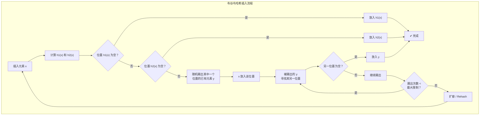

#### 插入示例

**第一次插入**：插入"张三"，经过哈希得到两个位置 3 和 5，选择位置 3 插入。

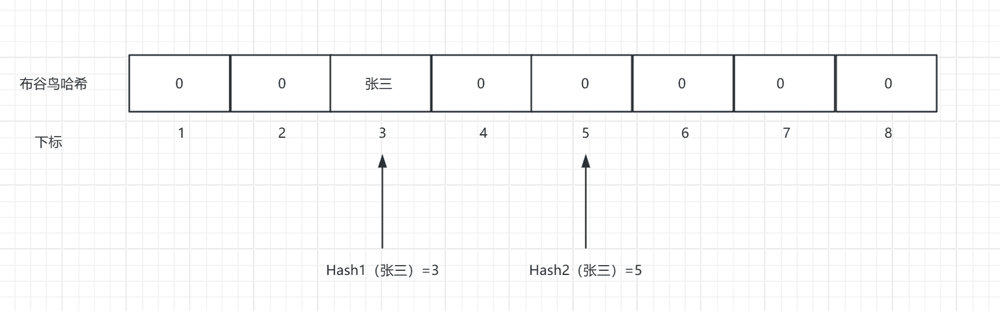

**第二次插入**：插入"赵四"，得到两个位置 3 和 4，选择位置 3。

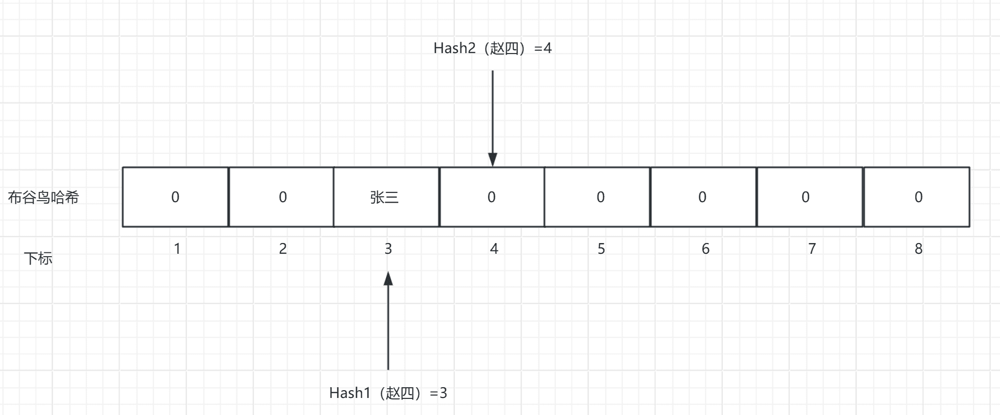

此时"赵四"想要插入位置 3，发生挤占：将"张三"从位置 3 挤出去。

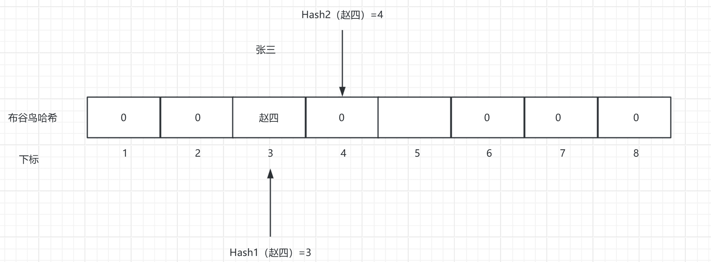

"张三"被挤出后，重新被引导到其另一个位置（位置 5），完成插入。

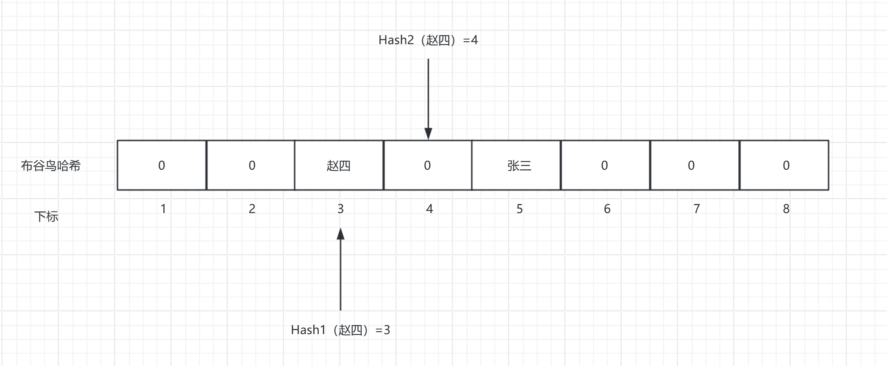

### 挤占循环问题

当挤占形成**环路**时——例如"张三"被挤出去后找到位置 3，"赵四"再次被挤出去，又回到位置 5——就会陷入无限循环。

还有更复杂的环形挤占链：A → B → C → D → ... → A。

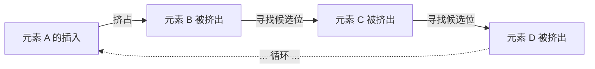

**解决方案**：

1. **设置最大挤占次数**（通常 500 或 1000）：达到阈值后判定空间不足，触发扩容
2. **增加哈希函数数**：让每个元素有更多候选位置，降低循环概率
3. **增加桶容量**：每个桶存储多个指纹，减少直接冲突

### 桶（Bucket）设计

实际布谷鸟过滤器将每个哈希位置扩展为一个**桶（bucket）**，每个桶可容纳多个元素（指纹）：

```java
type bucket [4]byte  // 一个桶，4 个座位
type cuckoo_filter struct {
    buckets [size]bucket  // 一维数组
    nums    int           // 容纳的元素个数
    kick_max int          // 最大挤兑次数
}
```

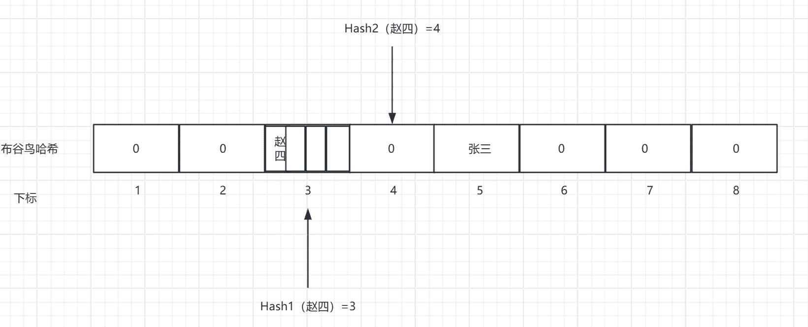

> 一个桶中的 4 个位置是连续存储的（数组而非链表），保证 CPU 缓存友好。

**负载率与桶大小的关系**（来自原论文）：

| 桶大小 | 负载率（Load Factor） |
|:------:|:--------------------:|
| 1 | ~50% |
| 2 | ~84% |
| 4 | ~95% ✅ |
| 8 | ~98% |

当桶大小达到 4 时，空间利用率已达 95%，远优于 Bloom Filter 的理论上限。

> 原论文：*Cuckoo Filter: Practically Better Than Bloom* — [PDF](https://www.cs.cmu.edu/~dga/papers/cuckoo-conext2014.pdf)

## 布谷鸟过滤器

### 核心概念：指纹（Fingerprint）

布谷鸟过滤器和布谷鸟哈希结构的核心区别在于：**布谷鸟过滤器不存储原始数据，只存储每个元素的"指纹"（Fingerprint）**。

指纹是元素经过 Hash 函数生成的 **n 位比特序列**：

```
fingerprint = Hash(element) & ((1 << fingerprint_bits) - 1)
```

- 指纹位数 n 决定误报率：n 越大，误报率越低
- 通常推荐 n = 8~16 位（1~2 字节）
- 指纹占用的空间远小于存储原始数据——这就是布谷鸟过滤器"省空间"的关键

> 但请注意：指纹可能重复——即不同元素可能计算出相同的 8 位指纹（最多 256 种可能性）——这就是**误报**的根本原因。布谷鸟过滤器和布隆过滤器一样，无法完全消除误报（False Positive）。

### 两个关键公式

布谷鸟过滤器使用一个巧妙的数学技巧来确定元素的**两个候选桶索引**：

```
i1  = hash(element)           // 第一个桶索引
i2  = i1 ⊕ hash(fingerprint)  // 第二个桶索引
```

**异或（XOR）的性质**提供了双向推导能力：

```
i1 = i2 ⊕ hash(fingerprint)
```

这意味着：当我们从桶中挤出一个元素时，只要知道**当前桶索引 i** 和**该元素的指纹 fp**，就能立刻计算出它的**另一个候选桶**，**无需重新获得原始元素**——这正是布谷鸟过滤器的高明之处。

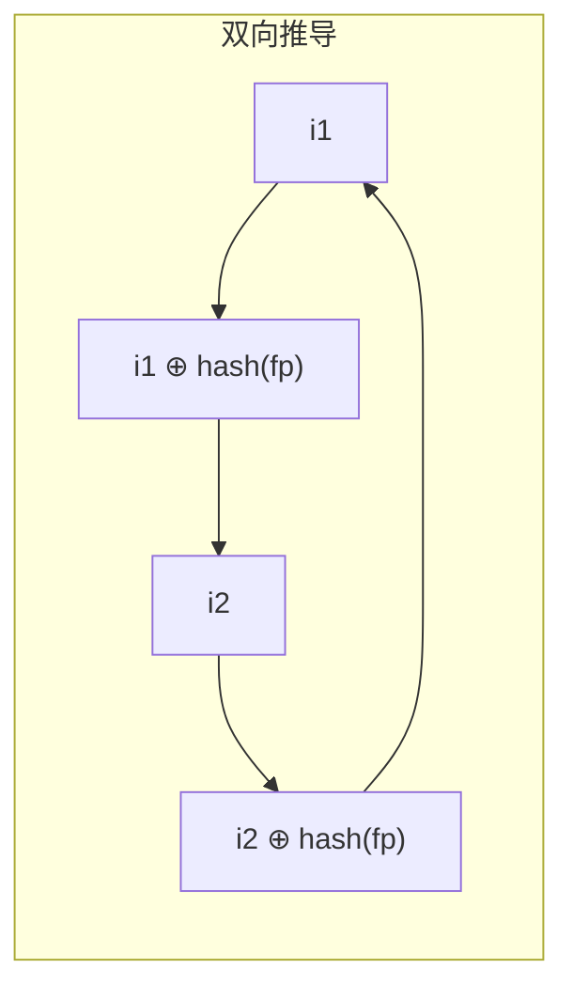

### 插入操作

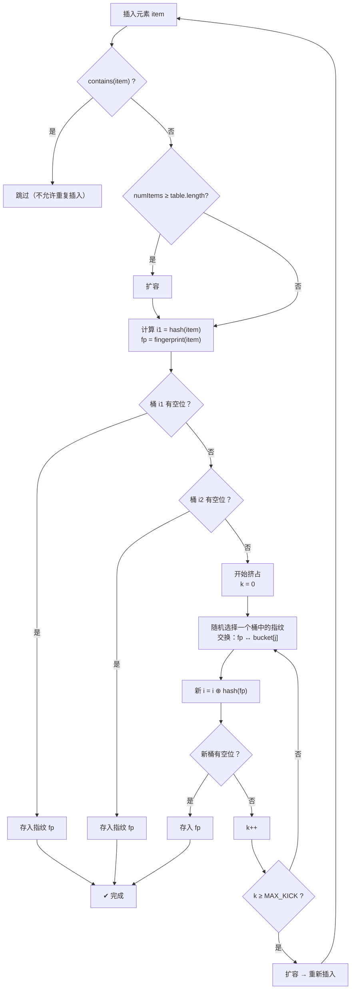

**Java 伪代码**：

```java
public void insert(int item) {
    if (contains(item)) return;                     // 不重复插入
    if (numItems >= table.length) resizeTable();    // 空间不足则扩容

    int i1 = hashItem(item);
    int fp = getFingerprint(item);

    for (int i = 0; i < MAX_KICK_ATTEMPTS; i++) {
        // 尝试在 i1 和 i2 两个桶中找到空位
        // 简化的逻辑：这里迭代的 i 实际上是当前尝试的桶索引
        if (table[i1] == -1) {                      // 有空位
            table[i1] = fp;
            numItems++;
            return;
        }
        // 挤占：交换当前指纹和桶中指纹
        int temp = table[i1];
        table[i1] = fp;
        fp = temp;
        // 用指纹计算另一个候选桶
        i1 = i1 ^ hashItem(fp);
    }
    // 达到最大挤占次数 → 扩容后重新插入
    resizeTable();
    insert(item);
}
```

#### 插入的重复问题

布谷鸟过滤器在判断"是否重复"时通过**指纹**进行比较——这意味着指纹可能误判。这就产生了一个两难选择：

| 策略 | 优点 | 缺点 |
|------|------|------|
| **允许重复插入** | 避免误判导致插入被拒 | 同一元素可能填满两个桶的全部位置（每个桶 4 个位置，共 8 个），第 9 个才触发挤占；扩容时必须增加**每桶容量**而非仅增大数组，空间飙升 |
| **不允许重复插入** | 节省空间 | 可能因指纹误判而拒绝本应插入的不同元素 |

### 查找操作

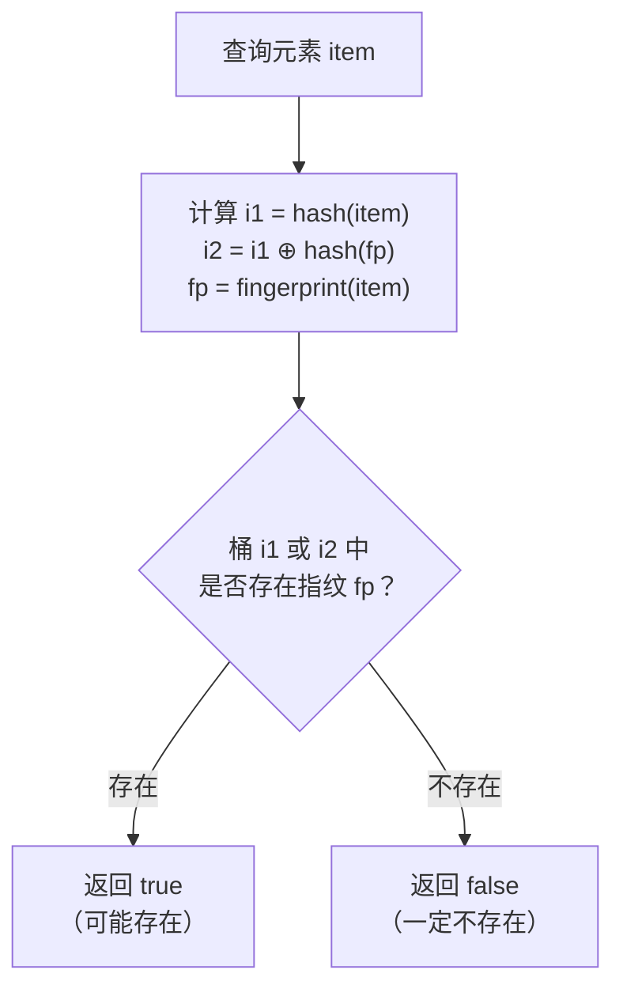

**Java 伪代码**：

```java
public boolean contains(int item) {
    int i1 = hashItem(item);
    int fp = getFingerprint(item);
    int i2 = i1 ^ hashItem(fp);

    if (table[i1] == fp) return true;
    if (table[i2] == fp) return true;
    return false;
}
```

### 删除操作

布谷鸟过滤器**支持删除**——这是它相对于 Bloom Filter 的最大优势之一。

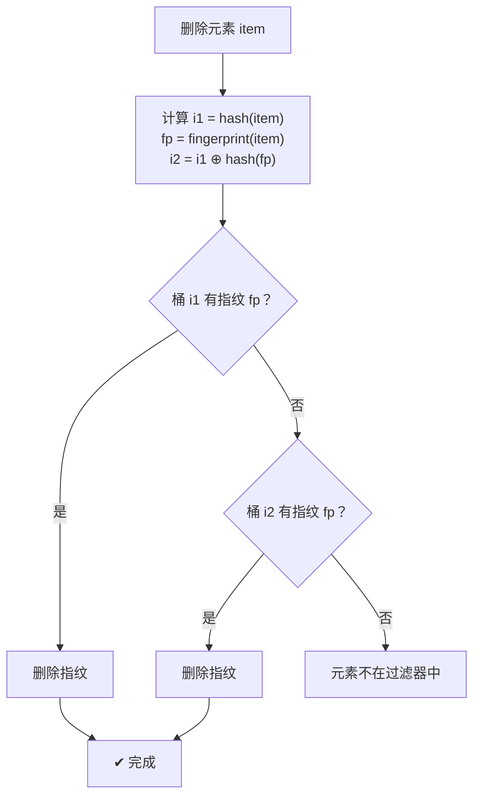

**Java 伪代码**：

```java
public void delete(int item) {
    int i1 = hashItem(item);
    int fp = getFingerprint(item);
    int i2 = i1 ^ hashItem(fp);

    if (table[i1] == fp) {
        table[i1] = -1;
        numItems--;
        return;
    }
    if (table[i2] == fp) {
        table[i2] = -1;
        numItems--;
        return;
    }
    // 未找到 → 元素不在过滤器中
}
```

> ⚠️ 同样是基于指纹的匹配，删除也可能因指纹重复而产生**误删**。

### 复杂度分析

| 操作 | 均摊时间复杂度 | 最坏情况 |
|------|:--------------:|:--------:|
| **查询** | O(1) — 最多检查 2 个桶 | O(1) |
| **插入** | O(1) — 大多数情况无需或仅需少量挤占 | O(MAX_KICK) — 触发挤占链 |
| **删除** | O(1) | O(1) |
| **空间占用** | O(n) — n 为元素数，每个指纹 b 位 | 每个桶 4 × b 位 |

### 三种过滤器对比

| 特性 | Bloom Filter | Cuckoo Filter | Counting Bloom Filter |
|------|:-----------:|:------------:|:--------------------:|
| 查询 | O(k) | O(1) | O(k) |
| 插入 | O(k) | O(1) 均摊 | O(k) |
| 删除 | ❌ | ✅ | ✅（需 4× 空间）|
| 负载率 | 理论 ~50% | ~95%（桶大小=4）| ~50% |
| 误报率趋势 | 随插入增加而增加 | 更稳定 | 随插入增加而增加 |
| 空间效率 | 高 | 更高 | 中等 |

## Java 简易实现

> 以下是一个用于教学目的的简化实现。真实的布谷鸟过滤器（如 RedisBloom 中的实现）在哈希函数选择、指纹长度优化、桶扩容策略等方面要复杂得多。

```java
import java.util.BitSet;
import java.util.Random;

public class CuckooFilter {
    private static final int MAX_KICKS = 500;     // 最大挤占次数
    private static final int FINGERPRINT_BITS = 8; // 指纹位数
    private int[] buckets;    // 简化为每个桶存一个指纹（实际应每个桶存多个）
    private int numBuckets;
    private int numItems;
    private Random random = new Random();

    public CuckooFilter(int capacity) {
        // 简化：每个桶存1个元素，实际生产环境每个桶存4个元素
        this.numBuckets = nextPowerOf2(capacity * 2);
        this.buckets = new int[numBuckets];
        for (int i = 0; i < numBuckets; i++) buckets[i] = -1;
        this.numItems = 0;
    }

    private int getFingerprint(String item) {
        return Math.abs(item.hashCode()) & ((1 << FINGERPRINT_BITS) - 1);
    }

    private int getBucket(String item) {
        return Math.abs(item.hashCode()) % numBuckets;
    }

    private int getAltBucket(int bucket, int fingerprint) {
        return bucket ^ (Math.abs(fingerprint * 0x9e3779b9) % numBuckets);
    }

    public boolean contains(String item) {
        int fp = getFingerprint(item);
        int b1 = getBucket(item);
        int b2 = getAltBucket(b1, fp);
        return buckets[b1] == fp || buckets[b2] == fp;
    }

    public boolean insert(String item) {
        if (contains(item)) return true;

        int fp = getFingerprint(item);
        int b1 = getBucket(item);
        int b2 = getAltBucket(b1, fp);

        if (buckets[b1] == -1) { buckets[b1] = fp; numItems++; return true; }
        if (buckets[b2] == -1) { buckets[b2] = fp; numItems++; return true; }

        int cur = b1;
        for (int i = 0; i < MAX_KICKS; i++) {
            int evicted = buckets[cur];
            buckets[cur] = fp;
            fp = evicted;
            cur = getAltBucket(cur, fp);
            if (buckets[cur] == -1) {
                buckets[cur] = fp;
                numItems++;
                return true;
            }
        }
        // 扩容（简化：创建新过滤器并重新插入）
        return rehashAndInsert(item);
    }

    public boolean delete(String item) {
        int fp = getFingerprint(item);
        int b1 = getBucket(item);
        int b2 = getAltBucket(b1, fp);
        if (buckets[b1] == fp) { buckets[b1] = -1; numItems--; return true; }
        if (buckets[b2] == fp) { buckets[b2] = -1; numItems--; return true; }
        return false;
    }

    private boolean rehashAndInsert(String item) {
        int oldSize = numBuckets;
        int[] oldBuckets = buckets;
        numBuckets = numBuckets * 2;
        buckets = new int[numBuckets];
        for (int i = 0; i < numBuckets; i++) buckets[i] = -1;
        numItems = 0;
        for (int i = 0; i < oldSize; i++) {
            if (oldBuckets[i] != -1 && oldBuckets[i] != 0) {
                // 注意：这里无法还原原始元素，实际实现需要更复杂的策略
                // 此处仅为演示
            }
        }
        return insert(item);
    }

    private int nextPowerOf2(int n) {
        return 1 << (32 - Integer.numberOfLeadingZeros(n - 1));
    }
}
```

## 总结

布谷鸟过滤器通过**布谷鸟哈希的挤占机制**和**指纹存储**，在 Bloom Filter 的基础上实现了两个重大改进：

1. ✅ **支持删除**：通过指纹异或推导候选桶，可在 $O(1)$ 时间内删除元素
2. 📊 **更高空间利用率**：桶大小 = 4 时负载率可达 95%

代价是：
- ❌ **仍然存在误报**（False Positive）：指纹位数有限，不同元素可能产生相同指纹
- ⚠️ **挤占循环风险**：需要设置最大挤占次数来兜底
- ⚠️ **插入性能存在抖动**：最坏情况需要多次挤占甚至触发扩容

**适用场景**：
- 需要频繁 **删除** 元素的近似成员查询场景（广告系统、网络防火墙规则匹配）
- 对空间利用率要求极高，且可容忍少量误报的场景
- 需要稳定误报率而非随元素增长而攀升的场景
