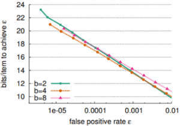

# 布谷鸟过滤器

## 什么是布谷鸟过滤器

在中国有一个成语，叫做鸠占鹊巢，字面意思就是说：鸠这种动物，从来不会自己搭建巢穴，在下蛋的时候就会把蛋下到鹊的巢穴里，挤占鹊的蛋的生存空间。而鸠就是布谷鸟，布谷鸟过滤器的思想就是挤占

布谷鸟过滤器的底层用的是布谷鸟哈希结构。

因此我们先来介绍一下布谷鸟哈希结构，其本质上是为了解决哈希冲突，最原始的布谷鸟哈希结构采用以下步骤来解决哈希冲突：

-   对输入的Key使用两个Hash函数，得到桶中的两个位置
-   如果两个位置都为空，就把Key随机选择一个位置放入
-   如果两个位置只有一个为空，就把Key放入到这个空的位置
-   如果两个位置都不为空，则随机踢出一个元素，踢出的元素再重新计算哈希找到相应的位置

其实这样说可能还是有点模糊，所以我们搭配图片来说明一下：

第一次插入元素：插入"张三"，经过哈希后得到两个位置：3和5，选择位置3进行插入


第二次插入元素 :  插入"赵四"，经过哈希后，得到两个位置3和4，选择位置3进行插入


而此时当“赵四”想要插入位置3的时候，就会发生挤占，将"张三"从原位置挤占出去了


此时就要重新为张三进行hash，得到位置3和5，选择位置5进行插入。


而在这种情况下，我们就完成了一次"挤占"的过程 。并且为被挤占的元素重新安排了位置

## 挤占循环

如果发生挤占循环怎么办？也就是说：==当重新为张三进行hash后，我们没有选择位置5，而是选择了位置3，此时就又会把“赵四”挤占出去了，而重新为“赵四”进行Hash的时候，赵四又选择了位置3，再次把“张三”挤占出去，此时“张三”又要重新进行Hash，无限循环这种情况..........==或者是==不同数据之间的相互挤占，也就是A数据的插入挤占出了B数据，B数据的插入挤占出了C数据，C数据的插入挤占了D数据，这样不断的循环==

而挤占循环这种问题，是没有办法真正解决的，我们能做的只有尽量抑制挤占循环，有如下思路：

-   设置最大挤占次数，如果达到最大挤占次数后，说明空间不够用了，要进行桶的扩容操作。
-   设置更多的哈希函数，使得一个Key有更多的位置可以选择。

而通过这两种方法，其实就可以很好的控制循环挤占的问题

而我们单独讲一下桶的扩容操作，因为桶可以使我们自己定义的数据结构，因此我们可以把让一个位置存储多个元素，类似二维数组的形式，我们来看一下代码：

```java
type bucket [4]byte // 一个桶，4个座位
type cuckoo_filter struct [
    buckets [size]bucket // 一维数组
    nums int // 容纳的元素的个数
    kick_max // 最大挤兑次数
}
```

如图所示：


这样我们就使得一个桶中可以存储四个数据，而此时的赵四只占用了一个位置，在同一个哈希映射坐标中，我们还可以存储三个。

>   注意：这里的位置是连续的。并不是有些人想的链表结构
>

而且根据相关文献研究，通过不断对桶进行扩容，我们可以大大提高桶的利用效率

文献指出，当桶的大小达到4的时候，我们整个桶数组的利用效率就达到了95%，这是我们使用布隆过滤器难以达到的

相关文献链接：[cuckoo-conext2014.pdf (cmu.edu)](https://www.cs.cmu.edu/~dga/papers/cuckoo-conext2014.pdf)

## 布谷鸟过滤器

布谷鸟过滤器的基础就是布谷鸟哈希结构。而它与布谷鸟哈希结构的区别就在于：我们在使用布谷鸟过滤器的时候，并不会像布谷鸟哈希结构一样，需要存储具体的信息。因为整个过滤器的作用只是证明当前元素是否可能存在，因此我们需要把可以证明这个元素的关键信息放进去就可以了

而我们给出的答案就是：指纹

指纹指的是使用一个哈希函数生成的n位比特位，n的具体大小由所能接受的误判率来设置

也就是说，我们把指纹存储到对应元素的进行哈希后所映射出来的坐标位置就好了。

>   但其实在这里我们就可以明白：布谷鸟过滤器的思维和布隆过滤器的底层还是一样的，只不过是在优化布隆过滤器的数据结构。而布隆过滤器的底层问题：可能存在误判。这个问题布谷鸟一样也避不开。
>

我们可以假设指纹是一个八位的二进制数字。那最多也就只有255种不同的指纹，也就是说一定会出现两个不同的元素但是指纹相同的问题，也就是误判问题。

### 布谷鸟过滤器的插入

我们来看一下布谷鸟过滤器是如何插入元素的：

```java
public void insert(int item) {
    //如果包含这个数据就返回，不做重复插入
    if (contains(item)) {
        return;
    }
    //如果表总长已经达到最大程度就进行扩容
    if (numItems >= table.length) {
        resizeTable();
    }
    //进行Hash得到位置
    int hash = hashItem(item);
    //计算该数据的指纹
    int fingerprint = getFingerprint(item);
    //进入循环，MAX_KICK_ATTEMPTS是最大挤占次数
    for (int i = 0; i < MAX_KICK_ATTEMPTS; i++) {
        //如果当前位置为空
        if (table[hash] == -1) {
            //存储当前数据的指纹
            table[hash] = fingerprint;
            numItems++;
            return;
        }
        //如果当前位置不为空
        else {
            //用temp存储原数据的指纹
            int temp = table[hash];
            //存储当前数据的指纹(挤占原指纹)
            table[hash] = fingerprint;
            //用fingerprint来存储原数字指纹
            fingerprint = temp;
            //此处的hashItem是一个哈希函数，我们把fingerprint输入进去得到新的hash坐标
            //也就是说，此时我们得到了一个新的坐标和原数据指纹，进行新一轮的插入
            hash = hashItem(fingerprint);
        }
    }
    //结束循环，也就是说达到了最大的挤占次数，仍然有数据被挤占
    //1，进行扩容
    resizeTable();
    //2.重新进行一次插入
    insert(item);
}
```

插入处的逻辑看起来复杂，其实关键点就在于：我们的第二个Hash坐标是通过指纹来计算出来的。

而在布谷鸟哈希结构，我们是直接使用两个Hash函数对同一个数据进行两次Hash，得到两个坐标。

布谷鸟过滤器之所以不采用两个Hash，是因为我们的布谷鸟过滤器为了节省空间，存储的并不是原数据。如果我们使用原数据得到了两个Hash坐标，选择一个存入。那么我们在发生挤占之后，得到原数据的指纹，我们又要如何得到这个数据的另一个坐标呢？

也就是说在布谷鸟过滤器得到的两个坐标中：

第一个坐标是通过某个哈希函数计算出来，第二个坐标是使用第一个坐标和指纹的哈希做了一个异或操作，进行异或操作的好处是：因为异或操作的特性：`a^b = c`，`c ^ b=a`，`c^a=b`我们可以快速的互推数据。换句话说，在桶中挤占一个数据，我们直接用当前桶的索引i和存储在桶中的指纹计算它的备用桶。

而布谷鸟的插入也存在一个困难的问题：我们是否允许重复？

之所以说这个问题苦难，是因为我们在布谷鸟过滤器中判断是否可以重复插入的时候，是依靠指纹进行判断的，而指纹会存在误判情况，此时就分为两种情况：

如果我们允许重复插入：插入相同的数据，那么它的两个坐标就是相同的，我们假设有两个坐标，一个坐标里面有四个位置：

那么他最多就允许八个相同的元素插入，当我们插入第九个相同的元素的时候，就会发生挤占，而且这种挤占无法通过普通的扩容来解决，需要重新设置同一个坐标的位置个数，而不是简单的增加数组长度，也就是对这里进行操作：

而这种级别的扩容所带来的辐射是每一个坐标的，他会使得空间复杂度飙升。

而如果我们不允许重复插入：那么此时就存在一个BUG了，指纹是可以重复的，而我们在判断是否是重复插入元素是通过指纹进行判断的，也就是说存在误判的情况。这样会导致部分数据无法正常插入布谷鸟过滤器。

### 布谷鸟过滤器的删除

布谷鸟过滤器只需要根据输入数据计算得到指纹，找到指纹进行删除就可以了。

```java
public void delete(int item) {
    //计算Hash位置
    int hash = hashItem(item);
    //计算指纹
    int fingerprint = getFingerprint(item);
    if (table[hash] == fingerprint) {
        //如果桶的hash位置是对应的指纹，直接删除
        table[hash] = -1;
        numItems--;
        return;
    } else {
        //如果不是，就利用指纹计算另外一个备用位置
        int altHash = hashItem(fingerprint);
        //如果是对应的指纹就删除
        if (table[altHash] == fingerprint) {
            table[altHash] = -1;
            numItems--;
            return;
        }
    }
}
```

而就像我们前面说的一样：布谷鸟过滤器为了优化存储空间，牺牲了存储的精度。所谓的指纹也只不过是一串二进制数字。也就是说：指纹可能重复，布谷鸟过滤器也会出现误删的情况。

### 布隆过滤器的查找

查找很简单，通过指纹和Hash坐标去判断就可以了。

```java
public boolean contains(int item) {
    int hash = hashItem(item);
    int fingerprint = getFingerprint(item);

    if (table[hash] == fingerprint) {
        return true;
    } else {
        int altHash = hashItem(fingerprint);
        if (table[altHash] == fingerprint) {
            return true;
        }
    }

    return false;
}
```

而这个查找一样存在误判。

而这些问题从指纹的设计模式上来讲，很难解决。我们只能通过不断的扩大指纹的字节数量或者提升计算指纹的哈希函数来缓解这个问题。

不过布谷鸟过滤器确实实现了数据的删除，解决了布隆过滤器的缺点。



这是文献作者提供的数据统计，其实我们看出，当桶的座位为4的时候，其实就已经可以胜任大多数的业务了。

## 基于Java实现布谷鸟过滤器

这并不代表真正的布谷鸟过滤器，事实上真正的布谷鸟过滤器的哈希函数设计困难的多，这里只是贴出来一个简单模拟的

```java
import java.util.BitSet;
import java.util.Random;

public class CuckooFilter {
    private static final int MAX_KICKS = 500;
    private BitSet[] buckets;
    private int numBuckets;
    private int bucketSize;
    private int numItems;

    public CuckooFilter(int numBuckets, int bucketSize) {
        this.numBuckets = numBuckets;
        this.bucketSize = bucketSize;
        this.buckets = new BitSet[numBuckets];
        for (int i = 0; i < numBuckets; i++) {
            buckets[i] = new BitSet(bucketSize);
        }
        this.numItems = 0;
    }

    public boolean contains(String item) {
        int fingerprint = getFingerprint(item);
        int bucket1 = getBucket(item);
        int bucket2 = getAltBucket(bucket1, fingerprint);

        return buckets[bucket1].get(fingerprint) || buckets[bucket2].get(fingerprint);
    }

    public void insert(String item) {
        if (contains(item)) {
            return;
        }

        int fingerprint = getFingerprint(item);
        int bucket1 = getBucket(item);
        int bucket2 = getAltBucket(bucket1, fingerprint);

        if (buckets[bucket1].cardinality() < bucketSize) {
            buckets[bucket1].set(fingerprint);
            numItems++;
        } else if (buckets[bucket2].cardinality() < bucketSize) {
            buckets[bucket2].set(fingerprint);
            numItems++;
        } else {
            Random random = new Random();
            int bucket = random.nextBoolean() ? bucket1 : bucket2;
            int i = 0;
            while (i < MAX_KICKS) {
                int evictedFingerprint = random.nextInt(bucketSize);
                if (!buckets[bucket].get(evictedFingerprint)) {
                    buckets[bucket].set(evictedFingerprint);
                    String evictedItem = getItem(bucket, evictedFingerprint);
                    insert(evictedItem);
                    return;
                }
                i++;
            }
            rehash();
            insert(item);
        }
    }

    private int getFingerprint(String item) {
        // 使用合适的哈希函数生成指纹
        // 这里可以使用各种哈希算法，例如MurmurHash、SHA等
        // 这里简化处理，直接使用String的hashCode方法
        return item.hashCode();
    }

    private int getBucket(String item) {
        // 使用合适的哈希函数生成桶索引
        // 这里可以使用各种哈希算法，例如MurmurHash、SHA等
        // 这里简化处理，直接使用String的hashCode方法
        return Math.abs(item.hashCode()) % numBuckets;
    }

    private int getAltBucket(int bucket, int fingerprint) {
        // 使用异或操作产生备选桶索引
        return bucket ^ (fingerprint % numBuckets);
    }

    private String getItem(int bucket, int fingerprint) {
        // 根据桶索引和指纹反推出之前插入的元素
        // 这里简化处理，直接返回桶索引和指纹的拼接字符串
        return bucket + ":" + fingerprint;
    }

    private void rehash() {
        int newNumBuckets = numBuckets * 2;
        BitSet[] newBuckets = new BitSet[newNumBuckets];
        for (int i = 0; i < newNumBuckets; i++) {
            newBuckets[i] = new BitSet(bucketSize);
        }
        for (BitSet bucket : buckets) {
            for (int i = 0; i < bucketSize; i++) {
                if (bucket.get(i)) {
                    String item = getItem(buckets, i);
                    int newBucket = getBucket(item);
                    newBuckets[newBucket].set(getFingerprint(item));
                }
            }
        }
        buckets = newBuckets;
        numBuckets = newNumBuckets;
    }
}
```

总结：布谷鸟过滤器基于布谷鸟哈希结构，它使用指纹来标记每一个元素。布谷鸟过滤器解决了布隆过滤器不可以对内部数据进行删除的痛点。但由于其基于指纹的特性，可能会存在误判情况。
