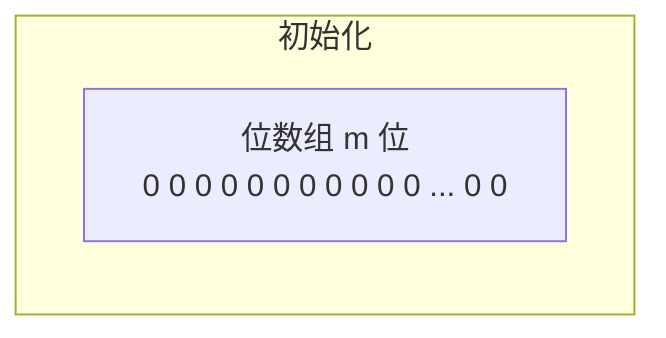
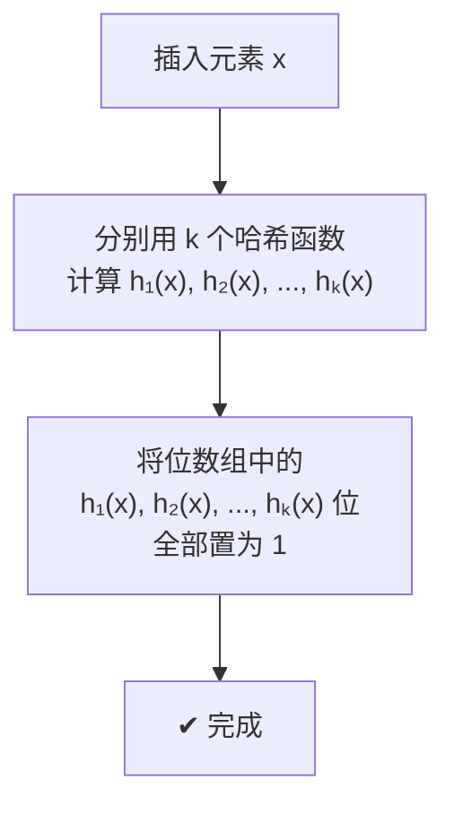
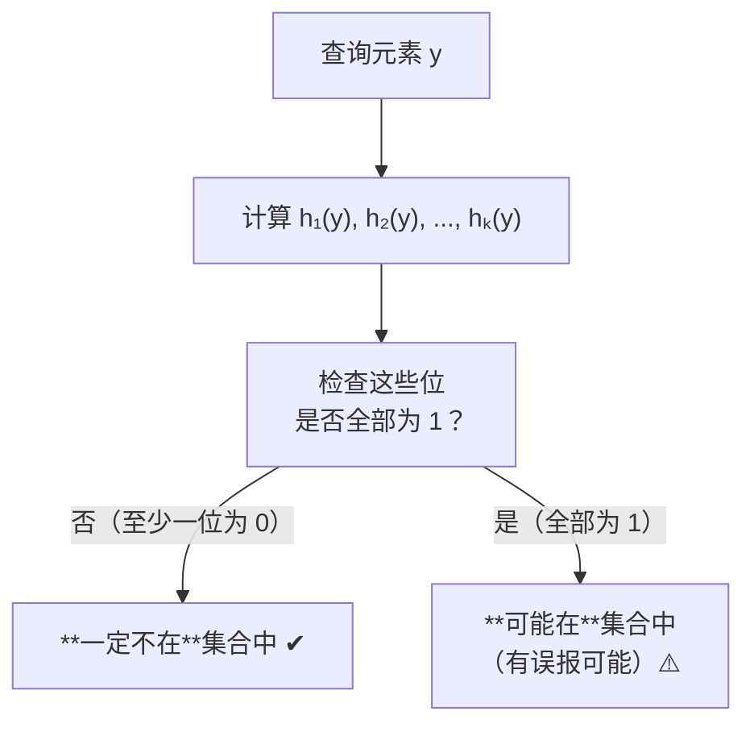
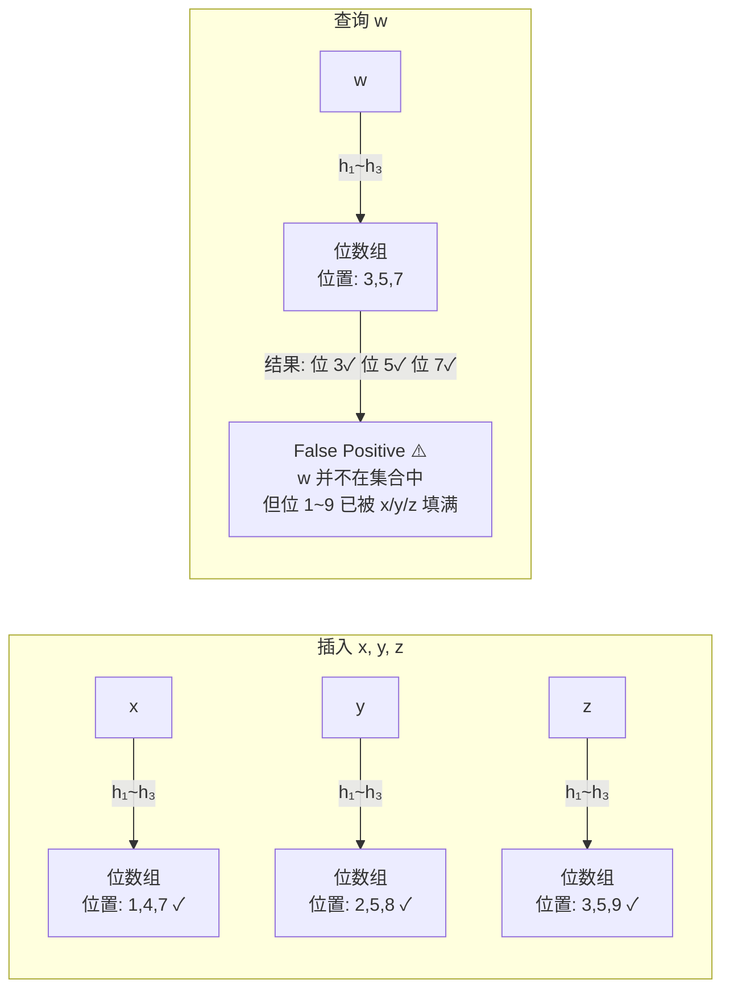
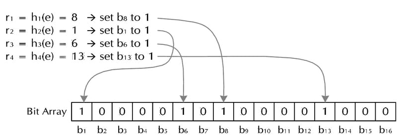
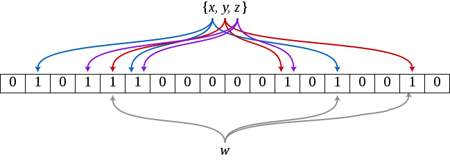
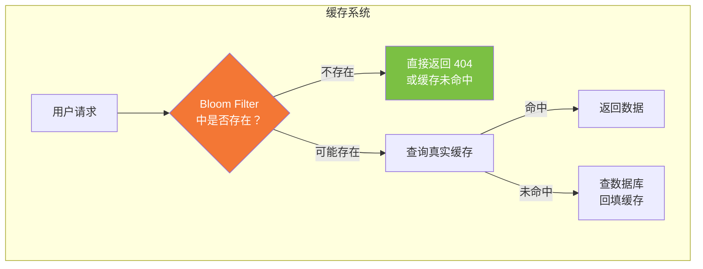
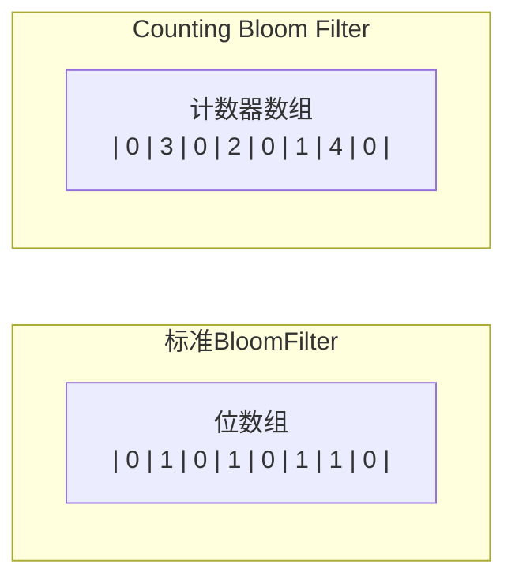

# 布隆过滤器

## 概述

布隆过滤器（Bloom Filter）由 Burton Howard Bloom 于 1970 年提出，是一种**空间效率极高的概率性数据结构**，用于判断一个元素是否属于一个集合。

**一句话总结**：布隆过滤器用少量空间回答"这个元素存在吗？"——回答"不存在"一定正确，回答"存在"可能误报（False Positive），但**绝不会漏报（False Negative）**。

### 核心特性

| 特性 | 说明 |
|------|------|
| ✅ **空间极省** | 每个元素仅需 ~log₂(1/ε) 个比特位（ε 为可接受的误报率）|
| ✅ **查询极快** | $O(k)$ — k 为哈希函数个数，与集合大小无关 |
| ✅ **插入极快** | $O(k)$ — 同上 |
| ❌ **有误报率** | 可能出现 False Positive（假阳性），但不会出现 False Negative（假阴性）|
| ❌ **不支持删除** | 标准版本不支持删除元素（Counting Bloom Filter 可部分解决）|

### 专业术语

| 英文术语 | 中文 | 含义 |
|---------|------|------|
| **False Positive** | 假阳性 / 误报 | 布隆过滤器说"元素在集合中"，但实际上不在。**Bloom Filter 有这个缺点** |
| **False Negative** | 假阴性 / 漏报 | 布隆过滤器说"元素不在集合中"，但实际上在。**Bloom Filter 绝对不会有这个问题** |

## 算法原理

### 数据结构

布隆过滤器的底层数据是一个 **m 位的位数组（Bit Array）**，初始状态全部为 0。

同时定义 **k 个独立的哈希函数**，每个函数将输入元素均匀映射到位数组的某个位置上（范围 0 ~ m-1）。



### 插入操作

插入元素 x 时，用 k 个哈希函数分别计算映射位置，将对应位全部置为 **1**：



### 查询操作

查询元素 y 时，同样用 k 个哈希函数计算位置：



**为什么没有 False Negative？** 所有位全 1 是元素被插入过的**必要条件**而非充分条件。如果某个位在插入时被置为 1，那它永远是 1——因此一个元素如果真的被插入过，它的 k 个位必然全是 1。反过来，如果一个元素从未被插入，但它的 k 个位恰好都被其他元素置为 1 了，就会产生**误报**。

### 可视化示例





*上图：三个元素 x, y, z 插入后的位数组状态。所有被 k 个哈希函数映射到的位置都被置为 1。*



*上图：查询 w 时，其 k 个哈希位置恰好全部为 1（但实际上 w 从未插入），产生误报。*

## 复杂度分析

| 指标 | 值 | 说明 |
|------|:---:|------|
| **插入时间复杂度** | $O(k)$ | k 为哈希函数个数，常数 |
| **查询时间复杂度** | $O(k)$ | 同上 |
| **空间复杂度** | $O(m)$ | m 为位数组长度，通常 $m = n \cdot \log_2 e \cdot \log_2(1/\varepsilon)$ |
| **误报率** | $\approx (1 - e^{-kn/m})^k$ | 取决于 m, n, k 三者关系 |

## 数学推导：误报率的最优设计

### 误报率公式

假设哈希函数输出均匀分布，对于某个特定位，在插入一个元素时**没有被某个哈希函数设为 1** 的概率为：

$$1 - \frac{1}{m}$$

经过 k 个哈希函数后仍为 0 的概率：

$$\left(1 - \frac{1}{m}\right)^k$$

插入 n 个元素后该位仍为 0 的概率：

$$p = \left(1 - \frac{1}{m}\right)^{kn} \approx e^{-kn/m}$$

该位为 1 的概率为 $1 - p$。

**误报率**：对一个不在集合中的元素，它的 k 个位全部为 1 的概率：

$$f = (1-p)^k = \left(1 - e^{-kn/m}\right)^k$$

### 最优哈希函数个数

固定 m 和 n，要使误报率 f 最小，令 $g = k \ln(1 - e^{-kn/m})$。代入 $p = e^{-kn/m}$：

$$g = -\frac{m}{n} \ln(p) \ln(1-p)$$

由对称性，当 $p = 1/2$ 时 g 最小，即：

$$e^{-kn/m} = \frac{1}{2} \quad\Rightarrow\quad k = \frac{m}{n} \ln 2 \approx 0.693 \cdot \frac{m}{n}$$

**最优哈希函数个数**：$k_{\text{opt}} = \frac{m}{n} \ln 2$

此时的最小误报率：

$$f_{\min} = \left(\frac{1}{2}\right)^k \approx \left(0.6185\right)^{\frac{m}{n}}$$

### 位数组大小

给定预期的误报率 ε 和元素数量 n，需要的最低位数组长度：

$$m \geq n \cdot \log_2 e \cdot \log_2(1/\varepsilon) \approx 1.44 n \cdot \log_2(1/\varepsilon)$$

| 预期误报率 ε | 每元素所需位数 | $k_{\text{opt}}$ |
|:----------:|:------------:|:----------------:|
| 1% (10⁻²)  | ~9.6 bits | ~7 |
| 0.1% (10⁻³) | ~14.3 bits | ~10 |
| 0.01% (10⁻⁴) | ~19 bits | ~13 |
| 0.0001% (10⁻⁶) | ~28.7 bits | ~20 |

> ☝️ 实践经验：Bloom Filter 的最佳状态是位数组中**恰好一半为 0、一半为 1**（$p = 1/2$），此时误报率最低。

## 应用场景

### 经典应用

| 场景 | 说明 |
|------|------|
| 🌐 **网页爬虫 URL 去重** | 避免重复爬取相同的 URL 地址 |
| 📧 **反垃圾邮件** | 判断发件 IP 或邮件域是否在黑名单中 |
| 🛡️ **缓存击穿防护** | 将已缓存 key 放入 Bloom Filter，黑客请求不存在的 key 时快速返回 |
| 🔍 **搜索引擎** | Bigtable 使用 Bloom Filter 查找不存在的行或列，减少磁盘 I/O |
| 💾 **KV 存储系统** | HBase、LevelDB、RocksDB 用 Bloom Filter 快速判断 SSTable 中是否有目标 key |
| 🌍 **Chrome 安全浏览** | Chrome 客户端维护 Bloom Filter 判断 URL 是否为恶意网站 |
| 🌩️ **P2P 网络** | 每条网络通路保存 Bloom Filter，查找资源时避免泛洪广播 |
| ⚡ **HTTP 缓存代理** | Squid 使用 Bloom Filter 存储 URL，快速判断资源是否已缓存 |

### 典型处理流程



## Java 实现

### 基于 BitSet 的 Bloom Filter

```java
package algorithm;
import java.util.BitSet;

public class BloomFilter {
    /* BitSet 初始分配 2^25 个 bit ≈ 4 MB */
    private static final int DEFAULT_SIZE = 1 << 25;
    /* 不同哈希函数的种子，一般应取质数 */
    private static final int[] seeds = new int[]{ 5, 7, 11, 13, 31, 37, 61 };
    private BitSet bits = new BitSet(DEFAULT_SIZE);
    /* 哈希函数对象 */
    private SimpleHash[] func = new SimpleHash[seeds.length];

    public BloomFilter() {
        for (int i = 0; i < seeds.length; i++) {
            func[i] = new SimpleHash(DEFAULT_SIZE, seeds[i]);
        }
    }

    // 将字符串标记到 bits 中
    public void add(String value) {
        for (SimpleHash f : func) {
            bits.set(f.hash(value), true);
        }
    }

    // 判断字符串是否已经被 bits 标记
    public boolean contains(String value) {
        if (value == null) return false;
        for (SimpleHash f : func) {
            if (!bits.get(f.hash(value))) return false;
        }
        return true;
    }

    /* 哈希函数类 */
    public static class SimpleHash {
        private int cap;
        private int seed;

        public SimpleHash(int cap, int seed) {
            this.cap = cap;
            this.seed = seed;
        }

        // hash函数，采用简单的加权和hash
        public int hash(String value) {
            int result = 0;
            for (int i = 0; i < value.length(); i++) {
                result = seed * result + value.charAt(i);
            }
            return (cap - 1) & result;
        }
    }
}
```

> 💡 **生产环境建议使用 Guava 的 BloomFilter**：`com.google.common.hash.BloomFilter.create(Funnels.stringFunnel(Charset.defaultCharset()), expectedInsertions, fpp)`，它已内置最优参数自动计算。

### 各框架中的实现

| 框架 | 类路径 | 特点 |
|------|--------|------|
| **Guava** | `com.google.common.hash.BloomFilter` | 成熟稳定，支持自定义误报率 |
| **Hadoop** | `org.apache.hadoop.util.bloom.BloomFilter` | 基于 BitSet，用于大数据场景 |
| **Elasticsearch** | `org.elasticsearch.common.util.BloomFilter` | 用于过滤不存在的数据 |
| **Redis** | `BF.ADD` / `BF.EXISTS` （通过 RedisBloom 模块）| 服务端分布式 Bloom Filter |

## 拓展：Counting Bloom Filter

### 为什么需要 Counting Bloom Filter？

标准 Bloom Filter **不支持删除操作**。这是因为多个元素共享同一个位，无法确定某个位的 1 是由哪个元素设置的。如果要删除一个元素，将其 k 个位全部置 0，可能会错误地影响其他元素。

### 实现原理

Counting Bloom Filter 将标准 Bloom Filter 中的**1 bit 扩展为一个小的计数器（Counter）**，通常为 **4 位**（可计数 0~15）：



| 操作 | 标准 Bloom Filter | Counting Bloom Filter |
|------|:----------------:|:--------------------:|
| **插入** | bit = 1 | counter++ |
| **查询** | bit == 1 ? | counter > 0 ? |
| **删除** | ❌ 不支持 | counter--（减到 0 表示不存在）|

### 计数器溢出概率

假设 n 个元素，k 个哈希函数，m 个计数器。第 i 个计数器被增加 j 次的概率：

$$\mathbb{P}(c(i)=j) = \binom{nk}{j}\left(\frac{1}{m}\right)^j\left(1-\frac{1}{m}\right)^{nk-j}$$

当每个计数器分配 4 位（最大值为 15）时，**任一计数器溢出的概率**：

$$\mathbb{P}(\max_i c(i) \geq 16) \leq 1.37 \times 10^{-15} \times m$$

对于 m = 10⁶（约 125 KB），溢出概率约 $1.37 \times 10^{-9}$，完全可以忽略。

> **结论**：4 位计数器对于绝大多数应用已经足够。

## 拓展：变体与演进

| 变体 | 核心改进 | 适用场景 |
|------|---------|---------|
| **Scalable Bloom Filter** | 随着元素增加自动扩展位数组，保持误报率不变 | 数据量未知的场景 |
| **Stable Bloom Filter** | 固定存储空间，通过随机替换旧元素适应流式数据 | 无限数据流的去重 |
| **Compressed Bloom Filter** | 对位数组进行压缩传输 | 分布式系统间交换过滤器 |
| **Cuckoo Filter** | 采用挤占哈希 + 指纹存储，支持删除，负载率 95% | 需要删除操作的高效近似成员查询 |
| **Bloomier Filter** | 将 Bloom Filter 扩展为关联数组：每个元素关联一个值 | Map 结构的压缩存储 |

> 布谷鸟过滤器详见 [布谷鸟过滤器](./布谷鸟过滤器.md)。

## 相关题目

### 给定 A、B 两个文件，各存放 50 亿条 URL，每条 64 字节，内存 4G，找出共同 URL

4G = 2³² × 8 ≈ 340 亿 bit。50 亿条 URL，按误报率 0.01 计算，需要约 650 亿 bit。

当前可用 340 亿 bit——虽略有不足，但可在接受范围内略微提升误报率。

**做法**：

1. 将 A 的 URL 映射到 Bloom Filter
2. 逐条读取 B 的 URL，检查是否在 Bloom Filter 中
3. 命中则判定为共同 URL（注意有一定误报率）

### 在 2.5 亿个整数中找出不重复的整数（内存不足）

**方案一：2-Bitmap**

每个数分配 2 bit：`00` = 不存在，`01` = 出现一次，`10` = 多次，`11` = 无意义。

内存需求：2³² × 2 bit = 1 GB ✅

扫描整数，将对应位从 `00` → `01` → `10` 递进，最后输出所有 `01` 即为不重复整数。

**方案二：分治**

1. 将大文件 Hash 分片到多个小文件
2. 每个小文件独立统计去重后排序
3. 多路归并得到全局不重复集合

### 40 亿个不重复的 unsigned int，判断一个数是否在其中

unsigned int 范围 0~2³²-1，共约 42.9 亿个数。

使用 **Bitmap** 精确判断：申请 2³² bit = 512 MB → 每个 bit 表示一个数是否存在。

读入 40 亿个数，设置对应 bit 为 1；查询时直接检查目标 bit 即可。
