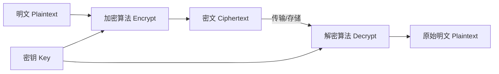
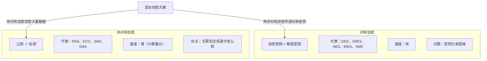
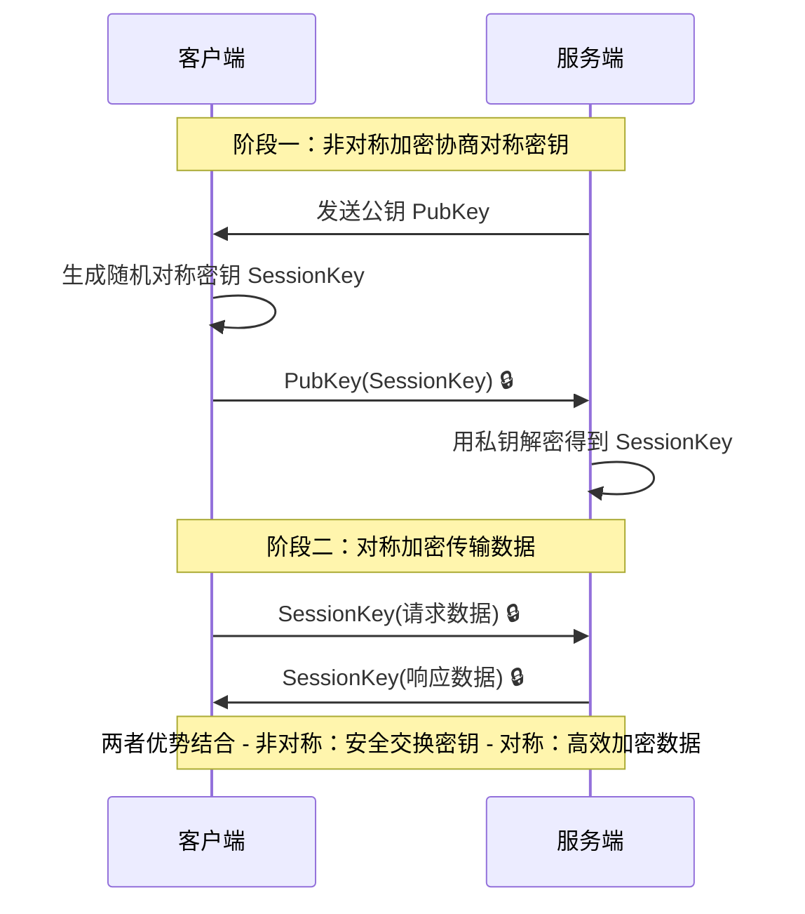
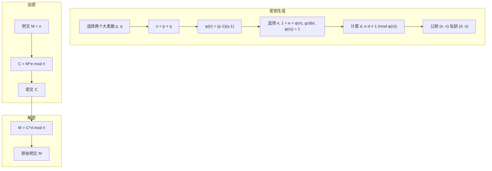
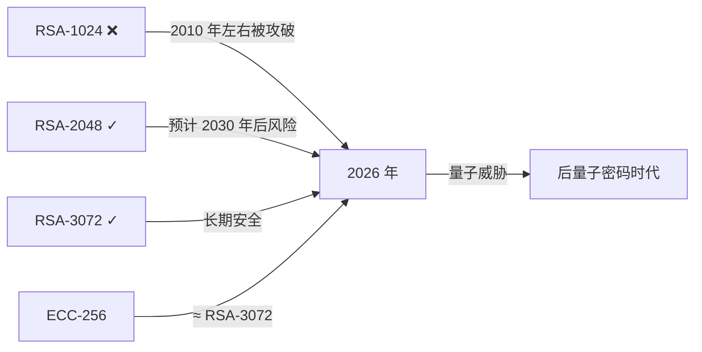

# 加密算法

## 加密算法简介

**加密三要素**：明文 + 加密算法 + 密钥 → **密文**。

- **加密算法**：将明文与密钥相结合的数学变换步骤。
- **密钥**：用于编码和解码的秘密参数。
- **核心目标**：通过密码学机制保障信息的**机密性、完整性、真实性和不可否认性**。



## 加密算法分类

根据密钥的使用方式，加密体制分为两大类：



### 混合加密工作流（实际应用中最常见）



## 对称加密

**定义**：加密密钥和解密密钥相同的加密算法。

**优点**：算法公开、计算量小、加密速度快、加密效率高。

**缺点**：密钥管理与分发困难——通信双方必须事先共享密钥，$n$ 方两两通信需要 $\frac{n(n-1)}{2}$ 个密钥。

### DES（Data Encryption Standard）

DES 是早期（1977 年 NIST 标准）的对称分组加密算法，现已淘汰。

#### DES 核心原理

```mermaid
flowchart TD
    subgraph DES 单轮结构（Feistel 网络）
        L_i["L_i (32 bit)"] --> L_out["L_{i+1} = R_i"]
        R_i["R_i (32 bit)"] --> Expand["扩展置换 E"]
        Expand --> XOR1["⊕ 子密钥 K_i (48 bit)"]
        XOR1 --> SBox["S 盒替换 (6→4 bit) × 8"]
        SBox --> PBox["P 置换"]
        PBox --> XOR2["⊕ L_i"]
        XOR2 --> R_out["R_{i+1}"]
    end

    subgraph 整体流程
        Plain["64 bit 明文"] --> IP["初始置换 IP"]
        IP --> Loop["16 轮 Feistel 网络"]
        Loop --> Final["逆初始置换 IP⁻¹"]
        Final --> Cipher["64 bit 密文"]
    end
```

**Feistel 网络核心公式**：

- $L_{i+1} = R_i$
- $R_{i+1} = L_i \oplus F(R_i, K_i)$

**重要性质**：加密和解密使用相同的算法结构，仅子密钥使用顺序相反 → Feistel 结构的优美对称性。

#### 安全性分析

| 缺陷 | 说明 |
|------|------|
| **密钥过短** | 56 位 → $2^{56}$ 穷举空间，现代机器 24 小时内可暴力破解 |
| **弱密钥** | 部分密钥导致子密钥全等或全 0，降低安全 |
| **互补性** | $DES(M) \oplus DES(\bar{M}) = \bar{C}$ 的性质可能被利用 |

> **结论**：DES 已**不安全**，但它的 Feistel 结构思想启发了后续大量算法（3DES、Blowfish、Twofish 等）。

#### 代码实现（JDK 内置）

```java
import java.io.UnsupportedEncodingException;
import java.security.SecureRandom;
import java.util.Arrays;
import javax.crypto.spec.DESKeySpec;
import javax.crypto.SecretKeyFactory;
import javax.crypto.SecretKey;
import javax.crypto.Cipher;

/* DES加密介绍 DES是一种对称加密算法，所谓对称加密算法即: 加密和解密使用相同密钥的算法。DES加密算法出自IBM的研究，
 * 后来被美国政府正式采用，之后开始广泛流传，但是近些年使用越来越少，因为DES使用56位密钥，以现代计算能力，
 * 24小时内即可被破解。虽然如此，在某些简单应用中，我们还是可以使用DES加密算法，本文简单讲解DES的JAVA实现 。
 * 注意: DES加密和解密过程中，密钥长度都必须是8的倍数
 */
public class DesDemo {

    // 测试
    public static void main(String[] args) {
        // 待加密内容
        String str = "cryptology";
        // 密码，长度要是8的倍数
        String password = "95880288";

        byte[] result;
        try {
            result = DesDemo.encrypt(str.getBytes(), password);
            System.out.println("加密后: " + Arrays.toString(result));
            byte[] decryResult = DesDemo.decrypt(result, password);
            System.out.println("解密后: " + new String(decryResult));
        } catch (UnsupportedEncodingException e2) {
            e2.printStackTrace();
        } catch (Exception e1) {
            e1.printStackTrace();
        }
    }

    // 直接将如上内容解密
    /* 加密
     * @param datasource byte[]
     * @param password String
     * @return byte[]
     */
    public static byte[] encrypt(byte[] datasource, String password) {
        try {
            SecureRandom random = new SecureRandom();
            DESKeySpec desKey = new DESKeySpec(password.getBytes());
            // 创建一个密匙工厂，然后用它把DESKeySpec转换成
            SecretKeyFactory keyFactory = SecretKeyFactory.getInstance("DES");
            SecretKey securekey = keyFactory.generateSecret(desKey);
            // Cipher对象实际完成加密操作
            Cipher cipher = Cipher.getInstance("DES");
            // 用密匙初始化Cipher对象,ENCRYPT_MODE用于将 Cipher 初始化为加密模式的常量
            cipher.init(Cipher.ENCRYPT_MODE, securekey, random);
            // 现在，获取数据并加密
            // 正式执行加密操作
            return cipher.doFinal(datasource); // 按单部分操作加密或解密数据，或者结束一个多部分操作
        } catch (Throwable e) {
            e.printStackTrace();
        }
        return null;
    }

    /* 解密
     * @param src  byte[]
     * @param password String
     * @return byte[]
     * @throws Exception
     */
    public static byte[] decrypt(byte[] src, String password) throws Exception {
        // DES算法要求有一个可信任的随机数源
        SecureRandom random = new SecureRandom();
        // 创建一个DESKeySpec对象
        DESKeySpec desKey = new DESKeySpec(password.getBytes());
        // 创建一个密匙工厂
        SecretKeyFactory keyFactory = SecretKeyFactory.getInstance("DES");// 返回实现指定转换的Cipher对象
        // 将DESKeySpec对象转换成SecretKey对象
        SecretKey securekey = keyFactory.generateSecret(desKey);
        // Cipher对象实际完成解密操作
        Cipher cipher = Cipher.getInstance("DES");
        // 用密匙初始化Cipher对象
        cipher.init(Cipher.DECRYPT_MODE, securekey, random);
        // 真正开始解密操作
        return cipher.doFinal(src);
    }
}
```

### IDEA（International Data Encryption Algorithm）

IDEA 是 DES 的改进方案，**密钥长度 128 位**。

| 特性 | IDEA |
|------|------|
| 密钥长度 | 128 bit |
| 分组长度 | 64 bit |
| 结构 | 8.5 轮 Lai-Massey 方案 |
| 数学运算 | 异或 ⊕ / 模加 + / 模乘 ⊗（三种不同群上运算混合，增加密码强度） |

**设计思想**：将不同代数群（GF(2) 异或、模 $2^{16}$ 加法、模 $2^{16}+1$ 乘法）的运算混合，抵抗线性与差分密码分析。

#### 代码实现（需 BouncyCastle 库）

```java
import java.security.Key;
import java.security.Security;

import javax.crypto.Cipher;
import javax.crypto.KeyGenerator;
import javax.crypto.SecretKey;
import javax.crypto.spec.SecretKeySpec;

import org.apache.commons.codec.binary.Base64;
import org.bouncycastle.jce.provider.BouncyCastleProvider;

public class IDEADemo {
    public static void main(String args[]) {
        bcIDEA();
    }

    public static void bcIDEA() {
        String src = "www.xttblog.com security idea";
        try {
            Security.addProvider(new BouncyCastleProvider());

            //生成key
            KeyGenerator keyGenerator = KeyGenerator.getInstance("IDEA");
            keyGenerator.init(128);
            SecretKey secretKey = keyGenerator.generateKey();
            byte[] keyBytes = secretKey.getEncoded();

            //转换密钥
            Key key = new SecretKeySpec(keyBytes, "IDEA");

            //加密
            Cipher cipher = Cipher.getInstance("IDEA/ECB/ISO10126Padding");
            cipher.init(Cipher.ENCRYPT_MODE, key);
            byte[] result = cipher.doFinal(src.getBytes());
            System.out.println("bc idea encrypt : " + Base64.encodeBase64String(result));

            //解密
            cipher.init(Cipher.DECRYPT_MODE, key);
            result = cipher.doFinal(result);
            System.out.println("bc idea decrypt : " + new String(result));
        } catch (Exception e) {
            e.printStackTrace();
        }
    }
}
```

### 对称加密对比表

| 算法 | 密钥长度 | 分组长度 | 轮数 | 结构 | 状态 |
|------|---------|---------|------|------|------|
| DES | 56 bit | 64 bit | 16 | Feistel | ❌ 已淘汰 |
| 3DES | 112/168 bit | 64 bit | 48 | Feistel | ⚠️ 渐淘汰 |
| AES | 128/192/256 bit | 128 bit | 10/12/14 | SPN | ✅ 当前标准 |
| IDEA | 128 bit | 64 bit | 8.5 | Lai-Massey | 已过时 |
| SM4 | 128 bit | 128 bit | 32 | 非线性迭代 | ✅ 国标 |

## 非对称加密

**定义**：加密和解密使用**不同密钥**——公钥（公开）用于加密，私钥（保密）用于解密（反之亦可签名）。

**核心难题**：
- RSA：大整数分解（Integer Factorization）
- ECC/ECDSA：椭圆曲线离散对数（ECDLP）
- DSA：有限域离散对数（DLP）

### RSA

RSA 是 1978 年由 Rivest、Shamir、Adleman 提出的公钥密码体制，是目前应用最广泛的公钥加密算法。

#### 数学原理



**核心公式**：$M \equiv C^d \equiv (M^e)^d \equiv M^{ed} \equiv M^{(k\varphi(n)+1)} \pmod{n}$（欧拉定理保证）。

#### 安全性

RSA 安全性依赖于大整数分解的困难性：

| 密钥长度 | 安全状态 | 等价对称强度 |
|----------|----------|-------------|
| 1024 bit | ❌ 已不安全 | ≈ DES 56 bit |
| 2048 bit | ✅ 目前安全 | ≈ AES 128 bit |
| 3072 bit | ✅ 长期安全 | ≈ AES 128 bit |
| 4096 bit | ✅ 超长期 | ≈ AES 192 bit |



#### 代码实现（完整 Java）

```java
package com.snailclimb.ks.securityAlgorithm;

import org.apache.commons.codec.binary.Base64;

import java.security.*;
import java.security.spec.PKCS8EncodedKeySpec;
import java.security.spec.X509EncodedKeySpec;
import java.util.HashMap;
import java.util.Map;

import javax.crypto.Cipher;

/*
Created by humf. 需要依赖 commons-codec 包
 */
public class RSADemo {

    public static final String KEY_ALGORITHM = "RSA";
    public static final String SIGNATURE_ALGORITHM = "MD5withRSA";
    private static final String PUBLIC_KEY = "RSAPublicKey";
    private static final String PRIVATE_KEY = "RSAPrivateKey";

    public static void main(String[] args) throws Exception {
        Map<String, Key> keyMap = initKey();
        String publicKey = getPublicKey(keyMap);
        String privateKey = getPrivateKey(keyMap);

        System.out.println("公钥: " + publicKey);
        System.out.println("私钥: " + privateKey);

        // 私钥加密 + 公钥解密（签名场景）
        byte[] encryptByPrivateKey = encryptByPrivateKey("123456".getBytes(), privateKey);
        // 明文直接加密
        byte[] encryptByPublicKey = encryptByPublicKey("123456", publicKey);

        // 签名与验证
        String sign = sign(encryptByPrivateKey, privateKey);
        System.out.println("签名: " + sign);
        boolean verify = verify(encryptByPrivateKey, publicKey, sign);
        System.out.println("验签结果: " + verify);

        // 解密
        byte[] decryptByPublicKey = decryptByPublicKey(encryptByPrivateKey, publicKey);
        byte[] decryptByPrivateKey = decryptByPrivateKey(encryptByPublicKey, privateKey);
        System.out.println("公钥解密: " + new String(decryptByPublicKey));
        System.out.println("私钥解密: " + new String(decryptByPrivateKey));
    }

    public static byte[] decryptBASE64(String key) {
        return Base64.decodeBase64(key);
    }

    public static String encryptBASE64(byte[] bytes) {
        return Base64.encodeBase64String(bytes);
    }

    /* 用私钥对信息生成数字签名 */
    public static String sign(byte[] data, String privateKey) throws Exception {
        byte[] keyBytes = decryptBASE64(privateKey);
        PKCS8EncodedKeySpec pkcs8KeySpec = new PKCS8EncodedKeySpec(keyBytes);
        KeyFactory keyFactory = KeyFactory.getInstance(KEY_ALGORITHM);
        PrivateKey priKey = keyFactory.generatePrivate(pkcs8KeySpec);
        Signature signature = Signature.getInstance(SIGNATURE_ALGORITHM);
        signature.initSign(priKey);
        signature.update(data);
        return encryptBASE64(signature.sign());
    }

    /* 校验数字签名 */
    public static boolean verify(byte[] data, String publicKey, String sign) throws Exception {
        byte[] keyBytes = decryptBASE64(publicKey);
        X509EncodedKeySpec keySpec = new X509EncodedKeySpec(keyBytes);
        KeyFactory keyFactory = KeyFactory.getInstance(KEY_ALGORITHM);
        PublicKey pubKey = keyFactory.generatePublic(keySpec);
        Signature signature = Signature.getInstance(SIGNATURE_ALGORITHM);
        signature.initVerify(pubKey);
        signature.update(data);
        return signature.verify(decryptBASE64(sign));
    }

    public static byte[] decryptByPrivateKey(byte[] data, String key) throws Exception {
        byte[] keyBytes = decryptBASE64(key);
        PKCS8EncodedKeySpec pkcs8KeySpec = new PKCS8EncodedKeySpec(keyBytes);
        KeyFactory keyFactory = KeyFactory.getInstance(KEY_ALGORITHM);
        Key privateKey = keyFactory.generatePrivate(pkcs8KeySpec);
        Cipher cipher = Cipher.getInstance(keyFactory.getAlgorithm());
        cipher.init(Cipher.DECRYPT_MODE, privateKey);
        return cipher.doFinal(data);
    }

    public static byte[] decryptByPrivateKey(String data, String key) throws Exception {
        return decryptByPrivateKey(decryptBASE64(data), key);
    }

    public static byte[] decryptByPublicKey(byte[] data, String key) throws Exception {
        byte[] keyBytes = decryptBASE64(key);
        X509EncodedKeySpec x509KeySpec = new X509EncodedKeySpec(keyBytes);
        KeyFactory keyFactory = KeyFactory.getInstance(KEY_ALGORITHM);
        Key publicKey = keyFactory.generatePublic(x509KeySpec);
        Cipher cipher = Cipher.getInstance(keyFactory.getAlgorithm());
        cipher.init(Cipher.DECRYPT_MODE, publicKey);
        return cipher.doFinal(data);
    }

    public static byte[] encryptByPublicKey(String data, String key) throws Exception {
        byte[] keyBytes = decryptBASE64(key);
        X509EncodedKeySpec x509KeySpec = new X509EncodedKeySpec(keyBytes);
        KeyFactory keyFactory = KeyFactory.getInstance(KEY_ALGORITHM);
        Key publicKey = keyFactory.generatePublic(x509KeySpec);
        Cipher cipher = Cipher.getInstance(keyFactory.getAlgorithm());
        cipher.init(Cipher.ENCRYPT_MODE, publicKey);
        return cipher.doFinal(data.getBytes());
    }

    public static byte[] encryptByPrivateKey(byte[] data, String key) throws Exception {
        byte[] keyBytes = decryptBASE64(key);
        PKCS8EncodedKeySpec pkcs8KeySpec = new PKCS8EncodedKeySpec(keyBytes);
        KeyFactory keyFactory = KeyFactory.getInstance(KEY_ALGORITHM);
        Key privateKey = keyFactory.generatePrivate(pkcs8KeySpec);
        Cipher cipher = Cipher.getInstance(keyFactory.getAlgorithm());
        cipher.init(Cipher.ENCRYPT_MODE, privateKey);
        return cipher.doFinal(data);
    }

    public static String getPrivateKey(Map<String, Key> keyMap) throws Exception {
        Key key = keyMap.get(PRIVATE_KEY);
        return encryptBASE64(key.getEncoded());
    }

    public static String getPublicKey(Map<String, Key> keyMap) throws Exception {
        Key key = keyMap.get(PUBLIC_KEY);
        return encryptBASE64(key.getEncoded());
    }

    public static Map<String, Key> initKey() throws Exception {
        KeyPairGenerator keyPairGen = KeyPairGenerator.getInstance(KEY_ALGORITHM);
        keyPairGen.initialize(1024);
        KeyPair keyPair = keyPairGen.generateKeyPair();
        Map<String, Key> keyMap = new HashMap(2);
        keyMap.put(PUBLIC_KEY, keyPair.getPublic());
        keyMap.put(PRIVATE_KEY, keyPair.getPrivate());
        return keyMap;
    }
}
```

## 非对称 vs 对称对比总结

| 对比维度 | 对称加密 | 非对称加密 |
|---------|---------|-----------|
| 密钥数量 | 1 个共享密钥 | 2 个（公钥 + 私钥） |
| 密钥分发 | 困难（需安全信道） | 公钥可公开 |
| 加密速度 | 快（硬件加速常见） | 慢（慢 100~1000 倍） |
| 典型分组/块 | 64~256 bit | 1024~4096 bit |
| 主要用途 | 数据加密 | 密钥分发、数字签名 |
| 代表算法 | AES, SM4, ChaCha20 | RSA, ECDSA, SM2, EdDSA |
| 量子威胁 | Grover 算法减半安全强度 | Shor 算法完全破解 |
