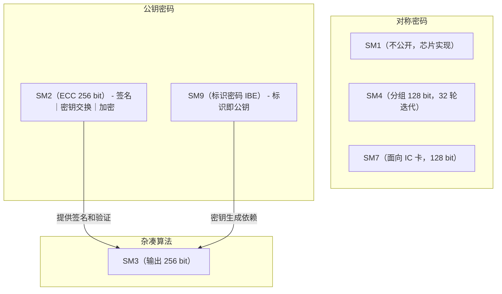
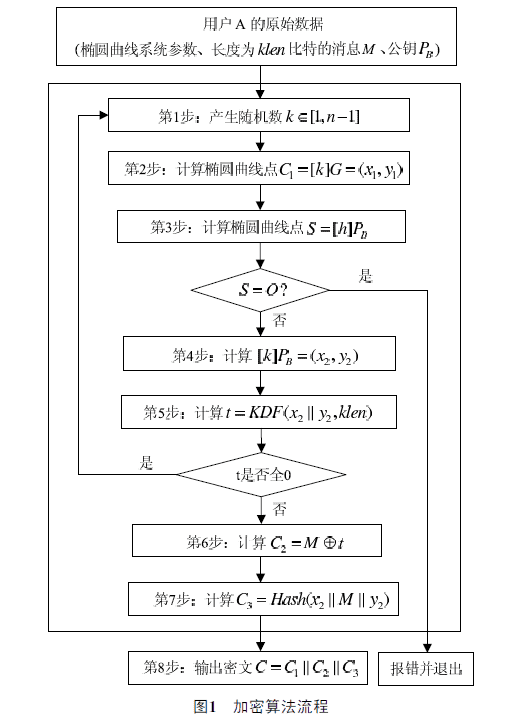
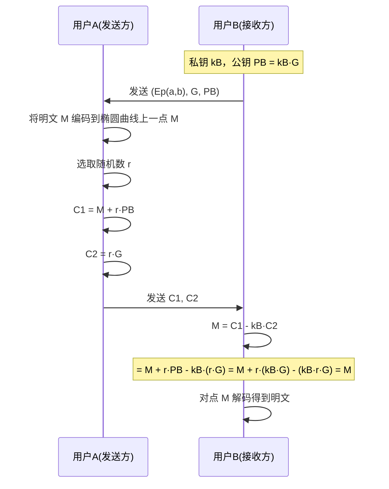
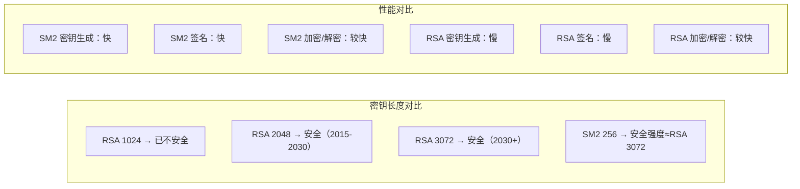
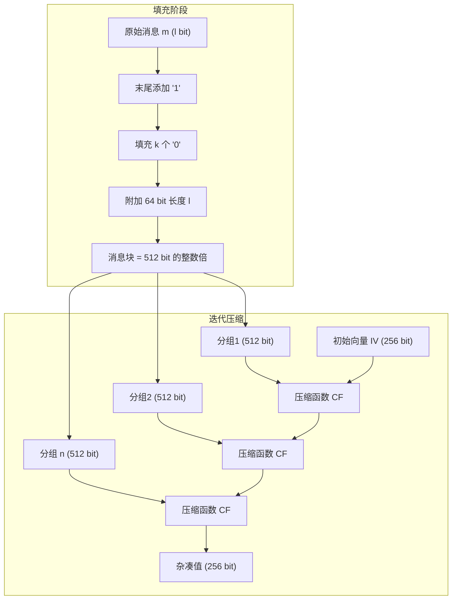
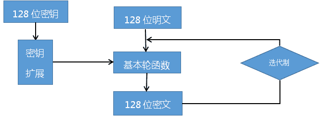
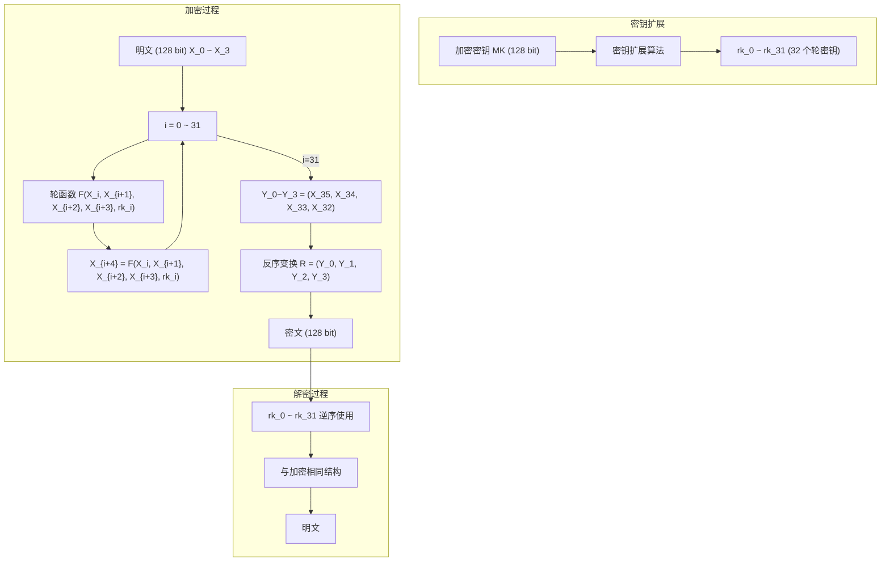
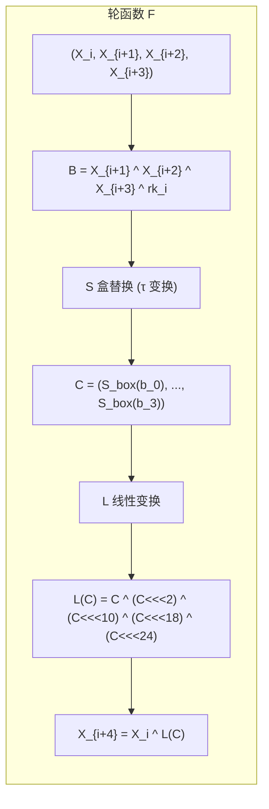

# 国密算法

国密即国家密码局认定的国产密码算法。主要有 SM1、SM2、SM3、SM4、SM7、SM9。

## 国密算法分类

> 国家标准官方网站如下：https://openstd.samr.gov.cn/bzgk/gb/

- **SM1** — **对称加密**。加密强度与 AES 相当。该算法**不公开**，调用时需通过**加密芯片的接口**进行调用。
- **SM2** — **非对称加密**，基于椭圆曲线密码体制（ECC）。已公开。256 位 SM2 的安全强度高于 2048 位 RSA，签名与密钥生成速度均快于 RSA。
- **SM3** — **消息摘要**（杂凑算法）。已公开。输出 256 位杂凑值，安全强度高于 MD5（128 位）和 SHA-1（160 位）。
- **SM4** — **分组对称加密**。密钥长度和分组长度均为 128 位，32 轮非线性迭代结构。
- **SM7** — **分组密码**。分组 128 位，密钥 128 位。适用于非接触式 IC 卡（门禁、票务、支付一卡通）。
- **SM9** — **标识密码**（IBE）。用户标识（手机号、邮箱）作为公钥，无需数字证书。

### 国密算法关系图



## SM2 算法

> SM2 椭圆曲线公钥密码算法是我国自主设计的公钥密码算法，包括 **SM2-1 数字签名**、**SM2-2 密钥交换**、**SM2-3 公钥加密**。基于椭圆曲线上点群离散对数难题（ECDLP），256 位密钥强度已超过 2048 位 RSA。

```
关于**sm2算法的流程如图**
```



### 数学基础：椭圆曲线密码体制（ECC）

椭圆曲线方程（Weierstrass 标准型）：

$$y^2 = x^3 + ax + b \quad (4a^3 + 27b^2 \neq 0)$$

核心安全假设：**ECDLP** —— 已知基点 $G$ 和公钥 $K = kG$，求私钥 $k$ 在计算上不可行。

**曲线参数** $T = (p, a, b, G, n, h)$：

| 参数 | 含义 | 约束条件 |
|------|------|----------|
| $p$ | 有限域模素数 | 约 256 位 |
| $a, b$ | 曲线方程系数 | $4a^3 + 27b^2 \neq 0 \pmod{p}$ |
| $G$ | 基点 | 阶为 $n$ |
| $n$ | $G$ 的阶 | 为素数 |
| $h$ | 余因子 $h = \frac{|E|}{n} \leq 4$ | $p \neq n \times h$ |

### SM2 加密/解密流程



**验证推导**：

$$C_1 - k_B \cdot C_2 = (M + r \cdot P_B) - k_B \cdot (r \cdot G) = M + r \cdot k_B \cdot G - r \cdot k_B \cdot G = M$$

**特点**：每次加密使用随机数 $r$，即使同一明文每次加密结果也不同 —— 这**不能防御重放攻击**。若要防重放，需服务端提供加密因子，通过 SM2+SM4 混合加密实现。

### SM2 vs RSA 安全性对比

| RSA密钥强度（长度） | SM2密钥强度（长度） | 破解时间（年） |
| ------------------- | ------------------- | -------------- |
| 521比特             | 106比特             | 104（已破解）  |
| 768比特             | 132比特             | 108（已破解）  |
| 1024比特            | 160比特             | 1011           |
| 2048比特            | 210比特             | 1020           |

速度对比：

| 算法    | 签名速度  | 验签速度   |
| ------- | --------- | ---------- |
| 1024RSA | 2792次/秒 | 51224次/秒 |
| 2048RSA | 455次/秒  | 15122次/秒 |
| 2565M2  | 4095次/秒 | 871次/秒   |



### SM2 标准结构

SM2 国家标准包含四个部分：

1. **总则** — 有限域 $F_p$ 和 $F_{2^m}$ 上的椭圆曲线表示、点运算、多倍点计算；数据转换规则（整数↔字节串、域元素↔比特串、点↔字节串）；曲线参数生成与验证；密钥对生成（私钥 $s$，公钥 $sP$）。
2. **数字签名算法** — 签名生成与验证。
3. **密钥交换协议** — 双方协商会话密钥。
4. **公钥加密算法** — 加密与解密。

> 总则内容同样适用于 **SM9 算法**。

## SM3 算法

> SM3 杂凑算法是我国自主设计的密码杂凑算法，输出 256 比特，适用于数字签名、消息认证码（MAC）、随机数生成等场景。

### 算法原理：Merkle-Damgård 结构

SM3 采用 **Merkle-Damgård 迭代结构**，将任意长度消息经填充后，分成 512 位分组，每分组通过压缩函数迭代处理，最终输出 256 位杂凑值。



### 填充规则

假设消息 $m$ 长度为 $l$ 比特：

1. 末尾添加比特 `1`
2. 添加 $k$ 个 `0`，$k$ 是满足 $l + 1 + k \equiv 448 \pmod{512}$ 的最小非负整数
3. 附加 64 比特二进制表示的长度 $l$

**示例**：消息 `01100001 01100010 01100011`（$l=24$）
- 添加 `1`
- 添加 423 个 `0`
- 添加 64 比特 `00...011000`（24 的二进制）

### 压缩函数结构

```mermaid
flowchart TD
    subgraph 第 j 轮压缩 (64 轮)
        V_j["V^(j) (256 bit)"] --> W["消息扩展"]
        W --> W1["W_0 ~ W_15 (消息字)"]
        W --> W2["W'_0 ~ W'_15"]
        W2 --> R["64 轮迭代"]
        W1 --> R
        R --> V_next["V^(j+1) (256 bit)"]
    end

    subgraph 一轮迭代
        R1["SS1 = (A<<<12 + E + T_j)<<<7"]
        R2["SS2 = SS1 ^ (A<<<12)"]
        R3["TT1 = FF_j(A,B,C) + D + SS2 + W'_j"]
        R4["TT2 = GG_j(E,F,G) + H + SS1 + W_j"]
        R5["D = C; C = B<<<9; B = A; A = TT1"]
        R6["H = G; G = F<<<19; F = E; E = P_0(TT2)"]
        R1 --> R2
        R2 --> R3
        R2 --> R4
        R3 --> R5
        R4 --> R6
    end
```

### 实现代码（Python 风格参考）

```python
import struct

# 初始常量 IV
IV = [0x7380166F, 0x4914B2B9, 0x172442D7, 0xDA8A0600,
      0xA96F30BC, 0x163138AA, 0xE38DEE4D, 0xB0FB0E4E]

def sm3_ffj(x, y, z, j):
    """布尔函数 FF_j"""
    if j < 16:
        return x ^ y ^ z
    return (x & y) | (x & z) | (y & z)

def sm3_ggj(x, y, z, j):
    """布尔函数 GG_j"""
    if j < 16:
        return x ^ y ^ z
    return (x & y) | ((~x) & z)

def sm3_p0(x):
    """压缩函数中的置换 P_0"""
    return x ^ (x << 9 | x >> (32-9)) ^ (x << 17 | x >> (32-17))

def sm3_p1(x):
    """消息扩展中的置换 P_1"""
    return x ^ (x << 15 | x >> (32-15)) ^ (x << 23 | x >> (32-23))

# 轮常数 T_j
T_j = [0x79CC4519 if j < 16 else 0x7A879D8A for j in range(64)]

# 完整实现需包含消息填充、扩展、64 轮迭代压缩
```

**安全强度**：256 比特输出→抗碰撞安全强度 128 比特（生日攻击），远高于 MD5（64 比特）和 SHA-1（80 比特）。

## SM4 算法

> SM4 是用于无线局域网的分组对称密码算法，分组 128 比特，密钥 128 比特，采用 **32 轮非线性迭代结构**。



### 加密整体流程



### 轮函数结构



### 基本运算部件

| 部件 | 说明 | 公式 |
|------|------|------|
| **模 2 加** | 32 位异或 | $\oplus$ |
| **循环移位** | 32 位循环左移 | $<<<k$ |
| **S 盒** | 8×8 非线性置换（固定查找表） | $S\_box(a)$ |
| **τ 变换** | 4 个 S 盒并行 | $(S\_box(a_0), ..., S\_box(a_3))$ |
| **L 变换（加密）** | 32 位线性置换 | $C \oplus (C <<< 2) \oplus (C <<< 10) \oplus (C <<< 18) \oplus (C <<< 24)$ |
| **合成变换 T** | τ 后接 L | $T(·) = L(τ(·))$ |

### 密钥扩展

密钥扩展与加密结构类似，使用不同的系统参数 $FK$ 和固定参数 $CK$：

1. $K_0 \| K_1 \| K_2 \| K_3 = MK \oplus (FK_0, FK_1, FK_2, FK_3)$
2. 对 $i = 0, ..., 31$：
   - $rk_i = K_{i+4} = K_i \oplus T'(K_{i+1} \oplus K_{i+2} \oplus K_{i+3} \oplus CK_i)$
   - $T'$ 中 L 置换替换为：$L'(C) = C \oplus (C <<< 13) \oplus (C <<< 23)$

### 复杂度分析

| 维度 | SM4 |
|------|-----|
| 密钥长度 | 128 bit |
| 分组长度 | 128 bit |
| 轮数 | 32 轮 |
| 安全性 | 可抵抗差分攻击、线性攻击、代数攻击 |
| 速度 | 软实现约 200-400 Mbps（取决于优化程度） |

### 解密

SM4 是对合运算：解密与加密结构相同，**仅轮密钥使用顺序相反**（逆序使用 $rk_{31}, ..., rk_0$）。

## SM7 算法

SM7 是一种分组密码算法，分组和密钥长度均为 128 比特。

**应用场景**：
- **身份识别**：门禁卡、工作证、参赛证
- **票务**：大型赛事/展会门票
- **支付与通卡**：积分消费卡、校园一卡通、企业一卡通

SM7 针对非接触式 IC 卡的资源受限环境（低功耗、低计算能力）进行了优化设计。

## SM9 算法

### 背景：标识密码（IBE）

1984 年，Adi Shamir（RSA 发明人之一）提出**标识密码**概念——将用户标识（邮件地址、手机号等）直接作为公钥，省去证书交换过程。

2008 年，标识密码算法正式获得国密局型号：**SM9**（商密九号算法）。

### SM9 的优势

```mermaid
graph TD
    subgraph 传统 PKI
        A1["用户生成密钥对"] --> A2["向 CA 申请数字证书"]
        A2 --> A3["证书签发"]
        A3 --> A4["通信时交换证书"]
        A4 --> A5["验证证书链"]
    end

    subgraph SM9（标识密码）
        B1["用户标识（手机号/邮箱）= 公钥"] --> B2["密钥中心（KGC）生成私钥"]
        B2 --> B3["通信时直接用标识加密"]
        B3 --> B4["接收方用私钥解密"]
    end

    PKI["传统 PKI 流程复杂"] -->|"优点"| SM9["SM9 部署简单"]
```

**应用场景**：基于云技术的密码服务、电子邮件安全、智能终端保护、物联网安全、云存储安全等。

## 相关工具：GmSSL

**GmSSL** 是开源密码工具箱，支持 SM2/SM3/SM4/SM9 等国密算法，是 OpenSSL 的分支并保持接口兼容。

| 特性 | GmSSL |
|------|-------|
| 算法支持 | SM2, SM3, SM4, SM9, ZUC |
| 证书 | SM2 国密数字证书 |
| 协议 | 国密 SSL/TLS |
| 许可证 | 类 BSD（友好商业） |
| 维护方 | 北京大学关志副研究员团队 |
| 项目地址 | GitHub 开源 |

GmSSL 可作为 OpenSSL 的替代品，使应用自动具备国密安全能力。

## 国密算法横向对比

| 算法 | 类型 | 密钥/输出长度 | 安全强度 | 公开状态 | 核心数学难题 |
|------|------|--------------|----------|----------|-------------|
| SM1 | 对称 | 128 bit | 约 AES-128 | 不公开 | — |
| SM2 | 非对称 | 256 bit 曲线 | ≈ RSA-3072 | 公开 | ECDLP |
| SM3 | 杂凑 | 256 bit 输出 | ≥ SHA-256 | 公开 | 碰撞攻击 |
| SM4 | 对称 | 128 bit | ≈ AES-128 | 公开 | 差分/线性攻击 |
| SM7 | 对称 | 128 bit | 适用于 IC 卡 | 公开 | — |
| SM9 | 标识公钥 | 256 bit 曲线 | ≈ SM2 | 公开 | 双线性对 bilinear pairing |
