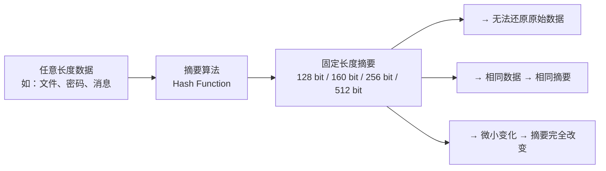
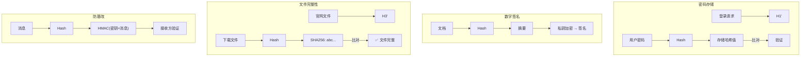
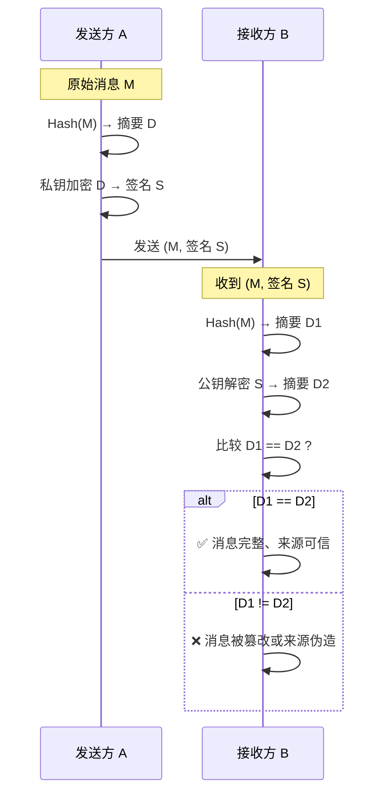
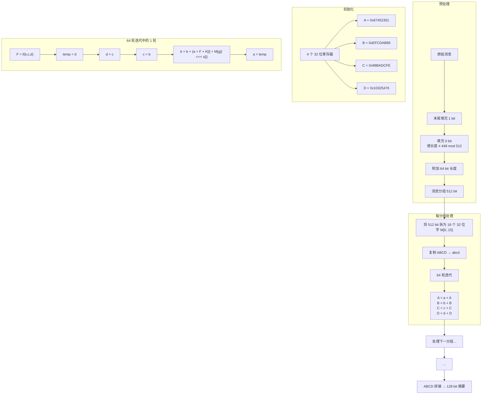
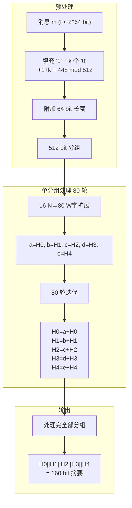
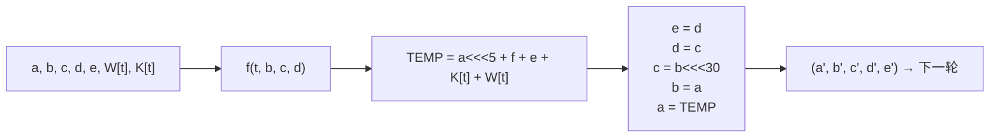
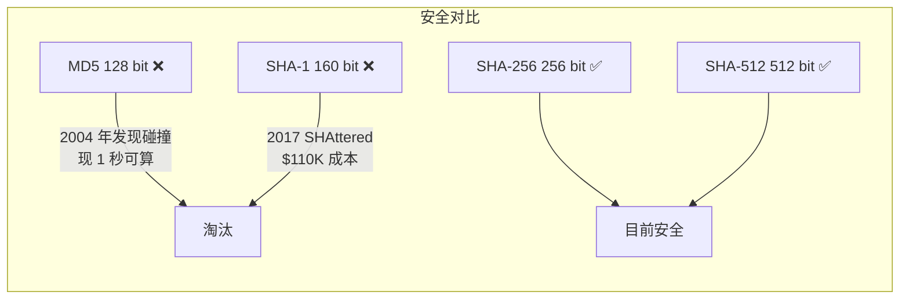

# 摘要算法（杂凑算法 / Hash 函数）

## 摘要算法简介

消息摘要算法是将**任意长度**的输入消息映射为**固定长度**的散列值（摘要/指纹）的数学变换。

**核心区别**：与加密算法不同，摘要算法是**单向不可逆**的——无法从摘要恢复原始消息。



### 摘要算法特点

| 特性 | 说明 | 直观理解 |
|------|------|----------|
| **固定输出** | 任意输入 → 固定长度输出 | 一本小说和一个句子的 MD5 值都是 128 位 |
| **单向性** | 从摘要不可逆推原文 | 如同「碎纸机」——无法复原 |
| **抗碰撞性** | 难以找到两不同输入有相同摘要 | 指纹——理论上每人不同 |
| **雪崩效应** | 输入微小变化 → 摘要天翻地覆 | 改 1 个 bit → 约 50% 输出 bit 变化 |
| **确定性** | 同一输入 → 同一摘要 | 可重复验证 |

## 摘要算法应用场景



## 数字签名原理

数字签名 = **摘要算法** + **非对称加密**。



**关键功能**：
- **完整性验证**：摘要比对 → 数据未被篡改
- **身份认证**：私钥签名 → 确认发送者身份
- **不可否认性**：私钥唯一掌握 → 发送者不能抵赖

## 常见摘要算法

### MD5（Message-Digest Algorithm 5）

**作者**：Ronald Rivest（RSA 中的 R）

**输出**：128 bit（16 字节）

**结构**：Merkle-Damgård 迭代

**状态**：❌ **已不安全**——2004 年已找到碰撞攻击

#### MD5 算法流程



**四轮布尔函数**（非线性）：

| 轮次 | 函数 | 公式 |
|------|------|------|
| 1 ($i=0\thicksim15$) | $F$ | $(b \land c) \lor (\lnot b \land d)$ |
| 2 ($i=16\thicksim31$) | $G$ | $(d \land b) \lor (\lnot d \land c)$ |
| 3 ($i=32\thicksim47$) | $H$ | $b \oplus c \oplus d$ |
| 4 ($i=48\thicksim63$) | $I$ | $c \oplus (b \lor \lnot d)$ |

> **为什么这样设计？** 四种不同的非线性函数增加复杂性，使输出位之间的统计依赖关系难以分析，抵抗差分密码分析。

#### 完整 Java 实现（JDK 内置）

```java
import java.security.MessageDigest;

public class MD5Demo {

    public static void main(String[] args) {
        System.out.println(getMD5Code("你若安好，便是晴天"));
        // 输出: 6bab82679914f7cb480a120b532ffa80
    }

    public static String getMD5Code(String message) {
        String md5Str = "";
        try {
            MessageDigest md = MessageDigest.getInstance("MD5");
            byte[] md5Bytes = md.digest(message.getBytes());
            md5Str = bytes2Hex(md5Bytes);
        } catch (Exception e) {
            e.printStackTrace();
        }
        return md5Str;
    }

    public static String bytes2Hex(byte[] bytes) {
        StringBuilder result = new StringBuilder();
        int temp;
        for (int i = 0; i < bytes.length; i++) {
            temp = bytes[i];
            if (temp < 0) temp += 256;
            if (temp < 16) result.append("0");
            result.append(Integer.toHexString(temp));
        }
        return result.toString();
    }
}
```

#### 不依赖 JDK 的 MD5 手写实现

```java
public class MD5 {
    /*
     * 四个链接变量（MD5 算法定义的初始值）
     */
    private final int A = 0x67452301;
    private final int B = 0xefcdab89;
    private final int C = 0x98badcfe;
    private final int D = 0x10325476;

    private int Atemp, Btemp, Ctemp, Dtemp;

    /*
     * 常量 K[i] = floor(abs(sin(i+1)) × 2^32)
     * sin 的自变量单位为弧度，保证 K 值伪随机分布
     */
    private final int K[] = {
            0xd76aa478, 0xe8c7b756, 0x242070db, 0xc1bdceee,
            0xf57c0faf, 0x4787c62a, 0xa8304613, 0xfd469501,
            0x698098d8, 0x8b44f7af, 0xffff5bb1, 0x895cd7be,
            0x6b901122, 0xfd987193, 0xa679438e, 0x49b40821,
            0xf61e2562, 0xc040b340, 0x265e5a51, 0xe9b6c7aa,
            0xd62f105d, 0x02441453, 0xd8a1e681, 0xe7d3fbc8,
            0x21e1cde6, 0xc33707d6, 0xf4d50d87, 0x455a14ed,
            0xa9e3e905, 0xfcefa3f8, 0x676f02d9, 0x8d2a4c8a,
            0xfffa3942, 0x8771f681, 0x6d9d6122, 0xfde5380c,
            0xa4beea44, 0x4bdecfa9, 0xf6bb4b60, 0xbebfbc70,
            0x289b7ec6, 0xeaa127fa, 0xd4ef3085, 0x04881d05,
            0xd9d4d039, 0xe6db99e5, 0x1fa27cf8, 0xc4ac5665,
            0xf4292244, 0x432aff97, 0xab9423a7, 0xfc93a039,
            0x655b59c3, 0x8f0ccc92, 0xffeff47d, 0x85845dd1,
            0x6fa87e4f, 0xfe2ce6e0, 0xa3014314, 0x4e0811a1,
            0xf7537e82, 0xbd3af235, 0x2ad7d2bb, 0xeb86d391
    };

    /* 循环左移位数 s[i] */
    private final int s[] = {
            7, 12, 17, 22,  7, 12, 17, 22,  7, 12, 17, 22,  7, 12, 17, 22,
            5,  9, 14, 20,  5,  9, 14, 20,  5,  9, 14, 20,  5,  9, 14, 20,
            4, 11, 16, 23,  4, 11, 16, 23,  4, 11, 16, 23,  4, 11, 16, 23,
            6, 10, 15, 21,  6, 10, 15, 21,  6, 10, 15, 21,  6, 10, 15, 21
    };

    private void init() {
        Atemp = A; Btemp = B; Ctemp = C; Dtemp = D;
    }

    private int shift(int a, int s) {
        return (a << s) | (a >>> (32 - s));
    }

    private void MainLoop(int M[]) {
        int F, g;
        int a = Atemp, b = Btemp, c = Ctemp, d = Dtemp;
        for (int i = 0; i < 64; i++) {
            if (i < 16) {
                F = (b & c) | ((~b) & d);   g = i;
            } else if (i < 32) {
                F = (d & b) | ((~d) & c);   g = (5 * i + 1) % 16;
            } else if (i < 48) {
                F = b ^ c ^ d;              g = (3 * i + 5) % 16;
            } else {
                F = c ^ (b | (~d));         g = (7 * i) % 16;
            }
            int tmp = d;
            d = c;
            c = b;
            b = b + shift(a + F + K[i] + M[g], s[i]);
            a = tmp;
        }
        Atemp = a + Atemp; Btemp = b + Btemp;
        Ctemp = c + Ctemp; Dtemp = d + Dtemp;
    }

    private int[] add(String str) {
        int num = ((str.length() + 8) / 64) + 1;
        int strByte[] = new int[num * 16];
        for (int i = 0; i < num * 16; i++) strByte[i] = 0;
        int i;
        for (i = 0; i < str.length(); i++) {
            strByte[i >> 2] |= str.charAt(i) << ((i % 4) * 8);
        }
        strByte[i >> 2] |= 0x80 << ((i % 4) * 8);
        strByte[num * 16 - 2] = str.length() * 8;
        return strByte;
    }

    public String getMD5(String source) {
        init();
        int strByte[] = add(source);
        for (int i = 0; i < strByte.length / 16; i++) {
            int num[] = new int[16];
            System.arraycopy(strByte, i * 16, num, 0, 16);
            MainLoop(num);
        }
        return changeHex(Atemp) + changeHex(Btemp)
             + changeHex(Ctemp) + changeHex(Dtemp);
    }

    private String changeHex(int a) {
        StringBuilder str = new StringBuilder();
        for (int i = 0; i < 4; i++) {
            str.append(String.format("%02x",
                (a >> (i * 8)) & 0xff));
        }
        return str.toString();
    }

    private static MD5 instance;
    public static MD5 getInstance() {
        if (instance == null) instance = new MD5();
        return instance;
    }

    private MD5() {}

    public static void main(String[] args) {
        String str = MD5.getInstance().getMD5("你若安好，便是晴天");
        System.out.println(str);
    }
}
```

### SHA-1（Secure Hash Algorithm 1）

**输出**：160 bit（20 字节）

**结构**：Merkle-Damgård

**状态**：❌ **已不安全**——2017 年 Google 展示两个不同 PDF 的 SHA-1 碰撞（SHAttered 攻击）

#### SHA-1 算法流程



**80 轮迭代中的一轮**：



#### JDK 内置实现

```java
import java.security.MessageDigest;

public class SHA1Demo {

    public static void main(String[] args) {
        System.out.println(getSha1("你若安好，便是晴天"));
        // 输出: 8ce764110a42da9b08504b20e26b19c9e3382414
    }

    public static String getSha1(String str) {
        if (null == str || str.isEmpty()) return null;

        try {
            // 创建 SHA1 算法消息摘要对象
            MessageDigest mdTemp = MessageDigest.getInstance("SHA1");
            // 使用指定字节数组更新摘要
            mdTemp.update(str.getBytes("UTF-8"));
            byte[] md = mdTemp.digest();

            // 转为十六进制字符串
            StringBuilder buf = new StringBuilder();
            for (byte b : md) {
                buf.append(String.format("%02x", b & 0xff));
            }
            return buf.toString();
        } catch (Exception e) {
            e.printStackTrace();
        }
        return "0";
    }
}
```

### SHA-2 家族（SHA-224 / 256 / 384 / 512）

SHA-2 是 SHA-1 的后继标准，目前**推荐使用**。

| 算法 | 输出长度 | 消息最大长度 | 字长 | 轮数 | 安全强度 |
|------|---------|-------------|------|------|---------|
| SHA-224 | 224 bit | $2^{64}$ | 32 bit | 64 | 112 bit |
| SHA-256 | 256 bit | $2^{64}$ | 32 bit | 64 | 128 bit |
| SHA-384 | 384 bit | $2^{128}$ | 64 bit | 80 | 192 bit |
| SHA-512 | 512 bit | $2^{128}$ | 64 bit | 80 | 256 bit |

与 SHA-1 的区别：
- 更大的输出空间（256/512 bit → 抗碰撞强度高）
- 更复杂的轮函数和消息扩展
- 无已知可行碰撞攻击

### 抗碰撞攻击时间对比



**实际开发建议**：
- ✅ **密码存储**：使用 bcrypt / scrypt / Argon2（带盐/迭代/抗硬件加速）
- ✅ **文件校验**：SHA-256
- ✅ **数字签名**：SHA-256 或 SHA-512
- ✅ **HMAC**：HMAC-SHA256
- ❌ 不再使用：MD5、SHA-1（除非与旧系统兼容）

## 摘要算法对比总表

| 算法 | 输出长度 | 分组长度 | 最大输入 | 安全状态 | 推荐用途 |
|------|---------|---------|---------|---------|---------|
| MD5 | 128 bit | 512 bit | 无限 | ❌ 碰撞 | 仅兼容旧系统 |
| SHA-1 | 160 bit | 512 bit | $2^{64}$ | ❌ 碰撞 | 已淘汰 |
| SHA-256 | 256 bit | 512 bit | $2^{64}$ | ✅ 安全 | 文件校验/数字签名 |
| SHA-512 | 512 bit | 1024 bit | $2^{128}$ | ✅ 安全 | 高安全场景 |
| SM3 | 256 bit | 512 bit | $2^{64}$ | ✅ 安全 | 国密合规场景 |
| SHA-3 | 可变 | 1600 bit | 无限 | ✅ 安全 | 新一代标准 |
| BLAKE2 | 可变 | 可变 | 无限 | ✅ 安全 | 高性能替代 |

> **注意**：摘要算法不同于加密——它没有密钥，不可逆。需要密钥的摘要变体请使用 **HMAC**（Hash-based Message Authentication Code）。
