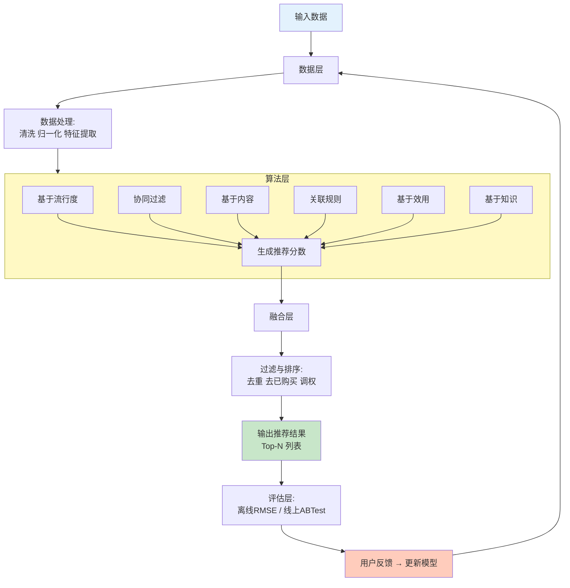
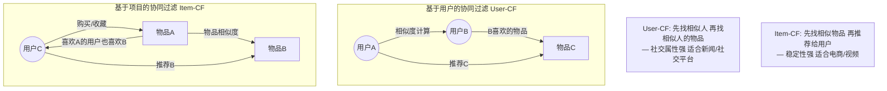
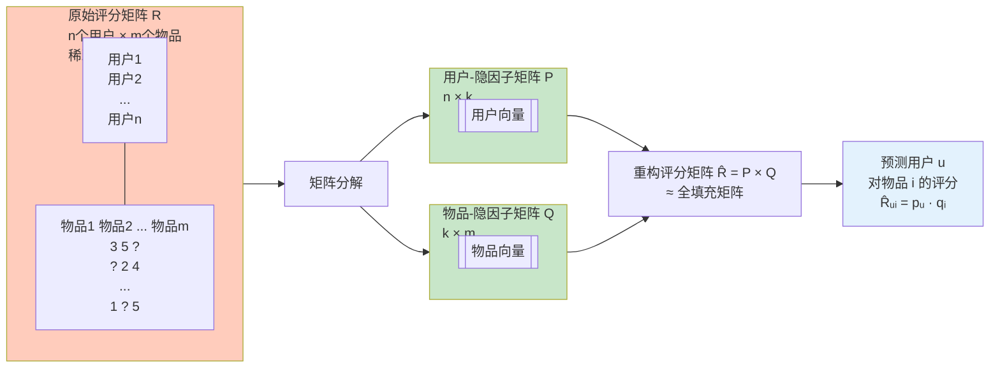
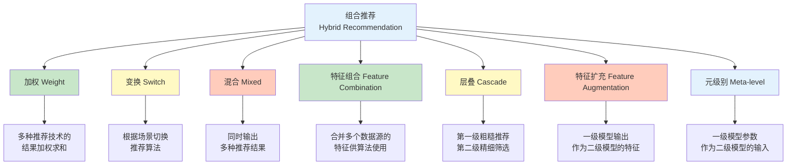
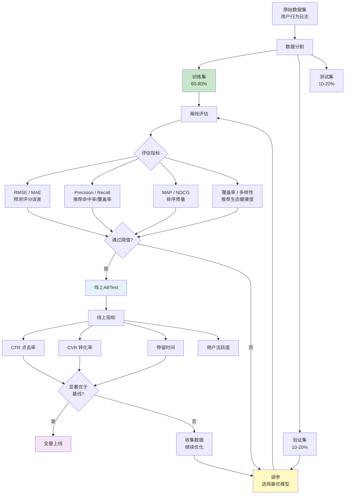

# 推荐算法 - 汇总

## 推荐算法的意义

推荐根据用户兴趣和行为特点，向用户推荐所需的信息或商品，帮助用户在海量信息中快速发现真正所需的商品，提高用户黏性，促进信息点击和商品销售。

- **帮助用户找到想要的商品（新闻/音乐/……），发掘长尾**

帮用户找到想要的东西，谈何容易。商品茫茫多，甚至是我们自己，也经常点开淘宝，面对眼花缭乱的打折活动不知道要买啥。在经济学中，有一个著名理论叫长尾理论（The Long Tail）。套用在互联网领域中，指的就是最热的那一小部分资源将得到绝大部分的关注，而剩下的很大一部分资源却鲜少有人问津。这不仅造成了资源利用上的浪费，也让很多口味偏小众的用户无法找到自己感兴趣的内容。

- **降低信息过载**

互联网时代信息量已然处于爆炸状态，若是将所有内容都放在网站首页上用户是无从阅读的，信息的利用率将会十分低下。因此我们需要推荐系统来帮助用户过滤掉低价值的信息。

- **提高站点的点击率/转化率**

好的推荐系统能让用户更频繁地访问一个站点，并且总是能为用户找到他想要购买的商品或者阅读的内容。

- **加深对用户的了解，为用户提供定制化服务**

可以想见，每当系统成功推荐了一个用户感兴趣的内容后，我们对该用户的兴趣爱好等维度上的形象是越来越清晰的。当我们能够精确描绘出每个用户的形象之后，就可以为他们定制一系列服务，让拥有各种需求的用户都能在我们的平台上得到满足。

## 推荐算法的输入

推荐系统是基于海量数据挖掘分析的商业智能平台，推荐主要基于以下信息：

- 热点信息或商品
- 用户Profile信息，如性别、年龄、职业、收入以及所在城市等等
- 用户历史浏览或行为记录
- 社会化关系

## 推荐系统的核心逻辑框架

## 常见推荐算法

### 基于流行度的算法

基于流行度的算法非常简单粗暴，类似于各大新闻、微博热榜等，根据PV、UV、日均PV或分享率等数据来按某种热度排序来推荐给用户。

这种算法的优点是简单，适用于刚注册的新用户。缺点也很明显，它无法针对用户提供个性化的推荐。基于这种算法也可做一些优化，比如加入用户分群的流行度排序，例如把热榜上的体育内容优先推荐给体育迷，把政要热文推给热爱谈论政治的用户。

### 基于用户行为数据的算法 - 协同过滤（CF）

CF算法主要有**基于用户的协同过滤算法（user-based CF）**、**基于项目的协同过滤（item-based CF）**以及**基于模型的协同过滤（model-based CF）**，它很简单而且很多时候推荐也是很准确的。

基于协同过滤的推荐机制是现今应用最为广泛的推荐机制，它有以下几个显著的优点：

- 它不需要对物品或者用户进行严格的建模，而且不要求物品的描述是机器可理解的，所以这种方法也是领域无关的。
- 这种方法计算出来的推荐是开放的，可以共用他人的经验，很好的支持用户发现潜在的兴趣偏好。

然而它也存在以下几个问题：

- 方法的核心是基于历史数据，所以对新物品和新用户都有"冷启动"的问题。
- 推荐的效果依赖于用户历史偏好数据的多少和准确性。
- 对于一些特殊品味的用户不能给予很好的推荐。
- 由于以历史数据为基础，抓取和建模用户的偏好后，很难修改或者根据用户的使用演变，从而导致这个方法不够灵活。
- 在大部分的实现中，用户历史偏好是用稀疏矩阵进行存储的，而稀疏矩阵上的计算有些明显的问题，包括可能少部分人的错误偏好会对推荐的准确度有很大的影响等等。

对于矩阵稀疏的问题，有很多方法来改进CF算法。比如通过矩阵因子分解（如LFM），我们可以把一个 $n \times m$ 的矩阵分解为一个 $n \times k$ 的矩阵乘以一个 $k \times m$ 的矩阵，这里的 $k$ 可以是用户的特征、兴趣爱好与物品属性的一些联系，通过因子分解，可以找到用户和物品之间的一些潜在关联，从而填补之前矩阵中的缺失值。

#### 基于用户的协同过滤（user-based CF）—— 人以群分

**核心直觉：** 找到与你兴趣相似的用户（邻居），看他们喜欢什么，把这些东西推荐给你——"物以类聚，人以群分"。

#### 基于项目的协同过滤（item-based CF）—— 物以类聚

**核心直觉：** 你之前喜欢A，而A和B经常被同一批人喜欢，那么推荐B给你——"喜欢A的用户也喜欢B"。

#### User-CF vs Item-CF 对比示意图

#### 关键区别详解

| 维度 | User-based CF | Item-based CF |
|------|---------------|---------------|
| **核心步骤** | 找相似用户 → 推荐相似用户的物品 | 找相似物品 → 推荐相似的物品给当前用户 |
| **适用场景** | 用户数 << 物品数（如新闻推荐） | 物品数 << 用户数（如电商推荐） |
| **实时性** | 用户行为变化后需重新计算相似度 | 物品属性稳定，可离线计算相似度 |
| **推荐理由** | "和你相似的人也喜欢" | "因为你喜欢XX，所以推荐YY" |
| **冷启动** | 新用户无行为数据 -> 无法找到邻居 | 新物品无用户评分 -> 无法计算相似度 |
| **典型系统** | 豆瓣猜、Twitter | Amazon推荐、Netflix、YouTube |

#### 基于用户的CF 原理流程

- 分析各个用户对item的评价（通过浏览记录、购买记录等）；
- 依据用户对item的评价计算得出所有用户之间的相似度；
- 选出与当前用户最相似的N个用户；
- 将这N个用户评价最高并且当前用户又没有浏览过的item推荐给当前用户。

#### 基于项目的CF 原理流程

- 计算所有物品之间的相似度（基于用户行为矩阵的列的相似性）；
- 找到用户历史喜欢的物品的k个最相似物品；
- 将这些相似物品推荐给用户（排除已购买的）；
- 可结合用户评分加权。

#### 基于模型的协同过滤（model-based CF）

基于模型的协同过滤推荐（model-based CF）是采用机器学习或数据挖掘等算法，用训练数据来学习识别复杂模式，从而得到学习模型，然后基于学习模型在数据集上进行智能预测。主要有以下模型：

- 隐语义模型（latent semantic CF models）/ 矩阵分解模型（matrix factorization）
- 贝叶斯信念网协同过滤模型（Bayesian belief nets CF models）
- 聚类协同过滤模型（clustering CF models）
- 概率因素模型（probabilistic factor models）

##### 矩阵分解示意图

**矩阵分解直觉：** 用户对物品的偏好可以建模为 $k$ 个隐因子（如"剧情深度"、"视觉风格"、"动作程度"等）的组合。每个用户有一个 $k$ 维向量 $p_u$ 表示他对各因子的偏好程度，每个物品有一个 $k$ 维向量 $q_i$ 表示它在各因子上的表现。用户 $u$ 对物品 $i$ 的评分预测为 $p_u \cdot q_i$。

### 基于内容的算法

CF算法看起来很好很强大，通过改进也能克服各种缺点。那么问题来了，假如我是个《指环王》的忠实读者，我买过一本《双塔奇兵》，这时库里新进了第三部：《王者归来》，那么显然我会很感兴趣。然而基于之前的算法，无论是用户评分还是书名的检索都不太好使，于是基于内容的推荐算法呼之欲出。

这种推荐仅需要得到两类信息：项目特征的描述和用户过去的喜好信息。

- 利用领域专家给项目打标签的方法，也即**传统的分类系统（Taxonomy）**
- 另一种是用户给项目打标签，也即**大众分类系统（Folksonomy）**

这种推荐系统的优点在于：

- 易于实现，不需要用户数据因此不存在稀疏性和冷启动问题。
- 基于物品本身特征推荐，因此不存在过度推荐热门的问题。

然而，缺点在于抽取的特征既要保证准确性又要具有一定的实际意义，否则很难保证推荐结果的相关性。豆瓣网采用人工维护tag的策略，依靠用户去维护内容的tag的准确性。

### 基于关联规则的推荐

基于关联规则的推荐更常见于电子商务系统中，并且也被证明行之有效。其实际的意义为购买了一些物品的用户更倾向于购买另一些物品。基于关联规则的推荐系统的首要目标是挖掘出关联规则，也就是那些同时被很多用户购买的物品集合，这些集合内的物品可以相互进行推荐。目前关联规则挖掘算法主要从**Apriori**和**FP-Growth**两个算法发展演变而来。

基于关联规则的推荐系统一般转化率较高，因为当用户已经购买了频繁集合中的若干项目后，购买该频繁集合中其他项目的可能性更高。该机制的缺点在于：

- 计算量较大，但是可以离线计算，因此影响不大。
- 由于采用用户数据，不可避免的存在冷启动和稀疏性问题。
- 存在热门项目容易被过度推荐的问题。

### 基于效用推荐

基于效用的推荐（Utility-based Recommendation）是建立在对用户使用项目的效用情况上计算的，其核心问题是怎么样为每一个用户去创建一个效用函数，因此，用户资料模型很大程度上是由系统所采用的效用函数决定的。基于效用推荐的好处是它能把非产品的属性，如提供商的可靠性（Vendor Reliability）和产品的可得性（Product Availability）等考虑到效用计算中。

### 基于知识推荐

基于知识的推荐（Knowledge-based Recommendation）在某种程度是可以看成是一种推理（Inference）技术，它不是建立在用户需要和偏好基础上推荐的。基于知识的方法因它们所用的功能知识不同而有明显区别。效用知识（Functional Knowledge）是一种关于一个项目如何满足某一特定用户的知识，因此能解释需要和推荐的关系，所以用户资料可以是任何能支持推理的知识结构，它可以是用户已经规范化的查询，也可以是一个更详细的用户需要的表示。

### 组合推荐算法

由于各种推荐方法都有优缺点，所以在实际中，**组合推荐（Hybrid Recommendation）**经常被采用。研究和应用最多的是内容推荐和协同过滤推荐的组合。最简单的做法就是分别用基于内容的方法和协同过滤推荐方法去产生一个推荐预测结果，然后用某方法组合其结果。尽管从理论上有很多种推荐组合方法，但在某一具体问题中并不见得都有效，组合推荐一个最重要原则就是通过组合后要能避免或弥补各自推荐技术的弱点。

在组合方式上，有研究人员提出了七种组合思路：

#### 七种组合方式详解

| 组合方式 | 工作机制 | 适用场景 | 代表系统 |
|---------|---------|---------|---------|
| **加权（Weight）** | 多个推荐模型并行输出，按权重线性组合 | 各模型数据充足时稳定效果好 | 加权混合协同过滤 |
| **变换（Switch）** | 根据场景（如冷启动/活跃用户）切换算法 | 解决冷启动问题 | 新闻推荐（新用户用流行度，老用户用CF） |
| **混合（Mixed）** | 同时展示多种推荐结果 | 需要覆盖多类需求 | YouTube同时推荐热门+个性化视频 |
| **特征组合（Feature comb.）** | 将不同数据源特征合并后再训练 | 协同过滤+内容特征 | 结合用户评分和物品标签特征 |
| **层叠（Cascade）** | 先粗筛后精排，后一个在前面的结果基础上优化 | 大规模推荐需要性能优化 | 推荐系统的粗排+精排阶段 |
| **特征扩充（Feature aug.）** | CF模型的输出特征作为内容模型的输入特征 | 缓解CF的数据稀疏性 | Netflix Prize中的SVD+RBMs组合 |
| **元级别（Meta-level）** | 一级模型学到的参数作为二级模型的输入 | 深度学习推荐系统 | Wide & Deep, DeepFM等 |

## 推荐算法的评估流程

### 常用评估指标

| 指标 | 全称 | 含义 | 适用场景 |
|------|------|------|---------|
| **RMSE** | 均方根误差 | $\sqrt{\frac{1}{N}\sum(pred - actual)^2}$ | 评分预测类任务 |
| **MAE** | 平均绝对误差 | $\frac{1}{N}\sum\|pred - actual\|$ | 评分预测（对离群点更鲁棒） |
| **Precision@K** | 精确率 | 推荐Top-K中用户喜欢的比例 | Top-N推荐 |
| **Recall@K** | 召回率 | 用户喜欢的所有物品中推荐到的比例 | 推荐覆盖面 |
| **NDCG** | 归一化折损累计增益 | 排序位置越靠前权重越大 | 排序质量评估 |
| **覆盖率** | Coverage | 推荐物品占总物品的比例 | 发掘长尾能力 |
| **新颖性** | Novelty | 推荐非热门物品的比例 | 防止推荐疲劳 |

## 推荐算法的改进策略

用户画像是最近经常被提及的一个名词，引入用户画像可以为推荐系统带来很多改进的余地，比如：

- 打通公司各大业务平台，通过获取其他平台的用户数据，彻底解决冷启动问题；
- 在不同设备上同步用户数据，包括QQID、设备号、手机号等；
- 丰富用户的人口属性，包括年龄、职业、地域等；
- 更完善的用户兴趣状态，方便生成用户标签和匹配内容。

另外，公司的优势——社交平台也是一个很好利用的地方。利用用户的社交网络，可以很方便地通过用户的好友、兴趣群的成员等更快捷地找到相似用户以及用户可能感兴趣的内容，提高推荐的准确度。

## 业界一些推荐系统

### Yahoo Research

2011推荐系统论坛中，来自Yahoo!的Yehuda Koren分享了他对于互联网中推荐系统的经验，他简单介绍了目前广泛流行的协同过滤推荐机制；另外分析了一些推荐系统中值得注意的一些问题：

- **Bias Matters** 在实际的应用中，用户并不是随机地选择物品去打分，而是只选择那些和他们兴趣相关的物品打分，绝大多数用户往往忽略了去给那些没有兴趣的物品打分。Koren通过分析Netflix Prize数据，Koren发现用户对视频的评分变化中，Bias可以解释其中的33%，而个性化只能解释其中的10%，剩下的57%暂时还得不到解释。
- **Eliciting user feedback** Koren的目标是解决推荐系统的cold-start问题，例如，Yahoo! Movie中，对于新用户，很难预测他们的喜好（对视频的评分）。那么，可以选一些视频让新用户打分，从而获取他们的兴趣数据。在此过程中，使用了决策树模型来引导用户评分，可以用尽量少的视频，最大程度地了解用户兴趣。
- **Estimating confidence in recommendations** 在推荐系统中，我们需要对被推荐物品的可信度进行估计，从而得出更为可信的物品来进行推荐。Koren在这里提出了基于概率的可信度计算方法，也就是根据对评分（用户对物品）的概率预测，然后利用熵，标准方差，或是Gini不纯度等概率分布来对物品可信度进行评估。

### 淘宝推荐系统

淘宝推荐系统的目标就是要为各个产品提供商品、店铺、人、类目属性各种维度的推荐。它的核心就是以类目属性和社会属性为纽带，将人、商品和店铺建立起联系。

淘宝的宝贝推荐原则：

- 基于内容的和关联规则
- 全网优质宝贝算分
- 根据推荐属性筛选TOP
- 基于推荐属性的关联关系
- 采用搜索引擎存储和检索优质宝贝
- 加入个性化用户信息

根据用户的购买和收藏记录产生可推荐的关联规则。对优质宝贝的算分需要考虑商品的相关属性，包括描述、评价、名称、违规、收藏人气、累计销量、UV以及PV等等。此外，推荐系统根据用户的浏览、收藏、购买行为以及反馈信息，在Hadoop上来计算用户带权重的标签，用于进行个性化推荐。

在个性化推荐之上，淘宝还实现了基于内容的广告投放。由于个性化推荐出来的物品是用户所感兴趣的，可以想象，基于此之上的广告投放也应该会行之有效。

众所周知，淘宝具有海量的数据和商品问题，这里列举了淘宝数据的一些参数：超过8亿种在线商品，100万产品，4万属性，等等。在淘宝实现推荐系统可能遇到的各种各样的难题，其中有：

- 商品种类繁多，生命周期短，很难及时收集到足够多的点击或购买数据，这使得基于用户行为的推荐方法，比如基于物品的推荐方法，发挥空间有限。
- 因为商品是由卖家而非网站登记的，数据的规范性差，这又给基于内容的推荐带来了很大的困难。
- 8亿种商品中，重复的商品种类应该非常多，需要尽量避免推荐重复种类的商品给用户，但在数据规范性差、区分度差的情况下，如何归并重复商品种类，这本身也是个很大的难题。
- 大多数推荐系统只需要考虑如何满足买家的需求，在淘宝，还要考虑卖家的需求。

### 豆瓣的推荐引擎 - 豆瓣猜

豆瓣网在国内互联网行业美誉度很高，这是一家以帮助用户发现未知事物为己任的公司。它的"豆瓣猜"是一种个性化的推荐，其背后采用了基于用户的协同过滤技术。那么，豆瓣猜是如何向我们推荐产品的呢？

- 首先，确定什么样的产品适合推荐？豆瓣猜提出选择"具有媒体性的产品（Media Product）"来进行推荐，即选择多样、口味很重要、单位成本不重要，同时能够广泛传播（Information Cascade）的产品；接着在对真实的数据集进行定量分析后，进一步得出，应该是条目增长相对稳定、能够快速获得用户反馈，数据稀疏性与条目多样性、时效性比较平衡的产品，才是适合推荐的产品。
- 其次，豆瓣网的推荐引擎面对高成长性的挑战，通过降低存储空间，近似算法与分布式计算的设计，来实现对基于用户的协同过滤推荐系统的线性扩展。
- 最后，针对当前推荐系统面临的问题，包括倾向于给出平庸的推荐，有信息无结构，以及缺乏对用户的持续关注等黑盒推荐问题。豆瓣提出了分为 Prediction、Forecasting、Recommendation 三个阶段的下一代推荐系统，并探讨了一种下一代推荐引擎的构想——基于用户行为模型的、有记忆的、可进化的系统。

### Hulu的个性化推荐

Hulu是一家美国的视频网站，它是由美国国家广播环球公司（NBC Universal）和福克斯广播公司（Fox）在2007年3月共同投资建立的。在美国，Hulu已是最受欢迎的视频网站之一。它拥有超过250个渠道合作伙伴，超过600个顶级广告客户，3千万的用户，3亿的视频，以及11亿的视频广告。广告是衡量视频网站成功与否的一个重要标准。事实证明，Hulu的广告效果非常好，若以每千人为单位对广告计费，Hulu的所得比电视台在黄金时段所得还高。那么，是什么让Hulu取得了这样的成功呢？

通过对视频和用户特点的分析，Hulu根据用户的个人信息、行为模型和反馈，设计出一个混合的个性化推荐系统。它包含了基于物品的协同过滤机制，基于内容的推荐，基于人口统计的推荐，从用户行为中提炼出来的主题模型，以及根据用户反馈信息对推荐系统的优化，等等。此个性化推荐系统也进而成为了一个产品，用于给用户推荐视频。这个产品通过问答的形式，与用户进行交互，获取用户的个人喜欢，进一步提高推荐的个性化。

Hulu把这种个性化推荐视频的思想放到了广告投放中，设计出了一套个性化广告推荐系统。那么，这种广告系统是如何实现个性化的呢？

- Hulu的用户对广告拥有一定控制权，在某些视频中你可以根据自己的喜好选择相应的广告，或者选择在开头看一段电影预告片来抵消广告。
- Hulu收集用户对广告的反馈意见（评分），例如，某个广告是否对收看用户有用？
- 根据人口统计的信息，来投放广告。例如，分析Hulu用户的年龄、性别特征来投放不同的视频及广告。
- 根据用户的行为模式，进一步增加广告投放的准确性。

## 推荐算法展望

从大数据的4V角度看，主要的挑战及未来研究方向有以下几个方面：

- **Volume（数据规模）。** 数据量巨大加剧了数据稀疏性问题和长尾（long tail）问题。在推荐系统中，可获得的已打分数目通常远小于需要预测的打分数目。常用的数据集都非常稀疏，当评分矩阵达到某种程度之后，相比标准的协同过滤技术，推荐质量会有所下降，而且距离关系的计算代价很高，很难实际应用到大规模评分数据上。长尾是指那些原来不受到重视的销量小但种类多的产品或服务由于总量巨大，累积起来的总收益超过主流产品的现象。
- **Variety（数据类型多样）。** 推荐系统可使用的数据复杂繁多，如社交网络里面的信息、地点位置信息和其他上下文感知信息都考虑进来，不但数据量增加，计算复杂度亦会成倍增加。
- **Value（价值）。** 大数据本身的价值密度低，但价值巨大。对推荐系统而言，对用户兴趣建模，并将用户可能感兴趣的项目推荐给他，这里的项目相对用户而言，是有价值的项目（数据）。
- **Velocity（时效性）。** 推荐系统对时效性要求较高，想真正捕获最优的推荐机会，时效性非常重要。如何将海量的用户数据应用到实时的用户交互中以提高用户体验，这就涉及到推荐系统可扩展性（scalability）问题。
