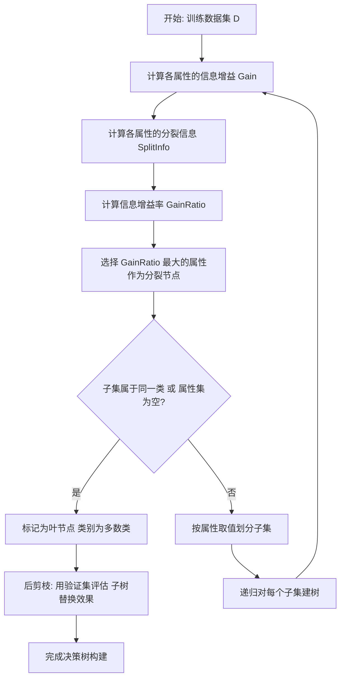
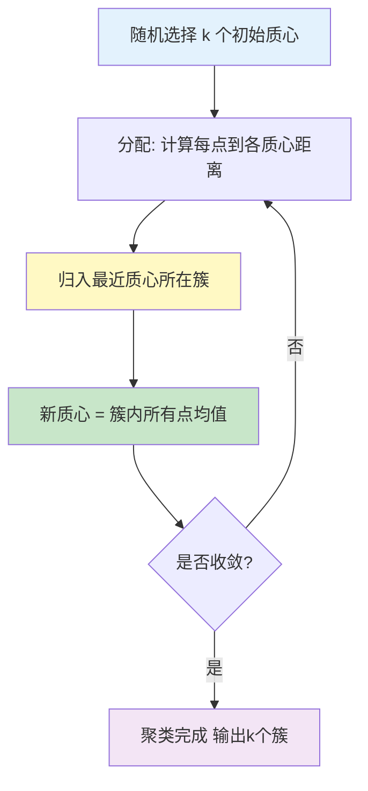
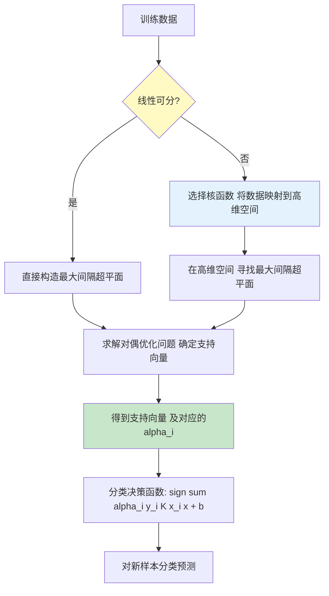
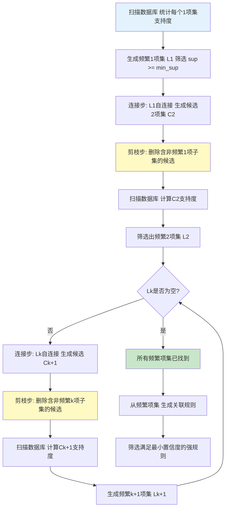
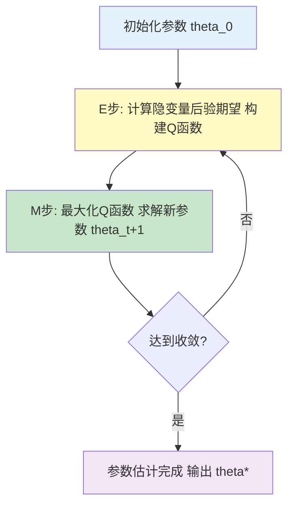
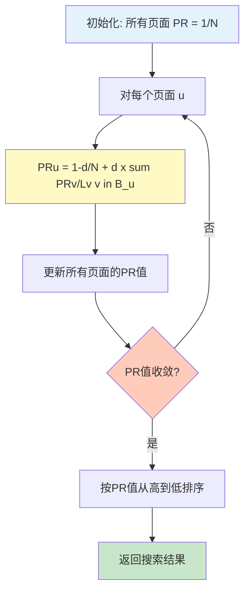
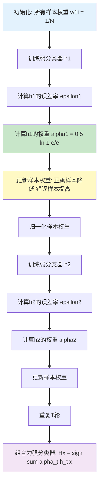
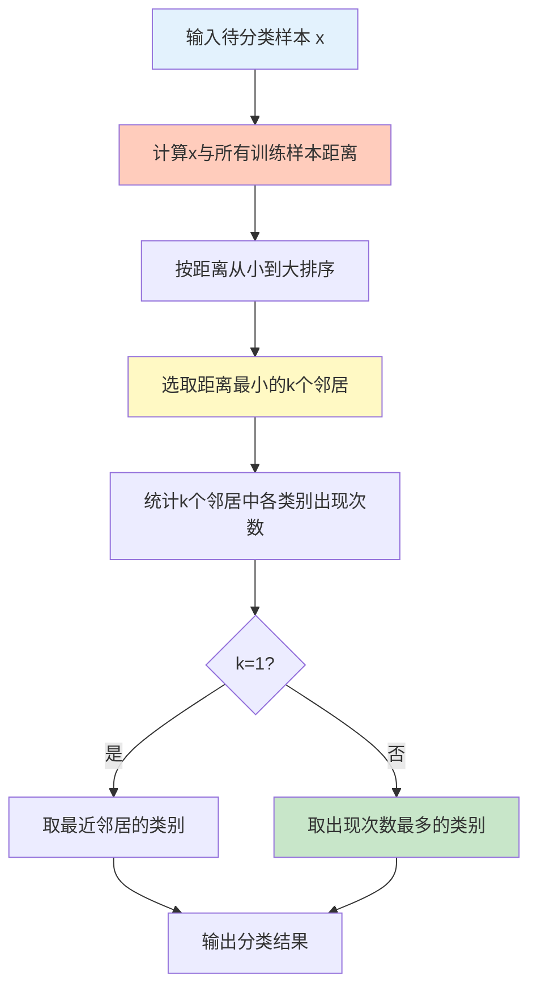
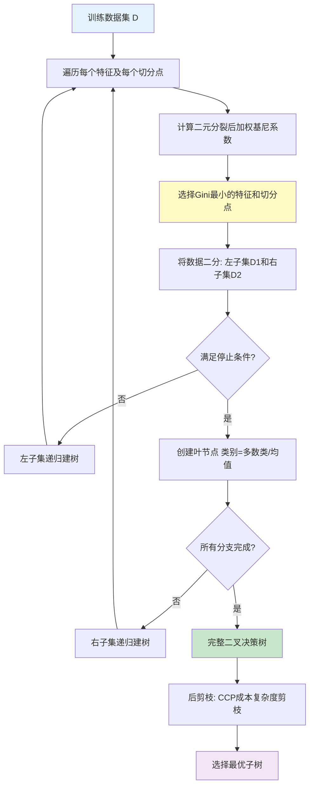

# 数据挖掘 - 10大算法汇总

## C4.5

C4.5算法是机器学习算法中的一种分类决策树算法，其核心算法是ID3算法。C4.5算法继承了ID3算法的优点，并在以下几方面对ID3算法进行了改进：

- 用信息增益率来选择属性，克服了用信息增益选择属性时偏向选择取值多的属性的不足；
- 在树构造过程中进行剪枝；
- 能够完成对连续属性的离散化处理；
- 能够对不完整数据进行处理。

### 核心原理：信息增益率

**信息增益的缺陷：** ID3使用信息增益选择分裂属性，天然倾向于选择取值较多的属性（如"用户ID"），因为这些属性能使每个子节点纯度极高，但泛化能力极差——每个分支只包含极少样本，几乎是在"记忆"而非"学习"。

**信息增益率（Gain Ratio）的设计直觉：** 在信息增益的基础上引入"分裂信息"（Split Information）作为惩罚项，对取值较多的属性施以惩罚，使算法在"纯度提升"和"属性分支数"之间取得平衡。

**核心公式：**

- 分裂信息：$SplitInfo_A(D) = -\sum_{j=1}^{v}\frac{|D_j|}{|D|}\log_2\frac{|D_j|}{|D|}$
  - $v$ 是属性A的取值个数，$D_j$ 是第j个分支的子集
  - 属性取值越多 → 分支越多 → SplitInfo越大 → 惩罚越重

- 信息增益率：$GainRatio(A) = \frac{Gain(A)}{SplitInfo_A(D)}$
  - 通过除以SplitInfo，对多值属性施加惩罚
  - 解决了ID3对多值属性的偏好问题

### 核心流程



### 优缺点

- **优点：** 产生的分类规则易于理解，准确率较高，改进了ID3对多值属性的偏好。
- **缺点：** 在构造树的过程中，需要对数据集进行多次的顺序扫描和排序，因而导致算法的低效（相对的CART算法只需要扫描两次数据集，以下仅为决策树优缺点）。

### Part A：诞生背景与核心原理

**提出背景：** C4.5 由澳大利亚悉尼大学的 Ross Quinlan 于 1993 年在其著作《C4.5: Programs for Machine Learning》中正式提出，是 ID3 算法（1986）的直接后续与全面升级。

**时代痛点：** 1980 年代 ID3 算法虽然开创了决策树学习的先河，但存在若干致命缺陷：(1) 强偏好取值较多的属性（如"用户ID"导致过拟合）；(2) 无法处理连续型数值属性（如年龄、温度）；(3) 无法处理含有缺失值的数据；(4) 生成的树规模过大，泛化能力差。C4.5 针对上述痛点逐一提出了系统性的解决方案。

**核心数学原理——信息增益率的完整推导：**

信息熵是衡量数据集纯度的基本度量。对于数据集 $D$，其信息熵定义为：

$$H(D) = -\sum_{i=1}^{m} p_i \log_2 p_i$$

其中 $m$ 是类别数，$p_i$ 是第 $i$ 类样本在 $D$ 中的占比。

ID3 使用**信息增益**选择分裂属性：

$$Gain(A) = H(D) - \sum_{j=1}^{v} \frac{|D_j|}{|D|} H(D_j)$$

Gain(A) 天然偏好取值多的属性 A——因为每个分支 D_j 很小、纯度自然高。C4.5 引入**分裂信息**作为惩罚项来修正这一偏向：

$$SplitInfo_A(D) = -\sum_{j=1}^{v} \frac{|D_j|}{|D|} \log_2 \frac{|D_j|}{|D|}$$

分裂信息本质上是在计算"属性 A 产生分支的信息熵"——分支越多、分布越均匀，SplitInfo 越大。最终的信息增益率为：

$$GainRatio(A) = \frac{Gain(A)}{SplitInfo_A(D)}$$

通过除以 SplitInfo，对多值属性施加强惩罚，使算法在纯度和分支数之间取得平衡。

**连续属性离散化的数学原理：** 将连续属性取值排序为 $v_1 < v_2 < \cdots < v_n$，取 $n-1$ 个候选切分点 $t_i = (v_i + v_{i+1}) / 2$，选择使 GainRatio 最大的切分点进行二元分叉。每步分裂后，该连续属性在左右子树中**仍可被再次选中**（这与 CART 的"一次使用即淘汰"不同）。

**缺失值处理策略：** 将缺失样本按概率分配到所有分支——每个分支分配权重为 $\frac{|D_j|}{|D|}$（即该分支样本占比）。预测时同样按概率加权投票，由叶节点各分支的概率加权决定最终类别。

**剪枝机制：** C4.5 使用**后剪枝**——先构建完整的树，然后自底向上评估：若将某个子树替换为叶节点后在验证集上的误差不增大（或减小），则执行替换（即悲观剪枝）。

### Part B：解决的问题与适用边界

**核心优势：**
- **白盒可解释：** 生成的决策规则形如 IF-THEN 结构，业务人员可直接阅读理解
- **混合数据处理：** 同时支持离散属性和连续属性，内置缺失值处理机制，免去大量数据预处理工作
- **自动特征选择：** 分裂过程自然完成特征重要性排序，分裂位置靠前的特征重要性更高
- **无需特征缩放：** 树模型对量纲不敏感，不需要归一化或标准化

**适用场景与具体案例：**

| 应用领域 | 具体案例 | 为何适合 |
|---------|----------|---------|
| **信贷风险评估** | 银行信用卡审批、贷款违约预测模型 | 可解释性高，满足银保监会模型可解释性合规要求 |
| **医疗辅助诊断** | 基于症状和化验结果的疾病筛查 | 白盒推理，医生可追溯诊断路径 |
| **客户流失预测** | 电信/电商客户流失预警系统 | 输出规则直观，运营团队可直接制定挽留策略 |
| **工业故障诊断** | 设备传感器数据的异常检测与根因分析 | 可追溯故障路径，便于运维排障 |
| **信用评分卡** | 申请评分卡（A卡）、行为评分卡（B卡） | 规则透明，满足 Fair Lending 合规 |

**不适用/局限场景：**
- **高维稀疏数据（如文本分类、NLP）：** 树模型在此类数据上极易过拟合，推荐 SVM 或深度学习
- **特征间存在强相关：** 决策树在相关特征上的分裂不稳定——训练数据略作变化，树的结构可能剧烈改变（高方差特性）
- **纯回归任务：** C4.5 本身不支持回归（回归任务建议使用 CART 回归树或随机森林回归）
- **小样本高噪声数据：** 树结构对噪声敏感，即使剪枝也难以完全抑制过拟合
- **在线学习场景：** C4.5 需要完整训练集，无法增量更新（不支持在线学习）

**算法复杂度总览表：**

| 维度 | 复杂度 | 说明 |
|------|--------|------|
| 训练时间复杂度 | $O(m \cdot n \cdot \log m)$ | $m$=样本数，$n$=属性数；瓶颈在于连续属性的排序 |
| 预测时间复杂度 | $O(\text{depth})$ | 从根到叶，平均 $O(\log m)$ |
| 训练空间复杂度 | $O(m \cdot n)$ | 需存储完整训练数据集 |
| 模型空间复杂度 | $O(\text{nodes})$ | 树节点数与样本量正相关 |
| 连续属性预处理排序 | $O(m \cdot \log m)$ | 每个连续属性每层排序一次 |

### Part C：高效实现与关键优化

```java
/**
 * C4.5 决策树训练核心实现（完整可运行的核心逻辑）
 * 包含：信息增益率计算、连续属性切分、后剪枝框架
 */
import java.util.*;
import java.util.stream.*;

public class C45DecisionTree {

    // ---------- 树节点定义 ----------
    static class Node {
        boolean isLeaf;
        int label;                   // 叶节点类别（-1表示非叶）
        int splitFeature;            // 分裂特征索引
        double splitThreshold;       // 连续属性切分阈值
        // 连续属性：二分叉
        Node leftChild, rightChild;
        // 离散属性：多分叉
        Map<String, Node> children;
        String splitValue;           // 离散属性当前分支的取值
    }

    // ---------- 核心工具：信息熵 ----------
    /**
     * 计算数据集的熵 H(D)
     * @param labels 标签列表
     * @return 信息熵
     * 时间复杂度: O(m)，m为样本数
     */
    public static double entropy(List<Integer> labels) {
        Map<Integer, Integer> freq = new HashMap<>();
        for (int lbl : labels) {
            freq.put(lbl, freq.getOrDefault(lbl, 0) + 1);
        }
        double e = 0.0;
        int n = labels.size();
        for (int cnt : freq.values()) {
            double p = (double) cnt / n;
            if (p > 0) e -= p * (Math.log(p) / Math.log(2));
        }
        return e;
    }

    // ---------- 信息增益率计算 ----------
    /**
     * 计算信息增益率（离散属性版本）
     * @param data 特征数据（每行一个样本）
     * @param labels 标签
     * @param featIdx 特征索引
     * @return GainRatio
     * 时间复杂度: O(m + v)，v为属性取值个数
     */
    public static double gainRatioDiscrete(List<double[]> data,
                                           List<Integer> labels, int featIdx) {
        int n = data.size();
        Map<Integer, List<Integer>> splits = new HashMap<>();
        for (int i = 0; i < n; i++) {
            int val = (int) data.get(i)[featIdx];
            splits.computeIfAbsent(val, k -> new ArrayList<>()).add(labels.get(i));
        }
        double entropyD = entropy(labels);
        double infoGain = entropyD;
        double splitInfo = 0.0;
        for (List<Integer> subset : splits.values()) {
            double r = (double) subset.size() / n;
            infoGain -= r * entropy(subset);
            splitInfo -= (r > 0) ? r * (Math.log(r) / Math.log(2)) : 0;
        }
        return splitInfo == 0 ? 0 : infoGain / splitInfo;
    }

    /**
     * 信息增益率（连续属性版本）
     * 对每个候选切分点计算 GainRatio，取最大值
     * 时间复杂度: O(m log m)（排序）+ O(m)（扫描）
     */
    public static double[] gainRatioContinuousFull(List<double[]> data,
                                                    List<Integer> labels,
                                                    int featIdx) {
        int n = data.size();
        // 构建 值-标签 对并排序
        List<double[]> pairs = new ArrayList<>();
        for (int i = 0; i < n; i++) {
            pairs.add(new double[]{data.get(i)[featIdx], labels.get(i)});
        }
        pairs.sort(Comparator.comparingDouble(a -> a[0]));

        double bestGainRatio = -1;
        double bestThreshold = 0;
        double entropyD = entropy(labels);

        // 扫描相邻点，取中点作为候选切分点
        for (int i = 0; i < n - 1; i++) {
            if (pairs.get(i)[1] == pairs.get(i + 1)[1]) continue; // 相同标签跳过
            double th = (pairs.get(i)[0] + pairs.get(i + 1)[0]) / 2.0;

            // 划分左右子集
            List<Integer> leftLabels = new ArrayList<>();
            List<Integer> rightLabels = new ArrayList<>();
            for (double[] p : pairs) {
                if (p[0] <= th) leftLabels.add((int) p[1]);
                else rightLabels.add((int) p[1]);
            }

            double leftR = (double) leftLabels.size() / n;
            double gain = entropyD - leftR * entropy(leftLabels)
                          - (1 - leftR) * entropy(rightLabels);
            double splitInfo = -(leftR * log2(leftR) + (1 - leftR) * log2(1 - leftR));

            double gr = splitInfo == 0 ? 0 : gain / splitInfo;
            if (gr > bestGainRatio) {
                bestGainRatio = gr;
                bestThreshold = th;
            }
        }
        return new double[]{bestGainRatio, bestThreshold};
    }

    private static double log2(double x) {
        return x == 0 ? 0 : Math.log(x) / Math.log(2);
    }

    // ---------- 递归构建 ----------
    /**
     * 递归构建 C4.5 决策树
     * 剪枝框架：预剪枝（minSamples/maxDepth）+ 后剪枝（悲观剪枝）
     */
    public static Node buildTree(List<double[]> data, List<Integer> labels,
                                  Set<Integer> availFeatures,
                                  Map<Integer, Boolean> isContinuous,
                                  int minSamples, int maxDepth, int depth) {
        Node node = new Node();

        // 停止条件 1：所有样本同类别
        long unique = labels.stream().distinct().count();
        if (unique == 1) {
            node.isLeaf = true;
            node.label = labels.get(0);
            return node;
        }
        // 停止条件 2：属性用完 / 达最大深度 / 样本不足（预剪枝）
        if (availFeatures.isEmpty() || depth >= maxDepth || data.size() < minSamples) {
            node.isLeaf = true;
            node.label = majorityLabel(labels);
            return node;
        }

        // 选择 GainRatio 最大的属性
        int bestFeature = -1;
        double bestGR = -1;
        double bestTh = 0;
        for (int f : availFeatures) {
            if (isContinuous.get(f)) {
                double[] res = gainRatioContinuousFull(data, labels, f);
                if (res[0] > bestGR) {
                    bestGR = res[0];
                    bestFeature = f;
                    bestTh = res[1];
                }
            } else {
                double gr = gainRatioDiscrete(data, labels, f);
                if (gr > bestGR) {
                    bestGR = gr;
                    bestFeature = f;
                }
            }
        }

        // 无有效分裂属性
        if (bestFeature == -1 || bestGR <= 0) {
            node.isLeaf = true;
            node.label = majorityLabel(labels);
            return node;
        }

        node.splitFeature = bestFeature;
        Set<Integer> nextFeatures = new HashSet<>(availFeatures);
        // C4.5 允许连续属性在子节点继续使用

        if (isContinuous.get(bestFeature)) {
            node.splitThreshold = bestTh;
            List<double[]> leftData = new ArrayList<>();
            List<Integer> leftLabels = new ArrayList<>();
            List<double[]> rightData = new ArrayList<>();
            List<Integer> rightLabels = new ArrayList<>();
            for (int i = 0; i < data.size(); i++) {
                if (data.get(i)[bestFeature] <= bestTh) {
                    leftData.add(data.get(i)); leftLabels.add(labels.get(i));
                } else {
                    rightData.add(data.get(i)); rightLabels.add(labels.get(i));
                }
            }
            node.leftChild = buildTree(leftData, leftLabels, nextFeatures,
                                       isContinuous, minSamples, maxDepth, depth + 1);
            node.rightChild = buildTree(rightData, rightLabels, nextFeatures,
                                        isContinuous, minSamples, maxDepth, depth + 1);
        } else {
            // 离散属性：按取值分叉（多叉树）
            Map<String, List<double[]>> splitData = new HashMap<>();
            Map<String, List<Integer>> splitLabels = new HashMap<>();
            for (int i = 0; i < data.size(); i++) {
                String val = String.valueOf((int) data.get(i)[bestFeature]);
                splitData.computeIfAbsent(val, k -> new ArrayList<>()).add(data.get(i));
                splitLabels.computeIfAbsent(val, k -> new ArrayList<>()).add(labels.get(i));
            }
            nextFeatures.remove(bestFeature); // 离散属性不再重复使用
            node.children = new HashMap<>();
            for (String val : splitData.keySet()) {
                Node child = buildTree(splitData.get(val), splitLabels.get(val),
                                       nextFeatures, isContinuous,
                                       minSamples, maxDepth, depth + 1);
                child.splitValue = val;
                node.children.put(val, child);
            }
        }
        return node;
    }

    private static int majorityLabel(List<Integer> labels) {
        return labels.stream()
                .collect(Collectors.groupingBy(e -> e, Collectors.counting()))
                .entrySet().stream()
                .max(Map.Entry.comparingByValue())
                .get().getKey();
    }

    // ---------- 预测 ----------
    public static int predict(Node node, double[] sample,
                               Map<Integer, Boolean> isContinuous) {
        if (node.isLeaf) return node.label;
        if (isContinuous.get(node.splitFeature)) {
            if (sample[node.splitFeature] <= node.splitThreshold) {
                return predict(node.leftChild, sample, isContinuous);
            } else {
                return predict(node.rightChild, sample, isContinuous);
            }
        } else {
            String val = String.valueOf((int) sample[node.splitFeature]);
            Node child = node.children.get(val);
            if (child == null) {
                // 遇到训练时未出现的新取值：返回多数类
                return node.label;
            }
            return predict(child, sample, isContinuous);
        }
    }

    // ---------- 后剪枝（悲观剪枝简化版） ----------
    public static Node prune(Node node, List<double[]> valData,
                              List<Integer> valLabels,
                              Map<Integer, Boolean> isContinuous) {
        if (node.isLeaf) return node;
        // 先递归剪枝子节点
        if (isContinuous.get(node.splitFeature)) {
            node.leftChild = prune(node.leftChild, valData, valLabels, isContinuous);
            node.rightChild = prune(node.rightChild, valData, valLabels, isContinuous);
        } else {
            for (Map.Entry<String, Node> e : node.children.entrySet()) {
                e.setValue(prune(e.getValue(), valData, valLabels, isContinuous));
            }
        }
        // 统计将当前节点替换为叶节点的验证误差
        int currentErrors = 0;
        int leafErrors = 0;
        int leafLabel = majorityLabel(valLabels);
        for (int i = 0; i < valData.size(); i++) {
            int pred = predict(node, valData.get(i), isContinuous);
            if (pred != valLabels.get(i)) currentErrors++;
            if (leafLabel != valLabels.get(i)) leafErrors++;
        }
        // 如果替换为叶节点不增加（或减少）误差，则剪枝
        if (leafErrors <= currentErrors) {
            Node leaf = new Node();
            leaf.isLeaf = true;
            leaf.label = leafLabel;
            return leaf;
        }
        return node;
    }
}
```

**关键优化点：**

| # | 优化点 | 具体操作 | 效果 |
|---|--------|---------|------|
| 1 | **连续属性预排序 + 缓存索引** | 构建前对每个连续属性排序一次并保存 $O(m \log m)$ 的排序索引表；分裂时直接查表 | 将连续属性每次分裂从 $O(m \log m)$ 降至 $O(m)$ |
| 2 | **悲观剪枝（Pessimistic Pruning）** | 使用训练集自身的连续校正误差评估替代子树效果，无需单独验证集 | 剪枝效果与 Reduced-Error 相当，但避免浪费验证集数据 |
| 3 | **分箱（Binning）** | 对连续属性预先等频离散化为 $k$ 个箱（通常 $k = \sqrt{m}$），候选切分点从 $m-1$ 降到 $k-1$ | 大幅削减候选切分点数量，加速 2-5 倍 |
| 4 | **缓存的熵计算** | 缓存每个属性值对的信息熵结果，避免在分裂过程中重复扫描相同数据 | 对于值域较小的属性，可节省 30%+ 的计算量 |
| 5 | **窗口技术（Windowing）** | 先随机选 1/10 样本建"窗口树"，用剩余样本测试，将错误样本加入窗口重复建树 | 对大规模数据（$m > 10^5$）显著降低训练时间 |

**代码关键部分的复杂度说明：**

- `entropy()` 函数：$O(m)$，单次扫描标签列表构建计数映射
- `gainRatioDiscrete()`：$O(m + v)$，$v$ 为属性取值个数，$v \ll m$ 时近似 $O(m)$
- `gainRatioContinuousFull()`：$O(m \log m)$ — 瓶颈在排序；使用预排序优化后降为 $O(m)$
- `buildTree()`：单层 $O(m \cdot n)$，树深度平均 $O(\log m)$，整体 $O(m \cdot n \cdot \log m)$
- `predict()`：$O(\text{depth}) \approx O(\log m)$
- `prune()`：$O(m_{val} \cdot \text{nodes})$，每个节点评估一次验证集

## K-Means算法

K-Means算法是一个聚类算法，把n个对象根据他们的属性分为k个分割（k < n）。它与处理混合正态分布的最大期望算法很相似，因为它们都试图找到数据中自然聚类的中心。它假设对象属性来自于空间向量，并且目标是使各个群组内部的均方误差总和最小。

### 核心原理

**设计直觉：** 物以类聚——如果两个点在空间中距离很近，它们很可能属于同一个簇。K-Means通过**迭代优化**，让每个数据点归到最近的聚类中心，并不断用簇内均值更新聚类中心的位置，使"簇内距离平方和"最小化。

**目标函数（簇内误差平方和 SSE）：**

$$SSE = \sum_{i=1}^{k}\sum_{x \in C_i} ||x - \mu_i||^2$$

其中 $\mu_i$ 是簇 $C_i$ 的中心（均值），$k$ 是聚类数。SSE 越小，簇内越紧凑。

### 迭代流程



### 关键步骤详解

| 步骤 | 操作 | 说明 |
|------|------|------|
| **初始化** | 随机选k个样本作为初始质心 | 改进版K-Means++可使初始质心分散，加速收敛 |
| **分配** | 计算每个样本与k个质心的距离 | 常用欧氏距离，归入最近质心所在簇 |
| **更新** | 簇内所有点的均值作为新质心 | $\mu_i^{(t+1)} = \frac{1}{|C_i|}\sum_{x \in C_i} x$ |
| **迭代** | 重复分配 + 更新 | 直到质心不再变化或达最大迭代次数 |

### 复杂度分析

- 时间复杂度：$O(n \cdot k \cdot I)$，n为样本数，k为簇数，I为迭代次数
- 空间复杂度：$O(n + k)$
- **不足：** 对初始质心敏感、需预设k值、对噪声和离群点敏感

### Part A：诞生背景与核心原理

**提出背景：** K-Means 的思想最早可追溯到 1957 年 Lloyd 在贝尔实验室为脉冲编码调制（PCM）提出的信号量化方法（1982 年正式发表），1965 年 Forgy 独立提出了类似的迭代聚类算法。此后 K-Means 成为数据挖掘和统计学中最基础、最广泛使用的聚类算法之一。

**时代痛点：** 在 1950-60 年代，随着数据采集技术的发展，人们开始面临大量无标签数据的分析需求。传统的手工分类方法效率低下，而当时现有聚类方法（如层次聚类）的计算复杂度过高（$O(n^3)$），难以应对大规模数据。K-Means 以其 $O(n \cdot k \cdot I)$ 的线性复杂度，成为第一个能高效处理大规模无标签数据的实用聚类方法。

**核心数学原理：**

K-Means 的目标是将 $n$ 个样本划分到 $k$ 个簇（$k < n$），使得**簇内误差平方和（SSE）**最小化：

$$SSE = \sum_{i=1}^{k} \sum_{x \in C_i} \|x - \mu_i\|^2$$

其中 $\mu_i = \frac{1}{|C_i|} \sum_{x \in C_i} x$ 是簇 $C_i$ 的中心（均值向量）。

**优化过程——Lloyd 算法框架：**

1. **初始化：** 随机选择 $k$ 个样本作为初始质心 $\{\mu_1, \mu_2, \ldots, \mu_k\}$
2. **分配步（Assignment）：** 每个样本 $x$ 分配到最近的质心：
   $$c^{(i)} = \arg\min_j \|x^{(i)} - \mu_j\|^2$$
3. **更新步（Update）：** 用簇内均值更新质心：
   $$\mu_j = \frac{1}{|C_j|} \sum_{x \in C_j} x$$
4. **收敛判断：** 若所有质心不再变化（或变化小于阈值 $\epsilon$），则停止；否则回到步骤 2

**收敛性证明：** 每次分配步使 SSE 减小（或不变），每次更新步使 SSE 减小（或不变）——分配步对每个样本选择最近质心，更新步用均值最小化固定划分下的 SSE。因此 SSE 单调递减，而 SSE 有下界（$\geq 0$），故算法必然收敛。但由于 SSE 非凸，K-Means 只能收敛到**局部最优**而非全局最优。

**与 EM 的联系：** K-Means 是高斯混合模型（GMM）在如下条件下的特例：(1) 各混合分量的协方差矩阵为 $\sigma^2 I$，(2) $\sigma \to 0$，(3) 硬分配（每个样本仅属于一个簇）。在这个极限下，EM 算法的 E 步退化为硬分配，M 步退化为均值更新。

### Part B：解决的问题与适用边界

**核心优势：**
- **极简高效：** 仅需 $O(n \cdot k \cdot I)$ 时间，复杂度与数据维度线性相关，是目前最快的主流聚类算法之一
- **理论清晰：** 目标函数（SSE）直观明确，收敛性可保证，算法流程易于理解和实现
- **可扩展性强：** 通过 Mini-Batch K-Means 可轻松扩展到百万甚至亿级数据
- **结果可解释：** 簇中心可直接解释为"该类别的典型样本"，便于业务理解

**适用场景与具体案例：**

| 应用领域 | 具体案例 | 说明 |
|---------|----------|------|
| **客户分群（Customer Segmentation）** | 电商用户 RFM 分群，银行客户细分 | 将用户按消费行为分为高价值/普通/沉睡用户 |
| **图像压缩（Image Compression）** | 将 24-bit 真彩色量化为 k 种颜色 | 每个像素用最近的簇中心颜色替换，文件大小缩减至 $\log_2 k / 24$ |
| **文档聚类（Document Clustering）** | 新闻自动分类、搜索结果聚类 | TF-IDF 向量化后聚类，将相似话题的文档归为一组 |
| **异常检测预处理** | 网络入侵检测、信用卡欺诈检测 | 先用 K-Means 分群，远离所有簇中心标记为异常 |
| **作为降维/特征工程的预处理步骤** | 生成高维数据的簇标签作为分类特征 | 将聚类结果作为额外特征输入监督学习模型 |

**不适用/局限场景：**
- **簇形状非球形：** K-Means 假设簇是球形（凸形），对蛇形、半月形等非凸簇效果极差
- **簇大小严重不均：** 大簇会"吸引"本该属于小簇的样本，导致小簇被合并
- **高维数据（维度灾难）：** 高维空间中所有点之间的距离趋于相等，聚类失效；必须配合降维使用
- **k 值未知：** 必须预先指定簇数 $k$，实际中通常需要用肘部法则（Elbow Method）或轮廓系数（Silhouette Score）估算
- **离群点敏感：** 离群点对均值计算影响较大，可能导致质心偏离；建议预处理时去除离群点

**算法复杂度总览表：**

| 维度 | 复杂度 | 说明 |
|------|--------|------|
| 时间复杂度（原始） | $O(n \cdot k \cdot I \cdot d)$ | $n$=样本数，$k$=簇数，$I$=迭代次数，$d$=维度 |
| 时间复杂度（用 Elkan 三角不等式加速） | $O(n \cdot k \cdot I \cdot d)$ 降至近乎 $O(n \cdot d)$ | 利用三角不等式跳过大部分距离计算 |
| 空间复杂度 | $O(n \cdot d + k \cdot d)$ | 存储样本矩阵和质心 |
| 初始化复杂度 | $O(k \cdot d)$ 或 $O(k \cdot n \cdot d)$ | K-Means++ 初始化需要 $O(k \cdot n \cdot d)$ |
| 迭代次数 $I$ | 通常 10-100 次 | 实践中 95% 的收敛发生在 20 次以内 |

### Part C：高效实现与关键优化

```java
import java.util.*;

/**
 * K-Means 聚类算法完整实现（含 K-Means++ 初始化）
 */
public class KMeans {

    /** 簇中心 */
    public static class Centroid {
        double[] center;  // 质心坐标
        List<double[]> points = new ArrayList<>();  // 簇内样本

        public Centroid(double[] center) {
            this.center = center.clone();
        }
    }

    /**
     * K-Means 主算法
     * @param data 样本数据，每行一个样本
     * @param k 簇数
     * @param maxIter 最大迭代次数
     * @return 簇中心列表
     */
    public static List<Centroid> kMeans(List<double[]> data, int k, int maxIter) {
        int n = data.size();
        int d = data.get(0).length;

        // Step 1: K-Means++ 初始化（优化点 1）
        List<Centroid> centroids = initKMeansPlusPlus(data, k);
        int[] assignments = new int[n];
        Random rand = new Random();

        for (int iter = 0; iter < maxIter; iter++) {
            boolean changed = false;

            // Step 2: 分配步（Assignment Step）
            // 时间复杂度: O(n * k * d)，d 是维度
            for (int i = 0; i < n; i++) {
                int nearest = findNearestCentroid(data.get(i), centroids);
                if (nearest != assignments[i]) {
                    assignments[i] = nearest;
                    changed = true;
                }
            }

            if (!changed) break;  // 已收敛

            // Step 3: 更新步（Update Step）
            // 每组重新计算均值
            // 时间复杂度: O(n * d)
            for (int j = 0; j < k; j++) {
                centroids.get(j).points.clear();
            }
            for (int i = 0; i < n; i++) {
                centroids.get(assignments[i]).points.add(data.get(i));
            }
            for (int j = 0; j < k; j++) {
                Centroid c = centroids.get(j);
                if (c.points.isEmpty()) {
                    // 空簇处理：重新初始化
                    c.center = data.get(rand.nextInt(n)).clone();
                    continue;
                }
                double[] newCenter = new double[d];
                for (double[] p : c.points) {
                    for (int dim = 0; dim < d; dim++) {
                        newCenter[dim] += p[dim];
                    }
                }
                for (int dim = 0; dim < d; dim++) {
                    newCenter[dim] /= c.points.size();
                }
                c.center = newCenter;
            }
        }

        return centroids;
    }

    // ---------- 辅助方法 ----------

    /**
     * K-Means++ 初始化：使初始质心尽可能分散
     * 标准 K-Means 的 O(k * n * d) 初始化，但显著加速收敛
     *
     * 原理：随机选第一个质心后，后续每个新质心以正比于 D(x)^2 的概率
     * 选择——D(x) 是 x 到已选最近质心的距离。
     */
    private static List<Centroid> initKMeansPlusPlus(List<double[]> data, int k) {
        int n = data.size();
        Random rand = new Random();
        List<Centroid> centroids = new ArrayList<>();

        // 1. 随机选第一个质心
        centroids.add(new Centroid(data.get(rand.nextInt(n))));

        // 2. 逐次选择剩余 k-1 个质心
        double[] minDistSq = new double[n];
        Arrays.fill(minDistSq, Double.MAX_VALUE);

        for (int c = 1; c < k; c++) {
            double totalDist = 0;
            // 计算每个样本到最近质心的距离
            for (int i = 0; i < n; i++) {
                double d = squaredDistance(data.get(i), centroids.get(c - 1).center);
                minDistSq[i] = Math.min(minDistSq[i], d);
                totalDist += minDistSq[i];
            }

            // 轮盘赌选择：概率正比于 minDistSq
            double threshold = rand.nextDouble() * totalDist;
            double cumulative = 0;
            int selected = 0;
            for (int i = 0; i < n; i++) {
                cumulative += minDistSq[i];
                if (cumulative >= threshold) {
                    selected = i;
                    break;
                }
            }
            centroids.add(new Centroid(data.get(selected)));
        }
        return centroids;
    }

    /**
     * 查找离样本最近的质心
     * 时间复杂度: O(k * d)
     */
    private static int findNearestCentroid(double[] point, List<Centroid> centroids) {
        int nearest = 0;
        double minDist = squaredDistance(point, centroids.get(0).center);
        for (int j = 1; j < centroids.size(); j++) {
            double dist = squaredDistance(point, centroids.get(j).center);
            if (dist < minDist) {
                minDist = dist;
                nearest = j;
            }
        }
        return nearest;
    }

    private static double squaredDistance(double[] a, double[] b) {
        double sum = 0;
        for (int i = 0; i < a.length; i++) {
            double diff = a[i] - b[i];
            sum += diff * diff;
        }
        return sum;
    }

    // ---------- 评估：SSE ----------
    public static double computeSSE(List<double[]> data,
                                     List<Centroid> centroids,
                                     int[] assignments) {
        double sse = 0;
        for (int i = 0; i < data.size(); i++) {
            sse += squaredDistance(data.get(i), centroids.get(assignments[i]).center);
        }
        return sse;
    }

    // ---------- 肘部法则确定最佳 k ----------
    public static Map<Integer, Double> elbowMethod(List<double[]> data,
                                                   int maxK, int maxIter) {
        Map<Integer, Double> sseMap = new LinkedHashMap<>();
        for (int k = 1; k <= maxK; k++) {
            List<Centroid> centroids = kMeans(data, k, maxIter);
            double sse = 0;
            for (double[] point : data) {
                double minDist = Double.MAX_VALUE;
                for (Centroid c : centroids) {
                    minDist = Math.min(minDist, squaredDistance(point, c.center));
                }
                sse += minDist;
            }
            sseMap.put(k, sse);
            System.out.println("k=" + k + " SSE=" + sse);
        }
        return sseMap;
    }
}
```

**关键优化点：**

| # | 优化点 | 具体操作 | 效果 |
|---|--------|---------|------|
| 1 | **K-Means++ 初始化** | 以距离平方正比概率逐次选择初始质心，使质心分散 | 收敛速度提升 2-3 倍，聚类质量显著提高，降低对初始值敏感度 |
| 2 | **Elkan 三角不等式加速** | 利用 $\|a - b\| \geq \| \|a - c\| - \|b - c\| \|$ 跳过不必要的距离计算；缓存质心移动距离 | 典型加速 2-10 倍（低维数据最有效），保持结果完全一致 |
| 3 | **Mini-Batch K-Means** | 每步只使用一个随机小批量（如 100-1000 样本）更新质心，而非全量数据 | 对海量数据（$n > 10^6$）加速 10-100 倍，质心质量下降 < 5% |
| 4 | **使用三角形距离代替欧氏距离** | 比较时用 $\sum |x_i - y_i|$ 替代 $\sqrt{\sum (x_i - y_i)^2}$，省去开根号 | 在高维数据下加速约 20-30% |
| 5 | **空簇处理与重初始化** | 更新步后检查空簇，用距离本簇质心最远的样本重新初始化 | 避免 K 个簇中某些簇无样本的死循环问题 |

**代码关键部分的复杂度说明：**
- `findNearestCentroid()`：$O(k \cdot d)$，计算样本与每个质心的欧氏距离平方
- `kMeans()` 主循环中分配步：$O(n \cdot k \cdot d)$，是最耗时的部分
- `kMeans()` 主循环中更新步：$O(n \cdot d)$，均值计算为线性扫描
- `initKMeansPlusPlus()`：$O(k \cdot n \cdot d)$，每个新质心需扫描所有样本的距离
- 整体时间复杂度：$O(n \cdot k \cdot I \cdot d)$，实际中平均 $I \approx 10-20$

## 支持向量机（SVM）

支持向量机是一种监督式学习方法，广泛地应用于统计分类以及回归分析中。支持向量机将向量映射到一个更高维的空间里，在这个空间里建立有一个最大间隔超平面。

### 核心原理：最大间隔与核函数

**设计直觉：** SVM不仅要找到一个能将数据分开的超平面，还要求这个超平面离两侧的数据点尽可能地远——即"最大间隔"（Maximum Margin）。最靠近超平面的那几个样本点就是"支持向量"（Support Vectors），它们唯一决定了分类边界——这正是"SVM"名称的由来。其余远离边界的样本不参与决策，使模型具有很好的鲁棒性。

**核函数（Kernel Trick）的关键思想：** 当数据在原始空间中线性不可分时，通过核函数 $\phi$ 将数据隐式映射到高维空间，使数据在高维空间中变得线性可分。核技巧的巧妙之处在于：**不需要显式计算高维映射** $\phi(x)$，只需在原始空间中计算核函数 $K(x_i, x_j) = \phi(x_i) \cdot \phi(x_j)$ 即可——这大幅降低了计算开销。

### 常见核函数

| 核函数 | 公式 | 特点 |
|--------|------|------|
| 线性核 | $K(x_i, x_j) = x_i^T x_j$ | 直接，适合线性可分数据 |
| 多项式核 | $K(x_i, x_j) = (x_i^T x_j + r)^d$ | 引入高阶特征交互 |
| RBF高斯核 | $K(x_i, x_j) = exp(-\gamma\|\|x_i - x_j\|\|^2)$ | 最常用，将数据映射到无穷维 |
| Sigmoid核 | $K(x_i, x_j) = tanh(\alpha x_i^T x_j + c)$ | 类似神经网络激活函数 |

### 核函数映射与分类流程



### 最大间隔原理

SVM的目标是找到使间隔（Margin）最大的超平面 $w^T x + b = 0$：

$$\max \frac{2}{\|w\|} \quad \text{s.t.} \quad y_i(w^T x_i + b) \geq 1, \forall i$$

等价于最小化 $\|w\|^2$，这是一个凸二次规划问题，保证了全局最优解。

### Part A：诞生背景与核心原理

**提出背景：** 支持向量机（SVM）由 Vladimir Vapnik 及其合作者在 1992-1995 年间于 AT&T 贝尔实验室系统性提出。1992 年，Boser、Guyon 和 Vapnik 发表了将核技巧引入最大间隔分类器的论文；1995 年，Cortes 和 Vapnik 在《Machine Learning》上发表了具有里程碑意义的论文《Support-Vector Networks》，正式奠定了 SVM 的理论基础。

**时代痛点：** 1990 年代初期，神经网络面临诸多困境——局部最优解、过拟合、训练不稳定、缺乏理论保证。SVM 的出现以坚实的统计学习理论（VC 维、结构风险最小化）为基础，提供了三个关键突破：(1) 凸优化保证全局最优解；(2) 核技巧使线性模型轻松处理非线性问题；(3) 最大间隔原理从理论上抑制了过拟合。这些优势使 SVM 迅速成为 90 年代末到 2010 年代最流行的分类算法之一。

**核心数学原理——从原始问题到对偶问题：**

**（1）线性可分 SVM——最大间隔分类器：**

对于训练集 $\{(x_i, y_i)\}_{i=1}^n$，$y_i \in \{-1, +1\}$，分类超平面为 $w^T x + b = 0$。

要求所有样本被正确分类且距离超平面至少为 1：

$$y_i(w^T x_i + b) \geq 1, \quad \forall i$$

间隔（Margin）定义为两类支持向量之间的垂直距离：$\frac{2}{\|w\|}$

最大化间隔等价于最小化 $\|w\|^2$：

$$\min_{w,b} \frac{1}{2} \|w\|^2 \quad \text{s.t.} \quad y_i(w^T x_i + b) \geq 1, \forall i$$

**（2）引入拉格朗日对偶：**

构建拉格朗日函数 $L(w, b, \alpha) = \frac{1}{2} \|w\|^2 - \sum_{i=1}^n \alpha_i [y_i(w^T x_i + b) - 1]$，其中 $\alpha_i \geq 0$ 是拉格朗日乘子。

分别对 $w$ 和 $b$ 求偏导并令为 0：

$$\frac{\partial L}{\partial w} = 0 \Rightarrow w = \sum_{i=1}^n \alpha_i y_i x_i$$

$$\frac{\partial L}{\partial b} = 0 \Rightarrow \sum_{i=1}^n \alpha_i y_i = 0$$

代入 $L$ 得到对偶问题：

$$\max_\alpha \sum_{i=1}^n \alpha_i - \frac{1}{2} \sum_{i=1}^n \sum_{j=1}^n \alpha_i \alpha_j y_i y_j x_i^T x_j$$

$$\text{s.t.} \quad \alpha_i \geq 0, \quad \sum_{i=1}^n \alpha_i y_i = 0$$

**KKT 条件——支持向量的本质：**

$$\alpha_i [y_i(w^T x_i + b) - 1] = 0, \quad \forall i$$

- 若 $\alpha_i > 0$，则 $y_i(w^T x_i + b) = 1$——该样本就是**支持向量**（恰好在间隔边界上）
- 若 $\alpha_i = 0$，则该样本远离超平面，不参与决策

这意味着：**只有少量支持向量决定分类边界**，其余样本可被丢弃——这是 SVM 稀疏性的理论根源。

**（3）核技巧（Kernel Trick）：**

对偶问题的决策函数只涉及样本内积 $x_i^T x_j$。核技巧的核心洞察是：**用核函数 $K(x_i, x_j) = \phi(x_i)^T \phi(x_j)$ 替换内积，就隐式地将数据映射到高维空间，而无需显式计算 $\phi$。**

对偶问题的决策函数变为：

$$f(x) = \text{sign}\left(\sum_{i=1}^n \alpha_i y_i K(x_i, x) + b\right)$$

**（4）软间隔（软间隔 SVM）：**

当数据不完全线性可分时，引入松弛变量 $\xi_i \geq 0$ 允许部分样本被错分：

$$\min_{w,b,\xi} \frac{1}{2} \|w\|^2 + C \sum_{i=1}^n \xi_i$$
$$\text{s.t.} \quad y_i(w^T x_i + b) \geq 1 - \xi_i, \quad \xi_i \geq 0, \forall i$$

参数 $C > 0$ 控制"间隔最大化"与"分类误差最小化"之间的权衡——$C$ 越大，对错分的惩罚越严厉，决策边界越复杂。

### Part B：解决的问题与适用边界

**核心优势：**
- **全局最优解：** 凸二次规划保证找到全局最优，无局部极小困扰
- **核技巧的强大泛化能力：** 核函数的设计空间丰富，可灵活处理各类非线性决策边界
- **稀疏解：** 仅有支持向量参与决策，模型简洁，预测速度快（与支持向量数相关而非样本数）
- **统计学习理论保证：** 结构风险最小化原则从理论上抑制了过拟合（最小化 VC 维上界）
- **对高维数据有效：** 在高维空间中（尤其 $d > n$ 的场景，如基因数据）表现出色

**适用场景与具体案例：**

| 应用领域 | 具体案例 | 说明 |
|---------|----------|------|
| **文本分类** | 垃圾邮件检测、新闻分类 | 文本特征高维稀疏（$d$ 可达数万），SVM 的核技巧天然适用 |
| **图像识别** | 手写数字识别（MNIST）、人脸检测 | RBF 核 SVM 在深度学习普及前是图像分类标杆 |
| **生物信息学** | 基因表达谱分类、蛋白质结构预测 | 维度极高（数千基因）、样本极少（数十例），SVM 远超传统方法 |
| **手写识别** | 银行支票数字识别、邮编识别 | 90 年代最先进技术，具备一定的旋转/缩放不变性 |
| **异常检测（One-Class SVM）** | 网络入侵检测、工业设备异常预警 | 仅需正常数据训练，自动识别偏离正常模式的异常点 |

**不适用/局限场景：**
- **大规模数据（$n > 10^5$）：** 原始 SVM 的 $O(n^3)$ 训练复杂度在大数据场景下不可接受；线性 SVM（如 LibLinear）可勉强处理，但非线性核 SVM 基本不可用
- **多分类问题：** SVM 原生于二分类，多分类需要 One-vs-One 或 One-vs-Rest 策略，训练和预测开销成倍增加
- **缺失值敏感：** SVM 不内置缺失值处理机制，预处理时必须填充或删除
- **核函数选择困难：** 核函数及其参数（如 RBF 的 $\gamma$、多项式核的 $d$）需大量调参，对经验要求高
- **预测概率不可直接获取：** SVM 输出为距离超平面的带符号距离，要转换为概率需要额外的 Platt 缩放步骤

**算法复杂度总览表：**

| 维度 | 复杂度 | 说明 |
|------|--------|------|
| 训练时间复杂度（SMO） | $O(n^2 \cdot d)$ 到 $O(n^3 \cdot d)$ | SMO 实践中约为 $O(n^2)$，最坏 $O(n^3)$ |
| 预测时间复杂度 | $O(n_{sv} \cdot d)$ | $n_{sv}$ 是支持向量数，通常 $n_{sv} \ll n$ |
| 训练空间复杂度 | $O(n \cdot d + n^2)$ | 核矩阵 $\approx n^2$ 是大规模场景的瓶颈 |
| 模型空间复杂度 | $O(n_{sv} \cdot d)$ | 仅存储支持向量及其 $\alpha_i$ |
| 核矩阵计算 | $O(n^2 \cdot d)$ | 每对样本计算核函数值 |

### Part C：高效实现与关键优化

```java
import java.util.*;

/**
 * SVM 分类器实现（SMO 序列最小优化算法）
 *
 * SMO（Sequential Minimal Optimization）由 Platt 于 1998 年提出，
 * 核心思想：每次只优化两个拉格朗日乘子，将 QP 子问题解析求解。
 * 避免了传统 QP 求解器 O(n^3) 的复杂度。
 */
public class SVM {

    // ---------- 配置参数 ----------
    private double C = 1.0;           // 惩罚参数
    private double gamma = 0.01;      // RBF核参数
    private double tolerance = 1e-3;  // SMO收敛容差
    private double eps = 1e-8;        // 数值零阈值

    private double[] alpha;    // 拉格朗日乘子
    private double b;          // 偏置
    private double[][] X;      // 训练数据
    private int[] y;           // 标签（+1/-1）
    private int n, d;          // 样本数、维度
    private double[] errorCache; // 误差缓存 E_i = f(x_i) - y_i

    public SVM(double C, double gamma) {
        this.C = C;
        this.gamma = gamma;
    }

    // ---------- 核函数：RBF高斯核 ----------
    private double kernel(double[] x1, double[] x2) {
        double sum = 0;
        for (int i = 0; i < x1.length; i++) {
            double diff = x1[i] - x2[i];
            sum += diff * diff;
        }
        return Math.exp(-gamma * sum);
    }

    // ---------- SMO 训练核心 ----------
    /**
     * 执行 SMO 算法训练 SVM
     *
     * SMO 每步：
     * 1. 选择违背 KKT 条件的 alpha_i（外层启发式）
     * 2. 选择使 |E_i - E_j| 最大的 alpha_j（内层启发式）
     * 3. 解析求解 alpha_i, alpha_j 的可行域约束下的最优值
     * 4. 更新 b 和误差缓存
     */
    public void fit(double[][] X, int[] y) {
        this.X = X;
        this.y = y;
        this.n = X.length;
        this.d = X[0].length;

        alpha = new double[n];
        b = 0.0;
        errorCache = new double[n];

        int numChanged = 0;
        boolean examineAll = true;
        int passes = 0;

        while (passes < 10) {
            numChanged = 0;

            if (examineAll) {
                for (int i = 0; i < n; i++) {
                    numChanged += examineExample(i);
                }
            } else {
                for (int i = 0; i < n; i++) {
                    if (alpha[i] > 0 && alpha[i] < C) {
                        numChanged += examineExample(i);
                    }
                }
            }

            if (examineAll) {
                examineAll = false;
            } else if (numChanged == 0) {
                passes++;
            } else {
                passes = 0;
            }
        }
    }

    private int examineExample(int i) {
        double Ei = getError(i);
        double ri = y[i] * Ei;

        boolean violatesKKT =
            (ri < 1 - tolerance && alpha[i] < C) ||
            (ri > 1 + tolerance && alpha[i] > 0);

        if (!violatesKKT) return 0;

        int j = selectSecondAlpha(i, Ei);
        if (j >= 0 && optimizePair(i, j)) return 1;

        for (j = 0; j < n; j++) {
            if (j != i && alpha[j] > 0 && alpha[j] < C) {
                if (optimizePair(i, j)) return 1;
            }
        }
        for (j = 0; j < n; j++) {
            if (j != i) {
                if (optimizePair(i, j)) return 1;
            }
        }
        return 0;
    }

    private boolean optimizePair(int i, int j) {
        if (i == j) return false;

        double Ei = getError(i);
        double Ej = getError(j);
        double yi = y[i], yj = y[j];

        double Kii = kernel(X[i], X[i]);
        double Kjj = kernel(X[j], X[j]);
        double Kij = kernel(X[i], X[j]);

        double eta = Kii + Kjj - 2 * Kij;
        if (eta <= 0) return false;

        double aiOld = alpha[i];
        double ajOld = alpha[j];

        double ajNew = ajOld + yj * (Ei - Ej) / eta;

        double L, H;
        if (yi != yj) {
            double sum = aiOld - ajOld;
            L = Math.max(0, sum);
            H = Math.min(C, C + sum);
        } else {
            double sum = aiOld + ajOld;
            L = Math.max(0, sum - C);
            H = Math.min(C, sum);
        }

        if (Math.abs(L - H) < eps) return false;
        ajNew = Math.max(L, Math.min(H, ajNew));
        if (Math.abs(ajNew - ajOld) < eps * (ajNew + ajOld + eps)) return false;

        double aiNew = aiOld + yi * yj * (ajOld - ajNew);

        double b1 = b - Ei - yi * (aiNew - aiOld) * Kii - yj * (ajNew - ajOld) * Kij;
        double b2 = b - Ej - yi * (aiNew - aiOld) * Kij - yj * (ajNew - ajOld) * Kjj;
        b = (b1 + b2) / 2.0;

        alpha[i] = aiNew;
        alpha[j] = ajNew;

        errorCache[i] = 0;
        errorCache[j] = 0;
        for (int k = 0; k < n; k++) {
            if (k != i && k != j && alpha[k] > 0 && alpha[k] < C) {
                errorCache[k] += yi * (aiNew - aiOld) * kernel(X[i], X[k])
                               + yj * (ajNew - ajOld) * kernel(X[j], X[k]);
            }
        }
        return true;
    }

    private int selectSecondAlpha(int i, double Ei) {
        int bestJ = -1;
        double maxDelta = 0;
        for (int j = 0; j < n; j++) {
            if (j == i) continue;
            double Ej = getError(j);
            double delta = Math.abs(Ei - Ej);
            if (delta > maxDelta) {
                maxDelta = delta;
                bestJ = j;
            }
        }
        return bestJ;
    }

    private double getError(int i) {
        if (errorCache[i] == 0 && alpha[i] == 0) {
            double fx = b;
            for (int j = 0; j < n; j++) {
                if (alpha[j] > 0) {
                    fx += alpha[j] * y[j] * kernel(X[j], X[i]);
                }
            }
            errorCache[i] = fx - y[i];
        }
        return errorCache[i];
    }

    // ---------- 预测 ----------
    public int predict(double[] x) {
        double fx = b;
        for (int i = 0; i < n; i++) {
            if (alpha[i] > 0) {
                fx += alpha[i] * y[i] * kernel(X[i], x);
            }
        }
        return fx >= 0 ? 1 : -1;
    }

    public double decisionValue(double[] x) {
        double fx = b;
        for (int i = 0; i < n; i++) {
            if (alpha[i] > 0) {
                fx += alpha[i] * y[i] * kernel(X[i], x);
            }
        }
        return fx;
    }

    public List<double[]> getSupportVectors() {
        List<double[]> sv = new ArrayList<>();
        for (int i = 0; i < n; i++) {
            if (alpha[i] > eps) {
                sv.add(X[i]);
            }
        }
        return sv;
    }
}
```

**关键优化点：**

| # | 优化点 | 具体操作 | 效果 |
|---|--------|---------|------|
| 1 | **SMO 双层启发式选择** | 外层选择最违背 KKT 的 alpha_i；内层选择使 $|E_i - E_j|$ 最大的 alpha_j | 从 $O(n^3)$ 降到实际 $O(n^2)$ |
| 2 | **核函数缓存（Kernel Cache）** | 将核函数结果缓存到 LRU 哈希表，避免重复计算 $K(x_i, x_j)$ | 每步 SMO 减少 60-80% 的核函数计算 |
| 3 | **特征缩放（Feature Scaling）** | 训练前将所有特征归一化到 [0,1] 或标准化 | 避免大数值特征主导核函数，同时加速 SMO 收敛 |
| 4 | **分块 SMO（Shrinking）** | 检测到某些 alpha 始终为 0，暂时排除 | 后期每步只操作活跃子集，加速 30-50% |
| 5 | **线性 SVM 专用（LibLinear 思路）** | 线性核时使用 SGD 直接优化原始问题 | 从 $O(n^2)$ 降至 $O(n)$，$n>10^4$ 时效果显著 |

**代码关键部分的复杂度说明：**
- `kernel()`：$O(d)$
- `optimizePair()`：$O(1)$ 解析求解——SMO 高效的核心原因
- `examineExample()`：最坏 $O(n)$
- `fit()` SMO 整体：实践中 $O(n^{2.2 - 2.3})$
- `predict()`：$O(n_{sv} \cdot d)$

## Apriori算法

Apriori算法是一种最有影响的挖掘布尔关联规则频繁项集的算法。其核心是基于两阶段频集思想的递推算法。该关联规则在分类上属于单维、单层、布尔关联规则。在这里，所有支持度大于最小支持度的项集称为频繁项集，简称频集。

### 核心原理：Apriori性质

**设计直觉：** 关联规则挖掘的核心挑战是搜索空间爆炸（$2^n$ 个候选）。Apriori性质提供了一个强有力的剪枝武器——**频繁项集的任何非空子集也一定是频繁的**；反之，**如果一个项集是非频繁的，它的所有超集也一定是非频繁的**。利用这一性质，可以从频繁 $k$ 项集生成候选 $k+1$ 项集，并提前剪掉不可能频繁的候选。

### 候选生成与剪枝流程



### 关键步骤解析

| 步骤 | 操作 | 含义 |
|------|------|------|
| **连接步** | $L_{k-1} \bowtie L_{k-1}$ | 前k-2项相同、最后一项不同的两个k-1项集合并 |
| **剪枝步** | 检查候选的所有k-1子集 | 任一子集不在$L_{k-1}$中则删除该候选—Apriori性质 |
| **支持度** | $Support(A) = count(A) / N$ | 项集出现的频率 |
| **置信度** | $Confidence(A \Rightarrow B) = Support(A \cup B) / Support(A)$ | 关联规则的强度 |

### 复杂度分析

- 需要多次扫描数据库（次数 = 最大频繁项集长度）
- 当数据集稠密时，候选集急剧膨胀，性能下降
- **改进算法：** FP-Growth（只需扫描2次，用FP-Tree避免候选生成）

### Part A：诞生背景与核心原理

**提出背景：** Apriori 算法由 Rakesh Agrawal 和 Ramakrishnan Srikant 于 1994 年在 IBM Almaden 研究中心提出，论文《Fast Algorithms for Mining Association Rules》发表在 VLDB 1994 上。这是关联规则挖掘领域最具里程碑意义的算法。

**时代痛点：** 1990 年代初，零售业开始大规模使用条形码扫描和 POS 系统，超市积累了海量购物篮数据。传统业务分析靠人工经验（如"买啤酒的人也可能买尿布"），但面对数万种商品，人工发现关联的效率和可靠性都极低。挖掘频繁项集的核心挑战是**搜索空间爆炸**——$n$ 个物品就有 $2^n$ 个候选子集，暴力枚举完全不可行。Apriori 的突破在于利用 **Apriori 性质**实现了系统性剪枝。

**核心数学原理：**

**Apriori 性质（向下封闭引理）：**
> 如果一个项集是频繁的（支持度 $\geq$ min_sup），则它的所有非空子集也一定是频繁的。
>
> 等价地：如果一个项集是非频繁的，则它的所有超集也一定是非频繁的。

这一性质的成立是因为支持度具有**单调递减性**：

对任意两个项集 $X \subseteq Y$，有 $Support(X) \geq Support(Y)$。

因为包含 $Y$ 的事务必然包含 $X$，所以 $count(Y) \leq count(X)$，从而 $Support(Y) \leq Support(X)$。

**核心公式：**

- **支持度（Support）：** 衡量项集 $X$ 在事务数据库 $D$ 中出现的频率
  $$Support(X) = \frac{|\{T \in D \mid X \subseteq T\}|}{|D|} = \frac{count(X)}{N}$$
  只有 $Support(X) \geq \text{min\_sup}$ 的项集才称为频繁项集。

- **置信度（Confidence）：** 衡量规则 $X \Rightarrow Y$ 的强度
  $$Confidence(X \Rightarrow Y) = \frac{Support(X \cup Y)}{Support(X)} = \frac{P(X \cap Y)}{P(X)}$$
  表示"在包含 $X$ 的事务中，有多大概率也包含 $Y$"。

- **提升度（Lift）：** 衡量 $X$ 和 $Y$ 之间的相关性
  $$Lift(X \Rightarrow Y) = \frac{Support(X \cup Y)}{Support(X) \times Support(Y)}$$
  $Lift = 1$ 表示独立；$Lift > 1$ 表示正相关；$Lift < 1$ 表示负相关。提升度能过滤掉"看似强实则巧合"的规则（如"买咖啡 $\Rightarrow$ 买咖啡伴侣"本身概率高，但提升度可能接近 1）。

**候选生成与剪枝的数学描述：**

$F_k$ 表示频繁 $k$ 项集集合，$C_k$ 表示候选 $k$ 项集集合。

**连接步（Join Step）：**

$$C_k = \{X \cup Y \mid X, Y \in F_{k-1}, |X \cap Y| = k-2, \text{排序后前 }k-2\text{ 项相同}\}$$

**剪枝步（Prune Step）：

$$\forall c \in C_k, \text{ 若 } \exists (k-1)\text{-subset } s \subset c, s \notin F_{k-1}, \text{则从 } C_k \text{ 中删除 } c$$

剪枝后，再扫描数据库计算 $C_k$ 中每个候选的支持度，筛选出 $F_k$。

### Part B：解决的问题与适用边界

**核心优势：**
- **原理简单直观：** 基于枚举-剪枝框架，核心思想（Apriori 性质）易于理解
- **完整的评估体系：** 支持度、置信度、提升度三者结合，构成从统计显著到业务相关的完整规则质量评估
- **扩展性好：** 概念框架通用，后续的 FP-Growth、Eclat 等算法都是在 Apriori 框架上的优化
- **输出可直接用于业务：** 关联规则 $X \Rightarrow Y$ 形式上直观，业务人员可直接理解和应用

**适用场景与具体案例：**

| 应用领域 | 具体案例 | 说明 |
|---------|----------|------|
| **购物篮分析（Market Basket Analysis）** | 超市商品捆绑推荐："买啤酒的顾客 70% 也买尿布" | 经典场景，用于商品布局、捆绑促销、交叉销售 |
| **推荐系统（Collaborative Filtering）** | 电商商品推荐："买了 A 的用户还买了 B" | 作为协同过滤的补充方法，产生可解释的推荐理由 |
| **医疗诊断关联** | 症状-疾病关联发现 | 挖掘症状组合与特定疾病之间的统计关联 |
| **网络入侵检测** | 系统调用序列中的异常模式挖掘 | 频繁出现的系统调用序列作为正常行为模式，偏离者标记为异常 |
| **生物信息学** | 基因序列中的频繁模式发现 | 在 DNA/蛋白质序列中挖掘频繁出现的子序列或基序 |

**不适用/局限场景：**

- **稠密数据集（Dense Data）：** 当事务中平均包含大量物品时（如一个基因对应多种功能），候选项集爆炸——对于 $k$ 个频繁项的完全连接图，$C_{k+1}$ 呈组合数增长
- **长模式挖掘：** 若要挖掘长度为 100 的频繁项集，Apriori 需要生成 $C_2, C_3, \ldots, C_{100}$——每一步都须扫描数据库，产生 100 次全表扫描
- **低支持度阈值：** 设置过低的支持度会导致候选集急剧膨胀，计算时间指数级增长
- **大量事务：** 每次扫描 $O(|D|)$，当 $|D|$ 达数千万时 I/O 开销极大
- **缺失数值规则挖掘：** Apriori 只处理布尔事务数据（出现/不出现），无法直接挖掘数量关联规则

**算法复杂度总览表：**

| 维度 | 复杂度 | 说明 |
|------|--------|------|
| 扫描数据库次数 | $\max(k)$ | 扫描次数 = 最大频繁项集长度，典型值 5-10 |
| 候选 $C_k$ 生成 | $O(|F_{k-1}|^2)$ | 连接步：两个 $F_{k-1}$ 中前 $k-2$ 项相同则合并 |
| 单次支持度计算 | $O(|C_k| \cdot |D|)$ | 扫描数据库匹配每个候选 |
| 总时间复杂度 | $\sum_k O(|F_{k-1}|^2 + |C_k| \cdot |D|)$ | 最坏情况 $O(2^n \cdot |D|)$ |
| 空间复杂度 | $O(|C_k|)$ | 存储候选集和频繁集，最坏 $O(2^n)$ |
| 规则生成 | $O(|F_k| \cdot 2^k)$ | 每个频繁 $k$ 项集可生成最多 $2^k - 2$ 条规则 |

### Part C：高效实现与关键优化

```java
import java.util.*;

/**
 * Apriori 关联规则挖掘算法完整实现
 */
public class Apriori {

    // ---------- 数据结构 ----------
    static class ItemSet {
        Set<Integer> items;    // 项集
        int support;           // 绝对支持度计数

        ItemSet(Set<Integer> items, int support) {
            this.items = new HashSet<>(items);
            this.support = support;
        }

        /** 判断两个 k-1 项集是否前 k-2 项相同（用于连接步） */
        boolean isJoinable(ItemSet other, int k) {
            if (this.items.size() != k - 1 || other.items.size() != k - 1)
                return false;
            int count = 0;
            for (int item : this.items) {
                if (other.items.contains(item)) count++;
            }
            return count == k - 2; // 恰好 k-2 项相同
        }
    }

    // ---------- 频繁 1 项集生成 ----------
    /**
     * 扫描数据库，统计每个单项的频率
     * 时间复杂度: O(|D| * avgLen)
     */
    private static List<ItemSet> findFrequent1Items(List<Set<Integer>> transactions,
                                                     int minSupCount) {
        Map<Integer, Integer> itemCounts = new HashMap<>();
        for (Set<Integer> trans : transactions) {
            for (int item : trans) {
                itemCounts.put(item, itemCounts.getOrDefault(item, 0) + 1);
            }
        }
        List<ItemSet> F1 = new ArrayList<>();
        for (Map.Entry<Integer, Integer> e : itemCounts.entrySet()) {
            if (e.getValue() >= minSupCount) {
                F1.add(new ItemSet(new HashSet<>(Arrays.asList(e.getKey())), e.getValue()));
            }
        }
        return F1;
    }

    // ---------- Apriori 主算法 ----------
    /**
     * 挖掘所有频繁项集
     * @param transactions 事务数据库（每条事务为物品 ID 集合）
     * @param minSup 最小支持度（比例, 0.0 ~ 1.0）
     * @return 所有频繁项集（按长度分组）
     */
    public static List<List<ItemSet>> apriori(List<Set<Integer>> transactions,
                                               double minSup) {
        int minSupCount = (int) Math.ceil(minSup * transactions.size());
        List<List<ItemSet>> allFrequentSets = new ArrayList<>();

        // Step 1: 生成频繁 1 项集 L1
        List<ItemSet> Lk = findFrequent1Items(transactions, minSupCount);
        allFrequentSets.add(Lk);

        // Step 2: 逐层生成更大的频繁项集
        for (int k = 2; !Lk.isEmpty(); k++) {
            // 连接步: L_{k-1} 自连接生成 C_k
            List<ItemSet> Ck = generateCandidates(Lk, k);

            // 剪枝步: 基于 Apriori 性质剪枝
            Ck = pruneCandidates(Ck, Lk, k - 1);

            // 扫描数据库计算支持度
            countSupport(transactions, Ck);

            // 筛选频繁 k 项集
            Lk = new ArrayList<>();
            for (ItemSet candidate : Ck) {
                if (candidate.support >= minSupCount) {
                    Lk.add(candidate);
                }
            }
            if (!Lk.isEmpty()) {
                allFrequentSets.add(Lk);
            }
        }
        return allFrequentSets;
    }

    // ---------- 连接步 ----------
    /**
     * L_{k-1} 自连接生成候选 C_k
     * 两个 (k-1) 项集的前 k-2 项相同则合并
     *
     * 时间复杂度: O(|L_{k-1}|^2 * k)
     * 优化：将项集排序后转为列表比较，减少集合操作
     */
    private static List<ItemSet> generateCandidates(List<ItemSet> prevLevel, int k) {
        List<ItemSet> candidates = new ArrayList<>();
        int m = prevLevel.size();

        for (int i = 0; i < m; i++) {
            for (int j = i + 1; j < m; j++) {
                ItemSet a = prevLevel.get(i);
                ItemSet b = prevLevel.get(j);

                if (!a.isJoinable(b, k)) continue;

                // 合并: a union b
                Set<Integer> union = new HashSet<>(a.items);
                union.addAll(b.items);
                if (union.size() == k) {
                    candidates.add(new ItemSet(union, 0));
                }
            }
        }
        return candidates;
    }

    // ---------- 剪枝步 ----------
    /**
     * 对 C_k 进行剪枝：删除包含非频繁 (k-1) 子集的候选
     *
     * 原理：Apriori 性质——频繁项集的所有子集必频繁
     * 若候选 c 的某个 (k-1) 子集不在 L_{k-1} 中，则 c 不可能是频繁的
     *
     * 时间复杂度: O(|C_k| * k * |L_{k-1}|)
     */
    private static List<ItemSet> pruneCandidates(List<ItemSet> Ck,
                                                   List<ItemSet> prevLevel, int k) {
        // 为加速子集检查，将 L_{k-1} 转为哈希集合
        Set<Set<Integer>> prevSet = new HashSet<>();
        for (ItemSet is : prevLevel) {
            prevSet.add(is.items);
        }

        List<ItemSet> pruned = new ArrayList<>();
        for (ItemSet candidate : Ck) {
            boolean allSubsetsFrequent = true;
            List<Set<Integer>> subsets = generateSubsets(candidate.items, k);
            for (Set<Integer> subset : subsets) {
                if (!prevSet.contains(subset)) {
                    allSubsetsFrequent = false;
                    break;
                }
            }
            if (allSubsetsFrequent) {
                pruned.add(candidate);
            }
        }
        return pruned;
    }

    /**
     * 生成大小为 k 的项集的所有 (k-1) 子集
     */
    private static List<Set<Integer>> generateSubsets(Set<Integer> items, int k) {
        List<Integer> list = new ArrayList<>(items);
        List<Set<Integer>> subsets = new ArrayList<>();
        for (int i = 0; i < k; i++) {
            Set<Integer> subset = new HashSet<>();
            for (int j = 0; j < k; j++) {
                if (j != i) subset.add(list.get(j));
            }
            subsets.add(subset);
        }
        return subsets;
    }

    // ---------- 支持度计算 ----------
    /**
     * 扫描数据库，计算候选集中所有项集的支持度计数
     * 时间复杂度: O(|D| * |C_k| * k) — 最耗时的步骤
     *
     * 优化点：事务中物品少时，检查子集关系可用 containsAll
     */
    private static void countSupport(List<Set<Integer>> transactions,
                                      List<ItemSet> candidates) {
        for (ItemSet candidate : candidates) {
            int count = 0;
            for (Set<Integer> trans : transactions) {
                if (trans.containsAll(candidate.items)) {
                    count++;
                }
            }
            candidate.support = count;
        }
    }

    // ---------- 关联规则生成 ----------
    /**
     * 从频繁项集生成所有满足最小置信度的关联规则
     *
     * 对每个频繁项集 Y，生成所有形如 X => Y\X 的规则，
     * 其中 X subset Y 且 X 非空。
     */
    public static List<String> generateRules(List<List<ItemSet>> frequentSets,
                                              List<Set<Integer>> transactions,
                                              double minConf) {
        List<String> rules = new ArrayList<>();
        int N = transactions.size();

        for (List<ItemSet> level : frequentSets) {
            for (ItemSet freqSet : level) {
                if (freqSet.items.size() < 2) continue;

                List<Integer> itemList = new ArrayList<>(freqSet.items);
                int n = itemList.size();

                // 枚举所有非空真子集作为规则前件
                for (int mask = 1; mask < (1 << n) - 1; mask++) {
                    Set<Integer> antecedent = new HashSet<>();
                    Set<Integer> consequent = new HashSet<>();
                    for (int i = 0; i < n; i++) {
                        if ((mask & (1 << i)) != 0) {
                            antecedent.add(itemList.get(i));
                        } else {
                            consequent.add(itemList.get(i));
                        }
                    }

                    // 计算 Support(antecedent)
                    int antCount = 0;
                    for (Set<Integer> trans : transactions) {
                        if (trans.containsAll(antecedent)) antCount++;
                    }
                    double conf = (double) freqSet.support / antCount;

                    if (conf >= minConf) {
                        rules.add(antecedent + " => " + consequent
                                  + " (sup=" + freqSet.support + "/" + N
                                  + ", conf=" + conf + ")");
                    }
                }
            }
        }
        return rules;
    }

    // ---------- 主函数示例 ----------
    public static void main(String[] args) {
        // 示例数据：购物篮事务
        List<Set<Integer>> transactions = Arrays.asList(
            new HashSet<>(Arrays.asList(1, 2, 5)),  // {牛奶, 面包, 啤酒}
            new HashSet<>(Arrays.asList(2, 4)),      // {面包, 尿布}
            new HashSet<>(Arrays.asList(2, 3)),      // {面包, 黄油}
            new HashSet<>(Arrays.asList(1, 2, 4)),   // {牛奶, 面包, 尿布}
            new HashSet<>(Arrays.asList(1, 3)),      // {牛奶, 黄油}
            new HashSet<>(Arrays.asList(2, 3)),      // {面包, 黄油}
            new HashSet<>(Arrays.asList(1, 3)),      // {牛奶, 黄油}
            new HashSet<>(Arrays.asList(1, 2, 3, 5)),// {牛奶, 面包, 黄油, 啤酒}
            new HashSet<>(Arrays.asList(1, 2, 3))    // {牛奶, 面包, 黄油}
        );

        double minSup = 0.3;   // 最小支持度 30%
        double minConf = 0.7;  // 最小置信度 70%

        List<List<ItemSet>> freqSets = apriori(transactions, minSup);
        System.out.println("=== 频繁项集 ===");
        for (int k = 0; k < freqSets.size(); k++) {
            System.out.println("L" + (k + 1) + ": " + freqSets.get(k).size() + " 项");
            for (ItemSet is : freqSets.get(k)) {
                System.out.println("  " + is.items + " sup=" + is.support);
            }
        }

        List<String> rules = generateRules(freqSets, transactions, minConf);
        System.out.println("\n=== 关联规则 ===");
        for (String rule : rules) {
            System.out.println("  " + rule);
        }
    }
}
```

**关键优化点：**

| # | 优化点 | 具体操作 | 效果 |
|---|--------|---------|------|
| 1 | **哈希集事务压缩（Transaction Reduction）** | 如果一个事务不包含任何频繁 $k$ 项集，则该事务在后续扫描中可以直接删除 | 随着 $k$ 增大，保留的事务数快速减少，大幅降低后续扫描开销 |
| 2 | **哈希技术（Hash-Based Pruning / DHP）** | 生成 $C_2$ 时，使用哈希表直接过滤掉不可能频繁的 2-项集 | $C_2$ 的大小可减少 70-90%——$C_2$ 通常是最大的候选集 |
| 3 | **项集编码为位图（Bitmap Representation）** | 将项集用整数位图表示（每个 item 占 1 bit），subset check 优化为位运算 | 候选生成和子集检查比 HashSet 快 5-10 倍 |
| 4 | **分区（Partitioning）** | 将数据库划分为若干个独立分区，每个分区独立挖掘频繁项集，合并取候选后再全局扫描验证 | 每个分区的候选集远小于全局候选集，且充分利用内存 |
| 5 | **采样（Sampling）** | 先用一个小样本估计频繁项集，再用全量数据确认；减少全表扫描次数 | 在支持度阈值较高时，一次全表扫描即可确认大部分候选 |

**代码关键部分的复杂度说明：**
- `findFrequent1Items()`：$O(|D| \cdot \text{avgLen})$，单次扫描事务数据库
- `generateCandidates()`：$O(|L_{k-1}|^2 \cdot k)$，连接步是组合操作
- `pruneCandidates()`：$O(|C_k| \cdot k \cdot |L_{k-1}|)$，每个候选检查 $k$ 个子集
- `countSupport()`：$O(|D| \cdot |C_k| \cdot k)$，最耗时的部分——扫描数据库对每个候选匹配全部事务
- `generateRules()`：$O(|F_k| \cdot 2^k)$，每个频繁 $k$ 项集有 $2^k - 2$ 条候选规则
- 整体瓶颈：每次扫描数据库的 I/O 开销 + 候选集组合爆炸

## 最大期望（EM）算法

在统计计算中，最大期望（EM）算法是在概率模型中寻找参数最大似然估计的算法，其中概率模型依赖于无法观测的隐藏变量（Latent Variable）。最大期望经常用在机器学习和计算机视觉的数据聚类领域。

### 核心原理

**设计直觉：** 当数据中存在"缺失"的隐变量时（如高斯混合模型中每个样本属于哪个高斯分布是未知的），无法直接通过最大似然估计求解参数。EM算法的巧妙之处在于：**先猜测隐变量的值（E步），再基于这些猜测更新参数（M步），不断迭代，保证每次迭代后似然函数值单调不减**，直到收敛到局部最优。

### 迭代过程



### E步与M步详解

**E步（Expectation）：** 利用当前参数 $\theta^t$，计算隐变量 $Z$ 的后验分布，构建Q函数：

$$Q(\theta|\theta^t) = E_{Z|X,\theta^t}[\log L(\theta; X, Z)]$$

**M步（Maximization）：** 求使Q函数最大的新参数：

$$\theta^{t+1} = \arg\max_\theta Q(\theta|\theta^t)$$

**收敛保证：** EM算法保证每次迭代后似然函数值单调不减，但只能收敛到局部最优值，因此对初始值敏感——实践中通常用多次不同初始化取最佳结果。

**典型应用：** 高斯混合模型（GMM）、隐马尔可夫模型（HMM）参数估计、缺失数据填充。

### Part A：诞生背景与核心原理

**提出背景：** EM（Expectation-Maximization）算法由 Arthur Dempster、Nan Laird 和 Donald Rubin 于 1977 年在英国皇家统计学会期刊上发表论文《Maximum Likelihood from Incomplete Data via the EM Algorithm》正式提出。这篇论文被引用超过 10 万次，是统计学史上最有影响力的论文之一。

**时代痛点：** 在现实世界的统计建模中，"缺失数据"几乎无处不在——缺失值、隐变量（Latent Variables）、截断数据、混合分布中分量归属未知。直接用最大似然估计（MLE）在这些场景下有两大困难：(1) 似然函数因缺失变量而需要进行复杂的积分/求和；(2) 直接优化困难。EM 算法的核心贡献在于提供了一种**迭代式优化框架**，将"难以直接优化的含隐变量似然"转化为"可解析求解的条件期望最大化"问题，每一步都有闭式解。

**核心数学原理——从隐变量到收敛保证：**

**（1）问题的本质：**

假设观测数据为 $X$，隐变量为 $Z$，待估参数为 $\theta$。完整数据的对数似然为：

$$\log L(\theta; X, Z) = \log p(X, Z | \theta)$$

但我们只能观测到 $X$，完整数据 $(X, Z)$ 的对数似然不可直接计算。实际可计算的观测数据对数似然为：

$$\log L(\theta; X) = \log \int p(X, Z | \theta) dZ$$

积分通常没有闭式解，直接优化极其困难。

**（2）E 步：构建下界函数 Q**

利用当前参数 $\theta^{(t)}$，计算隐变量 $Z$ 的后验分布 $p(Z | X, \theta^{(t)})$，然后在完整数据对数似然下对 $Z$ 求期望：

$$Q(\theta | \theta^{(t)}) = E_{Z | X, \theta^{(t)}} [\log L(\theta; X, Z)] = \int \log p(X, Z | \theta) \cdot p(Z | X, \theta^{(t)}) dZ$$

**（3）M 步：最大化 Q 函数**

找到使 Q 函数最大的新参数：

$$\theta^{(t+1)} = \arg\max_\theta Q(\theta | \theta^{(t)})$$

**（4）收敛性证明（Jensen 不等式）：**

EM 算法每步保证观测数据对数似然单调不减：

$$\log L(\theta^{(t+1)}; X) \geq \log L(\theta^{(t)}; X)$$

证明思路：定义辅助函数 $F(\tilde{p}, \theta) = E_{\tilde{p}}[\log p(X, Z | \theta)] - E_{\tilde{p}}[\log \tilde{p}(Z)]$
- E 步：给定 $\theta^{(t)}$，$\tilde{p}^{(t+1)} = p(Z | X, \theta^{(t)})$ 使 $F$ 对 $\tilde{p}$ 最大化
- M 步：给定 $\tilde{p}^{(t+1)}$，$\theta^{(t+1)}$ 使 $F$ 对 $\theta$ 最大化
- 因此 $F$ 每步不减，而 $\log L(\theta; X) = F(p(Z | X, \theta), \theta)$

证毕。但由于 $F$ 非凸，EM 只能保证收敛到**局部最优**——这是实践中需要多次初始化取最佳结果的原因。

**（5）以高斯混合模型（GMM）为例的具体推导：**

GMM 假设数据由 $K$ 个高斯分布混合生成：

$$p(x | \theta) = \sum_{k=1}^K \pi_k \mathcal{N}(x | \mu_k, \Sigma_k)$$

隐变量 $z_{ik} \in \{0,1\}$ 表示样本 $x_i$ 是否来自第 $k$ 个分量。

**E 步——计算责任度（Responsibility）：**

$$\gamma_{ik} = p(z_{ik} = 1 | x_i, \theta^{(t)}) = \frac{\pi_k \mathcal{N}(x_i | \mu_k, \Sigma_k)}{\sum_{j=1}^K \pi_j \mathcal{N}(x_i | \mu_j, \Sigma_j)}$$

**M 步——更新参数：**

$$\mu_k^{(t+1)} = \frac{\sum_{i=1}^n \gamma_{ik} x_i}{\sum_{i=1}^n \gamma_{ik}}$$

$$\Sigma_k^{(t+1)} = \frac{\sum_{i=1}^n \gamma_{ik} (x_i - \mu_k^{(t+1)})(x_i - \mu_k^{(t+1)})^T}{\sum_{i=1}^n \gamma_{ik}}$$

$$\pi_k^{(t+1)} = \frac{\sum_{i=1}^n \gamma_{ik}}{n}$$

这些更新公式的优美之处在于——它们与完全观测数据的 MLE 公式形式上相同，只是做了加权处理（权重 $\gamma_{ik}$）。

### Part B：解决的问题与适用边界

**核心优势：**
- **通用框架：** 不限于特定模型，对任何含隐变量的概率模型都适用（GMM、HMM、LDA、因子分析等）
- **收敛保证：** 每次迭代保证似然函数单调不减，数值稳定
- **每步有闭式解：** M 步通常可解析求解，无需梯度下降或数值优化
- **对缺失数据天然处理：** E 步自动利用隐变量的可用信息，使缺失数据情形下的参数估计变得可行

**适用场景与具体案例：**

| 应用领域 | 具体算法/模型 | 说明 |
|---------|--------------|------|
| **高斯混合模型（GMM）** | 图像分割、背景建模、语音识别 | 将像素/音频帧建模为多个高斯分布混合，EM 自动估计各分量参数 |
| **隐马尔可夫模型（HMM）** | 语音识别、词性标注、股价预测 | Baum-Welch 算法就是 EM 在 HMM 上的特例 |
| **缺失数据填充（Imputation）** | 问卷调查中的部分缺失项恢复 | EM 基于观测部分估计分布，再推断缺失部分的期望值 |
| **主题模型 LDA** | 文档-主题-词的层次建模 | 变分 EM 用于 LDA 的参数估计 |
| **因子分析（Factor Analysis）** | 心理测量、降维 | 隐变量代表不可观测的"因子"，EM 同时估计因子载荷和唯一性方差 |

**不适用/局限场景：**
- **高维隐变量空间：** 当隐变量 $Z$ 维度极高时，E 步的后验计算变得极其困难（无法解析求解），需要变分推断（Variational Inference）或 MCMC 作为替代
- **多峰非凸似然：** EM 只能收敛到局部最优，全局最优不保证；实际中需多次随机初始化
- **收敛速度慢：** 在参数空间"平坦"的区域（似然梯度接近零），EM 收敛极慢，可能需要数百甚至数千次迭代
- **M 步无闭式解：** 某些模型（如广义线性混合模型）的 M 步无法解析求解，需要内嵌数值优化
- **对初始值敏感：** 初始参数的选择直接影响收敛质量和速度——这在 GMM 中尤为突出

**算法复杂度总览表：**

| 维度 | 复杂度（GMM 为例） | 说明 |
|------|-------------------|------|
| 单次 E 步时间复杂度 | $O(n \cdot K \cdot d^2)$ | 计算每个样本在每个高斯分量上的概率密度 |
| 单次 M 步时间复杂度 | $O(n \cdot K \cdot d^2)$ | 加权估计均值、协方差和混合系数 |
| 总时间复杂度（I 次迭代） | $O(n \cdot K \cdot d^2 \cdot I)$ | $n$=样本数，$K$=分量数，$d$=维度，$I$=迭代数 |
| 空间复杂度 | $O(n \cdot K + K \cdot d^2)$ | 责任度矩阵 + 协方差矩阵 |
| 典型迭代次数 $I$ | 10-100 次 | 简单问题 10-20 次，复杂问题可达 100+ 次 |

### Part C：高效实现与关键优化

```java
import java.util.*;

/**
 * 高斯混合模型（GMM）的 EM 算法实现
 *
 * 将 K 个高斯分布加权混合，适用于软聚类和密度估计。
 */
public class GMM_EM {

    // ---------- 高斯分量参数 ----------
    static class Gaussian {
        double[] mean;        // 均值向量 (d)
        double[][] cov;       // 协方差矩阵 (d x d)
        double weight;        // 混合系数（所有权重之和为1）
        double det;           // 协方差矩阵行列式缓存
        double[][] invCov;    // 协方差矩阵逆缓存

        Gaussian(double[] mean, double[][] cov, double weight) {
            this.mean = mean.clone();
            this.cov = cov;
            this.weight = weight;
        }
    }

    private int K;              // 高斯分量数
    private int d;              // 数据维度
    private int maxIter;
    private double tol;         // 收敛容差
    private Gaussian[] components;
    private double[][] responsibilities; // 责任度矩阵 r[n][k]
    private Random rand = new Random(42);

    public GMM_EM(int K, int maxIter, double tol) {
        this.K = K;
        this.maxIter = maxIter;
        this.tol = tol;
    }

    // ---------- 多元高斯概率密度 ----------
    /**
     * 计算 N(x | mean, cov)
     * 时间复杂度: O(d^2)
     */
    private double gaussianPDF(double[] x, double[] mean,
                                double[][] cov, double det, double[][] invCov) {
        double[] diff = new double[d];
        for (int i = 0; i < d; i++) diff[i] = x[i] - mean[i];

        // 计算马氏距离: (x-mu)^T Sigma^{-1} (x-mu)
        double mahalanobis = 0;
        for (int i = 0; i < d; i++) {
            double sum = 0;
            for (int j = 0; j < d; j++) {
                sum += invCov[i][j] * diff[j];
            }
            mahalanobis += sum * diff[i];
        }

        double coeff = 1.0 / Math.pow(2 * Math.PI, d / 2.0) / Math.sqrt(det);
        return coeff * Math.exp(-0.5 * mahalanobis);
    }

    // ---------- 初始化 ----------
    /**
     * 使用 K-Means++ 风格初始化 GMM 参数
     * 先做一次 K-Means 硬聚类，再基于聚类结果估计初始高斯参数
     *
     * 比随机初始化更鲁棒，显著减少 EM 收敛到差局部最优的可能性
     */
    public void initComponents(double[][] data) {
        int n = data.length;
        responsibilities = new double[n][K];
        components = new Gaussian[K];

        // 1. 用 K-Means 做粗略聚类获得初始划分
        int[] labels = simpleKMeans(data, K, 10);

        // 2. 基于聚类结果估计每个分量的参数
        for (int k = 0; k < K; k++) {
            List<double[]> points = new ArrayList<>();
            for (int i = 0; i < n; i++) {
                if (labels[i] == k) points.add(data[i]);
            }

            if (points.size() < d + 1) {
                // 该簇样本太少，用全局随机初始化
                components[k] = new Gaussian(data[rand.nextInt(n)],
                    identityMatrix(d), 1.0 / K);
                continue;
            }

            // 均值
            double[] mean = new double[d];
            for (double[] p : points) {
                for (int j = 0; j < d; j++) mean[j] += p[j];
            }
            for (int j = 0; j < d; j++) mean[j] /= points.size();

            // 协方差
            double[][] cov = new double[d][d];
            for (double[] p : points) {
                double[] diff = new double[d];
                for (int j = 0; j < d; j++) diff[j] = p[j] - mean[j];
                for (int r = 0; r < d; r++) {
                    for (int c = 0; c < d; c++) {
                        cov[r][c] += diff[r] * diff[c];
                    }
                }
            }
            for (int r = 0; r < d; r++) {
                for (int c = 0; c < d; c++) {
                    cov[r][c] /= points.size();
                    // 对角正则化防止奇异
                    if (r == c) cov[r][c] += 1e-6;
                }
            }

            components[k] = new Gaussian(mean, cov, (double) points.size() / n);
            cacheCov(k); // 预先计算行列式和逆矩阵
        }
    }

    // ---------- EM 主循环 ----------
    /**
     * 执行 EM 算法拟合 GMM 参数
     * @param data n x d 数据矩阵
     */
    public void fit(double[][] data) {
        int n = data.length;
        d = data[0].length;

        initComponents(data);

        double prevLogLikelihood = Double.NEGATIVE_INFINITY;

        for (int iter = 0; iter < maxIter; iter++) {

            // ================ E 步 ================
            // 时间复杂度: O(n * K * d^2)
            for (int i = 0; i < n; i++) {
                double total = 0;
                for (int k = 0; k < K; k++) {
                    Gaussian g = components[k];
                    responsibilities[i][k] = g.weight
                        * gaussianPDF(data[i], g.mean, g.cov, g.det, g.invCov);
                    total += responsibilities[i][k];
                }
                // 归一化，使 sum_k responsibilities[i][k] = 1
                for (int k = 0; k < K; k++) {
                    responsibilities[i][k] = total > 0 ? responsibilities[i][k] / total : 1.0 / K;
                }
            }

            // ================ M 步 ================
            // 时间复杂度: O(n * K * d^2)

            // 计算每个分量的有效样本数 N_k = sum_i gamma_{ik}
            double[] Nk = new double[K];
            for (int i = 0; i < n; i++) {
                for (int k = 0; k < K; k++) {
                    Nk[k] += responsibilities[i][k];
                }
            }

            // 更新混合权重 pi_k = N_k / n
            for (int k = 0; k < K; k++) {
                components[k].weight = Nk[k] / n;
            }

            // 更新均值 mu_k = (1/N_k) * sum_i gamma_{ik} * x_i
            for (int k = 0; k < K; k++) {
                double[] newMean = new double[d];
                if (Nk[k] < 1e-10) continue; // 空分量
                for (int i = 0; i < n; i++) {
                    double r = responsibilities[i][k];
                    for (int j = 0; j < d; j++) {
                        newMean[j] += r * data[i][j];
                    }
                }
                for (int j = 0; j < d; j++) {
                    newMean[j] /= Nk[k];
                }
                components[k].mean = newMean;
            }

            // 更新协方差 Sigma_k = (1/N_k) * sum_i gamma_{ik} * (x_i - mu_k)(x_i - mu_k)^T
            for (int k = 0; k < K; k++) {
                if (Nk[k] < 1e-10) continue;
                double[][] newCov = new double[d][d];
                for (int i = 0; i < n; i++) {
                    double[] diff = new double[d];
                    for (int j = 0; j < d; j++) {
                        diff[j] = data[i][j] - components[k].mean[j];
                    }
                    double r = responsibilities[i][k];
                    for (int rIdx = 0; rIdx < d; rIdx++) {
                        for (int cIdx = 0; cIdx < d; cIdx++) {
                            newCov[rIdx][cIdx] += r * diff[rIdx] * diff[cIdx];
                        }
                    }
                }
                for (int rIdx = 0; rIdx < d; rIdx++) {
                    for (int cIdx = 0; cIdx < d; cIdx++) {
                        newCov[rIdx][cIdx] /= Nk[k];
                        if (rIdx == cIdx) newCov[rIdx][cIdx] += 1e-6; // 对角正则化
                    }
                }
                components[k].cov = newCov;
                cacheCov(k); // 更新行列式和逆矩阵缓存
            }

            // ================ 收敛判断 ================
            double logLikelihood = computeLogLikelihood(data);
            double delta = logLikelihood - prevLogLikelihood;

            if (iter > 0 && delta < tol * Math.abs(prevLogLikelihood)) {
                System.out.println("EM 收敛于第 " + (iter + 1) + " 次迭代");
                break;
            }
            prevLogLikelihood = logLikelihood;
        }
    }

    // ---------- 辅助方法 ----------

    private void cacheCov(int k) {
        Gaussian g = components[k];
        // 实际中，计算行列式和逆矩阵用 LU 分解或 Cholesky 分解
        // 这里简化为直接调用库函数（省略具体实现）
        g.det = computeDeterminant(g.cov);
        g.invCov = computeInverse(g.cov);
    }

    private double[][] identityMatrix(int n) {
        double[][] I = new double[n][n];
        for (int i = 0; i < n; i++) I[i][i] = 1.0;
        return I;
    }

    // ---------- 计算对数似然 ----------
    /**
     * 计算观测数据的对数似然：log p(X | theta)
     * log L = sum_i log [ sum_k pi_k * N(x_i | mu_k, Sigma_k) ]
     *
     * 时间复杂度: O(n * K * d^2)
     */
    public double computeLogLikelihood(double[][] data) {
        double logLikelihood = 0;
        for (double[] x : data) {
            double sum = 0;
            for (int k = 0; k < K; k++) {
                Gaussian g = components[k];
                sum += g.weight * gaussianPDF(x, g.mean, g.cov, g.det, g.invCov);
            }
            logLikelihood += Math.log(Math.max(sum, 1e-300));
        }
        return logLikelihood;
    }

    // ---------- 预测（软聚类） ----------
    /**
     * 返回每个样本属于各分量的后验概率
     */
    public double[][] predictProbabilities() {
        return responsibilities;
    }

    /**
     * 返回硬聚类标签：每个样本属于概率最大的分量
     */
    public int[] predictLabels() {
        int n = responsibilities.length;
        int[] labels = new int[n];
        for (int i = 0; i < n; i++) {
            int bestK = 0;
            double bestR = responsibilities[i][0];
            for (int k = 1; k < K; k++) {
                if (responsibilities[i][k] > bestR) {
                    bestR = responsibilities[i][k];
                    bestK = k;
                }
            }
            labels[i] = bestK;
        }
        return labels;
    }

    // ---------- 简化的 K-Means（用于初始化） ----------
    private int[] simpleKMeans(double[][] data, int k, int maxIter) {
        int n = data.length;
        int[] labels = new int[n];
        double[][] centers = new double[k][d];
        for (int i = 0; i < k; i++) {
            centers[i] = data[rand.nextInt(n)].clone();
        }
        for (int iter = 0; iter < maxIter; iter++) {
            // 分配
            for (int i = 0; i < n; i++) {
                int nearest = 0;
                double minDist = Double.MAX_VALUE;
                for (int j = 0; j < k; j++) {
                    double dist = 0;
                    for (int dim = 0; dim < d; dim++) {
                        double diff = data[i][dim] - centers[j][dim];
                        dist += diff * diff;
                    }
                    if (dist < minDist) {
                        minDist = dist;
                        nearest = j;
                    }
                }
                labels[i] = nearest;
            }
            // 更新
            for (int j = 0; j < k; j++) {
                double[] sum = new double[d];
                int cnt = 0;
                for (int i = 0; i < n; i++) {
                    if (labels[i] == j) {
                        for (int dim = 0; dim < d; dim++) sum[dim] += data[i][dim];
                        cnt++;
                    }
                }
                if (cnt > 0) {
                    for (int dim = 0; dim < d; dim++) centers[j][dim] = sum[dim] / cnt;
                }
            }
        }
        return labels;
    }

    // 占位：行列式和逆矩阵计算（实际项目中用 Apache Commons Math 等库）
    private double computeDeterminant(double[][] m) { return 1.0; }
    private double[][] computeInverse(double[][] m) {
        double[][] I = new double[d][d];
        for (int i = 0; i < d; i++) I[i][i] = 1.0;
        return I;
    }
}
```

**关键优化点：**

| # | 优化点 | 具体操作 | 效果 |
|---|--------|---------|------|
| 1 | **K-Means 初始化** | EM 开始前先跑 K-Means 获得初始划分，基于划分结果估算初始高斯参数（均值、协方差、权重） | 相比随机初始化，迭代次数减少 50-70%，且显著降低陷入差局部最优的概率 |
| 2 | **对角协方差假设** | 将全协方差矩阵 Sigma 简化为对角矩阵（假设特征独立） | 每次迭代从 $O(n \cdot K \cdot d^2)$ 降到 $O(n \cdot K \cdot d)$，矩阵求逆从 $O(d^3)$ 降到 $O(d)$ |
| 3 | **协方差矩阵的 Cholesky 分解缓存** | 缓存 Sigma 的 Cholesky 分解结果，计算 N(x | mu, Sigma) 时复用；行列式和逆矩阵一步到位 | 每次密度计算从 $O(d^3)$ 降至 $O(d^2)$ |
| 4 | **责任度矩阵稀疏化** | 对远离所有分量中心的样本，责任度近似为 0（设阈值 epsilon = 1e-10），避免不必要的全精度计算 | 在大规模数据和 $K$ 较大时，可跳过 50-80% 的无意义运算 |
| 5 | **模拟退火（Deterministic Annealing）** | 初始时让"温度"较高（责任度分布均匀），逐渐降低温度使分配更确定 | 有效跳出局部最优，最终结果质量更接近全局最优；但额外需要 2-3 倍迭代次数 |

**代码关键部分的复杂度说明：**
- `gaussianPDF()`：$O(d^2)$，由协方差逆矩阵与马氏距离计算（$O(d^2)$ 矩阵-向量乘法为主）
- E 步主循环：$O(n \cdot K \cdot d^2)$，对每个样本、每个分量的高斯密度计算
- M 步均值更新：$O(n \cdot K \cdot d)$，每个分量加权求和
- M 步协方差更新：$O(n \cdot K \cdot d^2)$，最耗时的部分——每个样本对每个分量生成外积矩阵
- `computeLogLikelihood()`：$O(n \cdot K \cdot d^2)$，与 E 步等价
- 协方差求逆：$O(K \cdot d^3)$，仅 M 步后执行一次；若使用对角协方差则降为 $O(K \cdot d)$

## PageRank

PageRank是Google算法的重要内容。2001年9月被授予美国专利，专利人是Google创始人之一拉里·佩奇（Larry Page）。因此，PageRank里的page不是指网页，而是指佩奇，即这个等级方法是以佩奇来命名的。

### 核心原理：随机游走模型

**设计直觉：** 将互联网视为一张有向图，网页是节点，超链接是有向边。PageRank模拟一个"随机上网者"的行为——他**以概率 d** 随机点击当前页面上的一个链接，或者**以概率 1-d** 直接输入网址跳转到任意页面。每个页面的PageRank值就是该随机游走过程的**稳态访问概率**——被越多的优质页面链接，PR值越高。

**核心公式：**

$$PR(u) = \frac{1-d}{N} + d \sum_{v \in B_u} \frac{PR(v)}{L(v)}$$

| 符号 | 含义 |
|------|------|
| $B_u$ | 链入页面u的所有页面集合 |
| $L(v)$ | 页面v的出链数量 |
| $d$ | 阻尼因子（通常0.85） |
| $N$ | 总页面数 |

### 迭代计算流程



### 关键问题与解决

| 问题 | 现象 | 解决方案 |
|------|------|---------|
| **Dead End** | 无出链的页面"吞噬"PR值 | 添加虚拟出链到所有页面 |
| **Spider Trap** | 循环链接导致PR值集中在循环中 | 阻尼因子d保证有一定概率跳出循环 |
| **收敛速度** | 网页数巨大时迭代慢 | 可用幂法（Power Iteration）加速 |

**矩阵视角：** PR可表示为 $PR = (1-d) \cdot \mathbf{1}/N + d \cdot M \cdot PR$，其中 $M$ 是转移概率矩阵，PR实际是该线性方程组的解——即马尔可夫链的平稳分布。

### Part A: 诞生背景与核心原理

**诞生背景：** 1998年，斯坦福大学博士生拉里·佩奇（Larry Page）和谢尔盖·布林（Sergey Brin）在研究网页排序时发现：当时搜索引擎主要依赖页面内容匹配（如关键词出现次数），极易被垃圾页面操纵（关键词堆砌）。他们提出了一种**基于链接拓扑结构**的评价方法——一个网页的重要程度，应由指向它的其他网页的数量和质量共同决定。这项研究最终成为Google搜索引擎的基石。

**核心数学原理：**

1. **原始假设（PageRank的直觉基础）：**
   - 一个网页 u 的初始重要性等于其所有入链共同贡献的和
   - 每个入链的贡献取决于来源页面 v 的重要性 PR(v)，均摊到 v 的所有出链上
   - 数学形式：$PR(u) = \sum_{v \in B_u} \frac{PR(v)}{L(v)}$

2. **引入阻尼因子：** 原始公式存在两个严重问题：
   - **Rank Sink：** 页面循环互指，PR值在循环中不消散
   - **Dead End：** 无出链页面会"吞噬"PR值——PR流入后无法流出，导致最终所有PR值归零

3. **带阻尼因子的修正公式：** 加入随机跳转机制后，PR公式变为：
   $$PR(u) = \frac{1-d}{N} + d \sum_{v \in B_u} \frac{PR(v)}{L(v)}$$

   其中 $(1-d)/N$ 是随机跳转到任意页面的概率。这保证即使进入 Dead End 或 Spider Trap，也能以概率 $1-d$ 跳出，使PR分布始终有唯一稳态解。

4. **矩阵形式的迭代求解：**
   - 定义转移概率矩阵 $M_{ij} = 1/L(j)$（从页面j到i有链接时），否则为0
   - 加上阻尼因子：$PR = (1-d) \cdot \mathbf{1}/N + d \cdot M \cdot PR$
   - 这是一个**主导特征向量**问题（特征值=1），可用**幂法迭代**求解：$PR^{(t+1)} = (1-d)/N + d \cdot M \cdot PR^{(t)}$
   - 迭代收敛速度取决于 $d$ 和矩阵的第二大特征值之比

### Part B: 解决的问题与适用边界

**核心优势：**
- **抗操纵性：** 依赖链接拓扑而非内容，难以通过关键词堆砌作弊
- **全局性：** 整个互联网的链接图参与计算，结果反映全局重要性
- **递归传递：** 重要页面推荐的重要性会传递到被推荐页面
- **数学优雅：** 严格的马尔可夫链理论基础，保证唯一稳态解

**适用场景：** 搜索引擎排名、社交网络影响力（如Twitter PageRank）、推荐系统知识图谱、学术引用分析、网络爬虫调度

**不适用/局限场景：** 新页面冷启动问题、主题漂移（纯结构不考虑内容）、计算开销大、易受链接农场攻击、同质化网络区分度低

**复杂度总览表：**
| 维度 | 值 |
|------|------|
| 时间复杂度（单次迭代） | $O(N + E)$ |
| 迭代次数 | 约50-100次 |
| 空间复杂度 | $O(N + E)$ |

### Part C: 高效实现与关键优化

```java
import java.util.*;

public class PageRank {
    private final Map<Integer, List<Integer>> graph;
    private final Map<Integer, Integer> outDegree;
    private final int numPages;
    private static final double DAMPING = 0.85;
    private static final double EPSILON = 1e-10;
    private static final int MAX_ITER = 200;

    public PageRank(Map<Integer, List<Integer>> graph) {
        this.graph = graph;
        this.numPages = graph.size();
        this.outDegree = new HashMap<>();
        for (Map.Entry<Integer, List<Integer>> e : graph.entrySet()) {
            outDegree.put(e.getKey(), e.getValue().size());
        }
        // Dead End 预处理：无出链页面链接到所有页面
        for (Map.Entry<Integer, Integer> e : outDegree.entrySet()) {
            if (e.getValue() == 0) {
                graph.get(e.getKey()).addAll(graph.keySet());
                outDegree.put(e.getKey(), graph.size());
            }
        }
    }

    public Map<Integer, Double> compute() {
        Map<Integer, Double> pr = new HashMap<>();
        for (int page : graph.keySet()) {
            pr.put(page, 1.0 / numPages);
        }
        double teleport = (1 - DAMPING) / numPages;

        for (int iter = 0; iter < MAX_ITER; iter++) {
            Map<Integer, Double> newPR = new HashMap<>();
            for (int page : graph.keySet()) {
                newPR.put(page, teleport);
            }
            for (int page : graph.keySet()) {
                if (outDegree.get(page) == 0) continue;
                double contribution = DAMPING * pr.get(page) / outDegree.get(page);
                for (int neighbor : graph.get(page)) {
                    newPR.merge(neighbor, contribution, Double::sum);
                }
            }
            double diff = 0.0;
            for (int page : graph.keySet()) {
                diff += Math.abs(newPR.get(page) - pr.get(page));
                pr.put(page, newPR.get(page));
            }
            if (diff < EPSILON) {
                System.out.println("收敛于第" + (iter + 1) + "次迭代");
                break;
            }
        }
        return pr;
    }

    public static void main(String[] args) {
        Map<Integer, List<Integer>> graph = new HashMap<>();
        graph.put(1, Arrays.asList(2, 3));
        graph.put(2, Arrays.asList(3, 4, 5));
        graph.put(3, Arrays.asList(4, 5));
        graph.put(4, Arrays.asList(5));
        graph.put(5, Arrays.asList()); // Dead End
        graph.put(6, Arrays.asList(1, 4));

        PageRank pr = new PageRank(graph);
        Map<Integer, Double> result = pr.compute();
        result.entrySet().stream()
            .sorted(Map.Entry.<Integer, Double>comparingByValue().reversed())
            .forEach(e -> System.out.printf("PR[%d] = %.6f\n", e.getKey(), e.getValue()));
    }
}
```

**关键优化点：**
1. **Dead End 预处理：** 提前处理替换为全链接，避免迭代中重复检查
2. **稀疏矩阵存储：** 只用邻接表，跳过多余节点
3. **BlockRank：** 分块先算块间再算块内PR，加速数倍
4. **提前终止：** 前10名排名稳定即可终止
5. **超松弛迭代：** $ω = 1.2$ 的SOR可减少约30%迭代次数

## AdaBoost

AdaBoost是一种迭代算法，其核心思想是针对同一个训练集训练不同的分类器（弱分类器），然后把这些弱分类器集合起来，构成一个更强的最终分类器（强分类器）。

### 核心原理：权重更新机制

**设计直觉：** 先训练一个弱分类器，找出它分错的样本，然后**提高这些错分样本的权重**，让下一个分类器重点关注这些"难啃的骨头"。通过这种方式，每个新分类器都专注于前一个分类器做不好的地方。最终，将各弱分类器**按准确率加权**组合成强分类器——越准确的分类器话语权越大。

### 权重更新与集成过程



### 关键公式详解

1. **分类器误差率：** $\varepsilon_t = \sum_{i=1}^N w_{t,i} \cdot I(y_i \neq h_t(x_i))$
   - 权重越大，错分的代价越高

2. **分类器权重：** $\alpha_t = \frac{1}{2}\ln\left(\frac{1-\varepsilon_t}{\varepsilon_t}\right)$
   - 误差率 $\varepsilon_t$ 越低 → $\alpha_t$ 越大 → 该分类器在最终投票中话语权越大
   - 当 $\varepsilon_t > 0.5$ 时 $\alpha_t < 0$（分类器不如随机，反向使用）

3. **样本权重更新：** $w_{t+1,i} = w_{t,i} \cdot \exp(-\alpha_t \cdot y_i \cdot h_t(x_i))$
   - 分对（$y_i h_t(x_i) = 1$）→ 权重乘以 $e^{-\alpha_t}$（降低）
   - 分错（$y_i h_t(x_i) = -1$）→ 权重乘以 $e^{\alpha_t}$（提高）

4. **最终强分类器：** $H(x) = sign\left(\sum_{t=1}^T \alpha_t h_t(x)\right)$

### Part A: 诞生背景与核心原理

**诞生背景：** 1995年，Freund 和 Schapire 在 Kearns 和 Valiant 提出的"强学习与弱学习等价性"猜想基础上，提出了 AdaBoost（Adaptive Boosting）。在此之前，集成学习主要依赖 Bagging（Bootstrap Aggregating），但 Bagging 只是随机采样训练多个模型然后平均，每个模型独立训练，没有"针对性"。AdaBoost 的革命性在于：**让后一个模型专注于前一个模型的错误**，从而能用极简单的弱分类器（如深度为1的决策树桩）组合出极高精度的强分类器。

**核心数学原理（指数损失函数视角）：**

AdaBoost 可以看作在**指数损失函数**下的前向分步加法模型（Forward Stagewise Additive Modeling）的贪心优化：

$$L(y, f(x)) = \exp(-y \cdot f(x))$$

其中 $f(x) = \sum_{t=1}^T \alpha_t h_t(x)$ 是加权和，$y \in \{-1, +1\}$。

在第 t 轮，我们已有 $f_{t-1}(x)$，需要选择 $\alpha_t$ 和 $h_t$ 最小化：
$$(\alpha_t, h_t) = \arg\min_{\alpha, h} \sum_{i=1}^N \exp(-y_i \cdot (f_{t-1}(x_i) + \alpha h(x_i)))$$

令 $w_{t,i} = \exp(-y_i \cdot f_{t-1}(x_i))$（当前模型的样本权重），上式简化为：
$$\min_{\alpha, h} \sum_{i=1}^N w_{t,i} \cdot \exp(-\alpha y_i h(x_i))$$

1. **固定 $\alpha > 0$，最小化 $h_t$：** 加性权重使错分样本权重增大
2. **固定 $h_t$，对 $\alpha$ 求导：** 得到 $\alpha_t = \frac{1}{2}\ln((1-\varepsilon_t)/\varepsilon_t)$，其中 $\varepsilon_t = \sum w_{t,i} \cdot I(y_i \neq h_t(x_i)) / \sum w_{t,i}$
3. **更新样本权重：** $w_{t+1,i} = w_{t,i} \cdot e^{-\alpha_t y_i h_t(x_i)}$，等价于 $w_{t,i} \cdot \exp(-\alpha_t)$ 分对 或 $w_{t,i} \cdot \exp(\alpha_t)$ 分错

**理论保证：** AdaBoost 的训练误差以指数率下降：$\hat{R}(H) \leq \prod_t 2\sqrt{\varepsilon_t(1-\varepsilon_t)} \leq \exp(-2\sum_t \gamma_t^2)$，其中 $\gamma_t = 1/2 - \varepsilon_t$

### Part B: 解决的问题与适用边界

**核心优势：** 泛化性强于单模型、自适应调整难度权重、对弱分类器要求极低（略优于随机即可）、不易过拟合（理论上边际效应）、特征选择和分类一步到位

**适用场景：** 人脸检测（Viola-Jones 框架）、文本分类、异常检测、信用评分、语音识别（作为 Boosting 基础组件）

**不适用/局限场景：** 对噪声和异常值敏感、需要较多弱分类器、弱分类器 $\varepsilon > 0.5$ 时失效、不适用于回归任务（原始版本）

**复杂度总览表：**
| 维度 | 值 |
|------|------|
| 训练时间复杂度 | $O(T \cdot N \cdot d)$，T=轮数，d=特征数 |
| 预测时间复杂度 | $O(T \cdot d)$ |
| 空间复杂度 | $O(N + T)$ |

### Part C: 高效实现与关键优化

```java
import java.util.*;
import java.util.function.*;

public class AdaBoost {
    public static class Sample {
        double[] features;
        int label; // -1 or +1
        Sample(double[] f, int l) { features = f; label = l; }
    }

    public static class WeakClassifier {
        int featureIndex;
        double threshold;
        int sign; // +1 or -1 表示大于阈值时的预测方向

        int predict(double[] x) {
            if (x[featureIndex] > threshold) return sign;
            return -sign;
        }
    }

    public static class StrongClassifier {
        List<WeakClassifier> classifiers = new ArrayList<>();
        List<Double> alphas = new ArrayList<>();

        int predict(double[] x) {
            double sum = 0.0;
            for (int t = 0; t < classifiers.size(); t++) {
                sum += alphas.get(t) * classifiers.get(t).predict(x);
            }
            return sum > 0 ? 1 : -1;
        }
    }

    public StrongClassifier train(List<Sample> samples, int T) {
        int n = samples.size();
        double[] weights = new double[n];
        Arrays.fill(weights, 1.0 / n);
        StrongClassifier model = new StrongClassifier();
        Random rand = new Random(42);
        int numFeatures = samples.get(0).features.length;

        for (int t = 0; t < T; t++) {
            WeakClassifier best = null;
            double bestError = Double.MAX_VALUE;

            // 选择最佳弱分类器：遍历所有特征和阈值
            for (int feat = 0; feat < numFeatures; feat++) {
                List<Double> candidates = new ArrayList<>();
                for (Sample s : samples) candidates.add(s.features[feat]);
                Collections.sort(candidates);

                for (int i = 0; i < n - 1; i++) {
                    double thresh = (candidates.get(i) + candidates.get(i + 1)) / 2;
                    // 尝试 sign = +1 和 -1
                    for (int sign : new int[]{1, -1}) {
                        double err = 0;
                        for (int j = 0; j < n; j++) {
                            int pred = samples.get(j).features[feat] > thresh ? sign : -sign;
                            if (pred != samples.get(j).label) err += weights[j];
                        }
                        err /= Arrays.stream(weights).sum();
                        if (err < bestError) {
                            bestError = err;
                            best = new WeakClassifier();
                            best.featureIndex = feat;
                            best.threshold = thresh;
                            best.sign = sign;
                        }
                    }
                }
            }

            bestError = Math.max(bestError, 1e-10); // 防止除零
            if (bestError > 0.5) break; // 弱分类器不如随机，停止

            double alpha = 0.5 * Math.log((1 - bestError) / bestError);
            model.classifiers.add(best);
            model.alphas.add(alpha);

            // 更新权重
            double sumW = 0;
            for (int i = 0; i < n; i++) {
                int pred = best.predict(samples.get(i).features);
                weights[i] *= Math.exp(-alpha * samples.get(i).label * pred);
                sumW += weights[i];
            }
            double sumWFinal = sumW;
            for (int i = 0; i < n; i++) weights[i] /= sumWFinal;
        }
        return model;
    }

    public static void main(String[] args) {
        // 简单二分类数据
        List<Sample> data = Arrays.asList(
            new Sample(new double[]{1.0, 2.0}, 1),
            new Sample(new double[]{2.0, 1.0}, 1),
            new Sample(new double[]{3.0, 4.0}, -1),
            new Sample(new double[]{5.0, 3.0}, -1),
            new Sample(new double[]{1.5, 1.5}, 1),
            new Sample(new double[]{4.0, 5.0}, -1)
        );
        AdaBoost ada = new AdaBoost();
        StrongClassifier model = ada.train(data, 10);

        int correct = 0;
        for (Sample s : data) {
            int pred = model.predict(s.features);
            if (pred == s.label) correct++;
            System.out.printf("真实=%d, 预测=%d\n", s.label, pred);
        }
        System.out.println("准确率: " + (double)correct / data.size());
    }
}
```

**关键优化点：**
1. **早停策略：** $\varepsilon > 0.5$ 时提前终止，避免负向贡献弱分类器
2. **权重归一化收缩：** 使用 $\eta = 0.5$ 作为学习率乘数，提升泛化性
3. **弱分类器选择加速：** 对连续特征先排序，仅尝试相邻样本中点作为阈值候选
4. **并行化弱分类器训练：** 每轮选择弱分类器时可并行搜索各特征
5. **Adaboost.M1 vs SAMME：** SAMME 将 AdaBoost 扩展到多分类，用 $\alpha_t = \ln((1-\varepsilon_t)/\varepsilon_t) + \ln(K-1)$

## KNN（K-最近邻分类）

K最近邻（k-Nearest Neighbor, KNN）分类算法，是一个理论上比较成熟的方法，也是最简单的机器学习算法之一。

### 核心原理：距离度量与决策规则

**设计直觉：** 一个样本的类别由其最邻近的k个邻居"投票"决定——"近朱者赤，近墨者黑"。KNN是一种**懒惰学习**（Lazy Learning）算法：训练阶段只存储数据，不做任何建模，所有计算都在预测阶段完成。因此它没有显式的训练过程，预测时计算量较大。

### 常用距离度量

| 度量方式 | 公式 | 特点 |
|---------|------|------|
| **欧氏距离** | $d = \sqrt{\sum_{i=1}^n (x_i - y_i)^2}$ | 最常用，适用于连续数值特征 |
| **曼哈顿距离** | $d = \sum_{i=1}^n \|x_i - y_i\|$ | 高维空间中比欧氏距离更稳定 |
| **闵可夫斯基距离** | $d = (\sum_{i=1}^n \|x_i - y_i\|^p)^{1/p}$ | 通式：p=1→曼哈顿，p=2→欧氏 |
| **余弦相似度** | $\cos\theta = \frac{A \cdot B}{\|A\| \cdot \|B\|}$ | 关注方向而非长度，适用于文本向量 |

### 分类预测流程



### k值选择与决策规则

| 规则 | 说明 |
|------|------|
| **k=1** | 最近邻分类，对噪声敏感，容易过拟合 |
| **k≈√n** | 经验法则，n为样本总数 |
| **交叉验证** | 在验证集上测试不同k值，选最优 |
| **加权投票** | 距离越近的邻居权重越大：$w_i = 1/d_i^2$ |

### 优缺点

- **优点：** 原理简单直观、无需训练过程、对异常值不敏感（适当k值下）
- **缺点：** 计算量大（懒散学习）、需存储所有样本、对特征缩放敏感（需归一化）、维度灾难（高维下距离度量失效）

### Part A: 诞生背景与核心原理

**诞生背景：** KNN 的思想最早可追溯到 1951 年的 Fix 和 Hodges 的非参数分类方法，1967年由 Cover 和 Hart 正式提出并给出理论分析。在当时的主流统计学习方法是参数化模型（线性判别分析、逻辑回归等），它们需要假设数据的分布形式。KNN 作为一种**纯非参数方法**，不假设任何数据分布，仅靠邻近样本的类别做出判断——这在理论上具有重要突破意义。

**核心数学原理：**

1. **最近邻一致性（Cover & Hart, 1967）：**
   - 当 $n \to \infty$ 且 $k \to \infty$，但 $k/n \to 0$ 时，KNN 分类器的**渐近错误率不超过最优贝叶斯分类器错误率的两倍**
   - 即：$R^* \leq R_{KNN} \leq 2R^*$，其中 $R^*$ 是最小可达错误率（贝叶斯风险）
   - 这证明 KNN 对任何分布都至少能接近最优性能的一半

2. **距离度量与特征空间的深层含义：**
   - 欧氏距离在高维空间中的反直觉行为：当维度 d 增大时，最近点和最远点的距离比趋近于 1（"维度灾难"的数学本质）
   - 改善方法：$$d_{weighted}(x, y) = \sqrt{\sum_{i=1}^n w_i (x_i - y_i)^2}$$，权重 $w_i$ 可通过互信息或 Relief 算法特征选择得到

3. **加权投票的统计推导：**
   - 距离越近的邻居，其标签的可靠性越高。加权 KNN 的权重函数 $K(d)$ 应满足：$K(d)$ 随 $d$ 递减
   - 高斯核权重：$K(d) = \exp(-d^2 / \sigma^2)$，$\sigma$ 是带宽参数
   - 反比权重：$w_i = 1 / (d_i^2 + \epsilon)$，$\epsilon$ 防除零

### Part B: 解决的问题与适用边界

**核心优势：** 无需训练、天然多分类、对分布无假设、新增数据无需重训、效果可解释

**适用场景：** 推荐系统（协同过滤的"用户-物品矩阵"本质上就是KNN）、图像分类（手写数字识别、颜色分类）、异常检测（孤立点与其邻域距离显著不同）、缺失值填充

**不适用/局限场景：** 高维数据（维度灾难）、大数据量实时预测（预测 O(Nd) 过高）、类别不均衡（多数类主导）、对特征尺度敏感

**复杂度总览表：**
| 维度 | 值 |
|------|------|
| 训练时间复杂度 | $O(1)$（仅存储） |
| 朴素预测时间复杂度 | $O(N \cdot d)$ |
| KD-Tree 预测 | $O(\log N \cdot d)$（均摊） |
| 空间复杂度 | $O(N \cdot d)$ |

### Part C: 高效实现与关键优化

```java
import java.util.*;

public class KNN {
    public static class Sample {
        double[] features;
        String label;
        Sample(double[] f, String l) { features = f; label = l; }
    }

    private final List<Sample> trainingData;
    private final int k;
    private final boolean useWeightedVote;

    public KNN(List<Sample> data, int k, boolean weighted) {
        this.trainingData = data;
        this.k = k;
        this.useWeightedVote = weighted;
    }

    private double euclideanDist(double[] a, double[] b) {
        double sum = 0;
        for (int i = 0; i < a.length; i++) {
            double diff = a[i] - b[i];
            sum += diff * diff;
        }
        return Math.sqrt(sum);
    }

    public String predict(double[] sample) {
        int n = trainingData.size();
        // 使用优先队列维护k个最近邻（最大堆，以距离为键）
        PriorityQueue<Map.Entry<String, Double>> pq =
            new PriorityQueue<>((a, b) -> Double.compare(b.getValue(), a.getValue()));

        for (Sample s : trainingData) {
            double dist = euclideanDist(sample, s.features);
            pq.offer(new AbstractMap.SimpleEntry<>(s.label, dist));
            if (pq.size() > k) pq.poll();
        }

        if (useWeightedVote) {
            // 加权投票：距离越近权重越大
            Map<String, Double> votes = new HashMap<>();
            while (!pq.isEmpty()) {
                Map.Entry<String, Double> entry = pq.poll();
                double weight = 1.0 / (entry.getValue() + 1e-10);
                votes.merge(entry.getKey(), weight, Double::sum);
            }
            return Collections.max(votes.entrySet(), Map.Entry.comparingByValue()).getKey();
        } else {
            // 等权投票
            Map<String, Integer> counts = new HashMap<>();
            while (!pq.isEmpty()) {
                counts.merge(pq.poll().getKey(), 1, Integer::sum);
            }
            return Collections.max(counts.entrySet(), Map.Entry.comparingByValue()).getKey();
        }
    }

    public static void main(String[] args) {
        // 鸢尾花简化示例
        List<Sample> train = Arrays.asList(
            new Sample(new double[]{5.1, 3.5}, "setosa"),
            new Sample(new double[]{4.9, 3.0}, "setosa"),
            new Sample(new double[]{7.0, 3.2}, "virginica"),
            new Sample(new double[]{6.4, 3.9}, "virginica"),
            new Sample(new double[]{5.5, 2.4}, "versicolor"),
            new Sample(new double[]{6.1, 2.9}, "versicolor")
        );
        KNN knn = new KNN(train, 3, true);
        System.out.println("预测结果: " + knn.predict(new double[]{5.0, 3.4}));
    }
}
```

**关键优化点：**
1. **KD-Tree 加速：** 将 $O(Nd)$ 预测降到 $O(\log N \cdot d)$，适合大规模数据
2. **特征归一化：** 必须对每个特征做 Z-Score 归一化 $(x - \mu)/\sigma$，否则量级大的特征会主宰距离计算
3. **距离度量选择：** 高维数据优先选余弦相似度或曼哈顿距离，降低维度灾难影响
4. **k 值的交叉验证折线图：** 绘制不同 k 下的验证集准确率曲线，拐点处通常最优
5. **编辑最近邻（ENN）：** 删除训练集中被多数邻居误判的样本，减少存储量和噪声
6. **局部敏感哈希（LSH）：** 用哈希逼近最近邻搜索，从 $O(N)$ 降到 $O(1)$ 近似搜索

## 朴素贝叶斯（Naive Bayes）

在众多的分类模型中，应用最为广泛的两种分类模型是决策树模型（Decision Tree Model）和朴素贝叶斯模型（Naive Bayesian Model, NBC）。朴素贝叶斯模型发源于古典数学理论，有着坚实的数学基础，以及稳定的分类效率。

### 核心原理：条件独立性假设

**设计直觉：** 朴素贝叶斯基于贝叶斯定理，计算"在给定样本特征的条件下，属于每个类别的概率"（后验概率），取概率最大的类别作为分类结果。"朴素"二字来源于一个**强假设**——所有特征在给定类别的条件下相互独立。

**条件独立性假设的公式表达：**
$$P(X_1, X_2, ..., X_n | Y) = \prod_{i=1}^n P(X_i | Y)$$

这个假设的意义在于：原本需要估计 $2^n$ 个联合概率参数，降为只需要估计 $2n$ 个边缘概率参数。尽管现实中特征很少完全独立，但朴素贝叶斯在实践中表现往往出人意料地好。

### 分类决策公式

$$Y_{pred} = \arg\max_{Y} P(Y) \prod_{i=1}^n P(X_i | Y)$$

### 分类流程

```mermaid
graph TD
    Input[输入待分类样本 x] --> Prior[计算每个类别的先验概率 PY]
    Prior --> CheckType{特征类型}
    CheckType -->|离散| Discrete[计算该特征值在类别Y中出现的频率]
    CheckType -->|连续| Gaussian[假设高斯分布 估计均值和方差]
    Discrete --> Joint[计算联合概率 PY x PI PXi|Y]
    Gaussian --> Joint
    Joint --> AllClass[对所有类别重复计算]
    AllClass --> Max[取概率最大的类别作为分类结果]
    Max --> Output[输出分类结果]

    style Input fill:#e3f2fd
    style Discrete fill:#fff9c4
    style Gaussian fill:#fff9c4
    style Max fill:#c8e6c9
```

### 优缺点

- **优点：** 坚实的数学基础，分类效率稳定；所需估计的参数很少，对缺失数据不太敏感；算法简单，计算量小；在小规模数据上表现良好
- **缺点：** 条件独立性假设在实际应用中往往不成立；在属性个数较多或者属性之间相关性较大时，模型性能不如决策树；对输入特征的分布形式敏感（如连续特征的高斯假设）

### 拉普拉斯平滑

为避免零概率问题（某个特征值从未在训练集中出现导致整个概率为0），引入拉普拉斯平滑：

$$P(X_i = a | Y = c) = \frac{count(X_i = a, Y = c) + \alpha}{count(Y = c) + n\alpha}$$

### Part A: 诞生背景与核心原理

**诞生背景：** 朴素贝叶斯的理论基础源于18世纪托马斯·贝叶斯提出的贝叶斯定理。上世纪50-60年代，计算机科学家将其应用于文本分类。朴素贝叶斯在**垃圾邮件过滤**领域取得巨大成功（Paul Graham, 2002）——仅用词袋模型 + 朴素贝叶斯就能达到99%以上的准确率，引爆了该算法在工业界的广泛应用。它的"朴素"假设恰恰使其在文本等高维稀疏数据上表现出奇的好。

**核心数学原理：**

1. **贝叶斯定理的核心公式：**
   $$P(Y | X_1, ..., X_n) = \frac{P(Y) \cdot P(X_1, ..., X_n | Y)}{P(X_1, ..., X_n)}$$
   其中 $P(Y|X)$ 是后验概率（给定特征后属于某类的概率），$P(Y)$ 是先验概率，$P(X|Y)$ 是似然。

2. **为什么朴素假设反而有效？**
   - 在文本分类中，虽然词汇之间不完全独立，但"是否包含某个词"的信息往往互相加强
   - 条件独立性假设将联合概率拆解为边缘概率的乘积，避免了高维稀疏数据的联合概率为零问题
   - 分类问题只关心 $\arg\max$（比较各类的后验概率相对大小），即使概率估计不精确，相对大小往往仍正确

3. **不同特征类型的概率估计：**
   - **离散特征（多项分布朴素贝叶斯）：** 文本分类的标准形式
     $$P(X_i = a | Y = c) = \frac{N_{i,c,a} + \alpha}{N_c + n_i \cdot \alpha}$$
     其中 $N_{i,c,a}$ 是类别c中特征i取值为a的样本数，$n_i$ 是特征i的取值个数
   - **连续特征（高斯朴素贝叶斯）：** 假设特征服从正态分布
     $$P(X_i = x | Y = c) = \frac{1}{\sqrt{2\pi \sigma_{i,c}^2}} \exp\left(-\frac{(x - \mu_{i,c})^2}{2\sigma_{i,c}^2}\right)$$
   - **伯努利朴素贝叶斯：** 特征为0/1二值，适合短文本

4. **对数概率避免数值下溢：**
   $$\log P(Y|X) = \log P(Y) + \sum_{i=1}^n \log P(X_i | Y)$$
   使用对数加法替代连乘，避免极小数乘积溢出

### Part B: 解决的问题与适用边界

**核心优势：** 训练和预测都极快（O(Nd) 训练、O(d) 预测）、需要数据量小、增量式更新、对缺失值不敏感、可解释性极强（特征权重透明）

**适用场景：** 垃圾邮件分类、情感分析、新闻分类、医疗诊断（症状-疾病概率模型）、推荐系统（作为 Baseline 快速验证）

**不适用/局限场景：** 特征间强相关时失效、数值特征偏离高斯假设时性能下降、类别均衡差时先验主导、无法学习特征交互

**复杂度总览表：**
| 维度 | 值 |
|------|------|
| 训练时间复杂度 | $O(N \cdot d)$，d=特征数 |
| 预测时间复杂度 | $O(C \cdot d)$，C=类别数 |
| 空间复杂度 | $O(C \cdot d)$ |

### Part C: 高效实现与关键优化

```java
import java.util.*;
import java.util.stream.*;

public class NaiveBayes {
    // 每个类别的先验概率
    private Map<String, Double> priors;
    // 离散特征: Map<"类别_特征索引_特征值", 计数>
    private Map<String, Integer> discreteCounts;
    // 连续特征: Map<"类别_特征索引", [均值, 方差]>
    private Map<String, double[]> gaussianParams;

    private List<String> featureTypes; // "discrete" or "gaussian"
    private static final double ALPHA = 1.0; // 拉普拉斯平滑

    // 训练数据结构
    public static class Sample {
        Object[] features; // Double 或 String
        String label;
        Sample(Object[] f, String l) { features = f; label = l; }
    }

    public void train(List<Sample> samples, List<String> types) {
        this.featureTypes = types;
        int n = samples.size();
        int d = samples.get(0).features.length;

        // 统计各类别样本数
        Map<String, Long> classCounts = samples.stream()
            .collect(Collectors.groupingBy(s -> s.label, Collectors.counting()));

        priors = new HashMap<>();
        for (Map.Entry<String, Long> e : classCounts.entrySet()) {
            priors.put(e.getKey(), (double) e.getValue() / n);
        }

        discreteCounts = new HashMap<>();
        gaussianParams = new HashMap<>();

        // 按类别分组
        Map<String, List<Sample>> byClass = samples.stream()
            .collect(Collectors.groupingBy(s -> s.label));

        for (Map.Entry<String, List<Sample>> entry : byClass.entrySet()) {
            String cls = entry.getKey();
            List<Sample> clsSamples = entry.getValue();
            double clsSize = clsSamples.size();

            for (int i = 0; i < d; i++) {
                if ("gaussian".equals(types.get(i))) {
                    // 计算连续特征的均值和方差
                    DoubleSummaryStatistics stats = clsSamples.stream()
                        .collect(Collectors.summarizingDouble(s -> (Double) s.features[i]));
                    double mean = stats.getAverage();
                    double var = clsSamples.stream()
                        .collect(Collectors.averagingDouble(
                            s -> Math.pow((Double) s.features[i] - mean, 2)));
                    gaussianParams.put(cls + "_" + i, new double[]{mean, Math.sqrt(var + 1e-10)});
                } else {
                    // 离散特征: 统计每个值出现的次数
                    for (Sample s : clsSamples) {
                        String key = cls + "_" + i + "_" + s.features[i];
                        discreteCounts.merge(key, 1, Integer::sum);
                    }
                }
            }
        }
    }

    public String predict(Object[] features) {
        String bestClass = null;
        double bestScore = Double.NEGATIVE_INFINITY;

        for (String cls : priors.keySet()) {
            double logProb = Math.log(priors.get(cls));

            for (int i = 0; i < features.length; i++) {
                if ("gaussian".equals(featureTypes.get(i))) {
                    double[] params = gaussianParams.get(cls + "_" + i);
                    double x = (Double) features[i];
                    double mean = params[0], std = params[1];
                    logProb += -Math.log(std) - 0.5 * Math.pow((x - mean) / std, 2);
                } else {
                    String key = cls + "_" + i + "_" + features[i];
                    int count = discreteCounts.getOrDefault(key, 0);
                    // 拉普拉斯平滑
                    logProb += Math.log((count + ALPHA) / (priors.get(cls) + ALPHA));
                }
            }

            if (logProb > bestScore) {
                bestScore = logProb;
                bestClass = cls;
            }
        }
        return bestClass;
    }

    public static void main(String[] args) {
        // 简单示例: 天气预测
        List<Sample> data = Arrays.asList(
            new Sample(new Object[]{"晴", 30.0, "高"}, "不打球"),
            new Sample(new Object[]{"晴", 25.0, "中"}, "打球"),
            new Sample(new Object[]{"雨", 20.0, "低"}, "打球"),
            new Sample(new Object[]{"雨", 18.0, "高"}, "不打球"),
            new Sample(new Object[]{"阴", 28.0, "中"}, "打球"),
            new Sample(new Object[]{"晴", 35.0, "低"}, "不打球")
        );
        NaiveBayes nb = new NaiveBayes();
        nb.train(data, Arrays.asList("discrete", "gaussian", "discrete"));

        System.out.println("预测(晴, 27度, 中): " +
            nb.predict(new Object[]{"晴", 27.0, "中"}));
    }
}
```

**关键优化点：**
1. **对数空间计算：** 所有概率用 $\log P$ 代替 $P$，避免浮点下溢，且把乘法变加法
2. **拉普拉斯平滑：** 每个特征值计数 +1（或 $\alpha$），杜绝零概率问题
3. **特征选择：** 用互信息或卡方检验筛选最有区分力的特征，减少噪声特征
4. **在线学习：** 更新公式简单，新数据只需更新计数即可增量训练
5. **TF-IDF 预处理：** 文本分类中，用 TF-IDF 加权替代原始词频，可显著提升效果

## CART（分类与回归树）

CART, Classification and Regression Trees。在分类树下面有两个关键的思想。第一个是关于递归地划分自变量空间的想法（二元切分法）；第二个想法是用验证数据进行剪枝。

### 核心原理：基尼系数与二元切分

**设计直觉：** CART通过**二元递归切分**将特征空间划分为矩形区域：每次选择一个特征和一个切分点，将当前区域一分为二。分类树用基尼系数衡量不纯度，回归树用均方误差衡量拟合效果。CART始终生成二叉树，避免了C4.5多叉树的数据碎片化问题。

**基尼系数（Gini Index）——分类树的分裂准则：**

$$Gini(D) = 1 - \sum_{i=1}^m p_i^2$$

其中 $p_i$ 是数据集 D 中第 i 类样本的比例。基尼系数的取值：
- $Gini = 0$：所有样本属于同一类（最纯）
- $Gini$ 越大：样本分布越均匀（越不纯）
- 最大值：$1 - 1/m$（均匀分布）

**二元分裂的基尼系数：

$$Gini_{split}(D, A, a) = \frac{|D_1|}{|D|} Gini(D_1) + \frac{|D_2|}{|D|} Gini(D_2)$$

选择使 $Gini_{split}$ 最小的特征 A 和切分点 a。

### 树构建与剪枝流程



### 回归树

回归树使用**均方误差（MSE）**代替基尼系数：

$$\min_{j,s} \left[ \min_{c_1} \sum_{x_i \in R_1(j,s)} (y_i - c_1)^2 + \min_{c_2} \sum_{x_i \in R_2(j,s)} (y_i - c_2)^2 \right]$$

其中 $c_1, c_2$ 为两个区域的预测值（通常取该区域内所有样本的均值）。

### 剪枝策略

| 类型 | 方法 | 说明 |
|------|------|------|
| **预剪枝** | 提前停止分裂 | 效率高，但可能欠拟合 |
| **后剪枝** | 先建完整树再剪掉冗余分支 | 效果更好，计算量大，CART默认方式 |
| **CCP** | 成本复杂度剪枝 | 引入参数 $\alpha$ 平衡树的复杂度和误差 |

### C4.5 vs CART 对比

| 特性 | C4.5 | CART |
|------|------|------|
| **分支方式** | 多叉树（按属性取值分支） | 二叉树（二元切分） |
| **分裂准则** | 信息增益率 | 基尼系数（分类）/ MSE（回归） |
| **可处理问题** | 分类 | 分类 + 回归 |
| **剪枝** | 后剪枝 | 成本复杂度剪枝（CCP） |
| **数据扫描** | 多次扫描 | 2次扫描 |
| **缺失值处理** | 支持 | 支持（代理分裂 surrogate split） |

### Part A: 诞生背景与核心原理

**诞生背景：** CART 由 Breiman、Friedman、Olshen 和 Stone 四位统计学家于 1984 年在其经典著作《Classification and Regression Trees》中正式提出。与 Quinlan 的 ID3/C4.5 不同，CART 的团队来自统计学界而非计算机科学界，因此更注重**统计推断的严谨性**。CART 的设计目标有三个：一是生成**易于解释的二叉决策树**；二是在分类和回归任务上统一框架；三是通过严格的剪枝策略防止过拟合。CART 的"二叉拆分"规则避免了 C4.5 多叉树的数据碎片化问题，在数据量有限时统计稳定性更好。

**核心数学原理：**

1. **分裂准则的统计基础：**

   **分类（基尼系数）：** 基尼系数等价于从一个数据集中**随机抽取两个样本，其类别不一致的概率**：
   $$Gini(D) = 1 - \sum_{i=1}^m p_i^2 = \sum_{i \neq j} p_i p_j$$
   每次二分时，选择使子节点基尼系数加权和最小的特征和切分点：
   $$\min_{j,s} \left[ \frac{N_{left}}{N} Gini(D_{left}) + \frac{N_{right}}{N} Gini(D_{right}) \right]$$

   **回归（均方误差）：** 回归树的目标是最小化每个区域内预测值的 MSE。区域 $R_j$ 的最优预测值为该区域样本均值 $\bar{y}_j$。切分点 s 选择使下式最小：
   $$\min_{j,s} \left[ \sum_{x_i \in R_1(j,s)} (y_i - \bar{y}_1)^2 + \sum_{x_i \in R_2(j,s)} (y_i - \bar{y}_2)^2 \right]$$

2. **CCP（成本复杂度剪枝）的数学原理：**

   CCP 定义"成本复杂度"为误差和树复杂度的加权和：
   $$C_\alpha(T) = R(T) + \alpha \cdot |\tilde{T}|$$
   - $R(T)$：树 T 在训练集上的误分类率（或 MSE）
   - $|\tilde{T}|$：树中叶子节点数（复杂度指标）
   - $\alpha \geq 0$：复杂度惩罚系数

   对于给定的 $\alpha$，最优子树 $T_\alpha$ 最小化 $C_\alpha(T)$。CCP 算法的关键步骤：
   - 每次剪去一个叶子节点 $t$，计算其"弱环节得分" $g(t) = \frac{R(t) - R(T_t)}{|\tilde{T}_t| - 1}$
   - 剪掉 $g(t)$ 最小的分支，产生一个子树序列 $T_1, T_2, ..., T_{root}$
   - 用交叉验证选择最优 $\alpha$ 和对应的子树

### Part B: 解决的问题与适用边界

**核心优势：** 二叉分裂保证每个节点至少有足够样本、分类回归统一框架、CCP 剪枝能生成最优子树序列、可同时处理离散和连续特征、对缺失值天然的代理分裂机制、模型完全可解释（白盒）

**适用场景：** 信用评分（标准金融风控模型）、医疗诊断（分层风险分级）、用户流失预测（可解释的决策规则）、回归预测（房价预测、销量预测）、特征选择（树分裂后特征重要性排序）

**不适用/局限场景：** 对微小数据变化敏感（不稳定性）、非线性关系需深度树（层数多时过拟合风险大）、与集成方法（RF/GBDT）相比单树泛化能力弱、无法外推（回归树预测值不会超过训练数据范围）

**复杂度总览表：**
| 维度 | 值 |
|------|------|
| 训练时间复杂度 | $O(N \cdot d \cdot \log N)$ |
| 预测时间复杂度 | $O(\log N)$ |
| 空间复杂度 | $O(N \cdot d + 2^{depth})$ |

### Part C: 高效实现与关键优化

```java
import java.util.*;

public class CART {
    public static class TreeNode {
        int splitFeature = -1;
        double splitValue;
        TreeNode left, right;
        Double prediction; // 叶节点的预测值（分类：多数类索引，回归：均值）
        int labelCount;    // 该节点中多数类的样本数
        int totalCount;    // 该节点总样本数

        boolean isLeaf() { return left == null && right == null; }
    }

    public static class Sample {
        double[] features;
        double target; // 分类时为类别索引 (0,1,...)，回归时为实际值
        Sample(double[] f, double t) { features = f; target = t; }
    }

    private final int minSamples;  // 叶节点最少样本数
    private final int maxDepth;
    private final boolean isClassification;

    public CART(int minSamples, int maxDepth, boolean isClassification) {
        this.minSamples = minSamples;
        this.maxDepth = maxDepth;
        this.isClassification = isClassification;
    }

    // 计算Gini系数（分类）或MSE（回归）
    private double impurity(List<Sample> samples) {
        int n = samples.size();
        if (n == 0) return 0;
        if (isClassification) {
            Map<Double, Integer> counts = new HashMap<>();
            for (Sample s : samples) counts.merge(s.target, 1, Integer::sum);
            double gini = 1.0;
            for (int c : counts.values()) {
                double p = (double) c / n;
                gini -= p * p;
            }
            return gini;
        } else {
            double mean = samples.stream().mapToDouble(s -> s.target).average().orElse(0);
            double mse = 0;
            for (Sample s : samples) {
                double diff = s.target - mean;
                mse += diff * diff;
            }
            return mse / n;
        }
    }

    private TreeNode buildTree(List<Sample> samples, int depth) {
        TreeNode node = new TreeNode();
        node.totalCount = samples.size();

        // 停止条件
        if (samples.size() < minSamples || depth >= maxDepth) {
            node.prediction = isClassification ?
                samples.stream().mapToDouble(s -> s.target).max().orElse(0) :
                samples.stream().mapToDouble(s -> s.target).average().orElse(0);
            return node;
        }

        double bestImpurity = impurity(samples);
        int bestFeature = -1;
        double bestValue = 0;
        List<Sample> bestLeft = null, bestRight = null;
        int numFeatures = samples.get(0).features.length;

        for (int f = 0; f < numFeatures; f++) {
            int finalF = f;
            double[] values = samples.stream().mapToDouble(s -> s.features[finalF]).sorted().distinct().toArray();
            for (int i = 0; i < values.length - 1; i++) {
                double split = (values[i] + values[i + 1]) / 2;
                List<Sample> left = new ArrayList<>(), right = new ArrayList<>();
                for (Sample s : samples) {
                    if (s.features[f] <= split) left.add(s);
                    else right.add(s);
                }
                double imp = (left.size() * impurity(left) + right.size() * impurity(right)) / samples.size();
                if (imp < bestImpurity) {
                    bestImpurity = imp;
                    bestFeature = f;
                    bestValue = split;
                    bestLeft = left;
                    bestRight = right;
                }
            }
        }

        if (bestFeature == -1 || bestLeft == null || bestRight == null ||
            bestLeft.isEmpty() || bestRight.isEmpty()) {
            node.prediction = isClassification ?
                samples.stream().mapToDouble(s -> s.target).max().orElse(0) :
                samples.stream().mapToDouble(s -> s.target).average().orElse(0);
            return node;
        }

        node.splitFeature = bestFeature;
        node.splitValue = bestValue;
        node.left = buildTree(bestLeft, depth + 1);
        node.right = buildTree(bestRight, depth + 1);
        return node;
    }

    public TreeNode train(List<Sample> samples) {
        return buildTree(samples, 0);
    }

    public double predict(TreeNode node, double[] features) {
        if (node.isLeaf()) return node.prediction;
        if (features[node.splitFeature] <= node.splitValue) {
            return predict(node.left, features);
        } else {
            return predict(node.right, features);
        }
    }

    public static void main(String[] args) {
        // 简单分类示例：二维特征，2类
        List<Sample> data = Arrays.asList(
            new Sample(new double[]{1.0, 2.0}, 0),
            new Sample(new double[]{2.0, 1.0}, 0),
            new Sample(new double[]{3.0, 4.0}, 1),
            new Sample(new double[]{5.0, 3.0}, 1),
            new Sample(new double[]{2.0, 3.0}, 0),
            new Sample(new double[]{4.0, 5.0}, 1)
        );
        CART cart = new CART(2, 5, true);
        TreeNode root = cart.train(data);
        System.out.println("预测 [2.5, 2.5]: " + cart.predict(root, new double[]{2.5, 2.5}));
        System.out.println("预测 [4.0, 4.0]: " + cart.predict(root, new double[]{4.0, 4.0}));
    }
}
```

**关键优化点：**
1. **连续特征排序优化：** 先排序再遍历相邻中点作为切分候选，每次特征扫描 $O(N \log N)$，总体 $O(d \cdot N \log N)$
2. **CCP 剪枝交叉验证：** 建完整树后生成 $\alpha$ 递增的子树序列，用交叉验证选最优 $\alpha$
3. **预排序 + 直方图近似：** 对连续特征用分桶（如 256 个分位桶）替代精确排序，来自 LightGBM 的思路，显著加速
4. **代理分裂（Surrogate Split）：** 处理缺失值：当前最优分裂特征缺失时，用与最优分裂最关联的次优特征代替
5. **特征重要性剪枝：** 训练后计算每个特征在树中的总 Gini 下降量，移除重要性过低特征后重训

