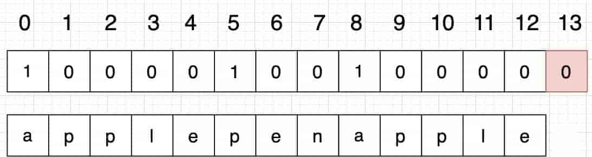

# 背包问题

动态规划做题步骤：

-   确定dp数组下标含义
-   确定递推公式
-   确定dp数组如何初始化
-   确定遍历顺序
-   举例推导dp数组

## 背包问题定义

给定一个背包容量target，再给定一个数组nums(物品)，能否按一定方式选取nums中的元素得到target。

由这个定义需要注意以下问题：

-   背包容量target和物品nums可能是数，也可能是字符串
-   target可能题目已经显式给出，也可能要自己挖掘（比如常见的非显式target=sum/2）
-   选取方式有几种：每个物品选一次/选多次/选物品进行排列组合

判定是否是背包问题，以及是什么类型的背包问题，有时就需要大量做题经验和总结。

## 常见背包类型

-   01背包（物品只能拿一次）
-   完全背包（可以重复拿）
-   分组背包（有多个背包，需要遍历每个背包）
-   组合背包（背包中的物品要考虑顺序）

## 常见问题递推公式

组合问题公式（求所有满足条件的排列组合）

```text
dp[i] += dp[i-num]
```

True、False问题公式（求是否存在...满足条件）

```text
dp[i] = dp[i] or dp[i-num]
```

最大最小问题公式（求最大或最小值）

```text
dp[i] = min/max(dp[i], dp[i-num]+1)或者dp[i] = min/max(dp[i], dp[i-num]+num)
```

## 初始化问题

最经典的01背包问题，最左列经常初始化为0，但是当情况不同时，初始化情况可能有变化。

[零钱兑换 II](https://leetcode.cn/problems/coin-change-ii/description/)

比如上面这道题，当target = 0时，用物品i（即coins[i]） 装满容量为0的背包有几种组合方法。都有一种方法，即不装。所以 `dp[i][0]` 都初始化为1。

有时甚至`dp[0][0]`初始化为1都是说不出来意义的，只是为了递归其他dp[i]的时候有数值基础而已。

有时递推公式是求最小值，那么就要初始化为INT_MAX，如果初始化为0就会乱了逻辑。

## 分类解题模板

1.  如果是01背包，一般物品nums遍历外循环，目标和target内循环。01背包二维dp数组交换遍历顺序也是可以的，只是先遍历物品更容易理解。

```cpp
for(int i = 1; i < weight.size(); i++) { // 遍历物品
    for(int j = 0; j <= bagweight; j++) { // 遍历行李箱容量
        if (j < weight[i]) dp[i][j] = dp[i - 1][j]; // 如果装不下这个物品,那么就继承dp[i - 1][j]的值
        else {
            dp[i][j] = max(dp[i - 1][j], dp[i - 1][j - weight[i]] + value[i]);
        }
    }
}
```

一维dp数组必须物品遍历外循环，目标和内循环，内循环倒序且 target ≥ nums[i]。

```java
for(int i = 0; i < weight.size(); i++) { // 遍历物品
    for(int j = bagWeight; j >= weight[i]; j--) { // 遍历背包容量
        dp[j] = max(dp[j], dp[j - weight[i]] + value[i]);

    }
}
```

2.  如果是完全背包，物品nums遍历外循环，目标和target内循环，内循环需要正序且 target ≥ nums[i]。纯完全背包问题，交换遍历顺序也是可以的。

```java
// 初始化 dp
vector<vector<int>> dp(weight.size(), vector<int>(bagweight + 1, 0));
for (int j = weight[0]; j <= bagWeight; j++) {
    dp[0][j] = dp[0][j - weight[0]] + value[0];
}

for (int i = 1; i < n; i++) { // 遍历物品
    for(int j = 0; j <= bagWeight; j++) { // 遍历背包容量
        if (j < weight[i]) dp[i][j] = dp[i - 1][j];
        else dp[i][j] = max(dp[i - 1][j], dp[i][j - weight[i]] + value[i]);
    }
}
```

3.  分组背包，这个比较特殊，需要三重循环：外循环背包bags，内部两层循环根据题目的要求转化为1,2,3三种背包类型的模板。

[一和零](https://leetcode.cn/problems/ones-and-zeroes/description/)

4.  多重背包，面试基本不考。

有N种物品和一个容量为V 的背包。第i种物品最多有Mi件可用，每件耗费的空间是Ci，价值是Wi 。求解将哪些物品装入背包可使这些物品的耗费的空间 总和不超过背包容量，且价值总和最大。

每件物品最多有Mi件可用，把Mi件摊开，其实就是一个01背包问题了。

## 排列问题与组合问题

背包问题有时需要判定是排序问题还是组合问题，比如，{1, 5} 和 {5, 1}是不一样的结果，就是排列问题；如果是一样的结果就是组合问题。

**注意：**二维数组，无论是01背包还是完全背包，颠倒内外循环顺序，求的都是组合数。

对于一维数组：

-   排序问题一般目标和target外循环，物品nums遍历内循环；

```cpp
for (int j = 0; j <= amount; j++) { // 遍历背包容量
    for (int i = 0; i < coins.size(); i++) { // 遍历物品
        if (j - coins[i] >= 0) dp[j] += dp[j - coins[i]];
    }
}
```

组合问题一般目标和target内循环，物品nums遍历外循环，target正序且 target ≥ nums[i]；

有时，排列问题并不明显：

[单词拆分](https://leetcode.cn/problems/word-break/description/)

比如上面这题，我们求的是排列数，为什么？ 拿 s = "applepenapple", wordDict = ["apple", "pen"] 举例。

"apple", "pen" 是物品，那么我们要求物品的组合一定是 "apple" + "pen" + "apple" 才能组成 "applepenapple"。

"apple" + "apple" + "pen" 或者 "pen" + "apple" + "apple" 是不可以的，那么我们就是强调物品之间顺序。

如果这里先遍历物品，再遍历背包，使用用例：s = "applepenapple", wordDict = ["apple", "pen"]，对应的dp数组状态如下：



最后dp[s.size()] = 0 即 dp[13] = 0，而不是1，因为先用 "apple" 去遍历的时候，dp[8]并没有被赋值为1 （还没用"pen"），所以 dp[13]也不能变成1。

除非是先用 "apple" 遍历一遍，再用 "pen" 遍历，此时 dp[8]已经是1，最后再用 "apple" 去遍历，dp[13]才能是1。

## Reference

[1] [希望用一种规律搞定背包问题](https://leetcode.cn/problems/combination-sum-iv/solution/xi-wang-yong-yi-chong-gui-lu-gao-ding-bei-bao-wen-/)

[2] [动态规划总结](https://www.programmercarl.com/%E5%8A%A8%E6%80%81%E8%A7%84%E5%88%92%E6%80%BB%E7%BB%93%E7%AF%87.html%23%E5%8A%A8%E5%88%92%E5%9F%BA%E7%A1%80)

[3] [一篇文章吃透背包问题！](https://leetcode.cn/problems/last-stone-weight-ii/solution/yi-pian-wen-zhang-chi-tou-bei-bao-wen-ti-5lfv/)
